# 深入探究亚马逊时间流——构建实时仪表板

> 原文：<https://betterprogramming.pub/deep-dive-into-amazon-timestream-building-a-real-time-dashboard-6a15ed36baf6>

## 使用 Timestream 和 Grafana 快速构建实时分析

照片由 [Isaac Smith](https://unsplash.com/@isaacmsmith?utm_source=medium&utm_medium=referral) 在 [Unsplash](https://unsplash.com?utm_source=medium&utm_medium=referral) 上拍摄

[上一篇 Timestream 文章](/deep-dive-into-amazon-timestream-data-ingestion-in-python-18c6c09accd)演示了如何使用`boto3`、`awswrangler`和 CLI 将数据接收到 Timestream 中。

在这篇文章中，我们将深入探讨在 Timestream 的查询语言中使用时间序列函数，并使用 Grafana 可视化数据。最终目标是让 Grafana 仪表板每 5 秒钟填充一次新数据。让我们开始吧！

# 创建时间流数据库和表

让我们从创建时间流资源开始。我们使用一个相当简单的配置，将最新数据在内存中保留一个小时，然后将其转移到长达 90 天的长期存储中。此后，过期记录将被自动删除。所有这些都可以使用保留期进行配置。

# 将第一批数据发送到时间流中

下面是我们如何将第一批数据发送到新创建的表中:

*   `get_data_from_api()`从 Cryptocompare API 中检索数据，并将记录转换成时间流友好的格式，
*   `ingest_records_into_timestream()`准备好记录器和`boto3`客户端等资源，调用`send_records()`，
*   `send_records()`函数向 Timestream 发送一批数据，
*   最后，`main`函数协调所有步骤。

# 每五秒钟发送一批新记录

最终目标是有一个脚本，可以部署到任何调度工具，以运行每一分钟。为此，我们需要每五秒调用一次`send_record()`函数，最多调用十二次，以匹配一分钟的时间间隔。下面是它可能的样子:

让我们将这种迭代逻辑集成到一个可以以一分钟的节奏运行的脚本中。您可以看到，与接收一批记录相比，只有`ingest_records_into_timestream()`函数发生了变化:

在我们了解如何监控流程并按计划运行它之前，您可以添加一个 while 循环来生成更多数据:

# 检查 AWS 控制台中的数据

让我们检查 AWS 控制台中的数据。为此，您可以运行以下查询，该查询将返回最近获取的行:

以下是 AWS 控制台中的输出:

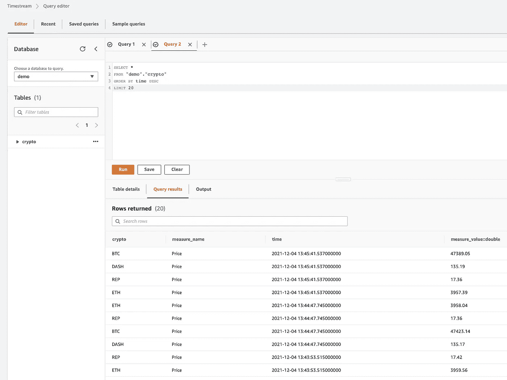

# 使用时间序列函数

如果我们想以小时或分钟为单位查看数据，该怎么办？Timestream 提供了一个`bin(time, interval)`函数以及聚合函数，比如`avg`、`sum`等等。以下是我们如何以分钟为单位查看比特币的平均价格:

AWS 控制台中的输出如下所示:

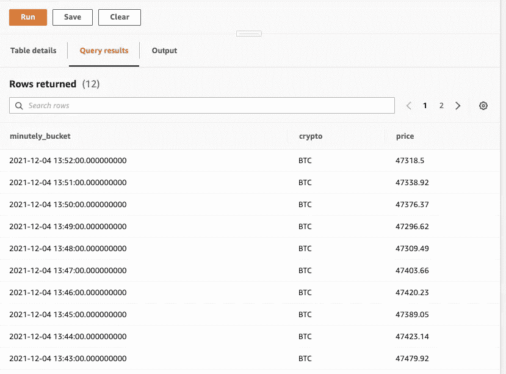

在 Timestream 风格的 SQL 中有许多[更有用的函数](https://docs.aws.amazon.com/timestream/latest/developerguide/date-time-functions.html)，使得处理时间序列数据更加容易。例如，要获得最近两天的数据，可以使用函数`ago()`:

# 用 Grafana 可视化数据

现在我们知道了如何接收和分析数据，让我们看看如何可视化它。最后，时间序列图可以立即为我们提供上升和下降趋势的信息，以及波动性，比任何数字本身都要多。

Grafana 是一个开源可视化工具，允许交互式分析。由于它是开源的，您可以下载它并在本地运行，或者在您自己的远程基础设施中配置它。为了简化 Grafana 设置，我们将注册一个免费层 [Grafana 云](https://grafana.com/auth/sign-up/create-user?pg=prod-cloud&plcmt=hero-btn1)。一旦你注册了一个帐户，你就可以开始免费试用(*别担心，有一个永远免费的等级*)并创建一个组织。确保选择一个可用的域名。

然后，为了能够在 Grafana 实例中使用 Timestream，您需要安装一个 Timestream 插件。为此，请转到设置→插件。

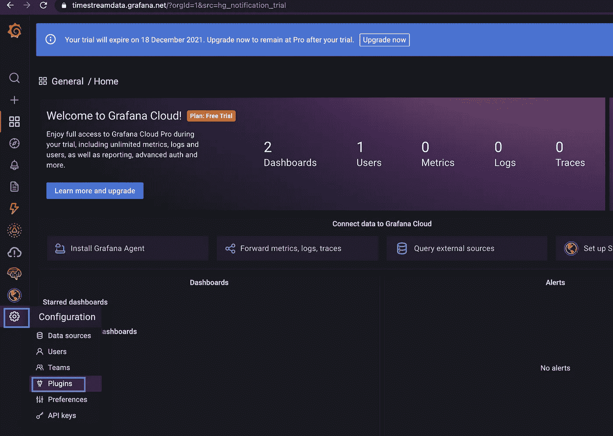

搜索 Timestream，然后“通过 grafana.com 安装”，并点击“安装插件”按钮进行确认:

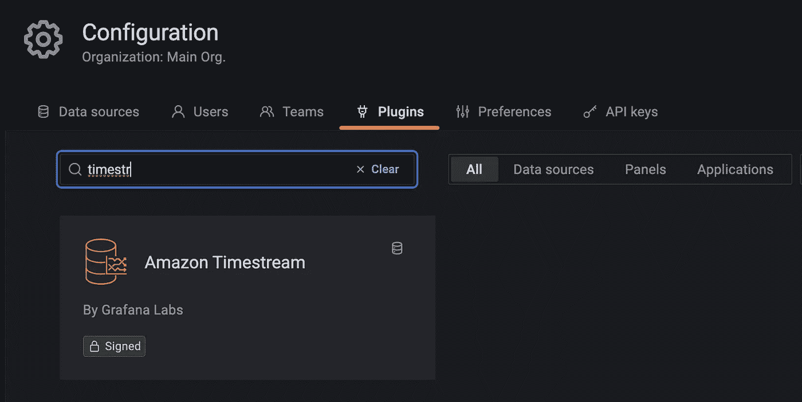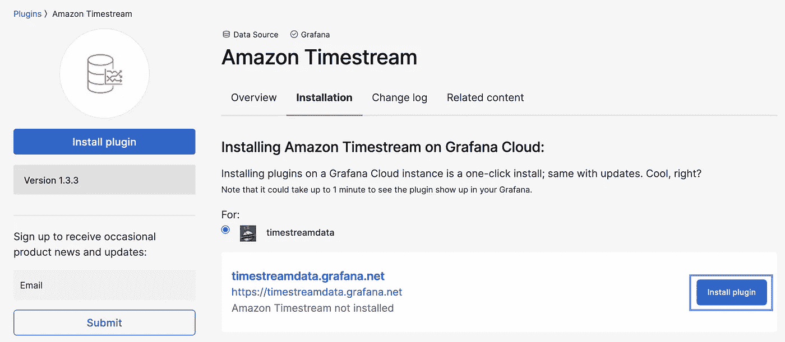

接下来，在 Grafana 实例中，转到数据源:

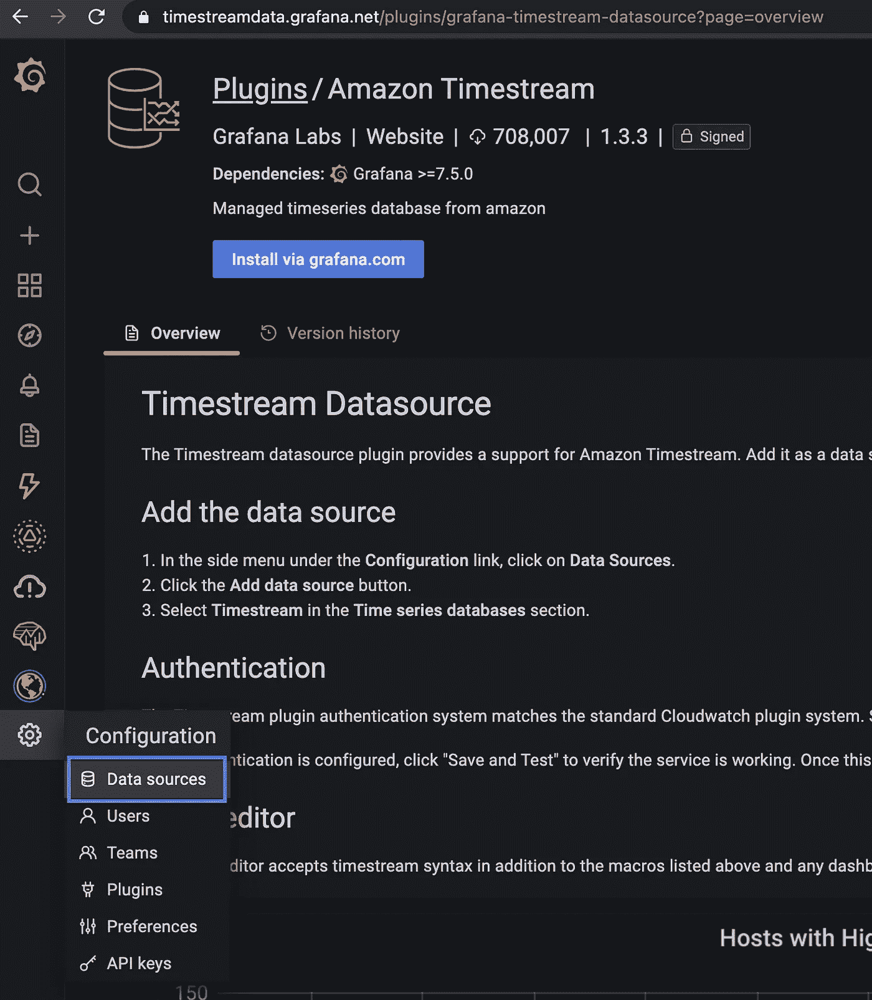

点击“添加数据源”:

选择时间流:

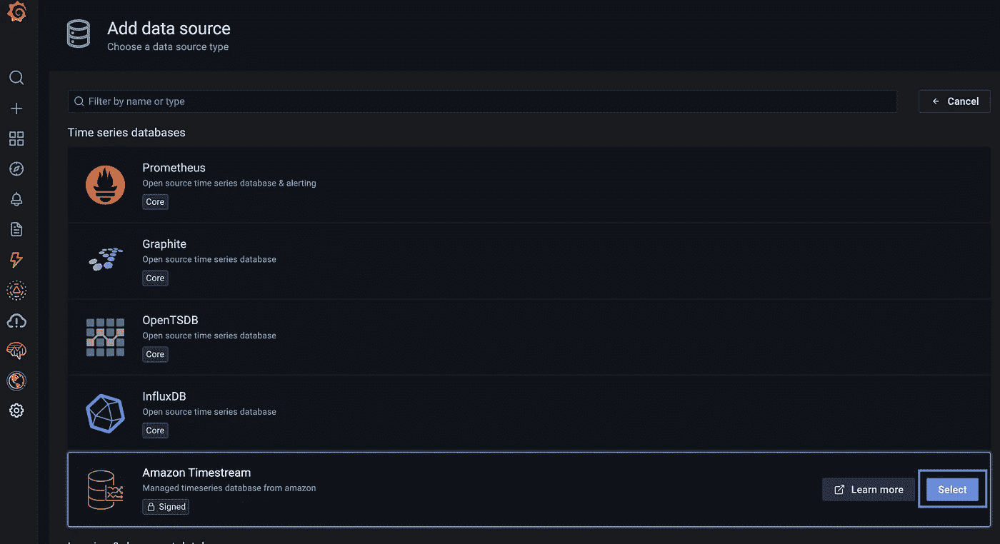

然后，使用只读 AWS IAM 用户(最好是对 Timestream 只有只读权限的用户)对其进行配置，然后单击“保存和测试”:

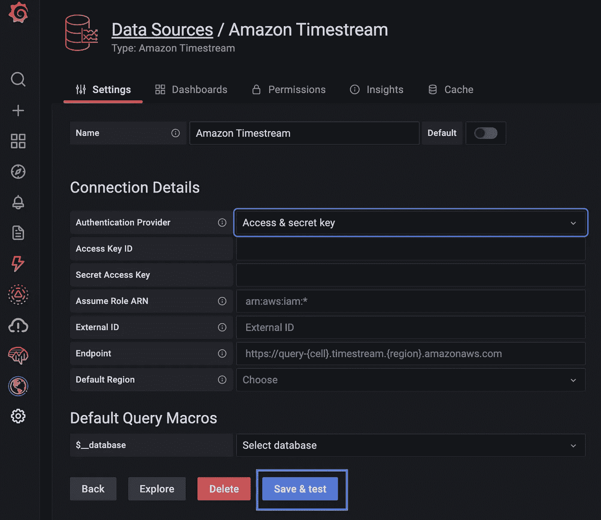

如果您不知道如何为它配置 IAM 用户，下面是如何从 AWS 控制台进行配置:

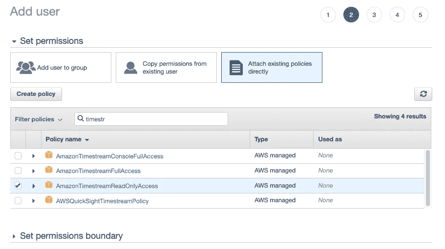

最后，您将获得一个可以在 Grafana 设置中输入的密钥对。请确保还设置了您的默认区域。

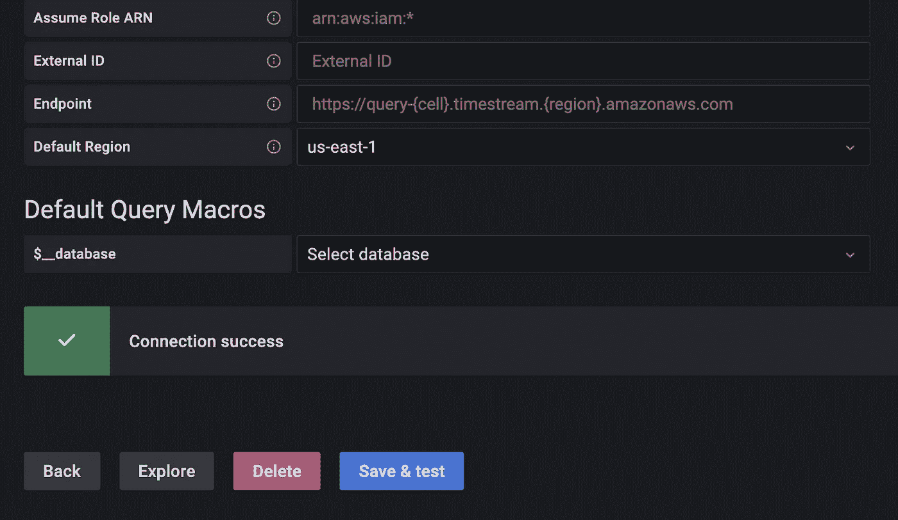

如果您可以看到“连接成功”，您可以开始构建您的仪表板。

要构建您的第一个可视化效果，请添加一个空面板:

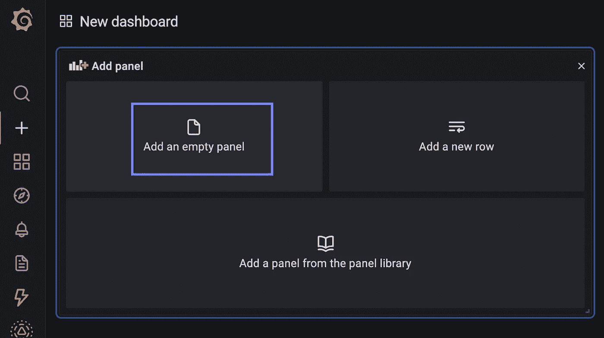

在宏中，选择数据库和表，并输入以下查询:

然后，您可以设置面板标题，然后应用并保存:

然后，您可以复制该面板，为其他加密货币创建类似的绘图:

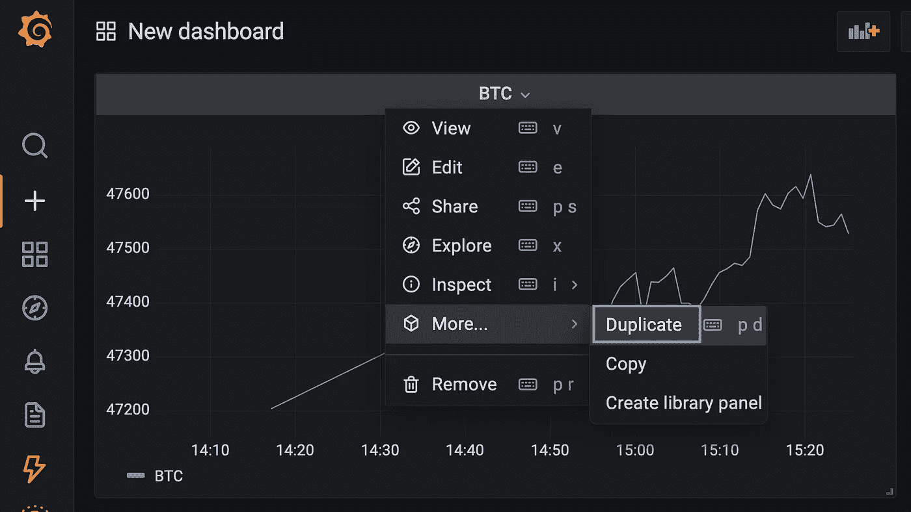

如果单击颜色栏，可以为该图设置不同的颜色:

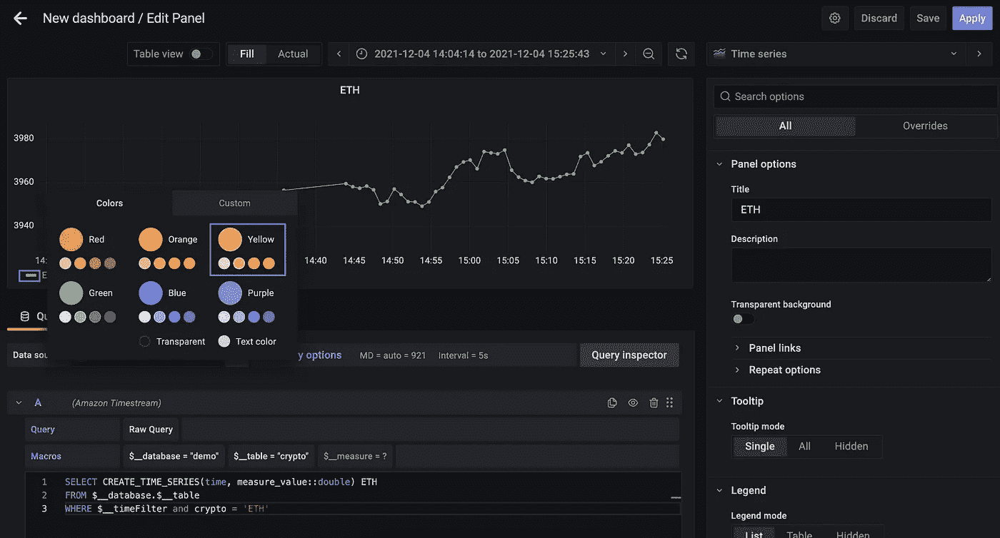

完成后，不要忘记保存仪表板！

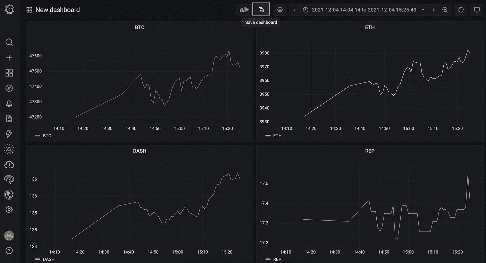

# 后续步骤

在本文中，我们讨论了如何将数据接收到 Timestream 中，以及如何使用 SQL 中的时序聚合函数对其进行分析。我们确保数据接收过程可以被安排为每分钟运行一次。最后，我们配置了一个实时仪表板，使用 Grafana 比较各种加密货币的价格。

感谢您的阅读！

在下一篇文章中，我们将看看如何使用 Prefect 操作、调度和监控数据摄取过程。如果不想错过，可以在这里订阅[。](https://annageller.medium.com/subscribe)