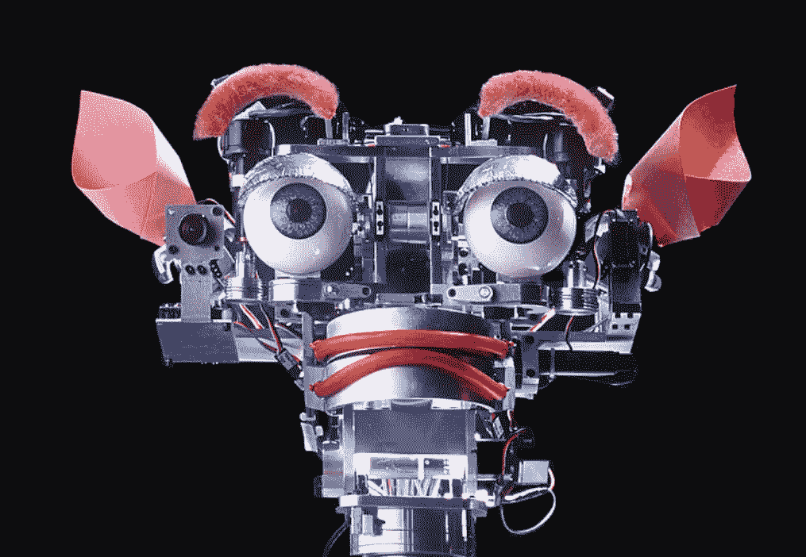
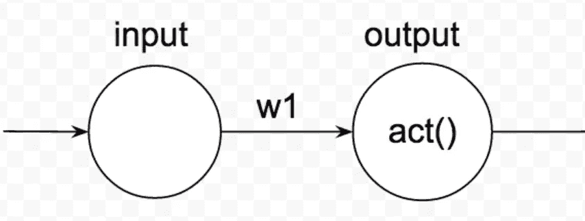

# 深度学习简介(第一部分)

> 原文：<https://betterprogramming.pub/deep-learning-101-cf9f935f9b56>

## 深度学习和机器学习有什么关系？

在 [Unsplash](https://unsplash.com/s/photos/artificial-intelligence?utm_source=unsplash&utm_medium=referral&utm_content=creditCopyText) 上由 [Franck V.](https://unsplash.com/@franckinjapan?utm_source=unsplash&utm_medium=referral&utm_content=creditCopyText) 拍摄的照片

在这篇文章中，我将尝试解释什么是深度学习，以及它与机器学习的关系。

尽管网上有很多来源讨论这个话题，但我找不到一个既详尽又简洁的来源。

在我开始解释深度学习到底是什么之前，我先解释一下人工智能、机器学习、神经网络以及这些主题之间的关系。

本文旨在为您提供该主题的背景知识，但不会太深入。希望我能很快发布第二部分，它将关注不同类型的神经网络，并引入术语*强化学习。*

# 人工智能

人工智能(AI)是一个科学分支，它强调开发能够像人类一样操作的机器。这些机器分为四大类:

## 类型 1

这是最简单的类型。它可以在没有记忆和利用先前经验的情况下做出决定。这种智能是反应性的，意味着它只能对当前的情况做出反应。这种类型的人工智能的一个很好的例子是 IBM 的“深蓝”,它是为下棋而设计的。

## 类型 2

这种类型包括有限的记忆，可以从先前学习的信息中获取知识，以做出决定——例如，特斯拉的自动驾驶汽车和网飞的电影推荐。这些汽车可以检测交通模式，并在没有司机干预的情况下进行必要的调整，网飞可以根据你过去看过的电影推荐电影。

## 类型 3

这种类型可以模仿人类的精神状态，包括他们的意图。这种机器可能能够识别、理解、保留和记忆情感输出，同时知道如何对它们做出反应。

辛西娅·布雷齐尔教授开发的 Kismet 就是一个例子。Kismet 能够对周围发生的事情做出面部表情(表情)反应。尽管它不能进行对话，但它在某些方面的情感能力与人类相似。

图 1:命运让我们感到恐惧

## 类型 4

作为一个有自我意识的人工智能，这种类型的机器拥有人类级别的意识。自我意识包括认识到自己是一个个体的能力。此外，这个人工智能将能够理解拥有感情和欲望的概念。这种类型仍然超出了人类的能力，没有自我意识的机器。

# 机器学习

机器学习是分析、理解和识别数据模式的主要工具。它是人工智能的一个子集，涉及基于先前的数据创建算法，在没有人为干预的情况下实现预测。

关于深度学习最著名的算法是人工神经网络(ANN)算法。人工神经网络是根据生物网络和人脑处理数据的方式松散地建模的。

与生物神经元类似，一旦达到某个阈值，感知器(人工神经元)就会产生输出。这些人工神经元中的每一个都与不同的权重和偏好相关联，我将在本文后面详细解释。图 2 描述了一个简单的线性关系人工神经网络，有一个输入和一个输出。

图 2:没有隐藏层的神经网络的表示

# 神经网络

在本文的前面，我提到了人工神经网络是由感知器构成的，每个感知器都有相关的权重和偏差。

*权重*是实数，表示接收到的输入有多重要，以帮助计算输出。例如，如果输出是骑自行车上班或不骑自行车上班，则输入可以是温度和风况。如果我对温度变化更敏感，我是否骑车上班的决定将更多地受到温度的影响。

*偏差*是一个附加参数，用于调整输出以及感知器输入的加权和。偏差是一个附加的常数，有助于使模型符合给定的数据。

权重和偏差共同表明决策过程中输入的重要性。如果所有输入的加权和大于预定义的阈值，则输出为 1。否则，它将是 0。

为了解决一个技术设计缺陷——输入中非常小的变化都会翻转输出，感知器的行为就会像阶跃函数一样——Frank Rosenblatt 引入了 sigmoid 感知器。sigmoid 感知器(神经元)的输出比阶跃函数更平滑，并返回 S 形曲线。

使用类似于逻辑回归函数的 sigmoid 函数，每个神经元的输出是 0-1 之间的真实值，也称为*激活函数。*

[来源](https://www.geospatialworld.net/blogs/difference-between-ai%EF%BB%BF-machine-learning-and-deep-learning/)

# 深度学习

根据 [GeeksforGeeks](https://www.geeksforgeeks.org/introduction-deep-learning/) :

> “深度学习是一种特殊的机器学习，它通过学习将世界表示为嵌套的概念层次结构，每个概念都是相对于更简单的概念定义的，而更抽象的表示是根据更抽象的概念计算的，从而实现了强大的功能和灵活性。”

图 3:多层神经网络

深度学习是机器学习的一个子集，其中神经网络在输入和输出之间包含一个或多个隐藏层，每一层都提供对输入数据的不同解释。

从这一刻开始，我将更加专注于前馈神经网络中的深度学习。前馈神经网络是第一种也是最简单的神经网络。它们是通过正向传播的过程来命名的。在前向传播中，每一层接收输入并应用不同的数学运算来产生结果。

为了训练一个人工神经网络，你必须给它一个衡量它表现有多差的标准。通常，要测量其性能，您需要创建一个成本函数来估计模型的性能有多差，成本越高，模型越差。我们的目标是尽可能降低成本，直到我们达到最低成本。

在深度学习神经网络中，反向传播和梯度下降使模型能够自我调整并降低成本函数。反向传播递归地应用微积分链规则来调整它之前的每个隐藏层的权重和偏差。这个过程一直持续到成本函数达到最小值，成本的变化非常小，或者机器达到预定的停止点。

总而言之，我将深度学习描述为一种通过将过程分解为更小的部分来描述解决复杂问题的算法的方式。

支持深度学习的主要机器学习算法是 NN，因为它们的嵌套结构以及处理标记和未标记数据以创建分类器的能力。出于这个原因，目前认为神经网络或其变体可能是允许我们在机器中复制自我意识的算法。然而，这种算法需要大量的数据和计算能力才能正常工作。

# 参考

 [## 神经网络和深度学习](http://neuralnetworksanddeeplearning.com/chap1.html)  [## 为什么深度学习优于传统的机器学习？](https://towardsdatascience.com/why-deep-learning-is-needed-over-traditional-machine-learning-1b6a99177063)  [## 深度学习与机器学习——你需要知道的本质区别！](https://www.analyticsvidhya.com/blog/2017/04/comparison-between-deep-learning-machine-learning)  [## 理解神经网络:从激活函数到反向传播](https://medium.com/fintechexplained/neural-networks-activation-function-to-back-propagation-understanding-neural-networks-bdd036c3f29f)  [## 关于神经网络你需要知道的一切](https://hackernoon.com/everything-you-need-to-know-about-neural-networks-8988c3ee4491)