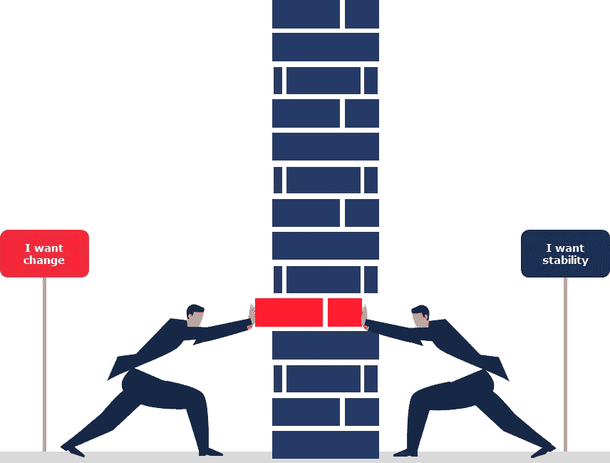
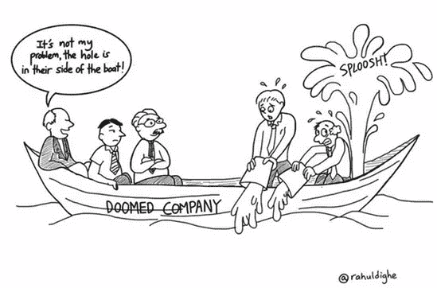
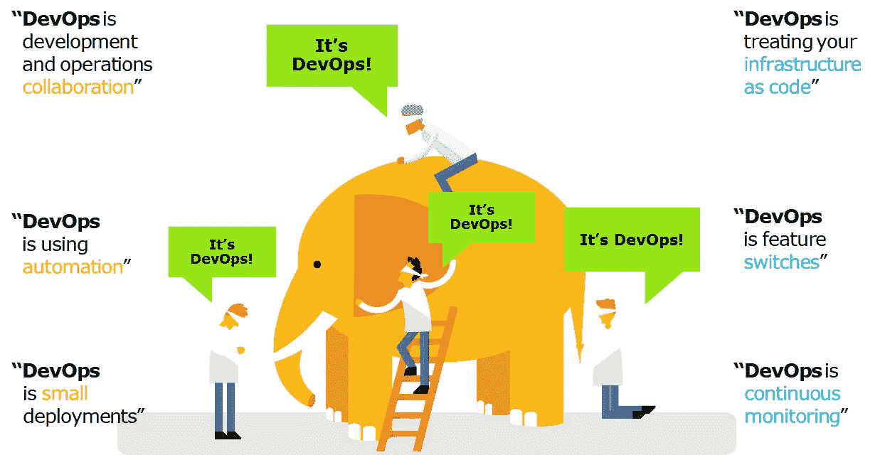

# 揭秘 DevOps

> 原文：<https://betterprogramming.pub/demystifying-devops-840aa292054a>

## DevOps 不再是一个选项——要么你接受它，要么你失败

照片由[汉娜·布斯](https://unsplash.com/@hannahbusing?utm_source=unsplash&utm_medium=referral&utm_content=creditCopyText)在 [Unsplash](https://unsplash.com/s/photos/teamwork?utm_source=unsplash&utm_medium=referral&utm_content=creditCopyText) 上拍摄

DevOps 在这里已经有一段时间了，并席卷了整个科技行业。曾经有一段时间，对于 DevOps 是什么，它解决什么问题，以及它是否真的需要，有很多困惑。

现在它似乎已经解决了，并且[超过 90%](https://www.statista.com/statistics/673505/worldwide-software-development-survey-devops-adoption/) 的科技行业已经采用了 DevOps 或者正在使用它。DevOps 不再是一个选项:要么你接受它，要么你失去竞争。

虽然大多数科技公司都在采用 DevOps，但仍有大量开发在进行。由于 DevOps 的本质，新的工具和实践正在出现并迅速发展。

对于大多数公司来说，采用 DevOps 就是在组织内建立一个新的团队来负责设置和管理 DevOps 工具。然而，DevOps 是一群系统管理员的别称吗？让我们找出答案。

# 困惑之墙

图片来源:作者

你记得这座著名的墙吗？这就是李·汤姆森和安德鲁·谢弗描述的开发和运营之间的困惑之墙。我把这描述为推卸责任。

在传统的、部门的软件交付方式中，在明确定义了开发和运营的情况下，开发人员将软件包抛给运营团队，让运营团队对如何将软件转换成可部署的、生产就绪的材料一无所知。

这是开发和运营团队之间的持续斗争。组织奖励开发团队为技术带来变化，奖励运营团队确保软件运行的稳定性。这是利益冲突。

这堵困惑之墙超越了两个团队对他们使用的工具的思维定势。开发团队使用一些工具，而运营团队使用其他工具来执行相同的任务。

# 整合开发和运营

图片来源:作者

DevOps 拆除了开发和运营团队之间的墙，通过使用一套流程和工具自动化软件交付生命周期，将开发和运营统一起来，以获得更好、更快的结果。

但是 DevOps 只是工具吗？不完全是。看看下面的图片。

[图片来自 Rahul Dighe](https://media-exp1.licdn.com/dms/image/C5612AQGCqR1T-v3EqQ/article-inline_image-shrink_400_744/0?e=1596067200&v=beta&t=89gB5bZeNbwcPCg-UzvWuIjdczRVa9vXPYvHs0jyZf8)

你对此进行反思了吗？我们都在传统组织中看到过这种情况。一旦您将代码部署到生产环境中，这就不再是开发问题了，而且运营团队对软件一无所知。他们指责开发团队首先造成了问题，并对任何新的东西投入生产持谨慎态度。结果呢？降低了开发速度，阻碍了组织的灵活性。

按时稳定的软件交付是您业务成功的关键。

阻碍软件交付的一些严重问题是:

*   **构建和维护服务器** —服务器一般都是手工构建的，既费时又低效。
*   **没有环境管理** —在管理环境的传统方式中，没有办法确定开发和生产环境之间的差异。
*   **缓慢部署** —部署时间长、容易出错且成本高。
*   **没有共享所有权** —所有权被分割。“这不是我们的问题”是一般的说法。缺乏反馈和支持性指标。
*   **没有适当的配置管理** —配置管理是传统思维模式中的一大难题。运营团队花费大量时间手动管理环境，这是所有差异的原因。
*   **部署是一个障碍** —由于所有实施都是手动的，回滚也很痛苦，因此部署和升级总是被视为一种风险。还有对特定部署工程团队的依赖，适得其反。
*   **生产停工期** —由于缺乏适当的实施计划和部署说明，生产经常停工。
*   **黑客攻击** —我们大多数人在大型组织中都遇到过这种情况:运营团队倾向于直接在产品中进行修复，而不是使用适当的修复过程，然后他们会忘记签入源代码控制。

# 房间里的大象

图片来源:作者

它不再是房间里的大象了。然而，有必要快速复习一下 DevOps，以便首先理解实现它的基础。

DevOps 是:

*   一种基于敏捷和精益原则的方法——业务和产品所有者、开发团队、操作团队和质量保证团队一起工作，不断地交付高质量和稳定的软件。
*   打破界限、促进共享所有权和共同目标的环境
*   提高团队敏捷性的运动
*   促进组织内优秀工作文化和关系的文化
*   一组提供快速、可靠的软件交付的过程

我们这里缺少工具吗？工具是必不可少的吗？

# 工具是开发运维的推动者，而不是目标

这是业内大多数公司都忽略的一点。工具不会产生债务。相反，工具支持组织内的开发运维。DevOps 总是从文化变革开始，也应该从文化变革开始。

如果你仍然有一种思维模式，认为你的公司喜欢从所有东西中创建部门，并对谁做开发、测试和运营有明确的界限，那么 DevOps 不会给你带来多少好处。

添加一堆工具可能在短期内对你有所帮助，但是你最终会碰壁，因为某个地方的某个人会成为持续交付过程中的障碍。

[DevOps 工具](https://www.osolabs.com/wp-content/uploads/2019/09/devops-tools.png)(图片来源:OsoLabs)

在大多数公司中，DevOps 一般是由开发人员发起的想法；在某些情况下，它是由 ops 发起的。尽管如此，很少有公司打破开发和运营之间的壁垒，允许团队之间更多的协作，允许团队之间更自由地互动，建立信任感，并了解他们在做什么。

纯 DevOps 模型给整个团队带来了责任。这不再是开发问题或运营问题；这是每个人的问题，每个人都以自己的方式帮助解决。

当你奖励团队中每一个稳定软件交付的人时，你自动地创造了一种包容感，并且组织中的每一个人都被授权承担责任，以确保他们满足客户需求并交付一个出色的软件。

DevOps 本质上是一个三步转换过程——人员、流程和工具。人永远是第一位的，工具是最后才出现的。

# DevOps 之旅

以上都是很棒的想法，但是我们如何开始处理真正的问题，我们如何开始我们的 DevOps 之旅呢？

DevOps 是一种思维方式，以下是一些你可以应用的步骤:

*   文化——总是从文化变革开始。试着理解你的组织的痛点，试着在公司内部建立一种“拥抱变化”的哲学。消除指责游戏。它不仅让人们产生防御性，导致他们推卸责任，而且过早地扼杀分析，阻止你从错误中学习。取而代之的是，开放的事后分析和透明的反馈。建立一个无风险的组织。
*   自动化——一旦你赢得了人们，自动化，自动化，自动化。从持续集成开始，然后转移到持续交付。记住，这是一个旅程，不要试图一口气解决所有问题。优先考虑和循环交付自动化的大块，从中学习并在过程中改进。
*   精益—专注于为最终用户生产，确保小批量生产。
*   度量——衡量一切:你节省了多少时间，你犯了多少错误，你节省了多少钱，你的客户有多高兴，你的团队有多积极。向领导展示改进并获得收益。
*   分享——最重要的是组织中每个人之间的分享和开放协作。请记住，在 DevOps 团队中，没有什么需要隐藏的。建立相互信任最终会打破界限，帮助你更快地交付稳定的软件。

# 结论

感谢阅读！我希望你喜欢这篇文章。

要记住的重要一点是，DevOps 是一种文化变革，而工具只是它的促成者。所以下次，如果有人告诉你他们正在做 DevOps，因为他们正在使用一些很酷的工具，准备好问他们一些棘手的问题！祝你的 DevOps 之旅好运！