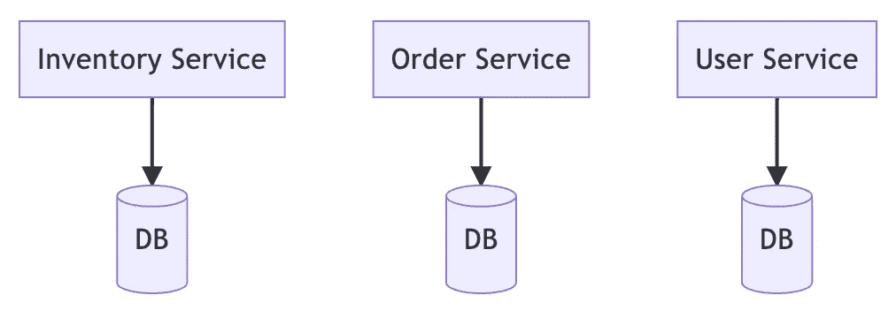
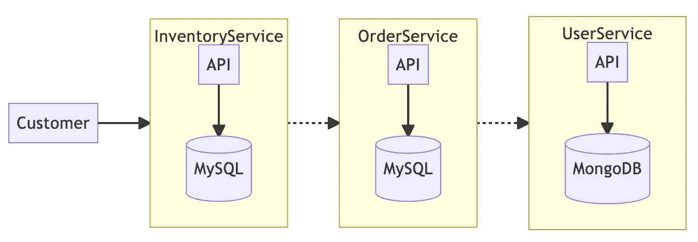

# 从高层次的角度设计一个电子商务网站

> 原文：<https://betterprogramming.pub/design-an-e-commerce-website-from-a-high-level-perspective-184618741ee8>

## 戴上你的软件架构帽子

[邓阳](https://unsplash.com/@palon?utm_source=medium&utm_medium=referral)在 [Unsplash](https://unsplash.com?utm_source=medium&utm_medium=referral) 上拍照

上两周，有一个架构师的聚会，我们在会上谈到电子商务网站实际上有一些规则的模式，所以如果你想快速提供一个高水平的设计，你会怎么做？

这篇文章是那次讨论的记录，我将根据我的印象列出我们的想法，然后呈现建筑师对这个经典设计模式的思考。

# 定义基本域服务

通常，对于一个启动系统或架构，我会建议从一个整体开始。在构建了 MVP(最小可行产品)之后，架构根据功能性和非功能性需求进行演化，看是应该分解成微服务还是几年前比较流行的面向服务的架构。

但无论如何，将会有一个整体作为快速启动和验证这个想法的基础。

然而，对于电子商务网站来说，没有必要进行快速验证，因为电子商务网站的成功取决于产品和曝光策略，而不是功能。因此，对于电子商务网站来说，更重要的是能够解决在可预见的将来会遇到的问题。

这里有几个实际的例子。

随着用户的快速增长，用户管理的需求会显著增加，因此有必要将用户相关的功能变成单独的服务，以方便开发周期的快速迭代。

库存，随着网站用户数量的上升，产品相关的功能将驱动大部分流量。客户总是在网站上寻找他们想要的产品并查看库存，因此为了处理高流量，它必须能够自行横向扩展。因此，库存也将成为一项独立的服务。

电子商务网站的另一个核心功能是采购和订单管理。当客户下订单时，必须在幕后整合现金流和物流等外部服务，并且需要不断实现连接不同现金流等新功能。但这种开发周期明显不同于用户相关的功能，测试和集成的需求与用户服务完全不同，即订单也必须成为服务。

最后，我们将如下定义基本的域服务。

# 定义数据库

在上一节中，我们提到我们有三个独立的服务，用户、订单和库存。然后，我们必须决定他们应该使用什么数据库。

对于一个刚刚启动的系统，我总是建议使用团队最熟悉的最成熟的技术，同时兼顾各种用例。

由于这个原因，我认为 MySQL 应该是订单服务和库存服务等需要强一致性的服务的最佳选择。虽然 MySQL 一直被诟病缺乏横向可扩展性，但近年来有了很多新的突破，越来越多的分布式 SQL 正在出现。如果一个电商网站的流量上升到瓶颈，那么从 MySQL 迁移到分布式 SQL 的痛苦不会太多，毕竟应用几乎不需要修改。

在用户服务的情况下，这更有趣。与用户相关的管理功能通常没有很强的一致性要求，用户信息和其他数据结构多种多样，非常丰富。作为一个基于文档的数据库，MongoDB 可以支持各种丰富的数据表示，并提供了很多管理上的便利。当然，也可以使用 MySQL 进行用户服务，但是需要在数据规范化上多下一点功夫。

再说，如果用 MongoDB 实现用户服务，即使以后有强一致性的需求，比如要给客户打折券，MongoDB 还是可以提供足够强的一致性保障的，因为 MongoDB 也有交易。但是不得不说，MongoDB 事务不容易编码，会增加开发的工作量。

# 定义通信

现在我们有三个服务负责它们的领域，但是它们如何相互通信呢？例如，当客户选择一个产品，然后发送订单、账单和发货时，这三个服务必须相互通信才能完成这个场景。

从我的角度来看，我建议这三个服务应该是异步的。尽管整个过程必须确保一致性，这大大增加了实现的工作量，但是只有异步才能容忍高可用性和高可伸缩性。可用性和可伸缩性是运行电子商务网站的强制性非功能性需求。

比如黑色星期五促销，会有大量客户涌向网站，大量下单，假设三个服务同步通信，那么三个服务一定以相同的速率伸缩，这显然是不合理的。

此外，当一个订单必须由所有三个服务提供服务时，其中任何一个服务暂时失败或网络暂时中断，整个订单都会失败。换句话说，只有通过异步通信，我们才能确保电子商务网站所需的可用性和可伸缩性。

此时，我们已经有了系统架构的原型。

然而，有一个组件我们还没有决定，那就是异步应该使用什么样的队列系统。在我看来，应该用`Kafka`。为什么不使用像`RabbitMQ`这样的纯消息队列？一个重要的原因是，`Kafka`在处理促销活动的大流量时具有更高的吞吐量。

此外，对于像订单和支付这样的行为，我们都知道它是顺序的。为了在大量消息涌入队列时保持消息的顺序，有必要在`Kafka`的使用者组中进行水平扩展，以便在同一时间更快、更有序地处理消息。

# 草图工作流程

一旦我们有了一个简单的系统架构，我们就开始勾画整个订单处理流程。

开始时，客户向库存服务下订单，库存服务只处理与库存相关的任务，例如预扣库存。在付款前减少库存的目的是避免大量用户消费时的竞争，如果直到最后阶段库存才实际减少，那么消费者购买空气的风险很高。

当库存服务完成处理后，订单服务被通知已经接管了整个事务，同时通知客户已经下了订单。此时，只有订单被建立，支付必须通过前端重定向，以便客户可以正确地与订单服务进行通信以进行计费。

支付完成后，订单服务会通知用户服务。然后，用户服务可以继续执行与用户相关的任务，如优惠券发行或用户级别升级。最后，库存服务和订单服务被告知交易已经成功完成。

或者，如果订单服务或用户服务中存在错误，则必须发送消息通知其他参与服务。然后，接收通知的服务可以相应地处理它，例如，库存服务必须添加回减少前的库存。

# 但是，还不够

订阅了我的文章的读者应该已经看到这是一个非常典型的[分布式事务](/design-distributed-transaction-with-practical-examples-7b1d93fddb63)，分布式事务的正确方法是始终保持弹性，也就是说，对错误具有弹性。

正如我在上一篇文章[中描述的，为了在事件驱动架构](/implement-event-driven-architecture-with-minimal-effort-182c3bbe5524)中处理分布式事务，需要一个仲裁器(crontab)。crontab 会定期检测哪些事件没有得到正确处理，并采取相应的措施来修复它们。

具体细节本文不再赘述。但是我们知道除了这三个域服务之外，还有另一个服务监视整个工作流。

# 但是，仍然不够

因为整个交易过程是异步的，所以用户必须能够准确地知道订单的状态，它处于哪个阶段，等等。因此，还需要有一个服务来订阅每个服务发送的消息，并有自己的数据库来记录和存储所有事务的状态。

这种方法也被称为 [CQRS](https://medium.com/interviewnoodle/shift-from-monolith-to-cqrs-a34bab75617e) 。整个工作流是通过一个独立的跨域服务来观察的，但是与仲裁器不同，这个观察者并不实际参与工作流，也不对工作流进行任何类型的更改。

观察者的存在只是为了让客户对工作流有一个正确的了解。

# 结论

电子商务网站可以认为是所有后端架构的教科书。后端工程师需要处理的各种问题都会出现在电子商务网站上，但是目前市面上的书籍往往只提供了一个铁板一块的解决方案，并且专注于如何实现那些功能需求。

但是作为后端专家，我们都知道使用一个整体来运行一个电子商务网站最终是一个死胡同。除非产品完全卖不出去，否则迟早会面临流量和可用性的挑战。

虽然这篇文章是架构师之间的随意对话，但它实际上是从一个不同的角度来看我们在日常工作中遇到的挑战。为什么一个创业电商网站需要具备五项服务？

*   为了更快地添加新功能并拥有独立的集成和测试流程，微服务必须划分到不同的领域中。
*   为了获得高可用性和可伸缩性，必须减少域之间的耦合。
*   为了更好地容错，必须建立弹性错误恢复机制。
*   为了更好的用户体验，必须实现全面的整体呈现。

之前经常提到微服的弊端，比如[微服原罪，第一部](https://medium.com/interviewnoodle/original-sin-of-microservices-part-1-90461ddcefb)和[微服原罪，第二部](https://lazypro.medium.com/original-sin-of-microservices-part-2-8856c0e8426d)。

但这并不意味着我完全拒绝微服务，相反，我希望我们都能以正确的态度面对微服务，不要将其视为圣杯，也不要将其视为魔鬼。

正确的权衡始终是软件架构最重要的核心概念。