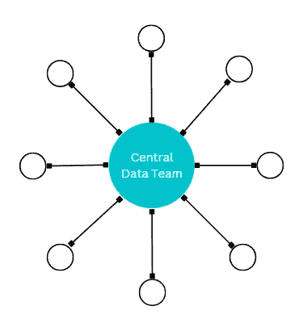
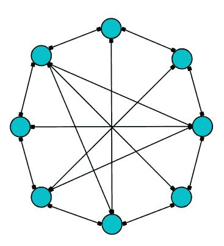

# 设计数据团队，实现大规模分析

> 原文：<https://betterprogramming.pub/designing-data-teams-for-enabling-analytics-at-scale-71303acab724>

## 不存在一刀切！

[万花筒](https://unsplash.com/@kaleidico?utm_source=medium&utm_medium=referral)在 [Unsplash](https://unsplash.com?utm_source=medium&utm_medium=referral) 上拍摄的照片

大多数全球性组织都采用数据分析来推动数据驱动的决策和报告。如果你是一家初创公司，那么你只需要一个专注的数据团队就可以开始了。另一方面，如果你是一个向上扩展或中型到大型企业，你正在讨论数据团队的结构。

设计团队融合了艺术和科学。这看起来很简单，但是不要低估创建团队的重要性，这将使你的组织走向成功。在你设计你的团队结构之前，你的数据策略是你应该做的第一件事。该战略定义了您的目标和需要采取的行动，以释放数据的力量。让我们从建立现代数据团队时想到的问题开始。

*   谁拥有数据路线图和交付？
*   我们希望用数据解决哪些用例？
*   数据团队的角色是什么？
*   我们应该将数据工程、平台和分析结合起来，还是将它们分开？
*   集中式团队还是分布式团队？
*   我们需要多少团队和什么角色？
*   数据团队的愿景、使命和价值观是什么？

# 过去的数据

现代数据世界已经完全不同于它的前身。过去，小型团队集中负责接收、存储、转换和报告他们的数据。数据环境很简单，卷占用空间很小。大多数公司不需要为数据团队建立组织结构。他们可能主要与服务于其余业务的中小型数据团队一起生活。

数据的低复杂性、随时间的缓慢增长以及数据分析的受限使用情形不需要复杂的数据团队结构。AI/ML 很少见，大多数人对他们在数据团队的帮助下创建的基本报告和仪表板很满意。Excel 是对数据进行切片、切割和分析的强大工具。尽管它仍然是许多人选择的工具。

数据集的所有权很简单，传统的数据角色“管家”足以维护数据治理的健全性。大数据闻所未闻，计算和存储非常昂贵，而且不像今天在云中那样容易扩展。更多的数据意味着更广泛的硬件，需要数百万美元的资本支出，并且供应商需要几个月的准备时间来安装。

# 今日数据

现代世界中的数据在数量、复杂性和用例方面发生了很大的变化。新的格局是快节奏的，对关键业务问题的答案缺乏耐心。云打开了可扩展性的视野，尽管很少有组织知道它的真正含义和需求。在充足的数据空间中不缺乏专有产品，同样强大的开源项目试图解决数据问题。与几年前相比，数据治理、安全性和管理已经成为更加重要的问题。

从人员、过程和技术的角度来看，软件工程已经有了迭代的份额。数据工程仍处于萌芽阶段，要可靠、可信地提供大规模数据，还有许多工作要做。

首先从数据组织开始。对于许多公司来说，数据已经成为一个独立的垂直领域。然而，顶部的结构只是设计的一部分。简单的设计和协作需要发生在团队层面。让我们探索一些流行的团队结构。

## 集中的团队

传统的结构是由一个小组(一个或多个团队)负责与数据相关的任何事情。从摄取到监管再到报告，他们端到端地交付项目/计划。

作者图片

这带来了更好的协作、知识共享、集中优先排序和所有数据需求的单一位置的好处。设定标准和最佳实践以确保系统拥有可信的高质量数据非常容易。数据治理的工作变得更加简单，因为他们不需要遍历多个团队来执行数据治理规则。

中央数据团队面临的最大挑战是，他们最终会成为新项目和计划的瓶颈。尽管优先级是核心，利益相关者还是努力让他们的请求先得到处理。团队可能偏离组织的目标，各自为政。

## 嵌入式团队

许多组织允许每个业务部门运行自己的数据团队来进行接收、管理和报告。数据平台通常是跨所有业务单位的共享功能，并被视为构建数据管道和报告的服务。

作者图片

接近业务或数据所有者有助于更好地理解数据。优先顺序取决于业务单位，并与其目标一致。这种模式缺乏标准实践和指导方针，存在重复劳动的风险。由于其他单位的数据不可见，冗余数据集会导致报告不一致。

## 混合/矩阵团队

混合方法结合了两者的优点，并消除了其他两种结构的不足。中央数据团队负责为所有业务部门接收、管理和准备标准数据集。来自核心团队的工程师/分析师融入其中。

作者图片

中心性质促进了标准指南、实践和过程的创建、维护和迭代。嵌入业务的中央团队的人员可以在业务单元级别集成最佳实践。业务单元感觉自己是解决方案的一部分，并与资源一起工作，提供中央团队设计所遗漏的数据和问题背景。这种设计面临着与矩阵结构相同的挑战，即管理中央嵌入式团队的优先级，以及领导下属。设计需要更好的协作和凝聚力来轻松实现。

# 结论

对一个组织有效的不一定对另一个组织有效。您的数据策略应该是设计数据团队组织的起点。当前的组织结构、规模和带宽决定了最佳的团队结构。有可能从一种结构开始，随着时间的推移转移到另一种结构。最终，你用数据解决的用例的数量很重要。

> “大多数人都有非常强烈的组织所有权意识，但我认为人们必须拥有的是一个创新议程，并且在实施方面一切都是共享的。”—塞特亚·纳德拉