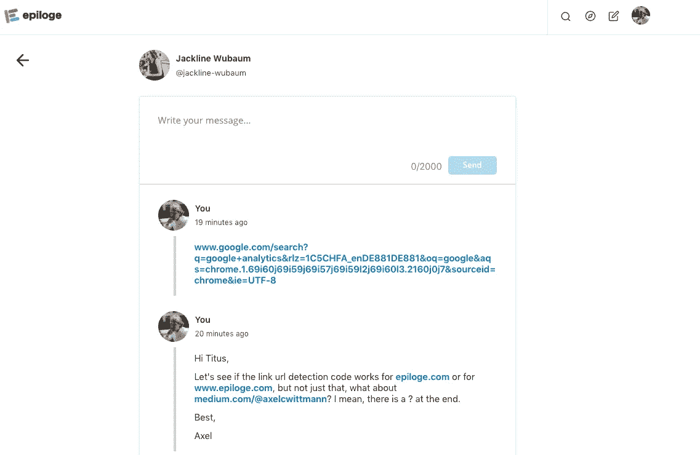

# 如何用 JavaScript 自动检测一段文本中的外部链接

> 原文：<https://betterprogramming.pub/detecting-external-links-in-a-paragraph-of-text-with-javascript-automatically-3c15537f4997>

## 避免明文中的虚假 URL 匹配


图片由 [Artem Sapegin](https://unsplash.com/@sapegin?utm_source=medium&utm_medium=referral) 在 [Unsplash](https://unsplash.com?utm_source=medium&utm_medium=referral) 拍摄

检查一个字符串是否是有效的 URL 本身就是一门科学。regex 验证方法的最终来源是检测有效的 URL，而不是错误地匹配不是真正有效的 URL，[很长，对于初次浏览者来说，非常复杂](https://mathiasbynens.be/demo/url-regex)。关于 StackOverflow 上 URL 检测的问题也是如此——人们对这些问题有相当大的兴趣。

我没有看到详细解释的是一个易于实现的 JavaScript 解决方案，例如，如何在用户简档描述或用户之间发送的消息中获取几段文本，并自动检测该文本中的所有 URL——特别是在您根本不知道是否有任何 URL 或它们在文本中的位置时。

在一些网站上有解决这个问题的好方法，但是我很确定没有完美的解决方法。这是我们在 vue.js 中实现的 JavaScript 函数。它在 99%以上的情况下都有效，更重要的是，它不匹配非 URL。



此算法如何检测链接的屏幕截图

# 我们需要一个 URL 检查正则表达式

```
$_HelperFunctions_modifyTextForLinks: function(textToCheck) {

  var expression = /(https?:\/\/)?[\w\-~]+(\.[\w\-~]+)+(\/[\w\-~@:%]*)*(#[\w\-]*)?(\?[^\s]*)?/gi; //*more code to follow here}
```

我不是正则表达式大师，我也不认为你需要成为一个。您只需要知道这个正则表达式匹配带有 HTTP、HTTPS 或不带 eithre 的 URL。它还匹配以 www .开头的 URL。或者没有它，比如 epiloge.com 这样的短网址和[epiloge.com/terms](http://epiloge.com/terms)这样的深度路由。此外，它还可以匹配初始域名后带有@的 URL，如[www.epiloge.com/@axel-wittmann](http://www.epiloge.com/@axel-wittmann.)。

到目前为止，一切顺利。让我们继续实际检查一段文本。

# 一个 While 循环来检查我们是否得到了任何匹配

```
var regex = new RegExp(expression);
var match = ''; var splitText = []; var startIndex = 0;while ((match = regex.exec(textToCheck)) != null) {

   splitText.push({text: textToCheck.substr(startIndex, (match.index - startIndex)), type: 'text'});

   var cleanedLink = textToCheck.substr(match.index, (match[0].length));
   cleanedLink = cleanedLink.replace(/^https?:\/\//,'');
   splitText.push({text: cleanedLink, type: 'link'});

   startIndex = match.index + (match[0].length);               
}
if (startIndex < textToCheck.length) splitText.push({text: textToCheck.substr(startIndex), type: 'text'});return splitText;
```

这些代码看起来可能很复杂，但实际上并不复杂。它所做的只是遍历一段文本，并检查是否有匹配的正则表达式(我们假定的 URL)。如果找到匹配，它会将链接前的任何文本放入一个数组中，表明它属于类型`text`，同时将链接作为一种类型的链接放入数组中(为了一致性，删除 HTTP 或 HTTPs)。它一直持续到检查完整个文本。

当我们到达段落的末尾时，末尾的任何文本也作为文本被推入数组。

现在，我们已经做好准备，能够以我们喜欢的任何方式在我们的网站或本机应用程序中显示我们的数组。你可以遍历它，在一个`<span>`中显示普通文本，而在一个`<a href=”link”>`标签中显示一个链接。或者，如果你更喜欢 Vue 中的`render`或者一个不同的 HTML 构造函数，你可以使用它。

# 句子之间不放空格的用户怎么办？

在本文的开头，我说过这个问题没有完美的解决方案，我们的解决方案适用于大多数用例。我知道，在寻找一个好的、即使不是完美的解决方案的问题上，我们并不孤独。如果你是 LinkedIn 的会员，试着用不同的网址给别人发信息。你会看到他们的算法没有检测出各种不太知名的顶级域名，如 [www.google.nz](http://www.google.nz) 。这是故意的，因为将`supermarket.Lots`匹配为“*我要去超市”中的 URL 会更糟糕。那里有很多好橘子，而不是没有。nz 匹配。*

为了避免错误匹配，最好拿出[一个最常用的顶级域名列表](https://www.icdsoft.com/blog/what-are-the-most-popular-tlds-domain-extensions/)，用它们来检查你匹配的 URL 是否真的是一个 URL。毕竟，我们想要一个好的解决方案，而不是一个完美的方案。我们挑选了以下几个:

```
var topDomains = [/\.com/, /\.de/, /\.org/, /\.net/, /\.us/, /\.co/, /\.edu/, /\.gov/, /\.biz/, /\.za/, /\.info/, /\.cc/, /\.ca/, /\.cn/, /\.fr/, /\.ch/, /\.au/, /\.in/, /\.jp/, /\.be/, /\.it/, /\.nl/, /\.uk/, /\.mx/, /\.no/, /\.ru/, /\.br/, /\.se/, /\.es/, /\.at/, /\.dk/, /\.eu/, /\.il/];
```

然后，您唯一需要做的就是循环遍历这些域，以排除所有不匹配的 URL:

```
var abort = true;
for (var i=0; i < topDomains.length; i++) {
   domainMatch = match[0].match(topDomains[i]);
   if (domainMatch) {
       urlLength = domainMatch[0].length + domainMatch.index;
       if (match[0].length == urlLength) abort = false;

       if (match[0].length > urlLength) {
          if (match[0].substr(urlLength, 1) == ‘/’) abort = false;
       } 
    }
 }
```

# 电子邮件地址呢？

用户有时会在文本中包含他们的电子邮件地址。你不要在“axel.wittmann@epiloge.com”中匹配“epiloge.com”。从匹配项中排除电子邮件地址的一个简单方法是在匹配的潜在 URL (match.index 是匹配的 URL 的第一个字符的位置)前加入一个 abort 语句，该语句忽略所有带有@的匹配项。

```
if ((match.index != 0) && (textToCheck[match.index - 1] == '@')) { 
    abort = true;
}
```

# 如果有人在你的链接后使用问号怎么办？

```
 if ((match.index != 0) && (textToCheck[match.index + match[0].length - 1] == '?')) { 
     match[0] = match[0].substr(0, match[0].length - 1); 
}
```

如果有人提出一个问题，并在末尾包含一个链接，该怎么办？这种情况下的问题是，URL 实际上可以在有效链接中包含问号——这对于链接来说很常见。所以你不要排除这样的匹配。

不过，想想下面这句话:“*你有没有看到 www.medium.com/article?*的那篇新文章《你不想也配吗？”或者更糟的是问号后面的任何东西。上面的代码检查。如果它是匹配的 URL 中的最后一个字符，就从匹配中删除它。

# 你可以想出更多这样的排除

你可以在这里查看我们用来循环段落的整个函数。如果你的用例与我们的相似，如果你不能直接插入我们的代码并轻松地让它在你的网站上工作，我会感到很惊讶。

如果你是一个完美主义者，并且知道更多错误匹配或有效 URL 不匹配的边缘情况，你总是可以包含更多的排除，甚至修改正则表达式。

希望这个简短的解释对自己项目中面临这个普遍问题的人有用。感谢阅读！