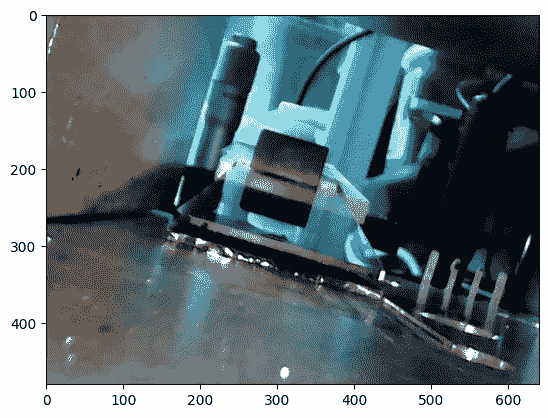
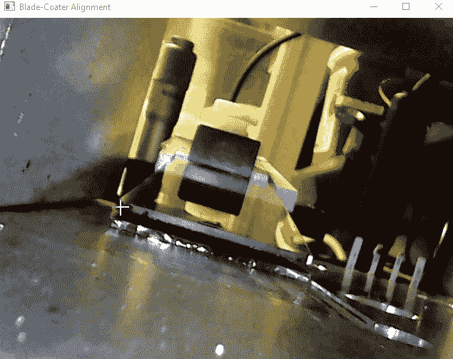
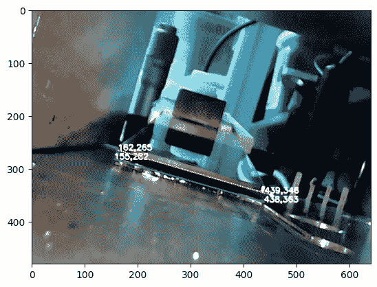

# 使用 Python 从图像中确定刮刀涂布机对准

> 原文：<https://betterprogramming.pub/determining-blade-coater-alignment-from-images-using-python-4242566dbc4a>

## 使用 OpenCV 自动化一个乏味的程序

我设计和制造的刮刀涂布机的示意图和实际图片。图片作者。

在我的博士课程中，我参与了几个不同的项目，我认为它们非常有趣。

这些项目包括合成氧化钛(IV)纳米粒子和从黄色甜菜中提取花青素以用于染料敏化太阳能电池，以及在各种同步加速器设施中进行高级 x 射线实验和开发用于提取光电和制药应用材料中分子取向信息的机器学习算法。在这些众多的项目中，我最喜欢的一个项目是为我工作的实验室设计、建造、测试和使用一台定制的刮刀涂布机。我真的很喜欢这个项目，因为它非常实用，因为我有如此多的自由去探索和试验我认为合适的各种功能和特性。这让我内心的工程师非常高兴。

在这篇短文中，我将展示我开发的 Python 例程，它帮助我调整刮刀涂布机来制作有机薄膜。

刮刀涂布机是一种允许人们从溶液中产生薄膜的设备，以便通过在基材的长度上拖动刮刀来制造各种装置。用这种技术制作薄膜的过程被称为刮刀涂布或溶液剪切，你可以认为它有点类似于打印机。越来越多的研究实验室逐渐采用刮涂法，以提高产量，并模仿工业装置中使用的卷到卷技术，大规模生产有机电子器件。在这种情况下，“刀片”是一个标准的显微镜载玻片。在刮刀涂布过程中，可以控制各种参数，例如刮刀速度、刮刀高度和刮刀角度，这些参数可以用来调节薄膜的厚度和其他性质。不用太专业，这些参数会影响控制液体如何在表面上移动的剪切力。在涂布过程中控制这些剪切力对于生产均匀和可再现的薄膜是重要的，并且可以影响分子水平的有序性。

确保涂层过程可重现的一个关键因素是检查刀片和基底之间的对准情况。当我第一次设计和制造刮刀涂布机时，我没有意识到对齐对于确保样品重现性有多么重要。通过对齐，我的意思是刀片的边缘与基底表面的平行程度。所以我增加了一个双轴测角仪，它可以帮助我更好地对准东西。有一段时间，我“用眼睛”进行校准，换句话说，我只是简单地看看校准是否足够好。然而，刮刀涂布机最终会有除我之外的用户，因此需要一个标准操作程序(SOP)。更复杂的是，刮刀涂布机位于手套箱内，因为我使用的材料对空气和水分的降解极其敏感，这意味着简单地查看内部是不可行的。因此，我在叶片室里面安装了一些照相机，这样我就可以用来观察里面了(见下文)。

# 例行公事

现在，我有办法看到刀片的边缘和基板，我想我可以使用 Python 的一些基本图像处理技术来确定当前的对齐。想法很简单:

1.  将角度计旋钮调整到某个角度。
2.  从刮刀涂布机的背面摄像头拍摄刮刀和基材的照片
3.  确定定义刀片边缘的线的坐标
4.  确定定义基底边缘的线的坐标
5.  使用点积确定这两条线之间的角度
6.  如果来自步骤 5 的角度低于期望的对准阈值，则叶片被对准。否则，重复步骤 1-5，直到基板和刀片之间的角度在所需的公差范围内。

Python 在第 3 步开始。这项工作只需要 4 个库/模块:OpenCV、glob、numpy 和 matplotlib。图像需要加载到 Python 中，这是我用 OpenCV 完成的。

叶片室内部视图。图片作者。

接下来，我需要一种方法来制作一条定义刀刃的线。这可以很容易地用 OpenCV 通过鼠标点击的交互方式来完成。这个想法是让用户在图像的两个点上点击，这将允许我定义刀片的边缘并将其绘制到图像上。此外，我还希望将这些点存储在内存中，以便在后续处理中使用。这可以通过全局变量或通过使用类来实现。我决定采用后一种方法来初始化一个数组实例，该数组包含用户选择的点的 x，y 像素坐标。最后，我还认为将坐标显示在图像中给用户会很棒。我使用下面的代码完成了这个任务:

这当然也适用于对应于衬底的线的构造。可以在下面的操作中看到代码:

边的坐标选择演示。图片作者。

前两个点定义刀刃的线，而后两个点定义制作基底的线。每个点都保存为一个元组，并放入名为 cs.points 的数组中。然后，我可以访问这些点并使用它们来绘制线条，如下所示:

从选定的坐标绘制刀刃和基底的线条。图片作者。

最后，我可以使用点积公式，求解θ，来计算这两条线之间的角度，如下所示。

用点积计算矢量间的夹角。图片作者。

使用上面例子中的坐标，我确定刀片和基板之间的角度是 **179.7** 。0°**和 180°是对应于刀片和基板彼此完全平行的两种情况。换句话说，在上面的例子中，刀片偏离完美对准 0.3**。****

****我将重复这个计算 3 次，以获得平均对准角度和对准不确定性，因为用户在图像上点击的位置存在一些误差。对于我的应用，我注意到大于 0.5 的对准角通常会导致薄膜具有清晰的横向厚度梯度。因此，在所示示例中计算出的 0.3 值将表明刀片对齐良好，可以使用。****

# ****结论和机会****

****对于我的目的来说，我在这里展示的程序有足够好的准确性和足够快的速度。然而，肯定有一些领域可以进一步自动化。例如，我现有的测角仪不是电动的。因此，这部分需要手动完成。我对这个项目的设想是有一个电动测角仪，我可以连接到计算机上。然后，我将能够在我的 python 程序和角度计之间创建一个反馈环，该反馈环将根据计算出的偏移自动对齐刀片。除此之外，我还可以扩展这个例程，以便实时完成对齐角度的角度计算，而不必手动单击这些点。我想到这样做，首先确定刀片的边缘和基板使用坎尼或轮廓或沿这些线的东西。不幸的是，缺乏资金不允许这个项目进一步发展，因为我必须专注于其他项目。****

****我希望这篇文章对你有用。感谢阅读！****

****如果你愿意支持我的编码工作，请考虑通过我的推荐链接加入 Medium:[https://victormurcia-53351.medium.com/membership](https://victormurcia-53351.medium.com/membership)****