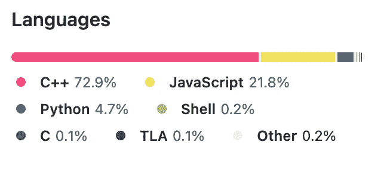

# 深入开源领域

> 原文：<https://betterprogramming.pub/diving-into-open-source-78edc820048e>

## 成为开源贡献者的技巧和诀窍

塔里库尔·拉纳在 [Unsplash](https://unsplash.com?utm_source=medium&utm_medium=referral) 上拍摄的照片

开源软件的源代码是开放的，换句话说，任何人都可以访问它。这是任何人在一个技术项目上找到一群合作者的一种方式。人们加入开源项目是为了与社区联系，学习技术技能，帮助开发他们感兴趣的软件，甚至在一些项目中，[还能获得奖金。](https://store.gatsbyjs.org/)

雇主可能会根据软件候选人对开源项目的贡献来评估他们。许多招聘人员甚至在 GitHub 上寻找潜在的候选人。所以，为开源做贡献甚至可以帮你找到工作。在你的简历中，你应该列出任何你为之做出重大贡献的项目以及你做出的主要贡献。这有助于让雇主感受到你所了解的技术，并突出你作为团队成员的技能。

只有一些开源软件是自由软件——任何人都可以无限制地修改和重新发布的软件。然而，所有的自由软件都是开源的。与一些人所认为的相反，自由和开源软件是可以销售的。

# 选择开源项目

您可能会根据构建项目所用的技术、软件的用途以及项目的质量来选择项目。了解项目结构，包括文档、发布频率、包格式、维护者、贡献者以及谁接受拉请求。你还应该调查开放和最近关闭的问题，有多少，他们需要多长时间来扭转，为什么。您想要查看源代码的质量，包括测试的代码覆盖率以及测试框架是否是最新的。所有这些信息将帮助您评估项目的质量。

使用 GitHub Explorer 搜索项目。截图自 Serghei Iakovlev。

找到项目的一个方法是直接在开源平台上。GitHub 是好的开源库的主要位置，尽管还有其他的如 Bitbucket。基于你之前的 GitHub 活动，比如你用星号标记的库，你查看过的库，你贡献过的库，以及你的项目，你也会得到一个可能适合你的项目列表。您也可以订阅 GitHub 时事通讯，获取推荐项目的电子邮件。

为了在 GitHub 上获得更准确的搜索结果和提要，您可以更改您对其他项目的赞。为此，请访问您的 GitHub 个人资料，点击“存储库”，然后点击“星星”然后，您可以从项目中删除星级。

在平台之外，还有其他发现项目的方法。也许你已经在使用这项技术，或者你在文章中读到过，或者你在一次技术演讲中听说过。或者是朋友告诉你的。许多外部网站和应用程序，如 [Goodfirstissue](https://goodfirstissue.dev/) 、[待价而沽](https://up-for-grabs.net/#/)和 [Sourcegraph](https://sourcegraph.com/search) ，也可以帮助你找到开源项目。

这个项目的受欢迎程度体现在它拥有的 GitHub 明星数量、观看者数量和分叉数量上。其他标签，如需要帮助的公开问题和需要帮助，可能会告诉你更多。用于构建项目的编程语言在图形中是可见的，而技术的其他方面(如编程框架)可能会在文档中描述。

MongoDB 中使用的编程语言，来自它的 GitHub 库。Rebecca Sealfon 截图。

在语言和技术方面可能有两个或更多类似的项目，但它们的结构会有所不同。只有一个项目可能有一个用于托管文档的 wiki，并且只有一个项目可能有持续集成(CI)。您可能想要在更成熟的项目上进行构建，或者如果不太成熟的项目看起来很有前途，或许可以采纳一些想法并添加到该项目中。

# 你能帮什么忙？

不管项目有多成熟，或者有多少贡献者，开源项目总是需要额外的帮手。也许项目的某些部分需要更新以兼容更新的技术，需要添加或更改功能，或者需要修复错误。即使是最大最活跃的项目也会有公开的问题，不管有多少维护者和贡献者。

参与开源项目不仅仅是提交代码，而是做任何有助于项目发展的事情。任何感兴趣的人都可以参与开源项目，包括那些没有编程技能的人。

当你尝试为项目做贡献时，你可能不想太快变得过于雄心勃勃。从保持你的拉取请求较小开始。还要确保与项目的格式一致，如果存在这样的文件，请阅读 CONTRIBUTING.md 以获取说明。如果这样的文件不存在，您可能会建议创建一个。回顾最后十个拉取请求，并在这些请求之后建立拉取请求的格式模型。

贡献方式的部分列表:

*   **构建新功能。**这可能是人们在列举项目贡献方式时首先想到的事情之一。尤其是如果这个特性流行起来的话，这也是参与开源项目可以提高你的资质的最好方法之一。然而，对于任何给定的贡献者来说，这并不总是最好的方法。添加一个新的、完整的特性需要您彻底理解项目的优先级，这样您就可以处理一个对整个项目都很重要的特性。它还要求您编写完整的代码、测试和文档，并充分理解任何接口，以使它们易于使用。
*   **报告 bug。**这是参与项目最简单的方式，因为你不必是开发人员。这也是最重要的任务之一。只需下载并安装软件，开始使用它，并注意任何错误。然后，如果这些错误尚未被报告为问题，则创建这些错误存在的新问题。这将提醒开发人员需要修复 bug。
*   **回答问题。**有时候，问题不是用来报告 bug，而是用来提问。开放问题可以作为一个论坛，人们可以在这里提问和回答问题，例如“我如何使用这个特性”？
*   **创建文档。**这个也不一定需要编程知识，虽然需要很好的文字功底。浏览项目的文档，看看缺少什么或者需要改进什么。然后试着填补空白。例如，许可证文件通常包含误导或不相关的信息。许可证文件应该包含允许注册用户打开和访问一个软件的注册信息。
*   **将文档、程序和界面翻译成不同的语言。许多项目使用翻译服务，例如基于 web 服务或 gettext 编译的 MO 文件的翻译系统。你也可以翻译成外语，这将有助于扩大项目的用户群或程序员群体。**
*   **开始讨论，提出建议。**如果您有如何改进软件的想法，例如添加新功能或更改旧功能，您可以创建一个新问题或分享您对现有开放问题的想法，以使其成为一个讨论。你也可以对他人的想法提供反馈。除非您首先参与讨论，否则包含讨论部分的项目不太可能接受未决问题。
*   **添加测试。**许多项目都有单元测试和其他测试中缺失的特性。
*   **改善基础设施。**许多项目面临基础设施问题，例如持续集成和持续交付(CI/CD)，或者开发网站或登录页面。你可以为这些做出贡献。事实上，改进配置可能是项目的一个很好的开端。
*   **解决现存的未决问题。**这通常需要编程知识，但并非总是如此。例如，一些问题可能涉及修复或改进文档，许多问题涉及编写代码。只需浏览问题列表，找到您想要帮助解决的问题。有时，问题是重复的，您可以进行重复数据删除。有时，在问题单上有一个你可以参与的讨论。
*   **建议发放标签。**如果项目没有问题标签，您可能需要建议一个标签系统。
*   **传道。你可以在社交媒体上传播这个软件，告诉你的观众这个软件是如何工作的，它帮助解决了什么问题，以及为什么它比其他软件更受欢迎。这是围绕软件项目发展社区的一种重要方式。**

设置 GitHub 使用的版本控制系统 Git，这里的指令[是](https://docs.github.com/en/get-started/quickstart/set-up-git)。您不希望使用您的公司 GitHub 帐户进行个人提交，反之亦然。如果您决定更改您在 GitHub 中的电子邮件地址，您的所有投稿都将被删除。

# 派生存储库

分叉意味着从开源软件项目中获取源代码并开发一个全新的程序。通常，这是开源项目陷入僵局的结果，这是无法克服的，以至于所有工作都停止了。在这个上下文中，fork 是一个生成自身副本的进程。在 pull 请求中，fork 也可以与主存储库合并。或者，它甚至可能取代项目的主要分支，成为主要进行维护的分支。

照片由[安视觉](https://unsplash.com/@anvision?utm_source=medium&utm_medium=referral)在 [Unsplash](https://unsplash.com?utm_source=medium&utm_medium=referral) 上拍摄

类似的方法是通过克隆旧的存储库并在其中创建一个分支来创建一个新的存储库。尽管没有指示存储库是一个分支，但是它将具有分支的法律地位。

虽然分叉让您无需等待维护人员就可以更改任何东西，但是它也将您从主项目的社区中移除。或者，如果一些社区成员加入你，分裂社区可能会分散它。也可能很难确定项目的作者、想法等等。此外，创建分叉会破坏项目的生态系统。

在自述文件中，您需要描述对原始存储库所做的更改。这将澄清其他贡献者是否可以参与，以及如何参与。

# 维护一个开源项目

维护一个活跃的多用户项目是开源贡献者的黄金标准。如果你这样做了，这个项目就变成了你的责任。如果它被广泛使用或流行，你就有责任。有一天，你可能会在一场灾难中醒来。您接受的一个不正确的拉取请求可能会给使用类似技术的公司带来严重的问题。

项目中可能有几个维护人员，他们划分工作量和职责。通常，维护人员接受补丁，开发新功能，解决问题，回答问题，修复 bug，发布新版本，更新环境，设计和监控持续集成，并解决安全问题。

# 结论

开源使你能够打破你所处的技术和社区，选择你自己的。这使得技术人员能够将他们的职业掌握在自己手中。乍一看，贡献者是免费工作的，但随着时间的推移，情况并非如此。事实上，他们获得了市场需要的技能，并从他们的经历中变得更有价值。

# 资源

*   [设置 Git 以使用 GitHub](https://docs.github.com/en/get-started/quickstart/set-up-git)
*   [GatsbyJS](https://github.com/search?o=desc&q=org%3Agatsbyjs+type%3Aissue+label%3A%22help%20wanted%22+is%3Aopen&s=updated&type=Issues)的未决问题，这是一个基于 React 的无头内容管理系统框架。
*   [NoSQL 数据库 MongoDB](https://github.com/mongodb/mongo) 的源代码。
*   好的第一期从流行的开源项目中挑选容易的内容，并帮助你为开源做出你的第一份贡献。
*   [待价而沽](https://up-for-grabs.net/#/)是一个开源项目列表，专门为新贡献者策划任务。
*   [Sourcegraph](https://sourcegraph.com/search) 是一个跨开源项目的代码搜索。

*本文由*[*Serghei Iakovlev*](https://www.linkedin.com/in/egrep/)*[*air slate*](https://www.airslate.com/?utm_source=Medium&utm_medium=Articles&utm_campaign=airslate_homepage&utm_id=open_source)*开发总监根据他的技术演讲撰写。奥尔哈·奥萨德丘克将谢尔盖的讲话翻译成了英语。**