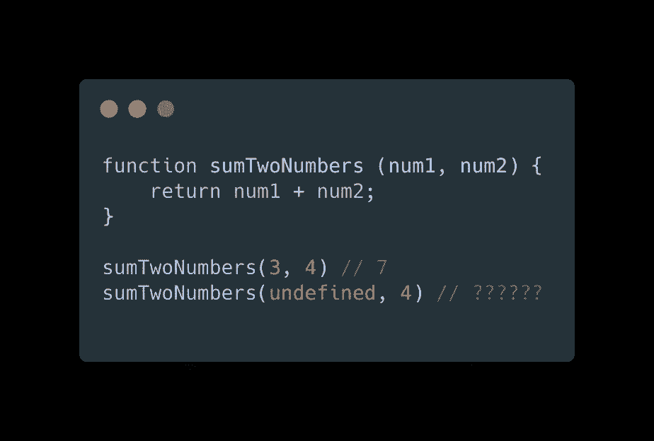

# 我真的懂编程吗？

> 原文：<https://betterprogramming.pub/do-i-really-know-programming-6449bf6924ad>

## “如果你不能简单地解释它，你就理解得不够好。”——阿尔伯特·爱因斯坦

怀疑我的技能

根据 [SlashData](http://www.slashdata.co) 的数据，2019 年全球活跃软件开发者达到 2640 万。

无论你是从职业生涯开始就已经在 IT 行业了，还是刚刚起步，你应该问自己的问题都是一样的:我真的懂编程吗？

# 两位程序员

尽管程序员之间存在着无数的差别和差异，但我在生活中最常遇到两种类型:冒名顶替的*和自信的*程序员。**

## 冒牌货

冒名顶替者，我有时会把自己包括在内，是那些觉得自己不适合他们的角色的开发人员。对工作或责任不够好的持续恐惧让我们怀疑自己没有做足够的事情来跟上技术发展的快节奏，让我们感觉落后于团队。

这通常会导致学习越来越多来填补这个空白——在这个过程中，我们会变成比我们意识到的更有技能的开发人员。

然而，被 [*冒名顶替综合症*](https://en.wikipedia.org/wiki/Impostor_syndrome) 影响并不是什么丢人的事。大约 70%的开发人员在他们的一生中至少经历过一次这种状态，所以这很常见，尤其是在一个人职业生涯的开始，那时我们所知道的仍然只是沧海一粟。

## 自信的程序员

另一方面，一些程序员对他们的技能水平有完全相反的看法。我也经历过这一阶段，幸运的是在为时已晚之前意识到了这一点。

我说的是当我们对自己的技能变得过于自信，认为自己是极限程序员的时候。

当然，在简单的项目中实现我们的第一次编码成功是一种非常好的感觉。它最终向我们展示了我们可以做到——我们正在编码。但是伴随着大国而来的不应该是以下几个方面:

*   **傲慢:**每当我们相信自己的解决方案比别人的好，我们就向封闭的心态迈近了一步。在编程中，对于同一个问题有成千上万的解决方案，不要因为我们认为我们的解决方案是最好的而去比较我们所做的，因为这限制了我们从不同的角度看问题的机会。
*   **懒惰:**仅仅因为我们在公司担任一个重要的角色，或者我们在一个特定的主题上展示了丰富的知识，并不意味着我们处于职业生涯的巅峰，或者是时候坐下来停止学习了。没有人会什么都知道，当我们不再好奇的时候，就是我们作为开发者成长的真正终点。

不幸的是，我曾经受到这些方面中第一个(也是最糟糕的)的影响，在我对编码真的一无所知的时候感觉自己像个神。我现在也不知道。

但是合适的人总是会帮助我们变得更好，不仅作为开发人员，作为人类也是如此。

对我来说，这种帮助来自我的前任首席技术官的反馈。我在这家公司工作了一年多一点，我自信地认为我作为一名程序员做得非常好，我的水平非常高。我从未如此大错特错。

在与他的交谈中，他帮助我认识到，作为一名开发人员，如果没有最重要的技能:倾听，我的技能就一文不值。

当你开始更多地倾听别人的意见，而不是急于暴露自己的观点时，你会在他们眼中获得更多的价值——希望你自己也是如此。

这对我来说是一个真正的改变，我会继续考虑让我未来的选择对如何作为一名程序员持更开放的观点。

# 我知道什么？

为了定义我们的编程知识水平，我们不能简单地问我们的祖母我们是否足够好——那是行不通的，因为他们爱我们胜过任何人。

为了做出这种区分，定义一些建立我们能力水平的标准是很重要的。但在此之前，我想先说明一些我认为非常重要的事情:

没有糟糕的程序员，只有缺乏经验的程序员。

这真的很重要，因为它提供了不同的视角，并提醒我们每个人在编写第一行代码时的状态。

那么我们如何评价自己是否真的懂编码呢？在这个练习中，我会参考[布拉德利·布莱斯维特](http://www.bradoncode.com/about)描述的“[一个优秀软件开发人员的四大支柱](http://www.bradoncode.com/blog/2012/08/the-four-pillars-of-good-software.html)”。

# 代码质量

当我检查我的一些代码时，我问自己的一个自然的问题是“这个片段看起来足够好以至于我能在一周内理解吗？”

这使得代码质量方面更加个人化，因为每个人都有不同的视角。但是，我们可以回答一系列一般性问题，以确定我们是否有效地遵守了良好的标准，或者我们是否可以改进:

## 我的代码易读吗？

代码可读性应该是我们主要关心的问题之一。现代编程语言引入了许多新奇的短语法技巧，以允许更少的冗长代码，创造了许多单行代码，他们倾向于使用它们来编写更少的代码。

这对我们的自尊心有好处，因为它让我们为用一行代码编写的很酷的功能感到自豪，但是当你在六个星期后检查相同的代码时，如果你使用了更具描述性的语法来描述代码片段应该做什么，你会很高兴的。

用不同版本编写的相同函数

我们容易忘记的是，虽然计算机理解我们的代码并不难，但对人类来说却很难。我们应该写我们的代码，让人们能够理解它。对于一台计算机来说，这些行将被转换成 0 和 1，所以你是否使用了一个很酷的语法或更具描述性的东西并不重要。

> “代码是给人类用的。”
> 
> —凯尔·辛普森

## 我的代码一致吗？

编写代码时保持一致与编写干净的代码一样重要。

 [## 干净代码的 3 种 JavaScript 重构技术

### 一些简单的技巧来重构你的代码，让它在任何语言中都更清晰。我相信每个开发人员都应该…

marcoghiani.com](https://marcoghiani.com/blog/3-javascript-refactoring-techniques-for-clean-code) 

你可以遵循你喜欢的代码风格——这并不重要。保持你的代码写得好并且易读的关键是坚持这种编码风格，这样其他阅读你的代码库的人可以容易地浏览它。

有很多好的指南可以帮助我们发现我们的编码风格应该是什么样的，尤其是一些写得很好的书——我在“技术领域的每个人都应该阅读的 4 本书及其原因”中推荐了这些书他们对我构建自己的编码实践至关重要。

 [## 从事技术工作的每个人都应该读的 4 本书，为什么

### 在过去的一年里，那些帮助我成为职业程序员的读物，让我重新发现了乐趣…

marcoghiani.com](https://marcoghiani.com/blog/4-books-everyone-in-tech-should-read-and-why) 

# 代码正确性

既然我们已经知道了应该如何编写代码来保持代码的整洁和可维护性，那么还有一个小细节需要注意:你的代码应该像预期的那样工作。

我的意思是，我们应该编写的代码不仅要符合我们对它的要求，还要考虑到死角和错误的情况。直截了当地说，查看下面的代码片段，在这里我们要编写一个对两个数字求和的函数:

两个数相加的函数。它不包括角落情况。

你明白我的意思吗？这个函数实际上是接收两个数字并返回它们的和，但它只涵盖了最好的情况。如果我们将不同于数字的东西作为参数传递，它的行为将不同于所需的功能。

这个简单的例子给了我们一些需要回答的问题:

*   我在代码中包含了边缘情况和不同的行为吗？
*   如果错误出现在我的代码中，我应该处理它们吗？
*   我正确地测试了我的代码功能吗？
*   这段代码依赖于我应该考虑的外部依赖吗？

我们可以将这些问题作为我们的代码在创建新功能(或重构它们)时应该考虑的清单。当然，不可能总是做得尽善尽美，但是始终致力于将我们的代码固化到它的角色中是成为一名优秀开发人员的好方法！

> "完美是无法达到的，但是如果我们追求完美，我们就能追求卓越."
> 
> ——文斯·隆巴迪

# 代码性能

在看到我们的代码看起来不错，可维护，满足所有的正确性需求之后，我们就可以开始深入到软件编程的兔子洞，谈论性能了。

我真的很关心我的代码的性能如何，这通常是我不断重复的最大错误:编写快速可靠的代码很重要，但是过度思考您的代码并包括过早的优化可能会破坏您的生产力并降低功能性。

我们不能忽视编写实现的需要，这样用户就可以享受我们软件的流畅体验。但是，我们应该一步一步来。

## 执行代码的 5 条戒律

我试着遵循一些简单的规则(并不总是成功),它们是一个很好的起点:

1.  让它工作。然后重构。然后深度优化。
2.  不要用代码质量来换取代码性能(如果应用程序对性能并不敏感)。
3.  如果代码有外部依赖，在优化之前检查它们是如何工作的。
4.  在集成新代码时测量性能，以便立即发现可能的优化失败。
5.  如果是一个架构决策，深入思考要使用的正确数据结构。

遵循这些建议肯定会让你在开始时慢下来，但从长远来看，重复这些建议并犯错误会改善你的工作方式，让你自动遵循更好的实践并减少错误。

# 代码生产率

卡尔·海尔达尔在 [Unsplash](https://unsplash.com?utm_source=medium&utm_medium=referral) 上拍摄的照片

通过实践，所有的开发人员最终都会变得更好。他们学习应用坚实的编程原则，并知道如何编写专业代码。优秀的开发人员和优秀的开发人员的区别在于他们在生产定性代码时的生产力。

在这里，我们可以问自己一些问题:

*   **我知道我的编码节奏吗？了解是什么让我们分心，我们需要休息的频率，或者是什么让我们推迟了我们的任务，这是防止你发现自己看着屏幕却不知道如何实现某事的第一步。了解你自己和你的习惯，以便能够完全集中精力，保持高效率。**
*   我能自动完成我的任务吗？
    程序员是*编程的人，*那么谁比我们更适合给我们的设备下达指令，告诉他们如何完成我们重复多次的任务呢？
    例如，我写了一个脚本来自动化我们公司的发布过程，这比我们在每次迭代中预期的节省了更多的时间。
*   我了解我的工具吗？
    由于最近软件开发的进步，我们有了大量令人惊叹的工具，比如 ide、任务管理器、终端等等。发挥它们 100%的潜力可以极大地提高我们的工作效率——很快我们就会忘记我们曾经如何缓慢地在屏幕上移动鼠标来关闭窗口。每当你开始使用一个新工具，检查它的所有可能性，并学习如何将它们整合到你的工作流程中。

# 第五根柱子

在开始的时候，我说过要参考四大支柱来回答我们对编程了解多少的问题，但那是一个谎言。我认为最后一个支柱是最重要的，也是最优秀开发人员的特征。

是关于*沟通。*世界上最伟大的开发人员是那些能够简单地交流和解释他们的代码是如何工作的，或者将抽象具体化的人。

教师、会议演讲者、作家……他们不仅被证明是伟大的程序员，而且能够让其他人变得伟大，以一种单独学习更困难的方式给予智慧药丸。

> “如果你不能简单地解释它，你就不够了解它。”
> 
> ——阿尔伯特·爱因斯坦

# **结束**

这是我很久以前开始的思考，我想与你分享。我希望你能像我一样，对自己提出更多的问题，并回答这些问题。

感谢阅读！