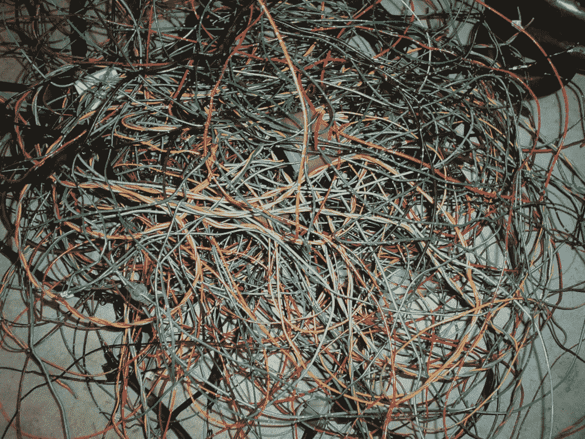

# “做对了，骄傲的去做！”—给开发者的建议

> 原文：<https://betterprogramming.pub/do-it-right-do-it-with-pride-a9e7783f1d28>

## 编写更容易理解的代码

由 [Do Nhu](https://unsplash.com/@donhu06?utm_source=medium&utm_medium=referral) 在 [Unsplash](https://unsplash.com?utm_source=medium&utm_medium=referral) 上拍摄的照片

每天，我们在工作中、在家里、甚至在虚拟世界里与人打交道……我们常常想当然地认为，我们做出的小小决定和采取的行动会影响、冲击和作用于我们打交道的人。通常，只要有一点点意识和意图，我们就可以不费吹灰之力让别人的生活变得更轻松愉快。

以电工为例。为了让你房子里的灯和插头正常工作，唯一需要的是它们正确连接(显然它们还需要一个能源，就像…我敢说… Eskom？).电线和连接根本不需要整齐地分开、贴上标签或组织起来。

电工的例子与代码非常相关……对于大多数普通人来说，整个建筑中的电线、连接和其他电气组件是“隐藏的”,就像我们许多人编写的代码一样。

这些细节是从不需要或不想了解它们的人那里抽象出来的，然而，仅仅因为一些东西对所有人来说是不可见或不可触摸的，并不意味着我们不应该像它确实在 showcase 上一样正确地做它。

“*眼不见，心不烦”*习语可悲地在这里发挥了作用……结果，这些电配置可以，而且经常确实像一种意大利面条——不是令人垂涎三尺的那种，而是令人垂涎三尺的那种。仅仅因为这些细节是从日常生活中抽象出来的，并不意味着另一个人或你未来的自己就不需要再做这些了。

当出现问题并需要修复时，或者当最初的实现需要扩展或增强时，该怎么办？总得有人去处理它…对吗？无论是最初的“意大利钢丝厨师”还是下一个必须弄清楚混乱状况的倒霉家伙……额外的时间要求和通常包含的挫败感都是完全不必要的。

电工的例子是一个简单的故事，它创造了不可维护、不可伸缩(或者至少不容易)的东西。毫不奇怪，这就是“意大利面条式代码”这个术语的来源——在最初实现的规划和设计阶段没有足够的远见，或者可能只是在没有太多关心或自豪的情况下编写的。代码是为做特定的事情而写的，虽然它可能只是做了这些…但它做得有多好呢？将来能保持或增强到什么程度？

由于大多数开发人员以前都遇到过这个代码难题，它很可能会增加范围蔓延或延迟交付。如果这还不够，这是一个滋生虫子的地方。

不要误解我的意思，有一个时间和地点可以一起破解概念证明或一次性解决方案，然后在它达到目的后一起离开，但这些情况是例外，而不是常态…

根据我十年的软件经验，我提供以下建议:每当你发现自己在创建一个“一次性”的一次性解决方案(拼凑一些东西)时，问问自己:将来我能使用这个或它的一个版本吗？我能使它更通用以扩展它的潜在用例吗？该解决方案的任何部分都可以转移或重用吗？如果任何一个问题的答案是肯定的，那么当你对上下文记忆犹新的时候，花几分钟(timebox it)，继续重构它，添加一个自述文件，或者如果需要的话，甚至只是一些评论。为你或下一个人将来需要重新审视它时感到自豪，让它更容易理解。

我向你保证，当你开始这样做，并且它成为你正常的做事方式时，你也会对你所做的日常工作更有成就感和自豪感，使你的旅程更愉快，即使你的一些工作被抽象了 5 层或从未看到生产的光芒…只要做对了，这样你就不必以后重做。

如果你能坚持这样做，那么，随着时间的推移，你也会建立一个文件夹(一个解决方案和工具的库)，在你的职业生涯中，你不可避免地会回来……当你发现你自己或另一个人在你的库中寻找某样东西时，你希望如何找到它？你想翻找一些旧意大利面吗？或者你更喜欢见到一件小艺术品，带有你第一次添加的魔法……那会让你有什么感觉？

成功是一个旅程，而不是目的地。过程往往比结果更重要。 —阿瑟·阿什