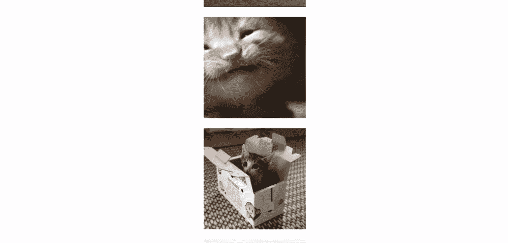

# 不要燃烧你的 CPU 处理 CSS 动画

> 原文：<https://betterprogramming.pub/do-not-burn-you-cpu-working-with-css-animations-e4d19069fb0f>

## 在懒惰加载你的图片和 css 动画时要小心

制造者在 [Unsplash](https://unsplash.com/s/photos/css?utm_source=unsplash&utm_medium=referral&utm_content=creditCopyText) 上 [NESA 的照片](https://unsplash.com/@nesabymakers?utm_source=unsplash&utm_medium=referral&utm_content=creditCopyText)

将笔记本电脑变成煎锅的动画

嘿，大家都在看这个！最近，在处理惰性加载图像时，我遇到了一个问题，这个问题后来被证明是一个非常大的警告，在处理 CSS 动画时绝对需要考虑。

上面这个动画——一个简单的延迟加载图像的预加载动画——确实引起了一些麻烦。

在这里，我想分享一些发现，见解，以及一些你在一个页面上处理大量 CSS 动画时可能会遇到的警告。

# 问题:无限循环动画

长话短说，问题是有一些加载动画。这些是关键帧 CSS 动画，在加载图像之前显示闪烁效果。

我们用于图像加载的闪烁动画

当开发人员和产品所有者意识到打开主页是将笔记本电脑变成直升机崇拜者，并且电池在大约 30-40 分钟内逐渐耗尽时，问题就出现了。

我们开始挖掘，发现了这个:

我们在页面上有 20-50 个无限循环动画，将 MacBook Pro 2019 (i7)上的 CPU 在空闲网页上提升到 60%。

# 那是怎么发生的？

所以，最初的想法是为了节省一些流量，并在[十字路口观察器](https://developer.mozilla.org/en-US/docs/Web/API/Intersection_Observer_API)的帮助下，让载入图像变得更慢。

这是一个可靠和可持续的解决方案，所以它存在了一段时间，然后，为了改善 UX，有一个设计决定，在未加载的图像上制作一个初始加载动画，当图像被请求但尚未显示给用户时，这是一种占位符，就像文章开头的那个。

听起来不错——你两全其美，既节省交通费用，又有好的 UX。但是在主页上，我们恰好在某个时候有几个物品转盘，总共有 120 个物品。

并且在 99.9%的访问中，只显示了每个转盘的前 5 到 10 个元素。其他 100 个项目每秒钟循环一次 CSS 动画*。*

事实上，对我来说这听起来很疯狂，但是想想它是如何一步一步地出现的，就有些道理了。当然，这不是故意的，但在某些时候，有一些稻草压断了骆驼的背，现在我们想解决这个问题。

# 显示优点的东西

包含 20 个动画的空闲页面上的 Chrome CPU 使用情况-在 MacBook Pro 2019 (i7)上测试

在这里，我创建了一个带有几个示例页面的 [repo，这样您就可以检查每个页面的 CPU 使用情况，并看到不同之处。](https://github.com/starikovm/cpu-usage-of-css-animations)

# 解决办法

对于旋转木马的初始情况，它结束得非常快速和简单——我们删除了动画以避免任何额外的缩放资源消耗。

然而，我想更深入地调查这个案子:

在 [clusterjobs.de](https://en.clusterjobs.de) 网站上，我们有一个招聘列表，上面有很多公司的 logos 都是惰性的。

提高加载占位符性能的第一个尝试是使用`translateZ(0)`将动画关键帧移动到它们自己的复合层。简而言之，使用它将使浏览器使用 GPU 而不是 CPU 来制作动画。

建议本身是针对[这个栈溢出问题](https://stackoverflow.com/questions/13176746/css-keyframe-animation-cpu-usage-is-high-should-it-be-this-way)给出的。

还有就是这篇[好文章](https://www.smashingmagazine.com/2016/12/gpu-animation-doing-it-right/)关于 GPU 如何用于浏览器动画。免责声明—这里也有很多警告，主要是内存消耗。

最后，在性能和用户体验之间，我们选择了性能，完全删除了动画，但提高了图像加载的阈值。

慢速 3G 节流网络上的延迟加载图像

你可以在这里查看经验:[clusterjobs.de/search/react 柏林](https://en.clusterjobs.de/search/react berlin)。这个想法是，当一个图像在用户视图的最低点达到 200 像素时，就开始加载，这样用户就可以更快地看到它了。

上面的例子是针对移动网络的，但是在没有节流的情况下，没有实际的闪烁，并且看不到延迟加载的事实。

为此，您可以使用 [lazysizes](https://github.com/aFarkas/lazysizes) 库。

# 结论

最后我真的很惊讶，掉进那个陷阱有多容易，有多少人没有意识到。

动画确实对用户体验有影响，可以增加网站的趣味性，但过度使用或意外创建大量动画可能会给手机甚至笔记本电脑用户带来非常糟糕和令人不安的体验。

我的同事们说，从帖子开始就有 100 个动画的主页真的让笔记本电脑疯狂，电池泄漏得非常快。

所以，我给自己上的一课是比平时更频繁地记住表演。

例如，用一个简单的 GIF 代替生成 CSS 关键帧，延迟加载动画的例子可能完全不成问题。

另一方面，如果它对页面来说确实是独一无二的，而且用 CSS 会更流畅，我还是会用 CSS。