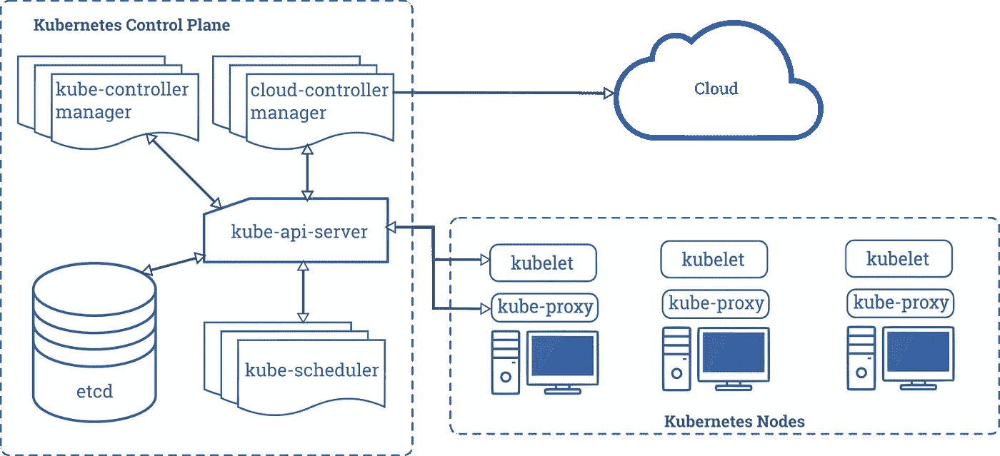

# 你真的需要 Kubernetes 吗？

> 原文：<https://betterprogramming.pub/do-you-actually-need-kubernetes-a342b0a90fd8>

## Kubernetes 解决了一些非常现实的问题。但是这些真的是你面临的问题吗？

克里斯·莱佩尔特在 [Unsplash](https://unsplash.com?utm_source=medium&utm_medium=referral) 上拍摄的照片

在过去的几年里， [Docker](https://www.docker.com/) 已经成为一种非常流行的构建、发布和运行应用程序的方式。依赖服务器配置和其他外部因素的日子已经一去不复返了。只需为 Docker 构建一次应用程序，就可以在任何地方运行它！

虽然这是我们开发软件方式的一个巨大飞跃，但它确实引入了一些新的挑战。首先，Docker 容器和主机之间的联网是很重要的。它与我们习惯的传统网络方式有很大的不同，并且需要一定程度的技巧才能做好。

存储是另一个挑战。默认情况下，Docker 卷绑定到其主机。这意味着如果我们想要运行共享一个卷的服务的多个实例，我们必须设置复制或者配置我们的设置来使用云存储服务。

虽然 Docker 本身是一项伟大的技术，但它似乎缺少一个将它联系在一起的组件。Kubernetes 正是这一组成部分。特别是在 Azure、AWS 和 DigitalOcean 等云平台提供的完全托管形式中，Kubernetes 解决了所有这些问题，同时通过[其所谓的*概念*](https://kubernetes.io/docs/concepts/) *将它们从最终用户那里抽象出来。*

kubernetes——也被称为*k8s*——是由谷歌创建的，用于解决他们在全球范围内运行成千上万个应用程序所面临的问题。虽然最初被批评为过于固执己见，但它在采用方面已经出现了快速增长，越来越多的公司正在寻找精通 k8s 的工程师。

虽然 Kubernetes 的实现对于像 Spotify、ING 和其他许多公司来说都取得了惊人的效果，但它可能不是所有公司的终极解决方案。在生产中运行 Kubernetes 也会导致一些严重的问题。在本文中，我们将探讨在决定转向 Kubernetes 之前应该考虑的一些因素。

# 学习曲线

Kubernetes 有自己的做事方式。它是围绕[一些概念](https://kubernetes.io/docs/concepts/)设计的，熟悉其中的大部分是在生产中运行 Kubernetes 的一个要求。这引入了一个相当陡峭的学习曲线。不仅对系统管理员如此，对开发人员也是如此。

为了给你一个思路，这里有一个 Kubernetes 架构的高层次概述:

Kubernetes 架构( [Kubernetes 组件](https://kubernetes.io/docs/concepts/overview/components/)，CC-BY 4.0)

所有这些管理器、调度器和服务器负责全天候运行您的应用程序，在 k8s 中也称为*工作负载*。他们每个人都有自己的职责，并实现一个或多个 Kubernetes 的概念。

如果您有使用 Docker 或更传统的系统管理的经验，这些概念不一定是您所熟悉的。每次在集群中部署新的应用程序时，Kubernetes 都会为您的应用程序创建以下最小数量的对象来运行:

*   一个代表您的应用程序的`[Deployment](https://kubernetes.io/docs/concepts/workloads/controllers/deployment/)`对象
*   一个`[ReplicaSet](https://kubernetes.io/docs/concepts/workloads/controllers/replicaset/)`来扩展与您的部署相关的`Pod`
*   可选地，一个或多个`[Service](https://kubernetes.io/docs/concepts/services-networking/service/)` [(s](https://kubernetes.io/docs/concepts/services-networking/service/) )负责您的部署的网络需求
*   一个或多个代表实际容器的`[Pod](https://kubernetes.io/docs/concepts/workloads/pods/pod/)` [(s](https://kubernetes.io/docs/concepts/workloads/pods/pod/) )。这是库伯内特建筑中最好的谷物

正如你所看到的，对于一个不熟悉 Kubernetes 的人来说，这是很难接受的。更重要的是，这些对象中的每一个都可以以无数种方式进行配置，从而彻底改变它们的行为。

启动和运行 Kubernetes 并正确配置其所有组件需要投入大量时间。受管理的 Kubernetes 提供者带走了大部分底层配置和集成，但是有些工作不可避免地会渗透到开发人员身上，他们至少需要对 Kubernetes 有基本的熟练程度才能正常工作。

你不需要*用* Kubernetes 来运行你的应用。这只是运行生产软件的众多选项之一。仔细考虑增加的学习曲线和配置开销是否值得迁移到 Kubernetes。

照片由 [Hitesh Choudhary](https://unsplash.com/@hiteshchoudhary?utm_source=medium&utm_medium=referral) 在 [Unsplash](https://unsplash.com?utm_source=medium&utm_medium=referral) 上拍摄

# 应用程序需要扩展吗？

Kubernetes 的一个关键特性是能够扩展应用程序的各个部分。流量在`Pod`之间自动路由和分配，如果进行了配置，Kubernetes 甚至可以为您自动扩展`Pod`。

如果应用程序有一个或多个需要处理突发事件的热门组件，例如在线游戏的身份验证服务，每当推出新的扩展或功能时，登录请求都会突然增加，那么这个功能就非常有价值。或者是那些在发布后变得非常受欢迎的游戏，它们需要快速扩展基础设施，而不必担心网络、存储等等。Pokémon Go 就是这种游戏的一个例子，它在推出后不久就有大量玩家涌入。他们广泛使用 Kubernetes 来服务世界范围内的大量玩家。

然而，对于大多数其他应用程序来说，构成整个环境瓶颈的单个服务是一个问题，通过优化比通过扩展更容易解决。当然，您可以在问题上再扔几个`Pod`，祈祷它消失——也就是说，直到您最终达到存储层的极限，此时简单地扩展您的`Pod`将不再能解决问题。

不要误解我的意思，能够动态扩展您的部署是一大优势。但是在我见过的绝大多数情况下，扩展部署来处理瓶颈是治标不治本。

此外，除了使用 Kubernetes，还有更多方法可以扩展应用程序。Heroku、Azure 和 AWS 都提供了动态运行和扩展应用程序的方法。例如，Azure Web App 可以选择*横向扩展、*，这实际上与在 Kubernetes 中运行多个`Pod`并在它们前面放置一个负载平衡器是一样的。

如果扩展能力是吸引你使用 Kubernetes 的原因，那么首先要仔细考虑其他不太需要维护的替代方案。

照片由[марьянблан| @ marjanblan](https://unsplash.com/@marjan_blan?utm_source=medium&utm_medium=referral)在 [Unsplash](https://unsplash.com?utm_source=medium&utm_medium=referral)

# 运行微服务

Kubernetes 主要面向运行许多小型工作负载，这些工作负载共同组成一个应用程序。其关键特性之一是独立扩展基础架构的各个部分，而不需要将应用程序作为一个整体来扩展，如前一节所述。

这些架构通常被称为*微服务架构，*在 Kubernetes 上蓬勃发展。它的体系结构允许轻松的服务发现，以及总体拓扑中各种组件之间的轻松交互。

因此，这里要考虑的不是在 Kubernetes 上运行微服务是否是一个好主意，而是微服务是否是给定应用的正确架构原则。虽然微服务架构通常比传统的整体架构更受青睐，但它们也会给开发人员带来巨大的开销。

拥有各自有明确职责的独立服务是一个合理的架构选择。将这些职责划分到不同的服务中似乎是合乎逻辑的下一步，但事实并非如此。为了让开发人员分析并修复微服务环境中的 bug，他们需要访问组成该环境的大部分(如果不是全部)服务。

这使得应用程序作为一个整体更加难以有效地工作。因为开发人员不能仅仅在他们的开发机器上运行应用程序，所以你需要引入一整套工具来解决问题。考虑一下每个环境的分布式日志记录、消息队列和性能监控。

这对开发人员生产力的影响是不可忽视的。同样，这样做可能是值得的，特别是对于拥有许多开发团队的大型组织，每个团队都将自己的微服务作为更大图景的一部分。然而，对于较小的公司和团队，微服务架构的价格要高得多。而 Kubernetes 并不一定让这些问题更容易处理。事实上，这甚至可能使他们变得更糟。

如果启用微服务架构是吸引您使用 Kubernetes 的原因，请仔细考虑责任分离是否是一个可以通过代码解决的问题，而不是通过在您的基础架构中引入 Kubernetes 这样的庞大组件来解决。

# 结论

在考虑 Kubernetes 是否适合您的项目或组织时，我们已经讨论了一些需要考虑的因素。Kubernetes 最初是由谷歌设计的，用来解决谷歌的问题。这些问题涉及到在生产中运行数量惊人的工作负载，其扩展要求对于我们这些凡人来说是不可思议的。

事实是，没有一家公司是谷歌。当然，除了谷歌。虽然你可能会遇到谷歌在设计 Kubernetes 时遇到的同样问题，但你的胜算很小。

在您决定实现 Kubernetes 作为您业务的基础之前，仔细考虑它对您的组织、开发团队以及您的平台的长期稳定性的影响是非常值得的。这项技术仍然相对较新，精通 Kubernetes 的工程师相对来说很难找到。

这并不是说 Kubernetes 是解决问题的错误方法。我之前参与了一些项目，这些项目依靠 Kubernetes 向最终用户交付价值，其规模是其他类似技术难以匹敌的。关键的一点是，尽管 Kubernetes 背后的宣传非常真实，但在应用程序环境中采用 Kubernetes 的决定是一个不容忽视的决定。

有时候这很合适——但绝对不是所有时候。