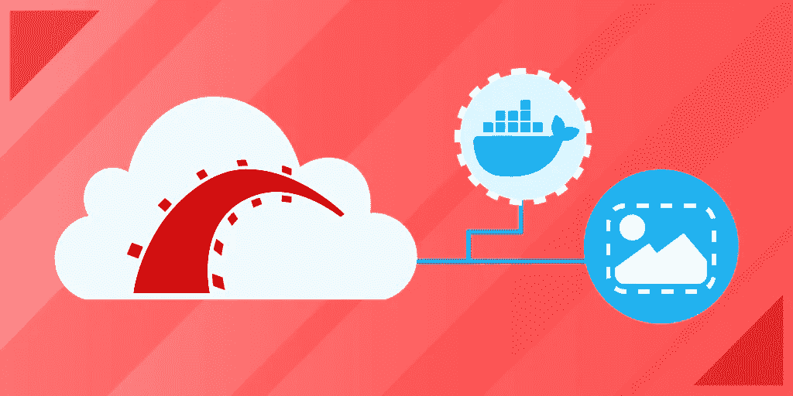
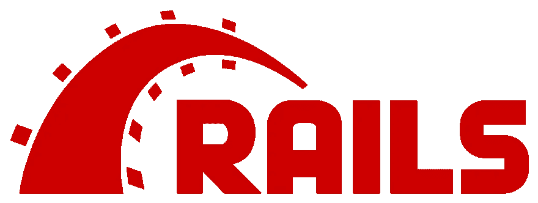

# Docker With Rails:优势和主要用例

> 原文：<https://betterprogramming.pub/docker-with-rails-benefits-and-top-use-cases-a0d1b9f7a1b4>

## 立即开始使用 Docker 和 Rails



图片来源:作者

Docker 和 Rails 都是 web 开发领域中众所周知的技术，它们都有独特而强大的优势。如果将这些工具结合到同一个应用程序中，它们的优势将会更加明显。Dockerizing 一个 Ruby on Rails 应用程序支持交付和运行软件的新的、创新的方法。

唯一的缺点是它更难安装——所以这值得吗？

今天，我们将探讨每种工具的优势以及它们如何协同工作，以帮助您决定它们是否适合您的下一个项目。

**下面是我们今天要讲的内容:**

*   Docker 是什么？
*   什么是 Rails？
*   为什么要将 Docker 与 Rails 一起使用？
*   你应该知道的基本概念和术语
*   Docker 和 Rails 入门


# Docker 是什么？

Docker 是一组用于打包和运行沙盒环境的工具，称为“容器”。像虚拟机一样，这些容器是自包含的，并且与程序的其余部分相隔离。它们也更轻便。本质上，Docker 允许您将一个应用程序及其所有依赖项打包到一个标准单元中。

Docker 的五个主要功能是:

*   **打包**:将软件打包成一种可重用、可共享的格式，称为镜像。
*   **分发**:轻松与其他人共享打包软件(映像)并将其部署到不同机器上的能力。
*   **运行时**:可靠地运行、暂停、重启或停止打包软件的能力。
*   **基础设施创建**:创建准备运行 Docker 容器的虚拟机。
*   **编排和扩展**:管理软件向单个 Docker 节点或整个集群的发布。

Docker 容器的主要好处是能够以易于分发的形式打包程序运行所需的所有依赖项和资源。

每个容器都有自己的环境。这允许您在自己的机器上模拟多节点生产场景。这些 Docker 容器是轻量级的，在某些情况下比 VM 更高效。

Docker 也很可靠，可以自我纠错。每当一个实例死亡，Docker 会自动生成你的应用程序的新副本，以避免产量下降。

*Docker 的自我纠正特性在跨多个实例分配工作负载的扩展解决方案中最有用。*

Docker 使用预打包的、易于加载的其他技术版本很好地与 Rails 接口，这些技术通常用于 Rails，如 Redis、MySQL、Postgres 或 Node。



# 什么是 Rails？

Ruby on Rails 是一个服务器端的 MVC 模型应用程序框架，用于开发 web 应用程序的结构。Rails 通过创新的省时功能优先考虑快速应用程序开发，比如无缝的表创建、表迁移和视图搭建。

Rails 不同于其他框架，因为它是使用配置约定(CoC)范式设计的。Rails 通过非常固执己见的语法实现了这一点，这意味着有一套构建 Rails 应用程序的“正确方法”。Rails 的 CoC 结构有助于减少开发人员需要做出的决策数量，从而加速整个 web 应用程序的开发过程。

Rails 的主要特点是:

*   **自动化测试** : Rails 提供了内置测试，所以测试用例更容易编写和执行。
*   **搭建**:这允许您轻松地创建管理数据的模型、支持用户数据交互的视图以及管理模型-视图通信的控制器。
*   **活动记录** : Rails 的运行基于这样一个假设，即您应该确保数据访问逻辑作为对象的一部分，以教育用户如何读写数据库。对象携带持久数据和对该数据进行操作的行为。
*   Rails 社区:Rails 有一个非常活跃的社区，开发者会定期发布产品补丁和更新。
*   **约定优于配置** : Rails 为构建适合大多数用例的应用程序设定了一个正确的方法，这比为每件事都做配置选项更重要。该框架为您做出提高生产力的决策。

# 为什么要将 Docker 与 Rails 一起使用？

通过在 Docker 容器中运行 Rails 应用程序，可以结合 Docker 和 Rails 的优点。

在 Rails 中，您保留了 CoC 固执己见的环境和所有用于快速构建应用程序的创新工具。在 Docker 中，您可以使用 Docker 的沙盒容器来应用自校正缩放和分发的便利性。

当你用 Docker 打包 Rails 时，你会得到一个可移植的、确定的 Rails 开发环境，你可以随时随地构建它。

看看我们如何无缝地将 Rails 和 Docker 结合起来。

首先，我们创建一个 docker 文件来定义我们的 Ruby 应用程序:

```
FROM ruby:2.7 
RUN apt-get update -yqq 
RUN apt-get install -yqq --no-install-recommends nodejs 
COPY myapp /usr/src/app/ 
WORKDIR /usr/src/app 
RUN bundle install
```

接下来，我们使用终端从任何定制图像构建我们的容器，比如`railsapp`。最后，我们有了一个完全沙盒化的 rails 应用程序实例，可以分发:

```
docker build -t railsapp .$ docker run -p 3000:3000 railsapp \ 
bin/rails s -b 0.0.0.0
```

# 带导轨的 Docker 的使用案例

如果你对 Rails 很熟悉，享受它提供的速度，但也希望你的应用程序被大量用户使用，你应该使用 Docker 和 Rails。Docker 带来了巨大的可伸缩性优势，以及它的动态容器启动，这意味着您的应用程序可以实时增加或减少实例的数量。

您甚至可以使用带有虚拟机的容器来提高使用微服务架构的应用程序的密度。例如，您可以在单个虚拟机的三个容器中运行三个服务，而不是在三个独立的虚拟机上运行三个服务。更少的虚拟机意味着维护基础架构的成本不会那么高。

这对团队来说也是一个很好的工具组合。如果没有 Docker，标准化每一个开发者的操作系统和每一个工具的版本将会是一项繁重的工作。使用 Docker，您的应用程序环境就在容器中，自动确保每个开发人员都有一个标准化的环境。

最后，Docker 是具有大量依赖项和其他必需技术的 Rails 应用程序的理想选择。在 Rails 上，连接到 PostgreSQL 或 MS SQL 等外部技术可能会很麻烦。Docker 通过允许您在单个文件中设置依赖关系和连接，并打包成一个文件来加载，从而解决了这个问题。

# 需要了解的基本概念和术语

*   **Docker Image** :一个包含蓝图的文件，用来构建一个在 Docker 中运行的容器。本质上，它是该类型的任何容器应该包含的内容的列表。
*   **Docker 容器**:图像的运行时实例。每个容器由一个 Docker 映像、一个执行环境和一组标准指令组成。
*   **Dockerfile** :一个包含所有命令的文件，用于构建一个您可以手动执行的映像。这允许 Docker 自动创建图像。
*   **Docker Compose** :一个内置的 Docker 工具，用来定义和运行更复杂的 Docker 应用。它的主要好处是能够在一个文件中定义多容器应用程序，可以用一个命令启动。
*   **Dockerize/Dockerized** :使用 Docker 打包应用程序的行为。它通常用于描述应用程序与 Docker 集成后的结果。
*   **Ruby 脚本**:Ruby 编程语言中用于使应用组件动态化的命令。
*   **Rails 服务器**:在`http://localhost:3000`时，您的浏览器上可用的本地 web 服务器。用于测试没有专用服务器的应用程序。
*   Rails Gemfile 用于描述 Ruby 程序中文件依赖关系的文件。您可以将这些文件添加到容器中，以便轻松地将依赖项添加到您的应用程序中。

# Docker 和 Rails 入门

现在，您对这些工具之间的关系有了更好的理解，是时候动手了。看到这些工具的好处的最好方法是在您自己的项目中一起使用它们。

接下来要探讨的一些主题是:

*   映像构建缓存
*   使用 Docker Compose 装入卷
*   向 Rails 应用程序添加 Redis
*   使用 Rail 进行云部署

*快乐学习！*