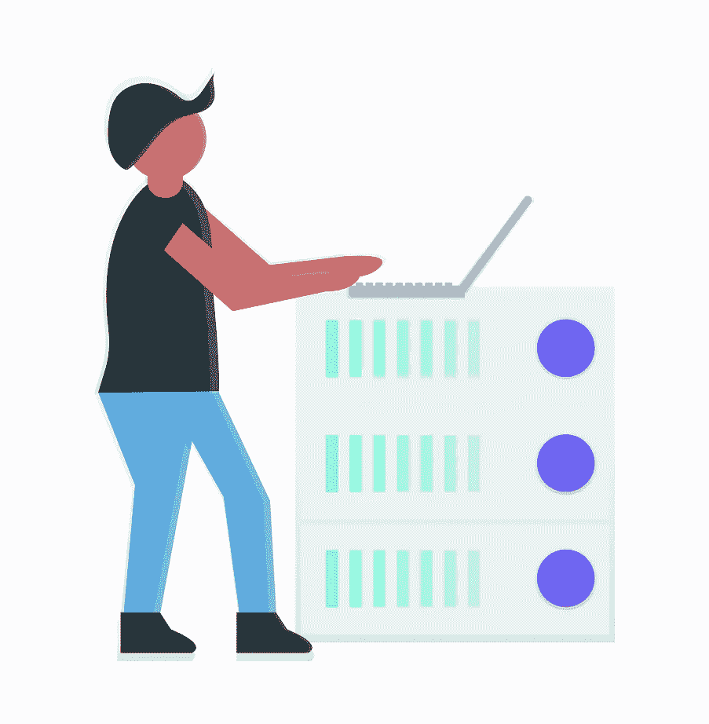

# 使用 Docker 编写创建多容器 Docker 应用程序

> 原文：<https://betterprogramming.pub/dockerizing-multiple-services-inside-a-single-container-96cdff286cef>

## 关于定义和创建多个 Docker 容器的教程，包括数据库设置



最近，我有机会为一个项目做码头集装箱。这是一次很好的学习经历，因为我之前对 Docker 的用法一无所知。

这个博客的目标是使用 Docker Compose 创建多容器 Docker 应用程序(应用服务器、客户机-服务器和 PostgreSQL 数据库)。

# **什么是 Docker？**(基本定义)

> Docker 是一个工具，旨在通过使用容器来简化应用程序的创建、部署和运行。容器允许开发人员将应用程序与它需要的所有部分打包在一起，比如库和其他依赖项，然后作为一个包发送出去。
> 
> 通过这样做，由于有了容器，开发人员可以放心，应用程序将在任何其他 Linux 机器上运行，而不管该机器的任何定制设置可能与用于编写和测试代码的机器不同。”—来源[https://opensource.com/resources/what-docker](https://opensource.com/resources/what-docker)

我喜欢把 Docker 看作是开发工具的乐高积木，它们可以组合在一起简化开发过程，并消除设置开销。

# **当前项目结构及其解决方案**

这个项目的代码可以在 [GitHub](https://github.com/mukul13/docker-example) 上找到。对于这个项目，我们将为两个 Node.js 服务器和一个 [Postgres](https://www.postgresql.org/) 数据库设置容器。

我们可以用不同的语言或框架编写两个服务器，只要我们为它正确初始化 Docker 文件。

为了简单起见，我们将托管两个 Node.js 服务器和两个基本端点来测试这个项目。

```
### Sample requests
curl [http://localhost:4000/](http://localhost:4000/)# Expected response
#
#  {"message":"Hello from Server 1"}
#curl [http://localhost:3001/](http://localhost:4000/)# Expected response
#
#  {"message":"Hello from Server 2"}
#
```

目前的项目结构如下:

```
docker-example
- server1 (will run on port 4000)
- server2 (will run on port 3001)
- docker-compose.yml (will initialize all Docker containers: postgres, server1, and server2)
```

首先，我们必须将`Dockerfile`添加到每个 Node.js 服务器项目中。

根据我们使用的语言和框架，这些 docker 文件可能会有所不同。`Dockerfile`是一个文本文档，包含用户可以在命令行上调用的所有命令，以组合一个图像。

对于`server1`，我们的`Dockerfile`看起来是这样的:

```
FROM node:12.4.0
EXPOSE 4000WORKDIR /home/server1COPY package.json /home/server1/
COPY package-lock.json /home/server1/RUN npm ciCOPY . /home/server1RUN npm installADD [https://github.com/ufoscout/docker-compose-wait/releases/download/2.2.1/wait](https://github.com/ufoscout/docker-compose-wait/releases/download/2.2.1/wait) /wait
RUN chmod +x /wait## Launch the wait tool and then your application
CMD /wait && PORT=4000 yarn start
```

基本上，我们要做的是:

*   暴露端口 4000，下载节点版本 12.4.0 Docker 镜像来构建这个项目。
*   创建一个工作目录，并在其中复制所需的文件夹。
*   当我们开始项目的构建过程时，`docker-compose.yml`中提到的所有 Docker 服务都被初始化并同时运行。`/wait`命令是在运行下一个命令之前等待图像加载。例如，我们希望首先初始化 PostgreSQL 数据库，然后初始化所有服务器，以便在服务器启动时数据库连接不会出现问题。另一种方法是在 Node.js 服务器代码中添加重试，以等待数据库连接，但我发现这种方法很容易解决上述问题。
*   最后，我们创建了一个 Docker 容器，可以通过`docker-compose.yml`初始化。基本上，我们已经以某种方式将多个乐高块连接起来，使事情能够工作(Node 是一个乐高块，Node.js 代码库是另一个乐高块)。

现在，`server2`也将有一个类似的`Dockerfile`。`docker-compose.yml`如下:

```
# docker-compose.yml
version: "3.3"
services:
  postgres:
    image: postgres
    hostname: postgres
    environment:
      POSTGRES_DB: postgres
      POSTGRES_USER: postgres
      POSTGRES_PASSWORD: postgres
    ports:
      - 5432:5432app:
    build: ./server1
    hostname: app
    env_file: ./server1/.env
    depends_on:
      - postgres
    links:
      - postgres
    ports:
      - 4000:4000
    environment:
      WAIT_HOSTS: postgres:5432client:
    build: ./server2
    hostname: client
    env_file: ./server2/.env
    ports:
      - 3001:3001
    depends_on:
      - postgres
    links:
      - postgres
    environment:
      WAIT_HOSTS: postgres:5432
```

`docker-compose.yml`是我们应用程序的起点。

它用于初始化所有 Docker 容器(`server1`、`server2`和 Postgres)，暴露端口并映射各自的环境变量。

我们正在努力做的是:

*   为我们拥有的不同服务创建单独的配置。
*   `WAIT_HOSTS`用于等待`postgres`服务完成执行。
*   暴露所需的`ports`并添加`build`路径。

要运行当前项目:

```
cd to-the-parent-directory
docker-compose up
```

要停止和移除当前项目的容器，请执行以下操作:

```
cd to-the-parent-directory
docker-compose down
```

要获得有关运行容器的更多信息:

```
docker ps
```

我们可以尝试`curl`请求来验证服务器是否正常运行。

如果你试图从`server2`点击`server1`，你将不得不在`server2`的`.env`文件中设置主机 URL 为`app`(而不是`localhost`)，因为那是`server1`的`hostname`。

类似地，当连接到数据库时，您必须使用`postgres`(这是我们的`docker-compose.yml`中的服务名)而不是`localhost`。

感谢阅读。我希望这有所帮助。不要犹豫，纠正评论中的任何错误或为未来的帖子提供建议！