# 使用 Ballerina 将您的 GitHub 回购变更记录到 Google Sheets

> 原文：<https://betterprogramming.pub/document-your-github-repo-changes-to-google-sheets-using-ballerina-e1446dabf5ae>

## 将 GitHub Repo 与 Google Sheets 集成

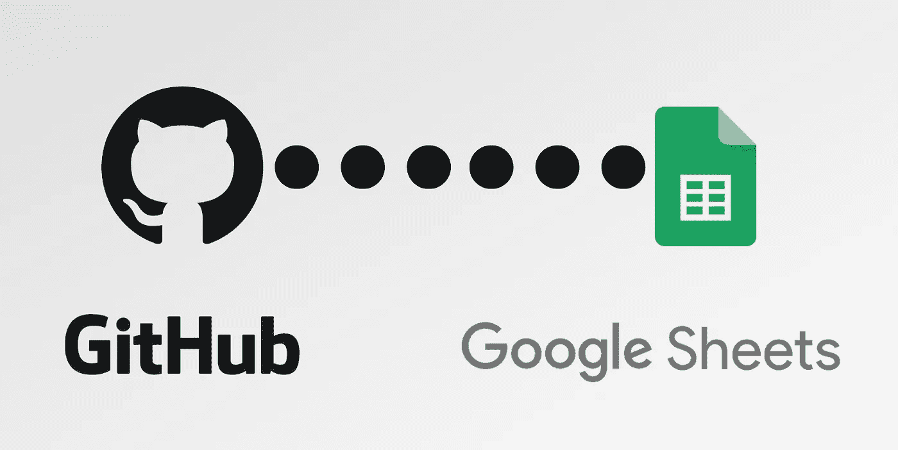

作者图片

本文着眼于如何在 Ballerina 中将 GitHub repo 与 Google Sheets 集成，以便每次 GitHub repo 中发生特定事件时，您都可以将其记录在自己的 Google Sheets 中。多酷啊！无论是在标签下创建的问题，还是打开的 PR，甚至是提交到存储库，您都可以通过几个简单的步骤在 Google Sheet 中记录所有内容。

# 最终目标

最终目标是在 Github 事件被触发时动态填充一个 Google 表单！看起来是这样的:

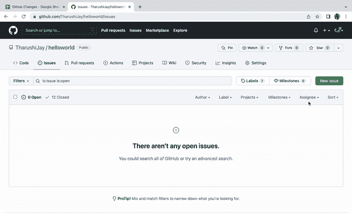

这个项目的源代码可以在 GitHub 上通过[这个链接](https://github.com/TharushiJay/github-gsheet-integration)访问！

# 芭蕾舞演员是什么？

Ballerina 是一种面向云的开源编程语言，它使使用、组合和创建网络服务变得更加容易。对于芭蕾舞新手，请参考 [ballerina.io](https://ballerina.io/) 了解入门步骤。为了继续，您需要安装芭蕾舞演员。按照这些[步骤](https://ballerina.io/downloads/)进行安装。

以下实现使用芭蕾舞演员的天鹅湖版本。

# 第 1 部分:配置 GitHub Webhook 来监听事件

最初，您需要在本地机器中公开订阅者服务，以便服务器能够访问 URL。因此，我们将使用 [ngrok](https://ngrok.com/) ，它允许您将运行在本地机器上的 web 服务器暴露给互联网。

步骤 1:一旦你安装了[ngrok，你所要做的就是运行下面的命令来告诉 ngrok 你的 web 服务器正在监听哪个端口。在我们这里是`port 9090`。](https://ngrok.com/download)

```
ngrok http -bind-tls=true 9090
```

一旦您启动并运行了 ngrok，它将如下所示:

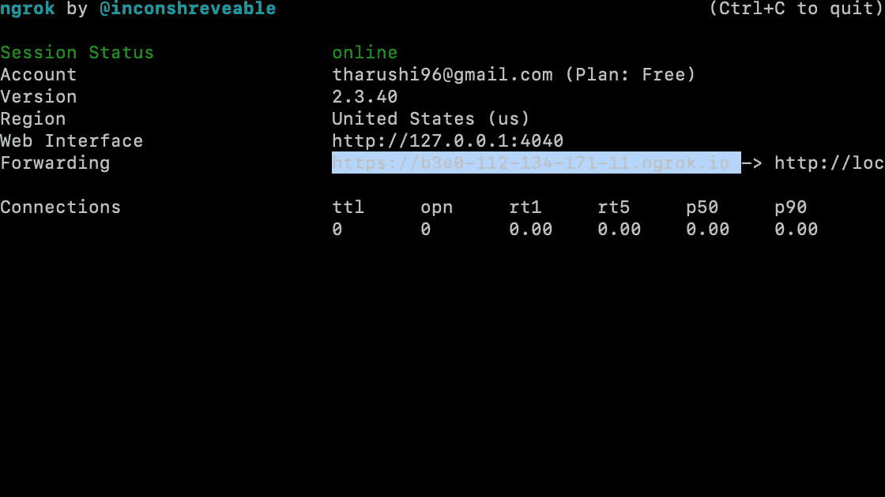

突出显示的 URL 将被用作回调 URL

我们将使用上面突出显示的 ngrok URL 作为订户服务的回调 URL。

在我们这里是`https://b3e0–112–134–171–11.ngrok.io`。

步骤 2:为我们想要接收通知的存储库注册一个 GitHub webhook。

在存储库主页中，导航到设置-> Webhooks ->添加 webhook。

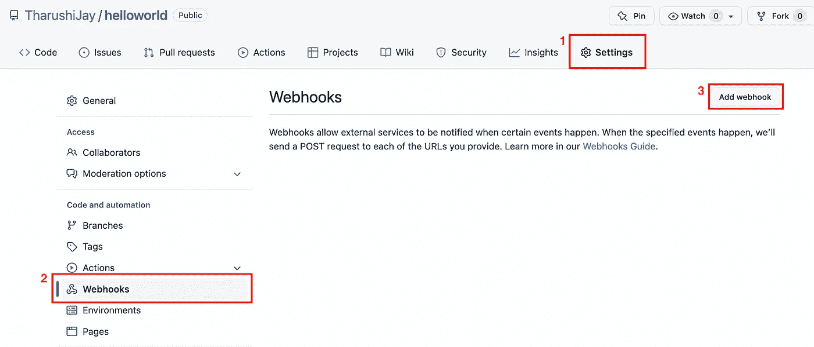

进入设置->网页挂钩->添加网页挂钩

*   将有效负载 URL 设置为 ngrok 回调 URL，后跟 ballerina 服务的服务路径名。在我们这里，它是`https://b3e0–112–134–171–11.ngrok.io/events`。
*   将内容类型设置为 application/JSON，然后单击 Add webhook。

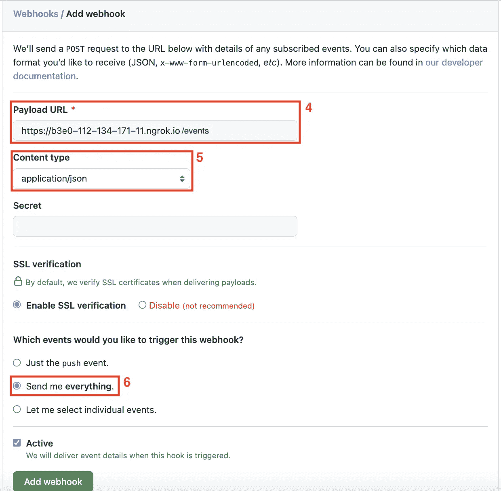

*   接下来，您应该创建一个[个人访问令牌](https://docs.github.com/en/enterprise-server@3.4/authentication/keeping-your-account-and-data-secure/creating-a-personal-access-token)，在使用 GitHub API 时，它将作为使用密码对 GitHub 进行身份验证的替代方法。
*   登录你的 GitHub 账户，进入[https://github.com/settings/tokens](https://github.com/settings/tokens)。
*   在“个人访问令牌”下，单击“生成新令牌”，这将带您进入如下所示的界面:

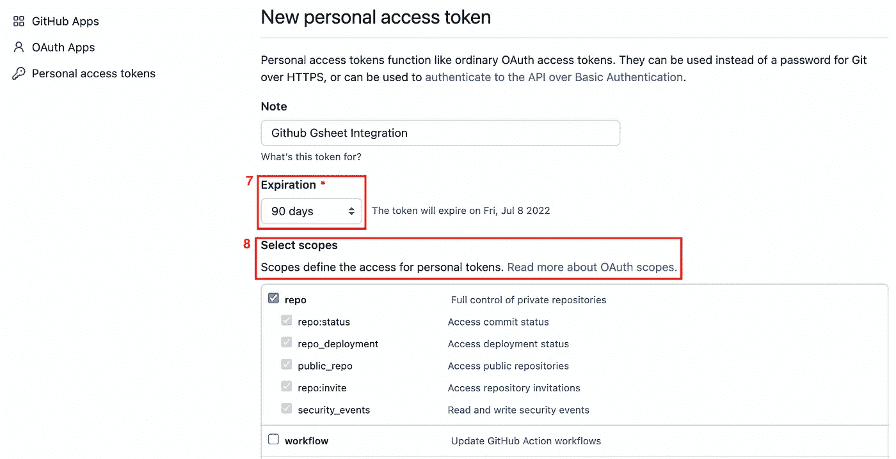

对于您的新 PAT，根据您的意愿设置到期日期，然后选择范围以准确指定您需要的访问类型。

对于这个应用程序，我们将选择`repo`、`write:packages`、`admin:repo_hook`、`notifications`的范围，并生成令牌。创建后，请务必复制您的 PAT，因为您将无法再次看到它。

现在，我们用芭蕾舞者来写我们的代码！

首先，通过在终端中运行以下代码来创建一个芭蕾舞项目。我们将称我们的项目为`gsheet_github_integration`。

```
tharushijayasekara@Tharushi/Test % bal new gsheet_github_integration
Created new package 'gsheet_github_integration' at gsheet_webhook_integration.
```

这创建了一个带有`main.bal`和`Ballerina.toml`的项目，前者包含我们的主方法，后者包含我们项目的配置。将以下代码添加到`main.bal`中:

如果我们仔细查看代码，我们所做的是通过设置 repo、ngrok 回调 URL 以及我们刚刚为身份验证创建的 GitHub PAT 的路径来创建一个订阅者服务来侦听 GitHub 事件。

订户服务是使用 WebSub 订户服务创建的。WebSub 是一种基于 HTTP webhooks 的通用机制，用于在 Web 内容的发布者和他们的订阅者之间进行通信。确认和验证订阅请求以及发布可用的新内容都是通过 hub 完成的。

关于如何充分利用 websub 模块的更多详细信息，请参见 https://lib.ballerina.io/ballerina/websub/latest[的芭蕾舞演员 API 文档。](https://lib.ballerina.io/ballerina/websub/latest)

然后，每次发送事件通知时，我们将所需的数据填充到一个 Details 类型的记录中。在将事件类型设置为 Issue 或 PR 之后，我们将记录传递到`insertDetails()`中，根据事件类型在 Google sheet 上记录事件细节。

# 第 2 部分:集成 Google Sheets API

对于实现的下一部分，我们将创建一个名为 GitHub Changes 的 Google 表单，用两个表单来记录 PR 细节和问题细节。让我们记下工作表 ID，它是 URL 下面突出显示的部分:


工作表 ID

```
[https://docs.google.com/spreadsheets/d/1l4KUKQ0e5HKB35doSRcaF3QgNYvBAp99q_l5GS3J1B8/edit#gid=0](https://docs.google.com/spreadsheets/d/1l4KUKQ0e5HKB35doSRcaF3QgNYvBAp99q_l5GS3J1B8/edit#gid=0)
```

接下来，在同一个项目中创建另一个名为`gsheet.bal`的文件来访问 Google Sheets API，并插入以下代码。

我们在这里所做的就像它看起来那样简单。只需调用 Google Sheets API 将新的数据行追加到我们的 Google Sheets 中。

下一个任务是找出上面代码中使用的`refreshToken`、`clientId`和`clientSecret`。

1.  打开 [Google API 控制台凭证](https://console.developers.google.com/apis/credentials)页面，登录您的相关 Google 帐户并创建一个新项目。


2.为项目命名，然后点按“创建”。

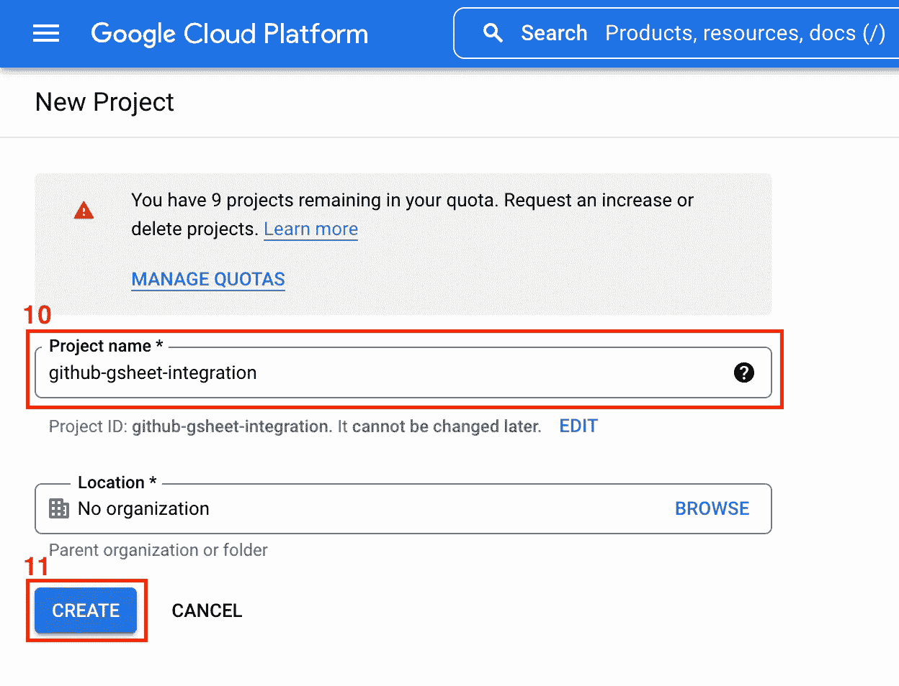

3.单击“配置同意屏幕”选择您希望如何配置和注册您的应用程序。


4.将用户类型设置为外部，然后单击创建。

5.在 OAuth 同意屏幕中，输入应用程序名称、用户支持电子邮件、开发人员联系信息，然后单击保存并继续。

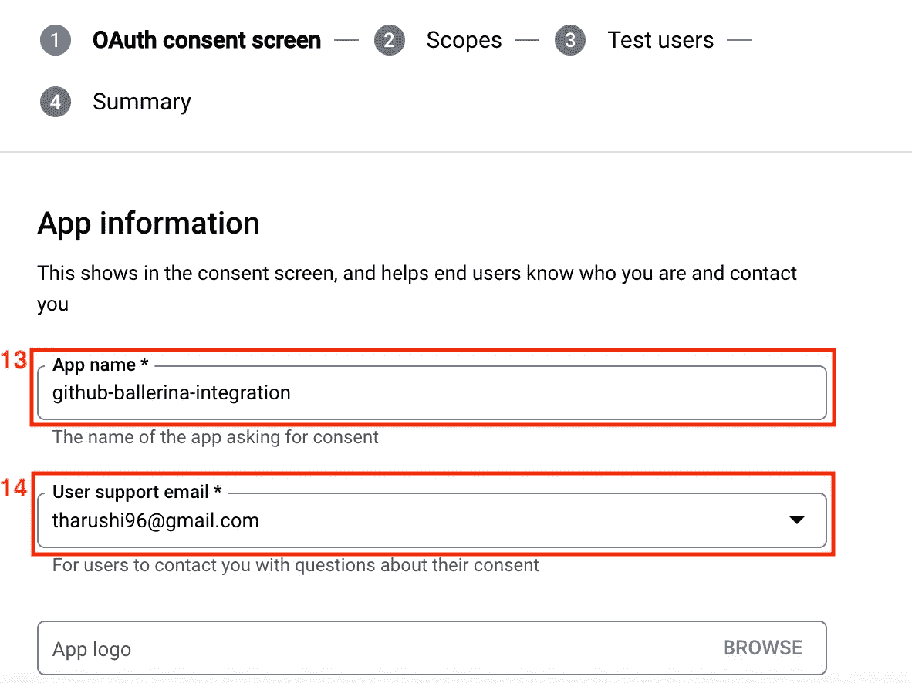

6.在“范围”屏幕中，单击“保存并继续”,然后进入下一个屏幕“测试用户”。

7.在测试用户下，添加您的电子邮件地址，然后单击保存并继续。


8.最后，您将看到一个摘要，以验证您输入的详细信息。


9.下一步，在凭据下单击创建凭据，然后单击 OAuth 客户端 ID。


10.在创建 OAuth 客户端 ID 屏幕中输入以下详细信息，然后单击创建。

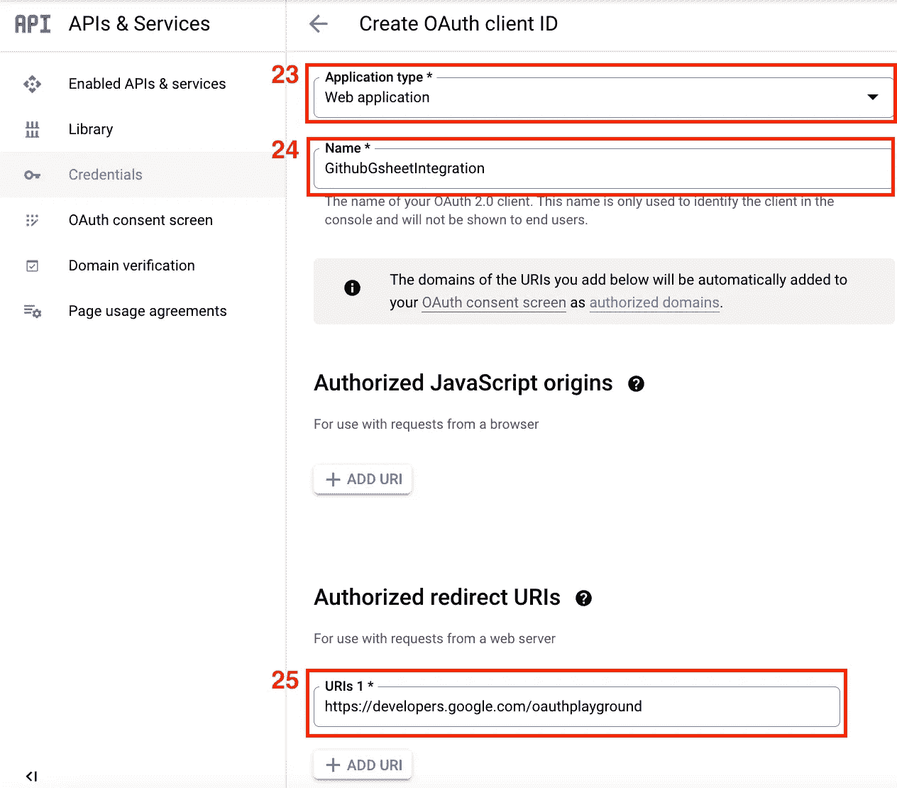

11.这将生成一个客户端 ID 和客户端密码，您应该保存以供将来使用！

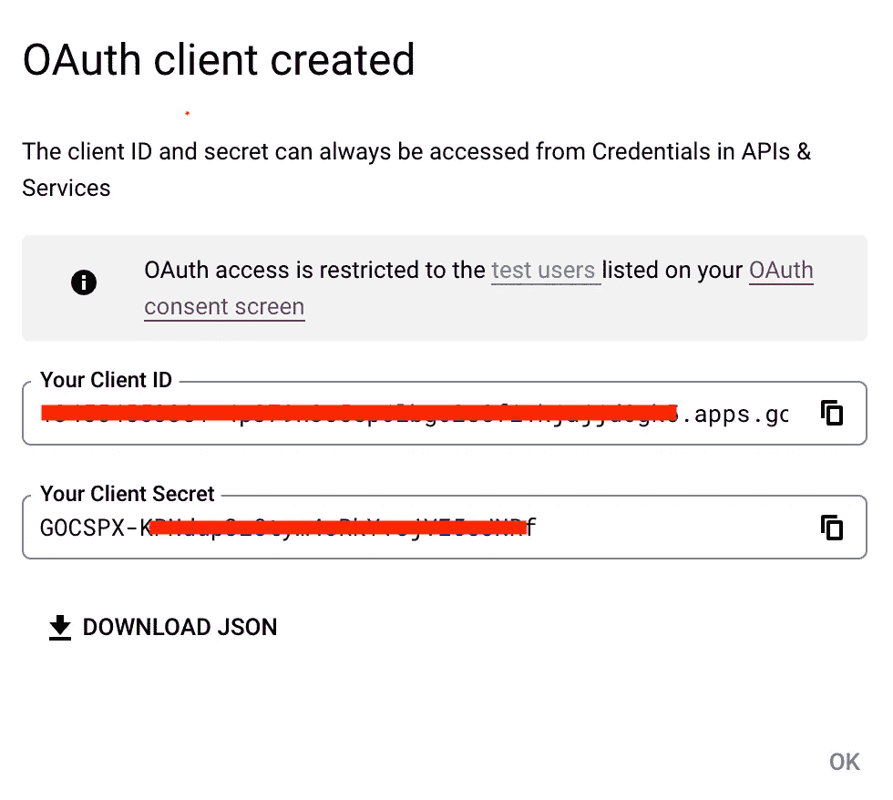

12.从左侧菜单中，选择 Library，搜索 Google Sheets API，并单击它以启用它。


13.为了获得刷新令牌，导航到 [OAuth 2.0 Playground](https://developers.google.com/oauthplayground/) 并点击屏幕右上角的 OAuth 2.0 配置按钮。


14.选择使用您自己的 OAuth 凭据，提供获得的客户端 ID 和客户端密码值，然后关闭窗口。

15.在步骤 1 中，从 API 列表中选择`Google Sheets API v4`,并选择所有的作用域。

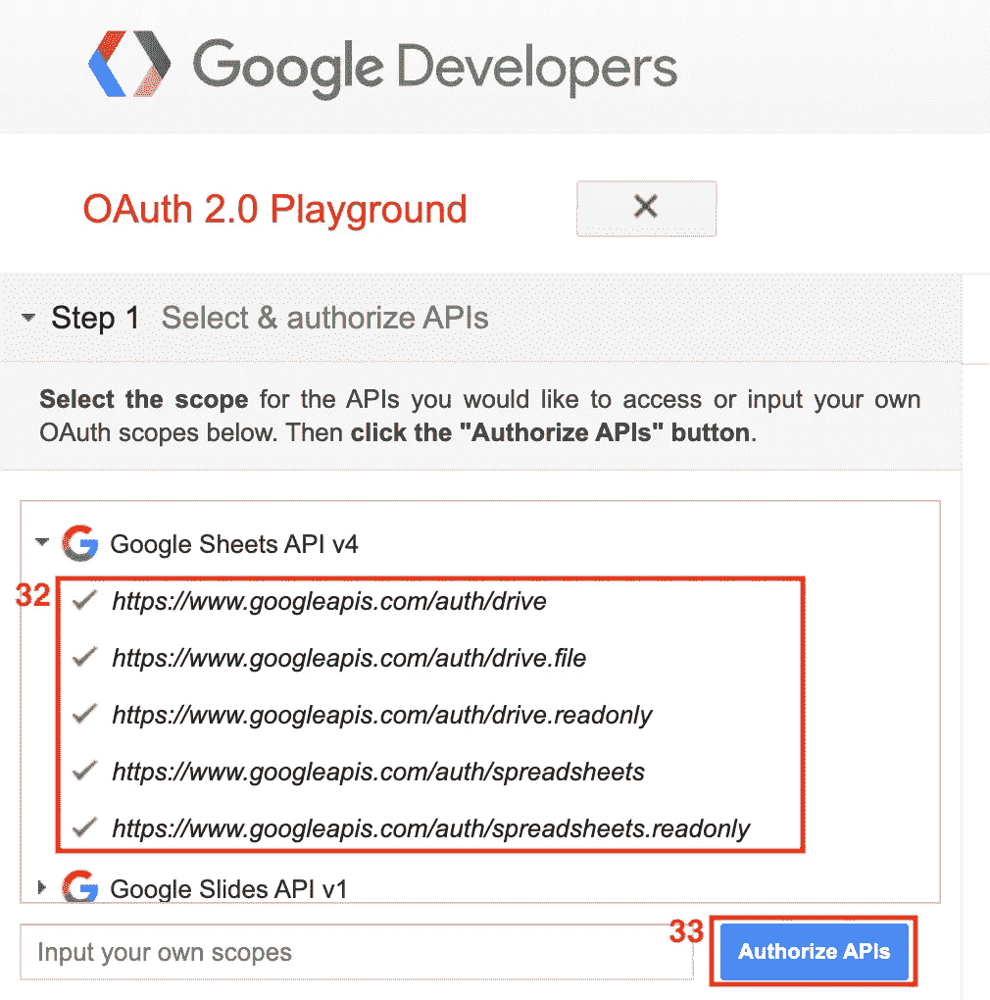

16.点击授权 API 按钮，当系统询问您是否允许时，选择您的 Gmail 帐户。

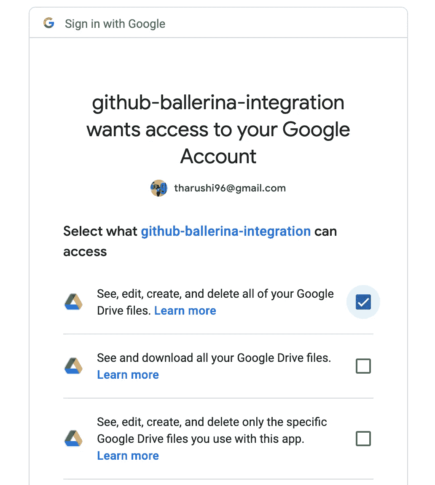

17.在步骤 2 下，单击“交换令牌的授权码”以生成和显示访问令牌和刷新令牌。

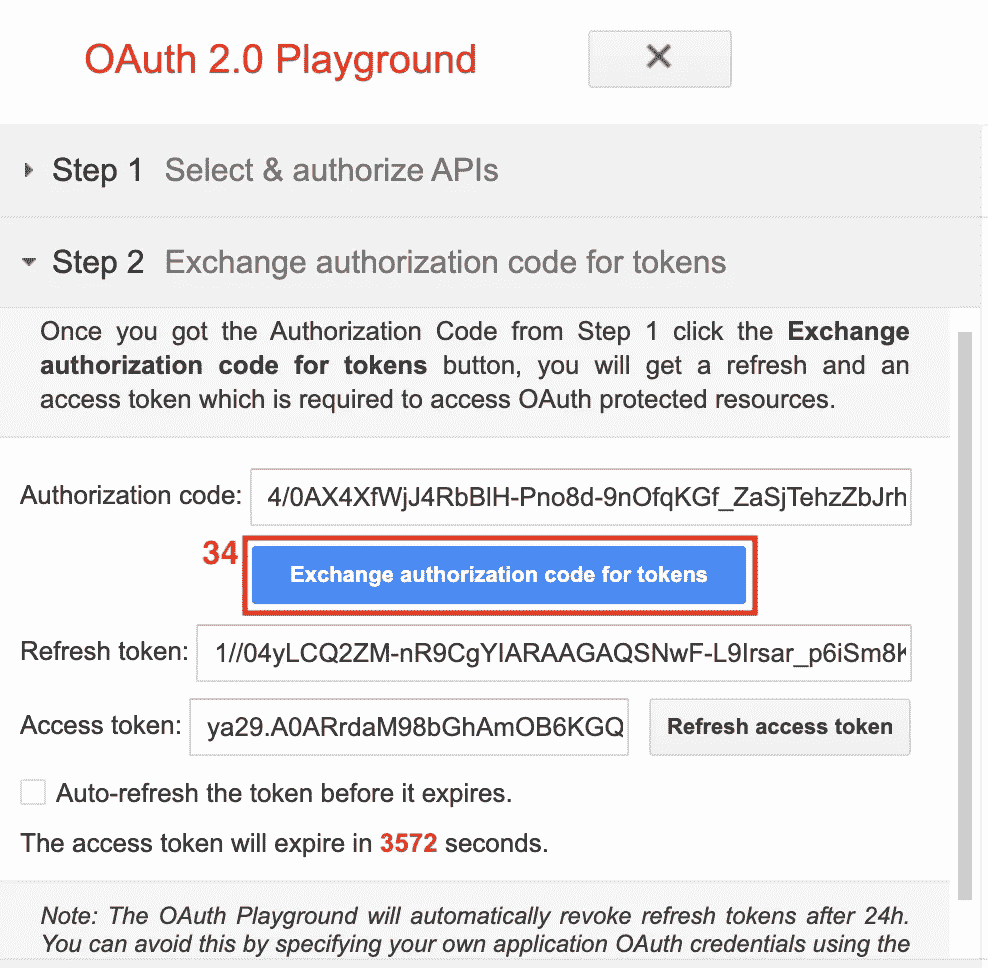

这让我们结束了对 Google Sheets API 的配置！使用我们的`gsheet.bal`文件中的刷新令牌、客户机 ID 和客户机秘密，并使用`bal run`运行项目。

输出如下，这意味着服务在`port 9090`成功启动。

```
tharushijayasekara@Tharushi github-gsheet-integration % bal run
Compiling source
        tharushijayasekara/github_gsheet_integration:0.1.0
WARNING [gsheet.bal:(31:5,32:95)] unused variable 'append'
WARNING [gsheet.bal:(47:5,48:95)] unused variable 'append'
WARNING [main.bal:(17:5,17:5)] concurrent calls will not be made to this method since the method is not an 'isolated' method
WARNING [main.bal:(24:21,29:84)] unused variable 'issueResponse'
WARNING [main.bal:(33:21,38:95)] unused variable 'pullRequestResponse'Running executabletime = 2022-04-10T22:18:14.755+05:30 level = WARN module = ballerina/websub message = "HTTPS is recommended but using HTTP"
```

你会在我们的谷歌表单上看到这些变化！

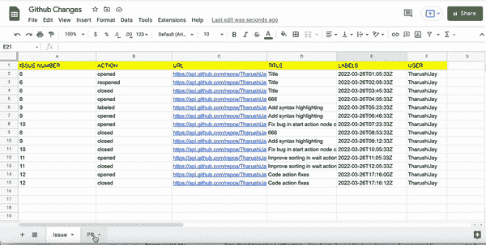

现在，您已经成功地为 GitHub 配置了一个 webhook，并使用一个用 Ballerina 编程语言编写的订阅者接收了事件！

谢谢你坚持到底。要了解芭蕾舞演员的最新动态，请访问[https://ballerina.io/](https://ballerina.io/)。