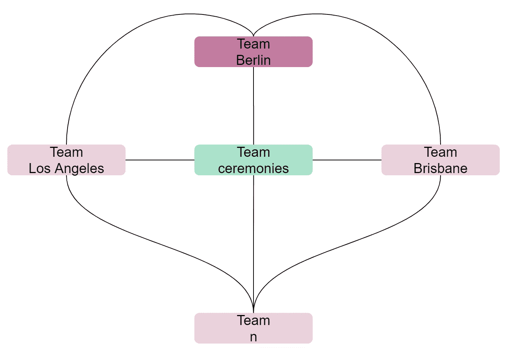

# DevOps 有规模吗？

> 原文：<https://betterprogramming.pub/does-devops-scale-d09393c6441a>

## 技术上是的，但从组织的角度来看呢？让我们看看。

布鲁斯·迪克森在 [Unsplash](https://unsplash.com?utm_source=medium&utm_medium=referral) 上的照片

DevOps 方法是应用程序开发中的一个重要转变，它带来了更成功的软件项目、更高的质量和更短的发布周期。因此，理论上，它应该是可扩展的。

至少从技术角度来看，我们知道确实如此。例如，今天的主要云服务提供商提供了从虚拟机到无服务器功能的产品，可以根据需求进行扩展和缩减。如果一个团队坚持今天的最佳实践，例如，具有受限上下文的无状态应用程序，他们通常有一个坚实的基础来在高峰时间扩展他们的应用程序，并在不太活跃的时间减少应用程序。

从组织的角度来看，DevOps 理论和最佳实践较少关注伸缩性，因为 DevOps 的核心是负责整个应用程序生命周期的小型跨职能团队。这个生命周期包括应用程序的软件开发、维护、关闭和退役。

然而，当优先考虑在专用业务领域工作的较小团队和团队在其领域内做出决策的能力时，DevOps 团队似乎受限于一点:全球范围。

这是因为随着全球化的发展，覆盖多个时区的必要性也随之而来。随着时区的增加，新的挑战也随之而来。例如:

*   澳大利亚布里斯班比德国柏林早 9 个小时
*   柏林比美国洛杉矶早 9 个小时

洛杉矶、柏林和布里斯班的时差

我们可以看到，在德国营业时间，澳大利亚已经结束了一天的工作，而洛杉矶还在沉睡。美国的营业时间，布里斯班很可能会在睡觉，而德国刚刚结束工作时间。

这意味着，在这种情况下，对于一个负责企业对企业(b2b)应用程序的小型 DevOps 团队来说，很难从一些用户(朝九晚五地工作)那里获得实时反馈，因为他们要么刚刚结束一天的工作，要么甚至还没有开始工作。当然，这是在用户或 DevOps 团队决定单向延长工作时间以克服时区困境之前。

显然，在这一点上，延长工作时间只能是一个临时的解决办法。我们希望家人、朋友和同事有足够的时间从工作中恢复过来，花时间和他们重要的人在一起。

当然，工作时间可以移动，以陪伴不同时区的用户。尽管如此——如下图所示——我们越是将工作时间转移到布里斯班，洛杉矶和 DevOps 团队之间的时间距离就越大。此外，德国用户在工作时间内获得的支持较少。

让 DevOps 的工作时间适应不同时区的用户

# 为什么 DevOps 团队必须和他们的用户处于相同的时区？

DevOps 的主要支柱之一一直是这样一个事实，或者更准确地说，是要求开发人员对他们的应用程序及其应用程序的生命周期承担全部责任。

虽然这在今天听起来并不令人惊讶，但就在几年前，将应用程序移交给纯粹的运营团队是一种很好的做法。虽然这种移交释放了开发团队的能力，但也消除了他们的操作负担，允许他们在开发期间走捷径以尽快完成开发。

开发人员尽快完成应用程序开发是有益的，因为他们还可以从事其他项目。然而，从长远来看，开发过程中走捷径会严重影响用户体验。

相比之下，通过要求开发团队独立操作他们的应用程序，我们试图阻止他们走捷径，并使他们能够构建可操作的持久应用程序。

运营责任通常要求履行合同义务和服务水平协议(SLA)。例如，SLA 通常涵盖应用程序全年的可用性。

> 大多数[可用性](https://www.stratus.com/availability/)解决方案提供 99%的可用性，这对于大多数组织来说可能听起来很不错，直到您意识到 99%意味着每年 87.6 小时的计划外停机时间。
> 
> [9s 法则——如何实现 99.999%的可用性| Stratus 博客](https://blog.stratus.com/rule-nines-availability-always-on-world/)

不履行这些协议会导致用户不满和法律诉讼，因此公司必须对失败做出快速反应。这就是 DevOps 团队再次出现的原因，因为我们希望他们有足够深入的知识来迅速修复应用程序中的错误。

# 回到比例和时区主题

我们怎么能期望一个大约 6 到 12 人的 DevOps 团队为他们在美国、德国和布里斯班运行的应用程序履行服务级别协议呢？

令人不快的答案是:在不牺牲其他敏捷价值观的情况下，我们无法将我们的单一 DevOps 团队扩展到多个时区。

是的，尽管开发运维与敏捷方法不经常一起被提及，但它们是相互依赖的。DevOps 团队需要一个组织框架，允许他们计划任务和跟踪进度，稳定地接收来自客户的反馈，并将这些反馈纳入开发周期。另一方面，敏捷方法需要一个将计划任务转化为 IT 系统的框架。

为了找到时区问题的解决方案，我们可以要求我们的 DevOps 团队轮班工作，以适应不同国家的用户。但是，有争议的是，这只有在被支持的国家数量足够少或者团队成员数量足够多以平均分配团队的情况下才行得通。

DevOps 团队轮班工作作者 Stefan Pfaffel

这将允许我们对故障做出快速反应，并确保积极的用户体验。缺点是，我们已经有效地将我们的单个团队分成了三个不能协作的子团队，因为他们都在一天中的不同时间工作。此外，通过取消与他们的领导的直接沟通，我们取消了任何获得反馈或认可的机会。

最终，轮班工作对 DevOps 团队的影响就像澳大利亚用户只能在德国工作时间获得支持一样糟糕。因此，听起来我们有一个典型的目标冲突:我们要么让我们的用户满意，要么让我们的开发者满意。

# DevOps 有规模吗？

> 敏捷宣言由四个关键价值观组成:
> -个人和交互优于过程和工具。
> -综合文档的工作软件。
> -客户协作超过合同谈判。
> -按照计划应对变化。【https://www.productboard.com/glossary/agile-values/】T5
> 

一个重视敏捷宣言的 DevOps 团队，如果他们能够密切沟通和合作，效果会最好。如上所述，前 DevOps 时代的一个重要问题是缺少为长寿构建应用程序的动力。相反，开发人员被激励尽快完成他们的职责——开发周期。

我们将不得不在这两个极端之间找到一个折衷点，以允许小型 DevOps 团队开发具有全球影响力的软件。最终，我们将不得不重新引入中央开发人员和特定国家运营团队之间的交接。

根据我们从过去学到的经验，这种移交不应受到激励。相反，我们需要所有参与者都有一种“共赢共输”的心态。

DevOps 心态和最佳实践无法解决这个挑战，因为它的关注点太窄。在这里，来自组织的支持是必要的，以使不同的 DevOps 团队能够在单个产品上有效地合作。

这种方法的关键是确保所有相关团队都在视线范围内工作。例如，中央开发团队总是比运营团队具有更大的影响力，因为运营团队总是必须对所提供的内容做出反应。因此，运营团队也需要参与早期规划；必须鼓励他们提出问题并展示改进的空间。

最后，所有参与的团队必须定义支持他们工作所需的工件。例如，开发团队需要提供一个 changelog、值得注意的特性和突破性变化，以及详尽的文档，以允许特定国家的团队成功地设置和操作应用程序。

只有这样，我们才能成功地构建和运行一个真正的全球产品。

感谢阅读。如果您有任何反馈或进一步的想法，可以通过 Twitter [@stfsy](https://twitter.com/stfsy) 联系我。