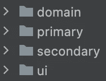

# 前端领域驱动架构，第 1 部分

> 原文：<https://betterprogramming.pub/domain-driven-architecture-in-the-frontend-i-d27fb71b5cb0>

## 什么是域驱动架构，它如何帮助你管理前端代码库的复杂性？


照片由 [Kimon Maritz](https://unsplash.com/@kimonmaritz?utm_source=medium&utm_medium=referral) 在 [Unsplash](https://unsplash.com?utm_source=medium&utm_medium=referral) 上拍摄

这篇文章是关于什么是领域驱动架构，为什么它可以帮助你，以及我如何在前面学习实现它。

# 什么

这是写给任何发现自己害怕在代码库上工作的前端开发人员的，因为太难跟上任何事情的发展了。

我写这些是因为我自己也经历过:你开始做一个项目，开始时，一切都很容易。但是随着它的成长，在它上面做任何事情都变得越来越难。随着时间的推移，一些令人兴奋的事情变成了麻烦，工作的动力也因此受到影响。即使你[不折不扣地遵循最佳实践](https://vueschool.io/articles/vuejs-tutorials/how-to-structure-a-large-scale-vue-js-application/)和[推荐风格指南](https://v2.vuejs.org/v2/style-guide)，这种情况也会发生。如果你能理解，那么领域驱动架构可以帮助你。

我在这里提出的领域驱动架构是领域驱动设计(DDD)的一些原则的一个实现，领域驱动设计是由 Eric Evans 在“领域驱动设计:解决软件核心的复杂性”(2003)中定义的开发哲学。

# 为什么

这种架构存在的主要原因之一是帮助开发人员管理代码库中随时间增加的复杂性。

另一个原因是使开发人员能够将他们的大部分注意力和智慧集中在考虑业务正在解决的问题(它的领域)上。

换句话说，我们告诉开发者:

> *“专注于找出可能的最佳解决方案。当您需要实现它时，只需遵循架构即可”。*

架构决策通常是我们作为开发人员强加给自己的自由的限制，但是这反过来增加了项目的组织性、可预测性、可读性和可测试性。领域驱动架构增加了构建项目的初始成本，但是极大地降低了维护项目的成本。因此，领域驱动架构对于任何长期存在(和发展)的解决方案都是合理的。

> 软件变得复杂和难以管理的一个主要原因是领域复杂性和技术复杂性的混合。Evans 将这个问题描述为“代码做了一些有用的事情，但没有解释如何做”。
> (领域驱动设计的模式、原则和实践。斯科特·米利特，尼克·图恩，2015 年)

# 怎么

在回顾我已经学会遵循的特定架构决策以及它们如何帮助我和我的团队之前，让我们回顾一下典型的前端应用程序是什么样子的。

# “问题”

查看直接取自 [Huy Ta Quoc](https://dev.to/huytaquoc) 的典型前端架构设计(链接到下面的资源)。看起来眼熟吗？


(查看 Huy Ta Quoc 关于这个主题写得非常好的文章:[https://dev . to/huyta Quoc/a-different-approach-to-frontend-architecture-38d 4](https://dev.to/huytaquoc/a-different-approach-to-frontend-architecture-38d4))

假设我们正在构建一个应用程序来存储和共享烹饪食谱。在上述设计下，代码可能类似于以下内容:

```
<template>
  <h1>Add Recipe</h1>
  <form>
    <div class="form-group">
      <label for="name">Name</label>
      <input type="text" v-model="name" />
    </div>
    <div class="form-group">
      <label for="ingredients">Ingredients</label>
      <textarea v-model="ingredients"></textarea>
    </div>
    <div class="form-group">
      <label for="instructions">Instructions</label>
      <textarea v-model="instructions"></textarea>
    </div>
    <button @click="save">Save</button>
  </form>
</template><script lang="ts">
import { mapActions } from 'vuex'export default {
  name: 'AddRecipe',
  data: () => ({
    name: '',
    ingredients: '',
    instructions: '',
  }),
  methods: {
    ...mapActions(['saveRecipe']),
    save() {
      const { name, ingredients, instructions } = this;
      this.saveRecipe(name, ingredients, instructions);
    },
  },
}
</script>
```

(尽管我展示的是一个 Vue 应用，但其教导适用于任何现代前端框架。)

我相信你已经见过了:`saveRecipe`动作将使用这些参数进行 API 调用，将其保存在后端，并且可能还会将新的食谱保存在 Vuex 存储中。

显示所有食谱的代码可能是这样的:

```
<template>
  <h1>Recipes</h1>
  <RecipeCard v-for="recipe in recipes" :key="recipe.id" />
</template><script lang="ts">
import { mapActions, mapGetters } from 'vuex'
import RecipeCard from '@/components'export default {
  name: 'Recipes',
  components: [RecipeCard],
  created() {
    // If we have the recipes in store, don't refetch
    if (this.recipes.length) return
    this.fetchRecipes()
  },
  computed: {
    ...mapGetters(['recipes']),
  },
  methods: {
    ...mapActions(['fetchRecipes']),
  },
}
</script>
```

有一段时间，这对许多项目来说可能是好的。但是过一段时间，随着复杂性的增长，这种设计的缺陷就会开始浮出水面。

状态管理与组件紧密耦合。

我花了一段时间才明白为什么这是个问题。毕竟，这正是官方文档展示该库用途的方式。如果写库的人那样显示，这种设计模式怎么会错呢？对你来说可能是也可能不是。

如开头所说，这完全取决于项目。重要的是对开发人员为项目选择的架构做出有意识的决定，而不是盲目地遵循文档中显示的内容。

无论出于什么原因，如果团队决定更改状态管理库，这种紧密耦合将使这样的任务变得非常困难。“*但我们绝不会这么做！*“你可能在想。你可能是对的…但是你确实想更新到同一个库的新版本，不是吗？嗯，[起亚大王自己说的](https://github.com/vuejs/rfcs/discussions/270)，“…就当皮尼亚是 Vuex 5 换个名字吧”。无论何时进行升级，您都会希望您的状态管理是松散耦合的。

与状态管理的松散耦合可以极大地简化组件。作为前端，如果有什么是我们都同意的，那就是组件越笨越好。所谓哑组件，我们指的是简单组件。那些不需要做很多事情的人。理想情况下，一个组件应该只是接收一些数据并显示出来，就这样，对吗？

我完全同意！然而，看看我们的代码，在“Recipes”组件的 created 钩子中发生了什么？在这段代码中，组件基本上决定了它的缓存策略…那不应该在那里。我们希望我们的组件调用它需要的数据，它根本不应该关心数据是来自缓存、来自 API、来自`LocalStorage`还是其他什么。

事实上，要解决这个问题，您可以在动作本身中进行检查，并将其从组件中移除……但是可能有一个更好、更全面的解决方案。

我个人现在发现这种方法的另一个问题(实际上是我过去喜欢的)是，它允许您调用一个动作来获取组件中的数据，然后通过 getter“神奇地”获得这些数据。

我更希望有一种更具声明性的编码方式，例如，调用 fetch 并将其结果直接赋给组件的数据属性。

让我们看看另一个您可能以前见过的代码示例:

```
<template>
  <div class="recipeCard">
    <div class="h2">{{ name }}</div>
    <div
      :class="{
        danger: difficulty === 'hard',
        warn: difficulty === 'intermediate',
        success: difficulty === 'easy',
      }"
    >
      <span>{{ difficulty }}</span>
      <RecipeTutorial
        v-if="difficulty === 'hard'"
        class="recipeTutorial"
        :steps="steps"
      >
        {{ tutorial }}
      </RecipeTutorial>
    </div>
    ...
  </div>
</template>
```

这里的想法是，组件根据它接收到的数据的状态(在这种情况下是食谱难度级别)表现不同。你可能每天都会看到类似的代码。

这里的问题是，关于配方状态如何影响应用程序的知识隐藏在组件中。这段代码做了一些有用的事情，但它没有解释如何做。一方面，它增加了组件的复杂性，而组件在理想情况下应该尽可能简单。另一方面，隐藏在组件中的知识是不可重用的。
如果行为仅特定于该组件，这是可以的(这里不一定是这种情况，因为人们可以想象，每次引用配方的难度时，它都需要使用特定的类或图标)。因此，您可能会决定创建一个更小的组件，接受食谱的难度，并在任何情况下都显示它。这绝对是一个不错的解决方案，但是新的开发人员仍然需要挖掘组件树来找到相关的应用程序知识。可能有更好的解决办法…

在我们讨论解决方案之前，让我们来看一下您可能已经看过无数次的最后一段代码:

```
export const useRecipeStore = defineStore({
  id: "recipes",
  state: () => ({
    recipes: [] as Recipe[],
  }),
  actions: {
    async fetchRecipes() {
      const { data: recipes } = await axios.get<ApiRecipe[]>("/recipes");
      this.recipes = fromApiToRecipes(recipes);
    },
  },
});
```

这里，状态管理库(这里是 Pinia，但也可以是 Vuex、Redux、XState 或任何其他库)用于与 API 交互以获取数据，使数据适应应用程序的任何需求(使用`fromApiToRecipes`)，并将结果保存在存储中。

这里的问题是州管理图书馆承担了比它应该承担的更多的责任。理想情况下，状态管理库应该只用于状态管理。

这实际上意味着您的 Vuex 存储中的所有代码应该只与状态管理问题有关。商店不应该负责运行不相关的副作用、格式化组件数据、进行 API 调用……所有这些都可以在许多代码库中的 Vuex 操作中找到。这导致 Vuex 商店变得非常复杂，即使是相对简单的应用程序也是如此([我过去肯定对这个](https://github.com/Blindpupil/piperade/blob/development/src/store/modules/recipe_module.js)感到内疚)。

我还见过动作被用作 API 调用的容器，完全绕过了商店！

```
actions: {
    async fetchRecipes() {
      const { data: recipes } = await axios.get("/recipes");
      return recipes;
    },
  },
```

我还看到多个组件在`created`或`mounted`上调用动作，却没有人检查这些数据是否已经在商店中可用。如果你在这些应用中打开网络标签并使用它，你会发现相同的 API 调用和相同的参数被一遍又一遍地使用...哦，浪费！

根据我的经验，所有这些问题都有一个根本原因:代码中缺乏明确的职责。就像人一样，当一些代码同时承担太多的责任时，它一定会处理得很差。

# 一个解决方案

让我们从划分和定义一些职责开始。



您看到的第一件事(可能是最重要的)是将域与应用程序的其余部分(主要)和基础设施(次要)分离(并保护)的决定。让我们看看这些新目录是怎么回事。

(我个人更喜欢用 *primary* 而不是 application 来命名的原因是，后者可能会与一些应用程序包含的“应用程序域”或“应用程序服务”混淆。我更喜欢用 *secondary* 而不是 infrastructure(或 infra ),因为这个词可能指的是为 DevOps 保留的目录，他们在那里放置 docker、terraform、ansible 的配置。)

## 领域

在这个建议的体系结构中，第一个也是最重要的新目录是域。域是应用程序的核心；解决业务问题的引擎。您应该能够将整个域从应用程序中交换出来，并将其放在不同的上下文中(在 Svelte、ReactNative、electronic 等任何上下文中)，或者将它连接到任何外部提供者(GraphQL、Firebase、REST)，并且域中的任何内容都不需要更改就可以完成它的工作。换句话说，我们的目标是编写可以与不同的应用程序(主要)或不同的基础设施(次要)轻松互换的领域代码。

> 注意，即使你确定你不需要在你的应用程序中做这样的改变，仅仅有这个目标就打开了通向更易维护、更易测试、更有组织的代码库的道路。

域目录将包含引用整个应用程序中使用的主要数据模型的目录。在这些文件中，将有一个与包含类的目录同名的文件，也是同名的(大写)。域目录也将被域模型中引用的任何异常、类型、枚举或常量共享。


领域和业务携手并进。理想情况下，业务专家应该能够阅读领域代码并理解它在做什么。事实上，领域代码中使用的语言的起源应该是他们的业务专长。

这是因为措辞应该在项目中的每个人之间通用，而不仅仅是开发人员。领域语言应该在专家、参与解决方案的每个人(通常是产品团队)和代码之间共享。换句话说，领域语言应该无处不在。

> *注意，没有一个人是“领域或业务专家”。对于向实现解决方案的团队提供领域知识的任何人来说，这只是一个总括性的概念。可能是采购订单、首席执行官、业务开发人员、客户服务代理、顾问、其他开发人员……*

有时候最困难的部分是决定什么是领域的一部分，什么不是。稍后我会给出我的建议来解决这个问题。然而，我已经可以说，以我个人的经验，每当我在这个架构下实现一个新的特性或者扩充一个现有的特性时，我不得不考虑这个问题的事实使我处于一个比我作为一个开发人员更好的位置。

> *你对业务(领域)的理解越好，你写的代码就越好。*

这大概是领域驱动架构在前端最大的优势:它迫使开发者为自己考虑领域，而不是盲目地从后端继承。事实是，在许多情况下，后端和前端团队在做决策时可能会有不同的考虑。正如我们将看到的，并不是后端定义的域对象中存在的所有属性都是前端实现的域对象所必需的。考虑每个数据属性并思考它是否/如何被前端使用是我们作为前端开发人员的责任的一部分。

## **域规则**

对域对象的所有更改都被封装，并以受控的方式发生。只有一种方法可以创建域对象，只有一种方法可以访问它们，只有一种方法可以改变它们。

关于域对象的架构决策的目标是保护它们不受这种受控方式之外的任何地方的操纵。这就是管理日益增加的复杂性的方法。让我们看一些代码，并讨论一些架构决策。

```
import { Unit } from "@/domain/ingredient/enums";
import type { IngredientProperties } from "@/domain/ingredient/types";
import { InvalidUnitForConversionException } from "@/domain/ingredient/exceptions/InvalidUnitForConversionException";
import { OUNCE_IN_GRAMS } from "@/domain/ingredient/constants";export class Ingredient {
  private constructor(
    private readonly id: string,
    private readonly name: string,
    private quantity: number,
    private unit: Unit,
    private readonly updatedAt: Date
  ) {} static fromProperties(properties: IngredientProperties) {
    const { id, name, quantity, unit, updatedAt } = properties;
    return new Ingredient(id, name, quantity, unit, updatedAt);
  } get properties(): IngredientProperties {
    return {
      id: this.id,
      name: this.name,
      quantity: this.quantity,
      unit: this.unit,
      updatedAt: this.updatedAt,
    };
  } changeGramsToOunces() {
    if (this.unit !== Unit.g) {
      throw new InvalidUnitForConversionException(
        this.unit,
        Unit.oz,
        this.changeGramsToOunces.name
      );
    } const quantityInOunces = this.quantity / OUNCE_IN_GRAMS;
    this.unit = Unit.oz;
    this.quantity = quantityInOunces;
    return this;
  }
}
```

我试图想出一个具有有用方法的示例域类，它使用了我在上面的截图中显示的所有成分(异常、类型、枚举、常量)。[这里是代码库来源](https://github.com/Blindpupil/family-cookbook)。这里有相当多的东西需要打开。

1.  域属性是表示域对象中数据当前状态的域类型。
2.  构造函数是私有的。我们使用域属性通过静态方法实例化域对象:`static fromProperties(properties: IngredientProperties): Ingredient`。
3.  域类中的所有属性都以私有只读开始。只有当某个属性显然需要能够更改时，才允许对该属性进行编辑。
4.  域类可以抛出异常。这些异常告诉开发者“如果你看到这个，你在别的地方搞砸了”。他们可能还会教给开发者一些关于领域的知识(比如你不能把质量转换成体积)。通常，例如，如果方法`changeGramsToOunces`要在一个表单中使用，那么在将它传递给域之前，UI 代码应该包含它自己的验证。
5.  域方法是唯一可以改变域对象属性的地方。
6.  从域实例访问数据的方法是通过 getter `get properties(): IngredientProperties`。然而，我们很快就会看到，您的组件永远不会访问域对象的属性。

那么，组件如何访问域对象中的信息呢？这就是初选的切入点。主要是连接您的组件(UI)、域、API 和其他外部资源的通道(次要)。我们将在下一篇文章中讨论所有这些，这篇文章已经太长了。

## **储存库**

在我们开始之前，还有最后一个简单(但重要)的领域难题我想和你分享:存储库。

您的应用程序处理的所有数据都由域存储库表示。

这里有一个例子:

```
import type { Recipe } from "@/domain/recipe/Recipe";
import type { RecipeId, RecipeToSave } from "@/domain/recipe/types";
import type { UserId } from "@/domain/user/types";export interface RecipeRepository {
  getRecipes(userId: UserId): Promise<Recipe[]>; getFavoriteRecipes(userId: UserId): Promise<Recipe[]>; createRecipe(userId: UserId, form: RecipeToSave): Promise<Recipe>; updateRecipe(recipeId: RecipeId, form: RecipeToSave): Promise<Recipe>; deleteRecipe(recipeId: RecipeId): Promise<void>;
}
```

存储库只是一个接口，您可以在其中定义将由您的基础设施(二级)实现的契约。

该合同是允许您复制整个域名目录并粘贴到任何其他应用程序或基础架构(例如，从 Vue web 应用程序到电子桌面应用程序)的一部分。只要合同被实现，一切都应该继续按预期工作(差不多，我们将在后面讨论一个警告)。

该存储库还为不熟悉代码库的开发人员提供了一个易于解析的领域与外部资源交互的所有方式的概述。

存储库的规则如下:

1.  这是方法的接口。它不是一个类型，因为它将由一个类实现(我们将在第二篇文章中讨论)。
2.  它的方法可以接收域属性和域类型作为参数。
3.  最重要的是，它们总是返回域对象(或者 void)；

这是我目前所能谈及的范围。接下来，[进入第二篇文章，讨论应用程序的其余部分如何利用我们创建的这个域](https://medium.com/@cesarmartinezd/domain-driven-architecture-in-the-frontend-ii-cdc46cf8ac1c)。