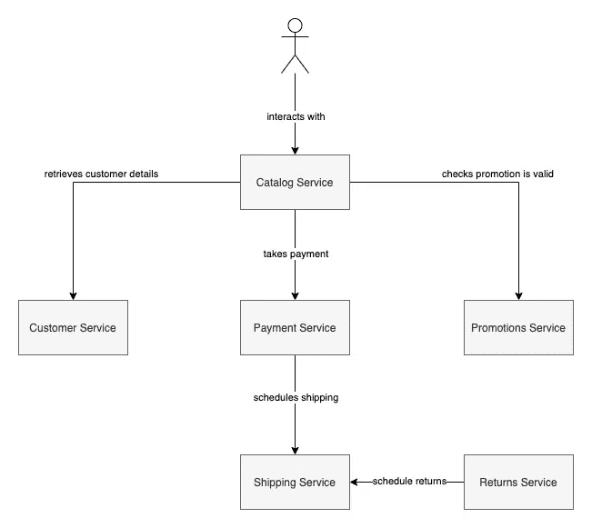

# 域分区:如何在微服务和单片之间找到健康的平衡

> 原文：<https://betterprogramming.pub/domain-partitions-how-to-find-a-healthy-balance-between-microservices-and-monoliths-2cd74206559>

## 深入了解适合大多数中小型公司的架构模式

汉娜·莫瑞斯在 [Unsplash](https://unsplash.com?utm_source=medium&utm_medium=referral) 上的照片

只要工程师一直在生产代码，就一直有关于构建一套系统的最佳方式的讨论。两种最常见的模式是单片和微服务。

它们各有利弊，但是有没有一种替代方案可以在两者之间找到平衡呢？我相信是这样的——域分区服务。

# 什么是域分区？

在我们深入研究什么是域分区之前，快速了解微服务和单片的标准架构很重要。

通常，微服务架构鼓励创建相对较小的服务，每个服务都有自己的存储库，所有服务都以某种方式通过网络进行通信，例如 HTTP 或通过消息代理。另一方面，monolith 通常是一个大型服务，都在一个存储库中，内存中调用系统不同部分之间的通信。

那么，域分区如何适应呢？本质上，它们是两者之间的中间地带。不是大量的小型服务，或者一个单一的整体服务，而是一组中等规模的服务，其中有不同的、明确定义的部分——分区。

让我们通过一个例子来看看这是如何使用我们的三种架构模式的。在假设的领域建模练习之后，我们定义了一个新的领域——采购领域。它处理四个功能领域:支付、运输、退货和促销。

我们已经实施了许多其他领域，例如目录和客户领域。

不要太担心域是否有意义，它们只是用来说明模式的。下面的架构也是如此，它们在依赖性方面肯定没有经过深思熟虑，但它们只是为了说明这一点。

## 庞然大物

在 monolith 中，这非常简单——所有与采购领域相关的代码都将进入 monolith。至少我们希望每个子域都有命名空间，但这可能是大多数 monoliths 所能做到的。

通常，代码库的不同部分之间没有明确的界限，这不仅会导致整体上的级联故障，还会导致所有权模糊以及关于谁拥有什么的冗长讨论。

## 微服务

微服务架构示例。图片来源:作者

在微服务架构中，需要做出选择，但最有可能的是，你最终会得到四种新服务。你可能会决定将退货和运输结合起来，这样只会产生三种新的服务，但是不管怎样，我们最终都会有很多新的服务。

服务之间需要某种形式的通信，例如，在付款后，需要请求发货。

## 域分区

示例域分区架构。图片来源:作者

通过域划分，我们将在两者之间找到一个平衡点。将会创建一个新的服务，并且在该服务中会有四个分区—每个子域一个分区。下面有更多技术层面上的实现细节，所以我不会在这里讨论。

架构中的其他服务将通过 HTTP 或消息代理，以类似于微服务架构的方式与购买服务进行通信，分区本身通常通过内存调用进行通信。但是，如果有充分的理由(例如，减少直接耦合，更快地处理 API 调用)，没有什么可以阻止通过 message broker 进行通信

另一个重要的方面是单个 API 是公开的，通常是通过 API 网关。这并不意味着每个分区不能有自己的内部 API，有自己的控制器，但是外部服务会将它们视为该域的单个、统一的 API。

# 域分区带来了什么价值？

我已经在上面提到了这种架构的一些好处，但是有必要更详细地讨论一下。

## 建筑复杂性

如果您曾经使用过微服务，您可能知道试图理解所有部分如何组合在一起的痛苦。当问题发生时，这尤其成问题:问题或错误到底在哪里？

当您进入异步工作流时，这个问题会加剧，尤其是在可观察性很差的情况下。例如，什么服务使用事件 X？

此外，新加入者通常会被所有不同的服务淹没，并试图理解它们是如何组合在一起的。通常，会有一些图表来帮助解决这种情况，但是它们经常是过时的或者没有给出完整的描述。

另一方面，域分区服务仍然有一些复杂性，因为我们仍然在分布式架构中处理大量的服务。因此，与整体建筑相比，它在建筑上更加复杂。

## 程序调试时间

根据我的经验，当您考虑各种场景时，域分区服务架构模式会导致更快的开发时间。

我认为公平地说，monolith 是三者中开发时间最慢的，因为它可能很难找出需要在哪里进行更改，以及理解更改的爆炸半径——特别是，需要测试什么以确保在您的更改后没有任何损坏？

如果变更非常小且范围非常明确(例如，针对服务)，那么微服务将会挤掉域分区架构。

然而，如果你需要修改两个或更多的服务，那么这将比域分区架构花费更多的时间。这就是为什么，根据我的经验，域分区架构在开发时间上通常是最快的，因为变化经常是跨分区的。在微服务架构中，这意味着修改两个不同的服务。

我要说的最后一点是，monoliths 通常有大而慢的测试套件，这使得 TDD 之类的实践很难遵循，并且通常很难在本地运行测试套件的大部分。

微服务和域分区服务都不会遇到这个问题，但是，它们的测试套件通常很快——我每天工作的一个服务的测试套件有四个域分区，在本地运行只需一分多钟。最慢的单个规范只需几秒钟就能运行，相比之下，我所处理的单个应用程序可能需要五分钟以上。

## 部署

在这三种模式中，Monoliths 的部署通常是最慢的，这通常是因为它们必须处理整个架构的所有问题——通常包括部署额外的云服务、编译资产等。

相反，微服务应该快速部署，因为它们应该很小，并且因为它们覆盖非常具体的职责，需要很少的步骤来部署，至少相对于整体来说是这样。

虽然域分区服务比微服务大，但它们的部署时间通常不会与微服务架构有很大不同。唯一的区别是通过分区比传统的微服务有更多的代码，这在大多数情况下不会显著影响部署时间。

也有例外，比如某个特定分区需要一些其他分区不需要的额外部署步骤，但总体而言，以我的经验来看，域分区服务和微服务之间的部署时间可以忽略不计。

## 费用

工程师们经常忘记的一个衡量标准是运行服务的成本。考虑到今天大多数公司都在使用容器，我们将从这个角度来解决这个问题。

如果你不处理大量的吞吐量(让我们现实一点，大多数公司不必处理*大量的*吞吐量)，单片实际上是相对划算的。这是因为您不需要部署多组服务，相反，您只需要为您的 monolith 部署足够的容器来处理它的所有工作负载。

然而，基于微服务的架构会很快变得昂贵。每个微服务至少需要 2-3 个容器来确保高可用性，因此如果您有 10 个服务，那么至少需要 20-30 个容器用于生产，如果考虑到试运行环境，这个数字可能会翻倍。这仅仅是开始，当你考虑到你还需要其他的资源，比如负载平衡器。

与其他类别类似，域分区服务位于中间。你可能需要比一个整体更多的容器，但没有微服务那么多，因为事实上我们的服务数量比微服务架构少。

## 概观

有许多领域和技术可以用来分析任何架构，我已经在上面介绍了主要的领域和技术。

这种体系结构的一个重要优点也值得强调，那就是能够相对容易地将一个分区提取出来用于自己的服务。您需要或想要这样做的原因可能有很多，例如:

*   您可能分区不正确，需要将一个分区移动到另一个服务。
*   随着体系结构的发展，服务中的一个分区可能会有特定的需求。一个例子是，在给定的服务中，一个分区需要处理比其他分区多得多的吞吐量。在这种情况下，提取该分区并按比例增加该服务的容器数量可能是有意义的，而不是按比例增加现有服务(这可能更昂贵)。

总的来说，我认为域分区服务对于大多数中小型公司(行业的绝大多数)来说是一个极好的选择。它将领域放在架构的中心，使工程师能够快速地完成他们最好的工作，并且对于大多数用例以及团队规模来说伸缩性相对较好。

# 你如何决定如何划分你的域名？

这种架构与其他架构的主要区别在于它的分区，因此确定如何分区至关重要。

对于每一个重要的工作，需要相当大的功能添加或更改，这是一个考虑这个工作适合在哪里以及如何适合的机会。因此，它的本质[领域驱动设计](https://en.wikipedia.org/wiki/Domain-driven_design)被实践。

一旦进行了领域建模练习，新功能应该放在哪里就变得很明显了。以下是一些需要考虑的事项，按顺序排列如下:

1.  这个新功能属于现有的分区吗？
2.  这个新功能属于现有的领域吗？(很可能已经有支持它的服务)

如果这两个问题的答案都是肯定的，那么您可能已经找到了放置新功能的地方。如果两个问题的答案都是否定的，那么您可能需要创建一个新的服务！

还有一些其他考虑因素，例如新功能是否有定制的需求(例如，新的云服务，或者必须处理大量的吞吐量，而不是任何现有的服务/分区)，这些因素可能会影响您的决策。如果有令人信服的理由，那么决定为一个域提供两个服务而不是一个服务是完全合理的。

# 域分区的实现

这一部分值得单独写一篇文章，在将来，我计划更详细地充实这一部分。现在，我想重点介绍该架构的高级视图，但是，我认为该架构有一个非常重要的构造对其成功至关重要。

在域分区之间实施清晰而严格的边界是至关重要的。如何做将根据语言的不同而不同，例如在 Java ( [docs](https://docs.oracle.com/javase/tutorial/java/javaOO/accesscontrol.html) )中，每个分区可以为每个分区公开少量(理想情况下一个)公共类——其余的应该是包私有的，所以这些类在那个包之外是不可访问的。这种可见性配置为您提供了一个分区。

这确保了分区之间的清晰接口，并允许在不影响其他依赖分区的情况下重构分区的内部。此外，如果需要将一个分区提取到另一个服务，任何依赖的分区都可以很容易地迁移到新服务进行调用，而不是内存调用。

最后，API 网关将所有的东西集合在一起。这意味着服务之间的集成点更少，每个服务都有自己的身份验证要求和配置。您最终仍然拥有相同的端点(例如`POST /payments`和`GET /promotions`)，但是它们将从单个服务中公开。

# 摘要

我希望这篇文章对你有所帮助。我从 [Shopify 的解构之旅](https://shopify.engineering/deconstructing-monolith-designing-software-maximizes-developer-productivity)、[优步的减少微服务数量之旅](https://eng.uber.com/microservice-architecture/)、无数关于微服务问题的讲座和研讨会，以及我自己实施域分区的经历中获得了灵感。

两篇文章都值得一读，因为它们都在解决类似的问题，尽管方式略有不同。Shopify 倾向于模块化的整体方法，而优步则倾向于一种他们称之为面向领域的微服务架构的方法。

在优步的例子中，他们仍然维护着大量的微服务，但是它们被分组在一个 API 网关之后——类似于这里概述的方法，但是有细微的不同，因为我们在大多数情况下被分组到单个服务中。优步可能是出于其可伸缩性需求而做出这一选择的，但大多数公司并没有这样的顾虑。

> 希望扩展您的技术知识，但不确定阅读什么？我办了一份免费的时事通讯，提供两周一次的技术书籍推荐，包括我从书中获得的关键信息。感兴趣吗？在这里报名吧！