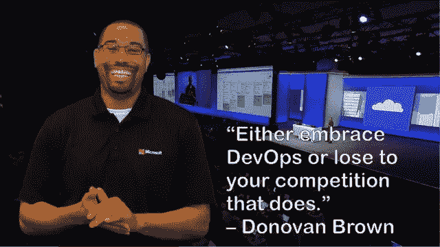

# “不要请求许可”——来自 Scrum 蔻驰的一个教训

> 原文：<https://betterprogramming.pub/dont-ask-for-permission-a-lesson-from-scrum-coach-e9a3ba8e8703>

## Scrum 学习

在一次会议上发言时，有人问我是否见过任何 DevOps 反模式。我首先想到的是员工请求允许为他们的公司做正确的事情。许多客户与我会面，询问他们如何让领导层相信敏捷和 DevOps 是好东西。我只是告诉他们停止尝试。言语永远无法传达一个运行良好的敏捷团队或一个成熟的 DevOps 管道的力量和好处。但是，结果会。

站在他们的角度想想。这些人中的许多人领导着非常成功的企业，这些企业在没有敏捷或开发运维的情况下成为了行业巨头。那么，他们为什么要修复他们认为没坏的东西呢？

对他们来说，一切都很好，他们正行驶在成功的高速公路上，前方道路畅通无阻。他们没有意识到的是，他们后视镜中微弱的灯光是他们的竞争对手在追赶他们。

是的，今天他们不是一个威胁，但是他们跑得如此之快以至于当他们超过你的时候，你终于意识到他们跑得有多快，你已经无法跟上他们了。它们完全颠覆了你的行业，就像亚马逊颠覆了购物业，优步颠覆了运输业。

要么接受 DevOps，要么输给你的竞争对手。

我们的客户要求不断创新，这只能通过自动化来实现。如果你不能满足顾客的需求，他们就会成为别人的顾客。留住一个客户比挽回一个已经失去的客户要容易得多。

没坏不代表不能改进。创新不是目的地；这是一个永无止境的旅程。我们必须不断寻找改进流程的方法。

不要再请求允许为你的公司做正确的事情。今天就开始做吧。如果您没有持续集成(CI)构建，只需创建一个即可。如果您没有针对刚刚编写的代码的单元测试，请编写一个！

你会问你的老板你应该使用 for 循环还是 while 循环吗？不，因为这是你的工作。基于你的技能和经验，你做你知道对你的公司是正确的事情。持续集成对你的公司来说是正确的事情，所以不要再请求许可来做你的工作。

此外，不要浪费时间用文档和演示来说服别人。实现持续集成比说服团队你应该做要花费更少的时间。不要问，只要建立持续集成，看着每个人都想知道当其他人都在等待代码被修复时，你是如何仍然在编码的。

他们都在不知道构建被破坏的情况下进行了最新的修改。但是持续的集成提醒了你这个问题。您仍然在工作，因为您没有将损坏的代码加载到您的机器上。当你的同事问你如何知道构建被破坏了，那么你告诉他们你建立了持续集成，他们也可以得到提醒。

没有什么比结果更快地结束一场辩论。交付速度更快，质量更高。只有当你的领导问你是如何做到的，你才向他们解释敏捷和 DevOps。以前没有。

*最初发表于*[*【https://www.donovanbrown.com】*](https://www.donovanbrown.com/post/Dont-go-ask-for-permission-just-do-the-right-thing-for-your-company)*。*