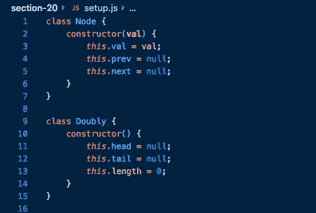

# 链表加倍，第一部分

> 原文：<https://betterprogramming.pub/doubling-down-on-linked-list-pt-1-5608f4f15022>

## 什么是双向链表，如何创建一个双向链表？


纽约布朗克斯植物园站台的地铁北线

你可能想知道为什么我选择用一张地铁北线列车的照片作为这篇文章的开头——如果你住在纽约，你可能会恨我提醒你总是迟到的原因。然而，双向链表和火车有很多相同的特征，这就是我希望你们在我们学习一些方法的时候，把它们形象化的方法。

那么，数据结构怎么会像火车呢？火车车厢的连接方式与双向链表中节点的连接方式非常相似。


这是一个耦合器，类似于双向链表上的指针

每节火车车厢都有一个车钩(把车厢连在一起的东西)；在链表中，我们有类似的东西叫做指针。对于双向链表，有两个指针，因此称为“双向”(而不是单向指针的单向链表):一个指向前方，一个指向后方。火车上只有两节车厢没有两个车钩，那两节车厢是火车的车头和车尾。在双向链表中，这些位置通常被称为头和尾，火车车厢本身被称为节点。除了头部和尾部，所有的节点都是前后连接的，头部和尾部只有一个指针。因此，暂时抛开火车的比喻，让我们编写一个双向链表的框架，我将把它命名为*double*。



这里我们有两个类，一个定义节点，一个定义双向链表，我再次调用了双向链表，但是你可以随意命名。每个节点都由三个属性构成，val 是在创建时声明的，两个指针 next 和 prev 被设置为 null，因为它们当前不指向任何其他节点，直到我们建立了这些连接。

接下来，我们定义 Doubly 类。在构造函数中，它有三个属性:头部、尾部和长度。随着节点开始落入列表中，长度将会增加。对于每个节点，长度增加 1，只有当列表中没有节点时，头和尾才会为空。我们要添加到这个 Doubly 类中的第一个方法是 push 方法，它将创建一个节点并将其添加到列表的末尾。

“但是等等，”你可能会想，“你是说推，比如推到一个数组？”完全正确。链表和数组非常相似，但是双向链表不像数组那样有索引，值指向彼此而不是索引。让我们得到一些代码来推进我们的双向链表，称为 doubley。


为我们的双向链表创建推送功能

```
What we see in the consoleDoubly {
    head: Node{val: "Harry"}, 
    next: null, prev: null}, tail: Node{val:"Harry"}, 
    next: null, prev: null length: 1
}
```

在初始化了一个名为 Doubly 的新对象后，我们使用自定义方法，使用值为 *Harry* 的头和尾来推送一个节点。现在，头部和尾部都有指向空的指针(如果你愿意想象霍格沃茨特快列车的前车厢，请随意)。

就像一列只有一节车厢的火车；它没有连接到任何东西，它只是孤独地坐着，等待火车伙伴。当第二节车厢进入时，它落在队伍的后面，现在是最后一节车厢。现在我们的两节车厢需要一个车钩，但是现在，清单上只有一件事；因此，当前长度等于 1。有几种方法可以检查我们的列表中是否存在任何节点，以及应该加倍采取什么行动。第一个是我上面展示的方式。如果列表长度为 0，则没有节点。您还可以通过确保头部不为空来进行检查，如下所示:

```
if (this.length === 0) // first way, meaning 0 nodes exist
if (this.head !== null) // second way to check, because if the head is null then nothing exists within our list. 
if (!!this.head) // same as above but less verbose
```

这将检查列表的头部是否有一个节点集？没有吗？然后我们第一次推进，头和尾都是这个新的节点。如果有一个节点，我们将点击 else 语句。记住，所有的节点都用指针初始化:prev(代表 previous)和 next，两者都设置为 null。所以，我们给我们的老尾巴的下一个指针一个值，我们的新节点。然后，新节点简单地用它的 prev 指针指向旧的尾部。然后，我们声明我们的新尾，这是新的节点。很像这个迷因。


我们以前的尾巴指向新节点，而新节点指向右后方

因此，当我们推送一个新节点时，例如，哈利最好的朋友*罗恩·韦斯莱*，以哈利为值的节点指向以罗恩为值的新节点，罗恩又指向哈利。如果我们将此记录在控制台中，它看起来像这样:

```
let doubly = new Doubly // our instance of a Doubly Linked Listlet doubly = new Doubly;
doubly.push("Harry");
doubly.push("Ron");Console.log(doubly);OUTPUT IN THE CONSOLE Doubly{ 
 head: Node {
  val: "Harry", 
  next: Node { val: "Ron", next: null, prev: [Circular]},
  prev: null 
 },  tail: Node {
  val: "Ron", 
  next: null, 
  prev: Node { val: "Harry", next: [Circular], prev: null} 
 } 
}
```

这很有意思:我们的头指向 Ron，现在两个节点都有一个叫做[Circular]的东西。所有的圆形都意味着它们无限地来回指向彼此。与哈利的节点指向罗恩，又指向哈利，又指向罗恩，永不停歇。

这就是节点保存值的方式，并指向其他节点。在继续之前，值得一提的是，尽管头部和尾部相互指向，但它们仍然有一个指针，设置为 null。头部总是有一个 null 的前一个值，尾部总是有一个 null 的后一个值，因为在头部之前和尾部之后什么都没有。这就是为什么它们是头和尾(前面和后面)。

这就是双向链表的要点:拥有一个带值的节点，并指向其他带值的节点。你可以像写数组一样在 Doubly 上写方法。像 pop()、unshift()这样的方法，或者使用 get 和 remove 从特定节点查找值。让我们写一个快速的方法，pop，删除列表的最后一个元素。


双向链表的 pop 方法

就像一个普通的数组一样，我们可以定义自己的 pop 方法，从字面上弹出最后一个节点并返回该节点。有几个条件需要检查。第一个是如果节点没有长度，那么就没有节点，我们返回 undefined。如果长度为 1，在从列表中删除后，就没有剩余的节点，我们必须将头和尾重置为空。如果有不止一个条目，那么我们转到火车的尾部(最后一个节点),并将该节点设置为返回。下面是它在代码中的工作方式:

```
let doubly = new Doubly // our instance of a Doubly Linked Listdoubly.push("Harry");
doubly.push("Ron");
doubly.push("Hermione"); 
doubly.push("Draco");doubly.pop();// Returned node 
Node {val: "Draco", next: null, prev: null}
```

快速浏览一下，在我们删除 *Draco* 之前:这个节点有一个 prev 值*赫敏*，我们设置赫敏的节点等于 temp 变量:

```
let temp = this.tail.prev 
// this.tail = draco's node, 
// his prev pointer points to Hermione's node
```

然后，我们将德拉科之前的指针设置为空，这样他就不再与其他船员联系了:

```
let temp = this.tail.prev;
this.tail.prev = null;
this.tail = temp;
```

所以现在我们在内存中有了赫敏的节点，我们通过将旧的尾巴的先前指针设置为空，然后将我们的新尾巴设置为赫敏的节点，从德拉科的节点中删除了对她的节点的引用，因为德拉科已经被踢出了霍格沃茨特快。剩下的唯一一件事就是通过设置我们新的 tail(赫敏的)next 指针为 null 来确保没有连接。现在我们有了一个双向链表的实例，我们可以在其中使用 push 和 pop 方法，跟踪列表中有多少项，并通过它们的指针获取对以下节点的引用。

双向链表有更多的功能。我们将在另一篇文章中讨论更多的方法，因为这篇文章运行的时间比预期的要长。我知道双向链表和数组看起来是一样的，在某些方面，它们是一样的。不同之处将在下一篇文章中介绍。如果你现在想了解一些不同之处，你可以在这里找到它们:[链表和数组](https://www.geeksforgeeks.org/linked-list-vs-array/)。

没有柯尔特·斯蒂尔和他的算法课程，这篇文章是不可能的。所以，柯尔特，即使你永远也不会读到这封信，谢谢你教会了我们所有需要它的人。这些数据结构真的很有挑战性，看起来你只是在面试时才需要它们，但是我向你保证，它们会让你的编码之旅变得简单一些。新的观点和知识是非常值得的，因为试图理解这些数据结构会遇到挫折。

我希望这能让双向链表更容易理解，并期待着尽快撰写后续文章。非常感谢您的阅读，祝您编码愉快！