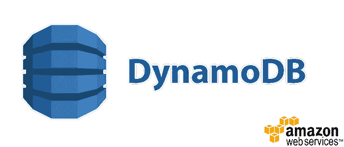
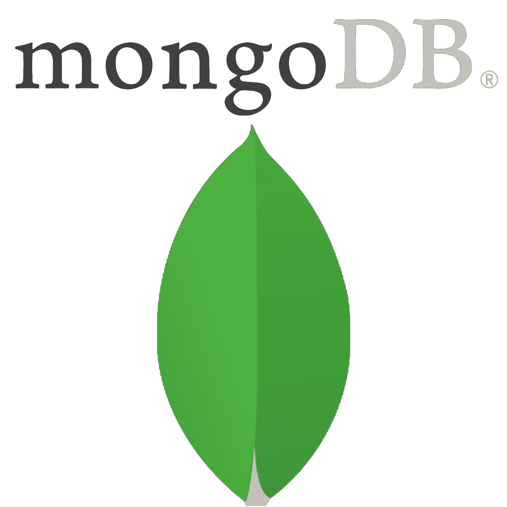

# DynamoDB 与 Hadoop 和 MongoDB 的对比

> 原文：<https://betterprogramming.pub/dynamodb-vs-hadoop-vs-mongodb-4f05714312b2>

## 所有的 NoSQL 系统都一样吗？


[活动发起人](https://unsplash.com/@campaign_creators?utm_source=unsplash&utm_medium=referral&utm_content=creditCopyText)在 [Unsplash](https://unsplash.com/s/photos/database?utm_source=unsplash&utm_medium=referral&utm_content=creditCopyText) 上的照片

满足您当前业务需求的最佳数据库通常取决于您的开发团队的技能和已经到位的应用程序。

了解哪个数据库系统最适合您公司的当前和未来需求是重要的一步。数据库在所有行业和组织中都扮演着至关重要的角色。

因此，从需求角度和价格角度选择最合适的系统可能是一个失败的项目和一个成功的战略实施之间的区别。

随着贵公司存储数据的方式不断扩展，我们想比较一些公司正在使用的更现代的数据库系统。

了解 [DynamoDB](https://aws.amazon.com/dynamodb/) 、 [Hadoop](https://hadoop.apache.org/) 和 [MongoDB](https://www.mongodb.com/) 提供了什么将帮助你为你的商业模式做出更好的决定。所有这些系统不一定可以互换，在某些情况下更像是比较苹果和橘子。然而，因为他们通常都属于 NoSQL 的保护伞下，他们经常聚集在一起。

因此，让我们首先介绍这些系统，然后对它们进行比较。

# 什么是 DynamoDB？



*亚马逊 DynamoDB(来自* [*AWS 数据库博客*](https://aws.amazon.com/blogs/database/simplify-amazon-dynamodb-data-extraction-and-analysis-by-using-aws-glue-and-amazon-athena/) *)*

亚马逊 DynamoDB(来自 [AWS 数据库博客](https://aws.amazon.com/blogs/database/simplify-amazon-dynamodb-data-extraction-and-analysis-by-using-aws-glue-and-amazon-athena/))

DynamoDB 由亚马逊创建，是一项独家的 NoSQL 数据库服务，可作为亚马逊网络服务(AWS)产品组合的一部分获得。这个术语源于[迪纳摩](http://www.allthingsdistributed.com/files/amazon-dynamo-sosp2007.pdf)，一个高度可访问的键值商店，是为了应对 2004 年亚马逊电子商务假期中断而建立的。

起初，只有少数团队在 Amazon 内部采用了 Dynamo，因为它的操作非常复杂，并且需要在数据一致性、性能、查询灵活性和可靠性之间进行权衡。

此外，在此期间，亚马逊开发人员更喜欢使用其主要的 NoSQL 数据库 SimpleDB，这减轻了用户的数据库管理任务。但是 SimpleDB 面临着一些限制，最终限制了它的使用。

DynamoDB 于 2012 年推出，是 AWS 上的一项数据库服务，旨在解决 Dynamo 和 SimpleDB 的障碍。

# Hadoop 是什么？


Apache Hadoop 是一个框架，允许通过简单的编程模型，通过计算机集群对大型数据集进行分布式处理。Hadoop 旨在从单个服务器扩展到多个机器，各个设备贡献本地计算和存储。

Hadoop 本身不是依靠硬件来分配高可用性，而是设计用于检测和处理应用层的故障。

什么是 Hadoop(来自 [IBM 大数据和分析中心](https://www.ibmbigdatahub.com/blog/what-hadoop)

深入观察会发现更多神奇之处，因为 Hadoop 实际上是模块化的。这个概念意味着你可以用各种软件工具交换几乎任何部件。这个过程实现了一个非常灵活的架构，它也是有效和健壮的。

# 什么是 MongoDB？



MongoDB 是由 MongoDB Inc .创建的一个非表格化的开放式数据库。最初，发起人专注于创建一个使用完全开源部分的平台，但由于难以让现有数据库满足他们在云中构建服务的要求，导致他们开始创建一个个人数据库系统。

MongoDB(来自 [MongoDB 分片集群](https://medium.com/@Alibaba_Cloud/mongodb-sharded-cluster-routing-policy-explained-d30f10d52735))

在意识到创建数据库软件的可能性之后，团队将注意力转移到创建 MongoDB 上。MongoDB 于 2009 年发布，旨在创建一个技术基础，通过分布式系统设计、文档数据模型和统一的体验来支持开发团队。

2016 年，MongoDB 公布了其完全托管的云数据库服务 [MongoDB Atlas](https://www.mongodb.com/cloud/atlas) 。MongoDB Atlas 提供了真正的 MongoDB，允许用户摆脱特定的操作任务。

现在不同之处在于。

# 易于使用、设置和管理

## DynamoDB

对于 DynamoDB，托管服务将用户从底层基础设施中抽象出来，并且只通过远程端点与数据库进行交互。

不需要担心操作问题或额外的硬件供应。这种方法使得 DynamoDB 非常容易上手。

## Hadoop

Hadoop 在设置时有几个选项。用几乎 [0 的抽象和命令行来管理 Hadoop 似乎是可行的。](https://www.tutorialspoint.com/hadoop/hadoop_enviornment_setup.htm)

当然，这意味着您需要熟悉命令行，并了解如何设置硬件。由于复杂性，已经有多家公司，如 [Cloudera](https://www.cloudera.com/products/product-components/cloudera-manager.html) ，帮助您轻松管理 Hadoop。

如果做得好，使用第三方可以为你节省数十万美元的个人成本(因为雇佣一名 Hadoop 工程师通常需要 15 万英镑以上)。

## MongoDB

MongoDB 是最容易管理的一个，这不是一个 Saas **。**您可以轻松下载并快速开始与 MongoDB 交互。[这里有一个 Mac 的快速指南](https://docs.mongodb.com/manual/tutorial/install-mongodb-enterprise-on-os-x/)。

# 支持质量

## DynamoDB

对于DynamoDB **，**质量支持，通过社区支持论坛、企业支持、服务器故障和堆栈溢出提供。

[DynamoDB 社区](https://aws.amazon.com/dynamodb/community/)提供了示例应用程序、驱动程序、扩展和工具。此外，由于 DynamoDB 是 AWS 的一部分，根据您的业务规模，您可能会直接从 Amazon 获得进一步的支持。

## Hadoop

对于Hadoop，有几家商家提供了该系统的商业实现和支持。Hadoop 已经存在了足够长的时间，有多个社区、支持工具和课程来帮助提高您在系统上管理和开发的能力。

就个人而言，我们确实认为，如果你只是指原始软件，它可能是更难获得支持的系统之一。

然而，有如此多的第三方已经介入，让您远离这一点，我们认为大多数大型组织都可以考虑将 Hadoop 作为一个数据存储系统。

## MongoDB

MongoDB 提供了一个社区支持论坛，ServerFault 和 Stack Overflow。用户还可以通过企业级支持获得非强制性的全天候企业支持。

MongoDB 社区也提供关于事件、MongoDB 大学、用户组和网络研讨会的信息。

# 数据库结构

## DynamoDB

DynamoDB 使用属性、项目和表作为用户经常使用的核心部分。

*   该表包含一组项目，每个项目是属性的集合。
*   此外，DynamoDB 使用主键来唯一标识表中的单个项目。
*   辅助索引的使用为查询提供了更大的灵活性。

## MongoDB

MongoDB 使用类似 JSON 的 doc 文件来存储与模式无关的数据。

MongoDB 中的文档集合不需要针对不同文档的预定义列和结构。MongoDB 在关系数据库中的几个特性包括:

*   易读的查询语言。
*   一致性强。

由于它是无模式的，MongoDB 允许创建文档，而不需要首先创建文档结构。

与关系数据库管理系统(RDBMS)的一个关键对比包括:

```
Table | Column | Value | Records
```

与 MongoDB 相比，它包括:

```
Collection | Key | Value | Document
```

这种方法意味着 MongoDB 和 RDBMS 的集合和表是相似的。还有，`Documents`和`Records`有相似之处。

## Hadoop

Hadoop 没有数据结构；本质上，它只是接受系统上使用的数据类型。Hadoop 应用了*读取模式*方法，这提高了它对所有数据集的通用性。

Hadoop 中的所有数据都存储为文件系统，其他技术如 [Hive](http://hive.apache.org/) 和 [Impala](https://impala.apache.org/) 向对象添加模式，这使得能够以表格格式查看底层数据。

如果您从原始软件管理 Hadoop 本身，这可能会变得非常复杂，因为您选择和编码的文件类型在从速度到空间的所有方面都起着巨大的作用。推翻具体的决定也是非常困难的。

# 适合您的业务

## DynamoDB

DynamoDB 仍然是游戏和物联网(IoT)领域的热门选择。如果您使用 AWS 堆栈并且想要一个 NoSQL 数据库，那么 DynamoDB 是一个很好的选择。

牢记在心；您可能无法像在 MongoDB 上那样访问嵌入式数据结构。

## Hadoop

Hadoop 是需要服务器集群的大型企业的热门选择，在这些企业中，专业的数据管理、编程技能和昂贵的实施不是问题。

Hadoop 还可以在构建未来的企业数据中心方面发挥有益的作用。它可能很难管理(取决于您决定如何管理，有没有第三方),但它也提供了很多优势。

## MongoDB

MongoDB 在缓存和可伸缩性方面提供了很好的选择。

它在 web 开发中也起着很大的作用，因为它可以使从后端到前端传递文档样式的数据变得容易。这使得创建内容管理系统的公司很容易选择它。

# 性能问题

## DynamoDB

对于 dynamo db,[突出显示了以下性能问题](https://blog.yugabyte.com/11-things-you-wish-you-knew-before-starting-with-dynamodb/):

*   DynamoDB 的定价模式非常昂贵。
*   低延迟读取。
*   地理分布问题。
*   设置 CI/CD 并不容易。
*   识别导致分区的确切键是复杂的。
*   持久的一致性并不普遍。
*   没有 ACID 事务和辅助索引。

## Hadoop

对于 Hadoop，[强调了以下性能问题](https://www.dynatrace.com/news/blog/top-performance-problems-discussed-at-the-hadoop-and-cassandra-summits/):

*   DataNode 和 NameNode 速度变慢。
*   地图减少了数据局部性。
*   TaskTracker 的性能和对洗牌时间的影响。

## MongoDB

对于 MongoDB,[强调了以下性能问题](https://www.infoq.com/articles/Starting-With-MongoDB/):

*   结合访问模式和模式来设计索引是至关重要的。
*   大对象和异常大的数组的问题。
*   安全性和耐用性的设置仍然是一个问题。
*   没有查询优化器。

除了这些差异之外，看看有什么工具可以帮助进一步支持这些系统总是很有趣的。

那么，让我们来看几个:

## 岩石集

[Rockset](https://rockset.com/product/) 是一个可扩展的、可靠的云中搜索和分析服务，只需使用 SQL 就可以轻松地在数 TB 的数据上构建快速运行的应用程序。

这就是 Rockset 的巨大优势。使用这个工具，您的团队不需要熟悉另一种查询语言。

## NoSQLBooster

NoSQLBooster 是一个 GUI，是为管理 MongoDB 而开发的。此外，它允许您使用 SQL 语法和 MongoDB 语法进行查询。

因此，它不仅使管理您的数据库变得更容易(想想使用 SQL Server Management Studio)，而且还可以使分析师更容易运行查询来回答业务问题。

## Sqoop

[Apache Sqoop(TM)](https://sqoop.apache.org/) 是一款工具，旨在高效地在 Apache Hadoop 和结构化数据存储(如关系数据库)之间传输批量数据。这也可以称为某种 ETL 工具，有助于简化与 Hadoop 的交互。

# 结论

DynamoDB、Hadoop 和 MongoDB 都是非常不同的数据系统，不总是可以互换的。每个数据库都有其优缺点和使用案例。

上面强调的要点旨在帮助您对这些数据库系统做出更好的决策。根据您的组织规模，采用这些数据库系统中的任何一个都可以提供高度多样化的数据类型、高效的应用程序管理等等。