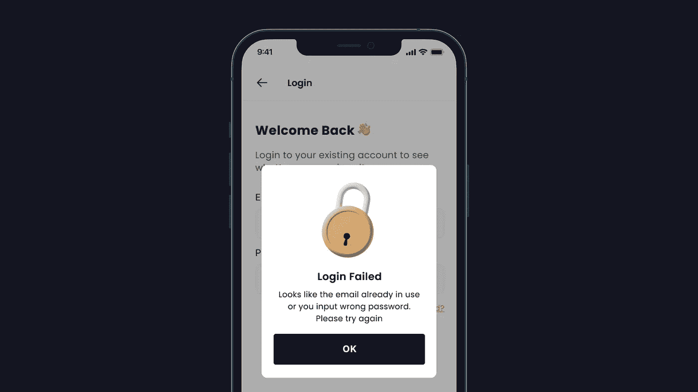
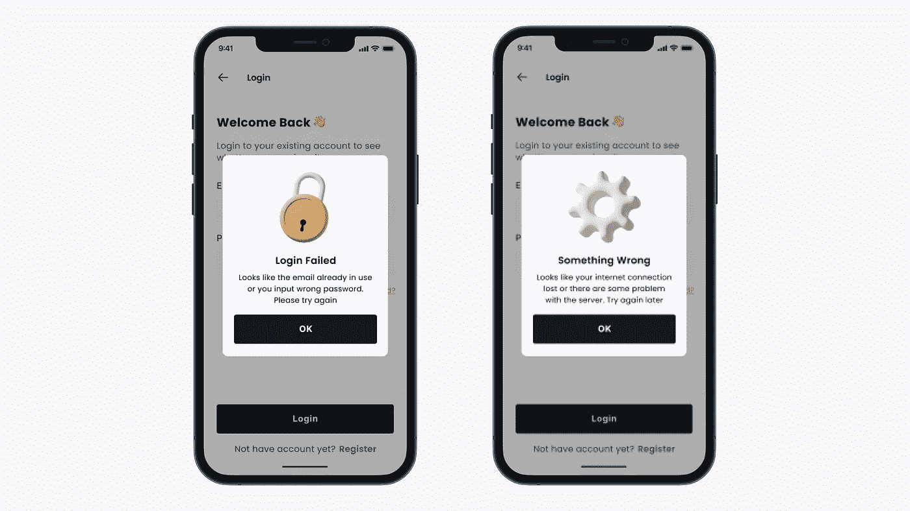

# 用达姿在颤振中创建良好的错误处理的简单方法

> 原文：<https://betterprogramming.pub/easiest-way-to-create-a-good-error-handling-in-flutter-with-dartz-44084d5341bb>

## 不要让你的用户感到困惑，在开发应用程序的时候，创建一个好的错误处理机制



作为开发人员，我们的主要任务是创建应用程序来解决某些问题。当发布时，我们开发的应用程序可能会在用户面前产生一些错误。例如，可能我们的用户输入数据不正确，连接丢失，甚至我们的服务器关闭。

一个好的应用程序将能够处理错误，并能再次为用户指出正确的道路。我们当然不希望仅仅因为应用程序不能处理像失去连接这样的小错误，用户就决定卸载它。

在本文中，我将展示如何使用达姿在一个颤振项目中创建良好的错误处理。

[](https://pub.dev/packages/dartz) [## dartz |飞镖包

### 按照 cats、scalaz 和标准 Haskell 库的精神，Dart 类型类层次结构中的函数式编程…

公共开发](https://pub.dev/packages/dartz) 

# 履行

首先，我们需要弄清楚哪些错误是可能发生的。例如，在登录流中，常见的错误是:

*   用户输入错误的密码或电子邮件未注册
*   服务器可能有问题
*   失去互联网连接

现在，让我们将我们需要的包添加到`pubspec.yaml`文件中:

```
...
dependencies:
    flutter:
        sdk: flutter

    dartz: ^0.10.1
    ...
```

在达姿包中，我们将使用一个叫做`Either<L,R>`的类。这个类将被用来在一个函数中返回两个不同的东西。

有一个类型为`Future<**Either<LoginFailure, bool>**>`的函数。有了这个类型，现在我可以从函数中返回两个不同的东西。

当请求成功时(状态码为 200)，布尔值 true 将作为正确的值返回。

如果请求失败，我可以通过返回`enum`作为左值来轻松处理它。`enum`阶层充当助手创造条件。

这是我们使用登录功能的方式，例如在`controller`中:

现在你可以像这样创建一些用户交互。



处理一些错误的用户交互示例

# 概述

这就是在颤振上实现良好的错误处理的方法。术语“好”意味着我们的应用程序有更丰富的错误处理功能，可以帮助用户了解他们在使用应用程序时是否有问题。

感谢阅读。我希望这些简短的提示可以帮助你为你的 Flutter 项目编写一个更加干净、简洁和健壮的代码库。