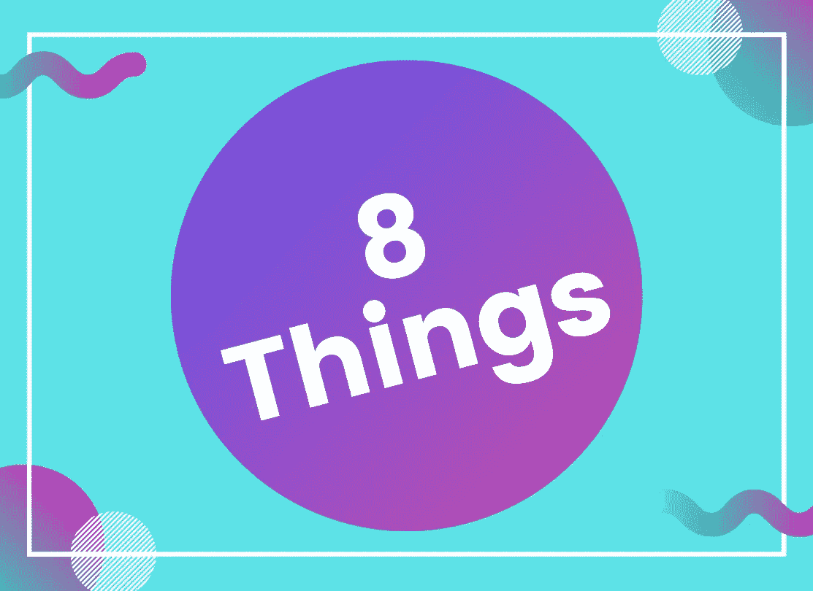

# 作为一名软件工程师，我在一年的自由职业生涯中学到的八个教训

> 原文：<https://betterprogramming.pub/eight-lessons-ive-learnt-in-a-year-of-freelancing-as-a-software-engineer-6fba21c359c6>

## 哦，见鬼，时间都到哪里去了？



我决定冒险开始自由职业已经一年多了。在此之前，我一直在伦敦的多家公司做全职软件工程师，也就是朝九晚五的普通人。

自由职业绝对是一种不同的工作方式，需要一些时间去适应。我不会说这一定比做一名受薪员工好——我认为两种工作方式都有各自的利弊——尽管此时此刻我不想再做一名员工。也许将来这种情况会改变。谁知道呢。

所以，事不宜迟，以下是我从事自由职业这一年来学到的八件事:

# 1.我能带来真正的价值

老实说，在成为自由职业者之前，我总觉得自己像一个大轮子中的一个小齿轮。我给一个已经存在的大型系统带来的价值可能是非常小的。在过去的一年里，通过开发新的代码库，我已经看到了自己的能力，并因此增强了信心——这让我非常满意。

我真的很喜欢直接与利益相关者一起工作——倾听和理解他们的想法，然后用代码实现它们。因为这种紧密的工作关系，我知道我所做的工作是有价值的。我喜欢通过我的工作为他人服务，这反过来让我觉得自己是有用的(我是多么的千禧一代)。

# 2.在家工作的孤立感是非常真实的

今年一整年，我都在与世界各地的人组成的远程团队中工作。正因为如此，我在现实生活中遇到任何同事的机会都非常渺茫。

我必须承认，我一直在与只有远程同事和主要独自工作的双重打击作斗争。我以前从来没有同时经历过这两种情况，我要说，这无疑导致我花了太多时间在自己的头脑中。


克里斯汀·休姆在 [Unsplash](https://unsplash.com/) 上拍摄的照片

为了解决这个问题，今年年初，我开始去一个共同工作的空间。这太棒了。我真的很喜欢和我遇到的其他人随意聊天，有一群可靠的人一起吃午饭真是太棒了。对我来说，这感觉很人性化，当我在家全职工作时，很难重现。

# 3.发现完全不同的行业真的很有趣

去年，我有幸通过我的客户了解了完全不同的行业。我感觉自己独家窥探到了与自己截然不同的行业。发现一个企业如何运作和产生收入一直让我着迷。我喜欢软件开发中人性化的一面，并且总是想了解不仅仅是客户的需求，而是它如何融入他们的业务——如果是的话，为什么。

此外，我是一个相当爱管闲事的人，所以我很好奇不同的行业如何吸引不同的人群。在一个我在性别上属于少数的行业里呆了很多年后，与更接近性别平等的其他行业一起工作令人耳目一新。此外，我一生中从来没有穿过一天西装，所以当我看到人们为工作而盛装打扮时，我总是有点敬畏。这在软件里肯定是不存在的！

# 4.我对敏捷的想法已经改变了

在今年之前，我一直认为敏捷基本上是开发软件的唯一途径，相关的 scrum 会议或“仪式”只是一个既定事实。然而，在工作了几个月后，没有任何一个 scrum 会议(例如，冲刺计划，backlog 精化，冲刺回顾)，我开始质疑它们的价值。

无论如何，我并不反对开会，但我认为相关人员数量最少、议程清晰的会议非常有用。尽管我怀疑敏捷仪式，让多人在一个系统的不相关部分工作，是否是对我时间的最好利用。我目前不相信，但我很乐意改变我的想法。

# 5.自由职业是进入商业的一个很好的开端

今年是我第一次正式涉足商界。我们这里不算易趣。有了这个，我一路上学会了多种新技能，比如寻找客户、会计、开发票，甚至设计公司标志。我喜欢学习这些新技能，而且我认为自由职业总体来说是开始经营自己企业的一个很好的方式。

当然，没有什么商业冒险是没有风险的，但是自由职业者的前期成本可以非常低；我最初只花了 15 英镑在域名和电子邮件托管上。因此，对我来说，这感觉比许多其他投资风险小得多。

# 6.我需要一个惯例

自由职业伴随着大量的责任和自由。我有完全的灵活性来支配我的时间表，这种灵活性非常大。


[摄于](https://unsplash.com/@the5th) [Unsplash](https://unsplash.com/) 上的第五

然而，我发现如果没有一个常规，我会变得有点疯狂。在过去的一年里，我发现我真的因为有了一个常规和结构而茁壮成长。对我来说，这确保了我既有足够的睡眠，又有时间在 9 点开始新的一天之前做早操。

有趣的是那一个是如何工作的🤷‍♀️.

# 7.如果我觉得我的时间被浪费了，我现在就没有耐心了

今年大部分时间，我都是按小时计酬的。它有自己的利弊清单。然而，我发现的一个奇怪的副作用是，在工作日，如果我觉得我的时间没有得到有效利用，我就会变得更没有耐心。比如说一些会议。

例如，如果我在工作时间有约会，也会发生这种情况。我发现我对服务人员更直言不讳了——因为我知道我以后会赶上时间的。显然，我并不粗鲁，但我觉得如果我被追加销售或计算机系统运行缓慢，我会失去耐心。

# 8.我可以忍受事情变得(相当)疯狂

从事自由职业，事情会变得相当疯狂！尤其是当你在一个绿地项目中试图用很少的资源做很多事情的时候。

从实施后需求的变化到没有一个适当的流程来运行数据库迁移，事情可能会变得有点疯狂！然而，我在做自由职业者之前的经历是(通常)加入一个更成熟的项目，在那里过程更成熟。因此，我觉得我可以更专注于编程方面的事情。

然而，这一年来，可以说我已经学会了拥抱疯狂。开始时，当需求改变时，我会感到沮丧，但我已经学会将此作为过程的一部分。至于没有到位的过程，我相信能够影响实现的标准/过程是令人满意的——对我自己和未来的开发人员都是如此。

现在我们有了。我希望这能给你一个诚实的视角，让你了解作为一名软件工程师的自由职业是什么样的，以及我是如何找到我的第一年的。进入下一个…

```
Want to connect?*Learn more about me on* [*my website*](https://www.madeleinesmith.uk/contact/)*.**Originally published at* [*https://www.madeleinesmith.uk*](https://www.madeleinesmith.uk/blog/eight-freelancing-lessons/)*.*
```