# 在 Azure 管道上使用 xUnit 和 Docker 进行端到端测试

> 原文：<https://betterprogramming.pub/end-to-end-testing-using-xunit-and-docker-on-azure-pipelines-1ef2311e2f61>

## 在 Azure Pipelines 中使用 xUnit 和 Docker 的定制集成测试解决方案综合指南

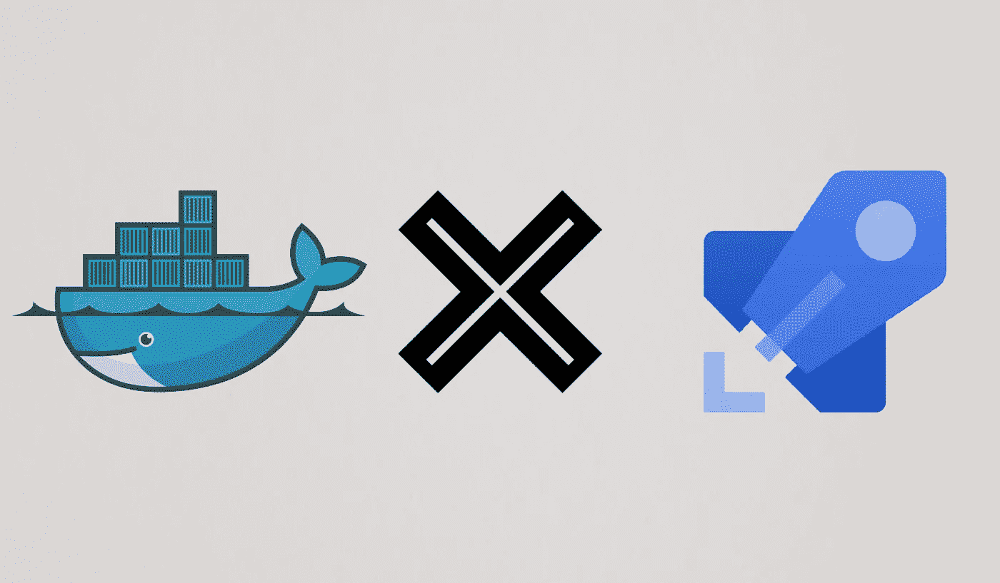

作者插图，背景由[安妮·斯普拉特](https://unsplash.com/@anniespratt?utm_source=unsplash&utm_medium=referral&utm_content=creditCopyText)在 [Unsplash](https://unsplash.com/?utm_source=unsplash&utm_medium=referral&utm_content=creditCopyText)

有效的端到端测试是对您的应用程序最重要的事情之一。但是进行端到端测试不像进行单元测试那么简单，因为它可能是单元测试和集成测试的融合。您将需要加速您的测试环境，更重要的是，您需要在 CI 管道中完成这一切。

让端到端测试在您的 CI 管道中运行，可以帮助您节省大量的测试时间，最重要的是，因为它是自动化的，所以您可以在每次想要检查构建时利用这一点。

# 什么是端到端测试？

端到端测试意味着模拟整个应用程序流，使整个应用程序可测试。在您的日常工作流程中使用端到端测试可以创建更强大的应用程序体验，保证每个发布版本的质量。

但是在本文中，我将向您展示如何使用 xUnit 和 Azure 管道对您的 API 进行端到端测试。您将学习如何使用 Docker 创建模拟数据库，以及如何使用 NSubstitute 和 AutoFixture 模拟接口。

# 使用 xUnit 编写单元测试

在开始之前，我需要通知您，在本节中，我将利用四个主要的包进行单元测试:

*   xUnit
*   不可替代
*   自动固定
*   FluentAssertions

单元测试是端到端测试系统的一部分。单元测试是用来测试应用程序组件微小部分的小代码。为了能够保证业务逻辑输出，您可以创建一个单元测试来模拟输入并相应地检查输出。以下代码可以帮助您:

单元测试模板

例如，您想要创建一个测试套件，用于检查当提供空参数时，方法是否返回用户角色列表。在您开始测试之前，您需要创建被测试的主题(SUT)以及相应的依赖项。

处理程序将是 SUT，存储库将使用 NSubstitute 进行模拟，最后，我们需要启动一个`IFixture`实例来帮助生成假数据。

安排单元测试

接下来，您需要通过创建将通过依赖注入使用的模拟对象来安排测试。在这种情况下，您可能想要创建假的结果，并将它们附加到模拟的依赖项。

执行单元测试

在你创建了假的结果之后，你需要执行这个方法。

断言单元测试

为了验证结果，您可以使用流畅的断言方法。fluent 断言不是微软默认测试套件提供的默认功能，它是一个您可以安装的自定义软件包。如果你有一个不存在错误的方法，试着先安装**fluent assessments**包。

# 使用 Docker 启动独立数据库

在开始使用 xUnit 编写端到端测试之前，您需要连接到一个测试数据库。创建测试数据库最简单的方法是使用 Docker。通过使用 Docker，您可以创建填充了测试数据的数据库映像。最重要的是，您可以将它与您的 CI 管道集成，以创建功能测试。

首先，您需要创建一个脚本来填充测试数据(在这里，我将把脚本命名为`init.sql`)。代码如下:

为集成测试注入新 AccessRoles 数据的查询

接下来，创建一个`Dockerfile`，它将构建您的定制映像，假设您将使用 SQL Server，下面的`Dockerfile`将使用 SQL Server，如下所示:

用于创建自定义 SQL Server 映像的 Dockerfile

# 使用 xUnit 编写集成测试

编写集成测试非常容易，但是在开始之前，我需要通知您，在本节中，我将使用两个主要的集成测试包:

*   `xUnit`
*   `Microsoft.AspNetCore.Mvc.Testing`

这需要微软提供的包才能工作。这个包提供了内存 API 测试所需的一切。假设您已经有了在后台运行的数据库，那么您需要做的就是创建测试。

例如，让我们做一个测试，检查`/users`端点是否会返回一个成功状态代码。

集成测试模板

每个测试类都会扩展`IClassFixture`接口。`IClassFixture`由`WebApplicationFactory`类提供。`WebApplicationFactory`将用于创建一个与生产非常相似的内存客户端。您只需要在`/users`端点上执行`GET`方法，然后就可以检索和断言状态代码。

因为响应将是。您可以通过使用以下命令来断言状态代码:

```
await client.GetAsync(url);
```

或者，您可以使用以下方式访问响应内容:

```
await response.Content.ReadAsStringAsync();
```

创建集成测试现在不是很难了，不是吗？上面的例子看起来很简单，但是如果你愿意的话，它可以扩展到很大的程度。

# 使用 Azure Pipeline 自动化 CI 构建内部的测试

出于安全目的，Azure Pipelines 要求您托管一个私有构建代理，以便在 CI 管道中运行 Linux Docker 映像。要运行 XUnit 测试，您需要在安装了 Visual Studio 的机器上运行它们。

要为您的生成代理安装 Visual Studio，您需要首先在 Windows 计算机上安装一个生成代理作为基准操作系统。

## 安装 visual studio 生成代理

为此，您需要下载特定于 Windows 的构建代理，但要获得最新的代理版本，您需要从代理池页面获取。

首先，转到您的项目设置:


作者图片

然后转到代理池部分，并单击您的默认代理池。

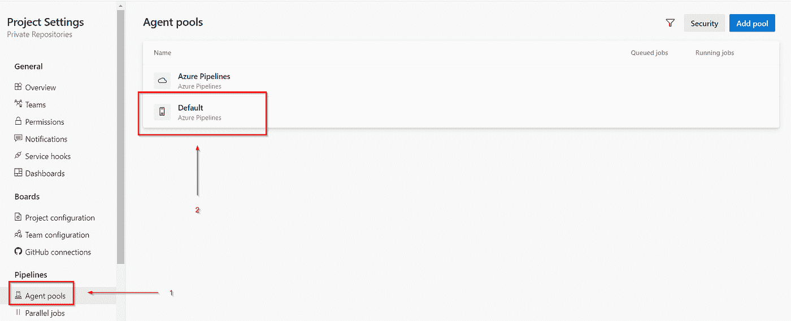

作者图片

点击**新增代理**。


作者图片

然后会出现一个弹出窗口，您必须:

1.  点击**窗口的**选项卡。
2.  复制代理下载 URL。

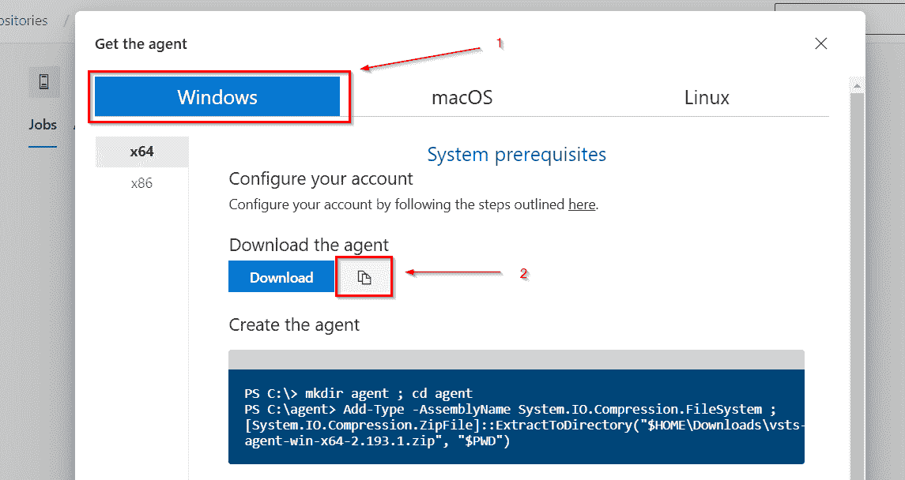

作者图片

**TL；*博士为了帮助你更快的度过这一切，你可以在这里*** ***下载*** [***代理(链接指向代理版本 2.193.1)，以后再更新。***](https://vstsagentpackage.azureedge.net/agent/2.193.1/vsts-agent-win-x64-2.193.1.zip)

然后，转到您的`C:`目录并键入 create a new directory agent:

```
mkdir agent
cd agent
```

然后，通过解包下载的软件包来创建代理:

```
Add-Type -AssemblyName System.IO.Compression.FileSystem ; [System.IO.Compression.ZipFile]::ExtractToDirectory(“$HOME\Downloads\vsts-agent-win-x64–2.193.1.zip”, “$PWD”)
```

接下来，通过运行配置脚本来配置代理:

```
.\config.cmd
```

最后，使用`run.cmd`脚本运行代理:

```
.\run.cmd
```

若要在 Windows 代理上启用 Visual Studio，您只需在您的计算机上下载并安装 Visual Studio。因为我的示例将使用 VS2017，所以您可以在这里检索 [VS2017 的下载 URL。](https://visualstudio.microsoft.com/vs/older-downloads/)

# 创建 CI 渠道

首先，创建新的配置项管道:

1.  进入您的管道目录。
2.  点击**创建管道**。

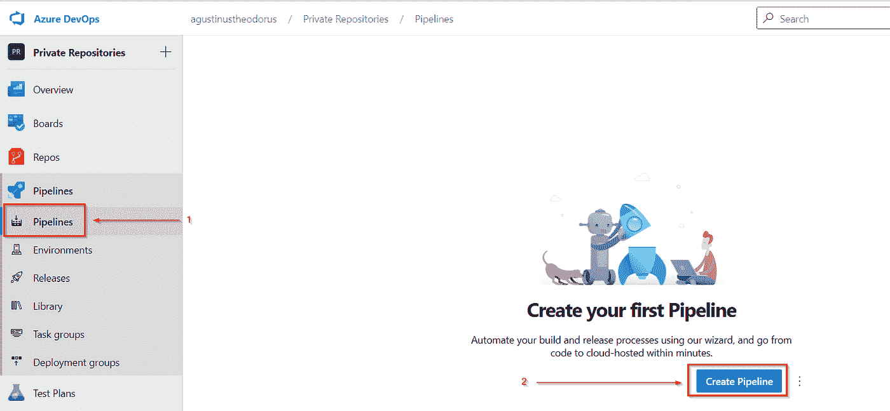

作者图片

尝试创建配置项模板时，选择使用经典编辑器。

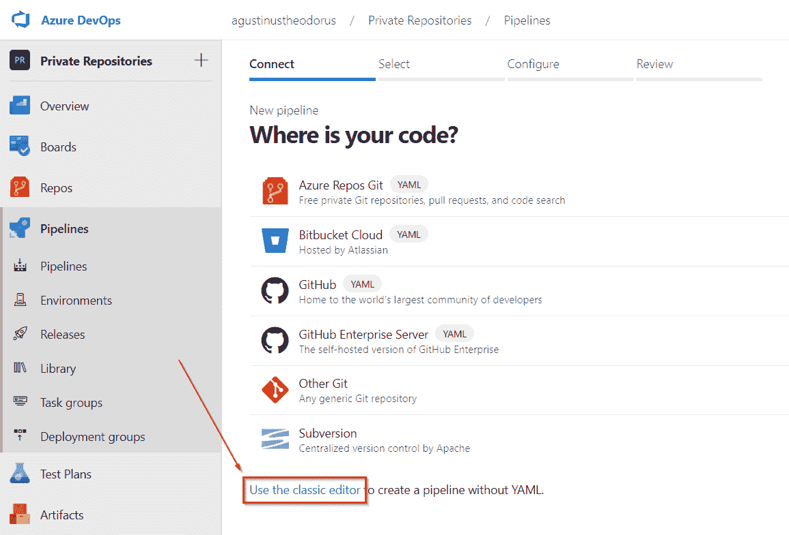

作者图片

接下来，确定您将参与哪个项目:

1.  选择**项目**。
2.  选择您指定的存储库。
3.  选择将触发 CI 构建的分支。
4.  全部完成后，再次检查并点击**继续**。

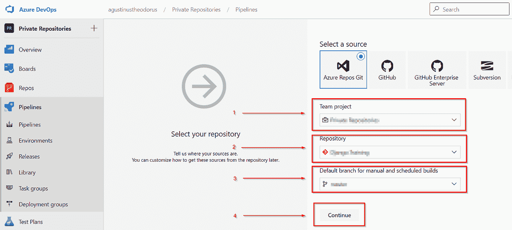

作者图片

要简化新模板的创建:

1.  搜索预定义的 ASP.NET 核心模板。
2.  应用模板。

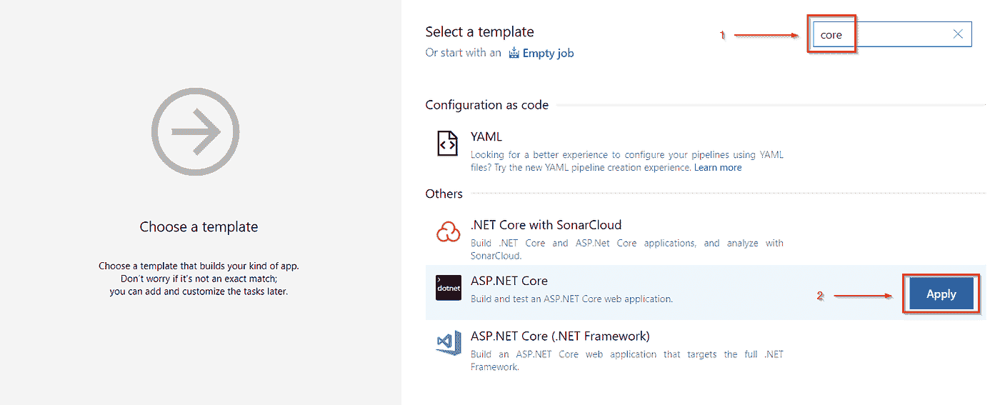

作者图片

接下来，使用您安装的 Visual Studio 代理:

1.  点击**管道**标签。
2.  单击代理池下拉列表。
3.  选择您的自托管代理池。

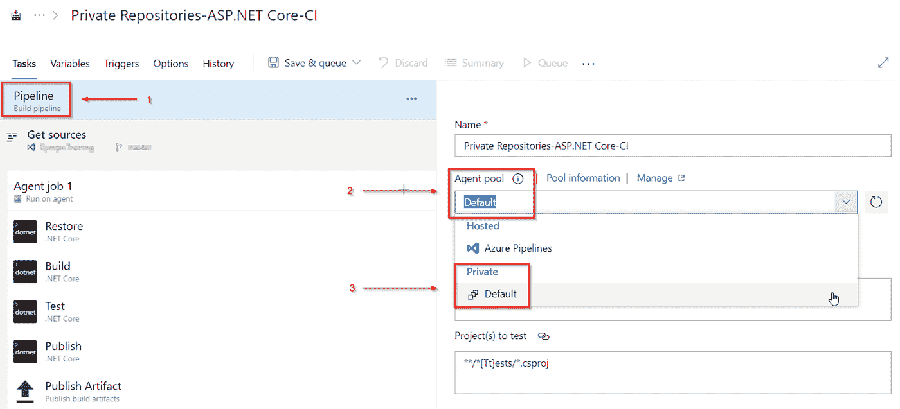

作者图片

在这个具体的 ASP.NET 核心解决方案中，我将其分成三个项目，主要是`Application`、`UnitTest`和`IntegrationTest`项目。这三个项目的修复和建造阶段也将分开。

目前，您将为应用程序项目设置恢复:

1.  单击恢复任务。
2.  通过单击链形符号取消项目链接。
3.  然后点击**解除链接**。

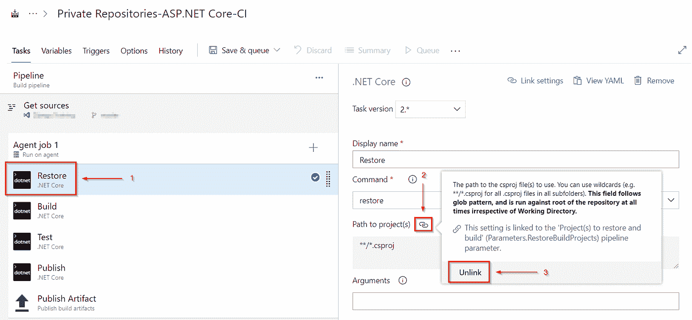

作者图片

然后将**到**项目的路径改为**到**您的应用程序项目文件。

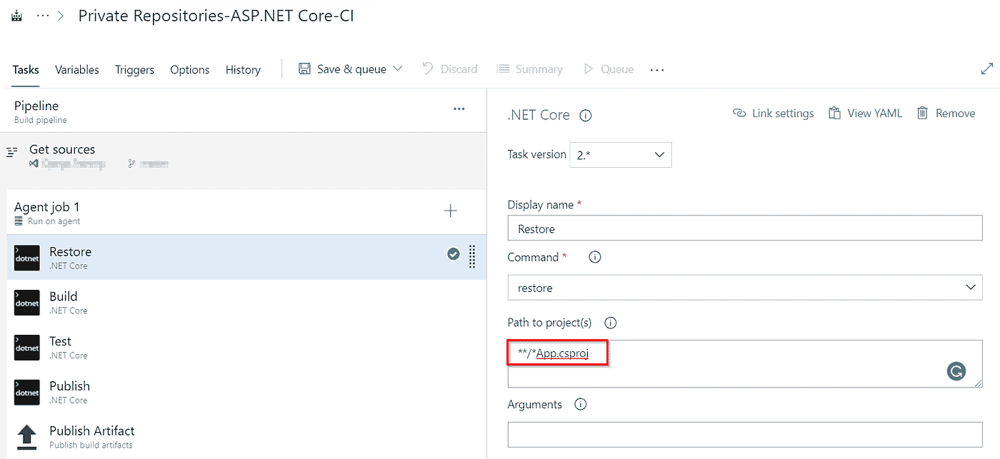

作者图片

接下来，对构建任务执行同样的操作:

1.  单击构建任务。
2.  将项目路径更改为应用程序项目文件。
3.  添加一个配置来防止构建恢复依赖项(因为它已经通过前面的任务完成了)。


作者图片

通过以下方式清理未使用的任务:

1.  单击要删除的任务。
2.  点击**移除**按钮。

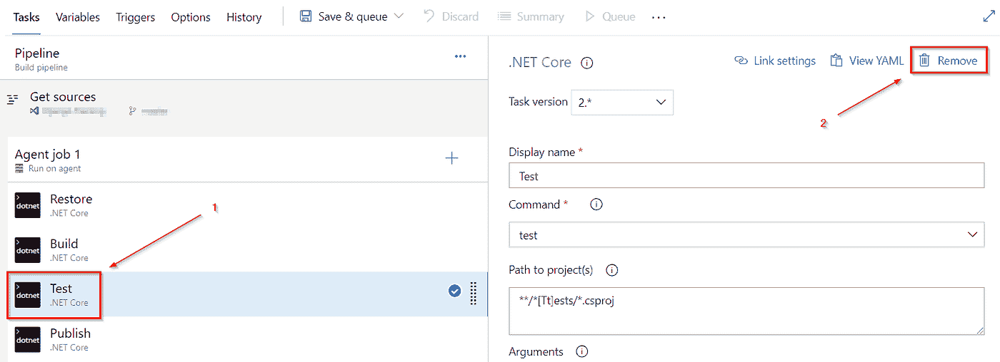

作者图片

因为我的例子需要一个`appsettings.json`:

1.  点击 **+** 按钮。
2.  因为你在 Windows 操作系统上选择搜索 **Powershell** 。
3.  点击**添加**。


作者图片

Powershell 任务将用于使用 Powershell 脚本在应用程序项目文件夹中插入 appsettings.json。

用于复制 appsettings.json 的 Powershell 脚本

要插入 Powershell 脚本:

1.  单击 Powershell 任务。
2.  将任务显示标题更改为**复制 appsettings.json** 。
3.  将脚本类型更改为内联。
4.  添加脚本。

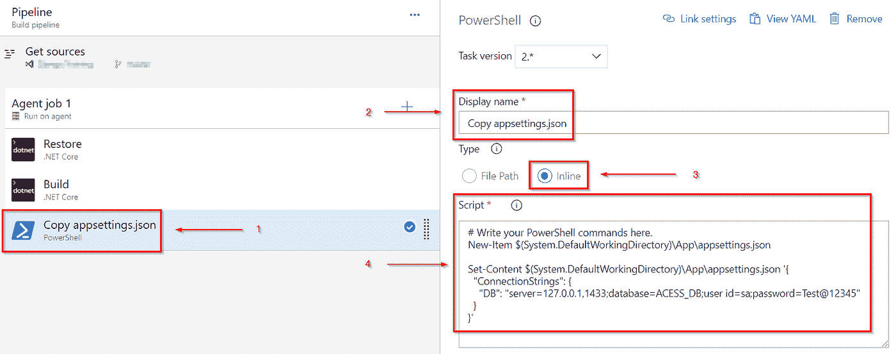

作者图片

接下来，您将需要恢复并构建单元测试项目，您可以通过克隆应用程序项目的前两个任务来轻松完成这一任务:

1.  左键单击恢复项目任务。
2.  点击**克隆任务**选项。


作者图片

克隆恢复任务后:

1.  单击克隆的任务。
2.  更改显示名称。
3.  更改项目文件位置。


作者图片

然后重复构建任务的步骤，之后:

1.  单击克隆的任务。
2.  更改显示名称。
3.  更改项目文件位置。
4.  检查配置以防止在构建期间进行恢复，如果不存在，请添加它。
5.  对集成测试项目再次这样做。

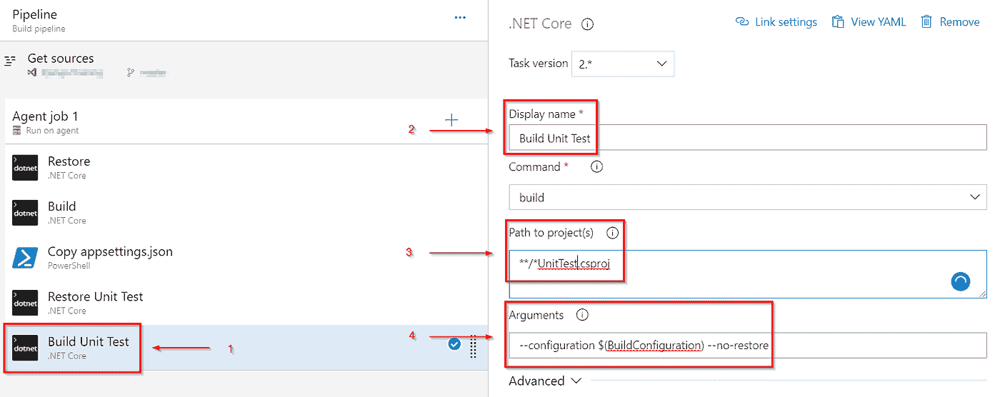

作者图片

要运行 Docker 数据库，需要添加一个 Docker 任务:

1.  点击 **+** 按钮。
2.  搜索 Docker 任务。
3.  点击**添加**。

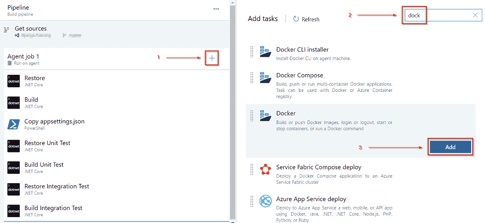

作者图片

在运行 Docker 容器之前，您需要首先构建它:

1.  点击新的 Docker 任务。
2.  将任务版本更改为 **0。*** 。
3.  将动作更改为**构建图像**。
4.  更新容器注册表类型以使用常规容器注册表。
5.  插入您的`Dockerfile`的位置。

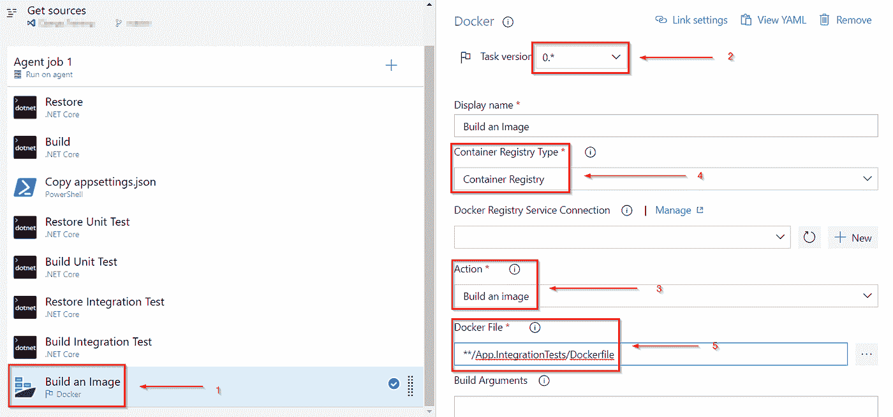

作者图片

添加另一个 Docker 任务来运行映像:

1.  点击新的 Docker 任务。
2.  将任务版本更改为 **0。*** 。
3.  将动作更改为**运行图像**。
4.  取消选中**限定图像名称**选项。

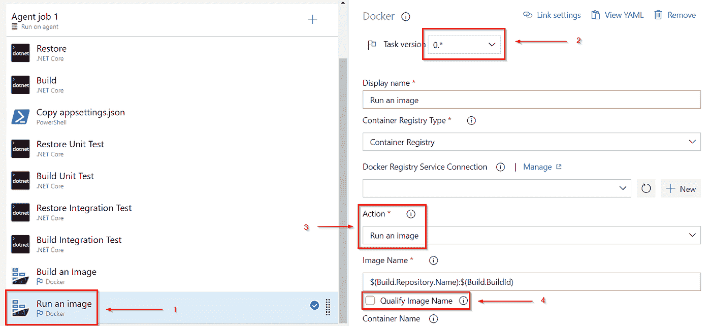

作者图片

添加 Visual Studio 测试任务:

1.  点击 **+** 按钮。
2.  搜索 Visual Studio 测试任务。
3.  点击**添加**。

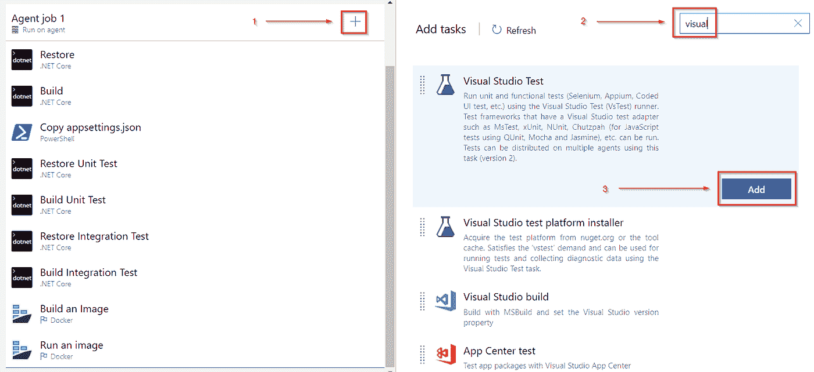

作者图片

设置 Visual Studio 测试任务:

1.  点击任务。
2.  更改显示名称。
3.  定义测试文件。

测试文件脚本如下:

```
**\bin\$(BuildConfiguration)\**\*test*.dll
!**\obj\**
!**\xunit.runner.visualstudio.testadapter.dll
!**\xunit.runner.visualstudio.dotnetcore.testadapter.dll
```


作者图片

添加另一个发布测试的任务:

1.  点击 **+** 按钮。
2.  搜索“发布测试结果”任务。
3.  点击**添加**。

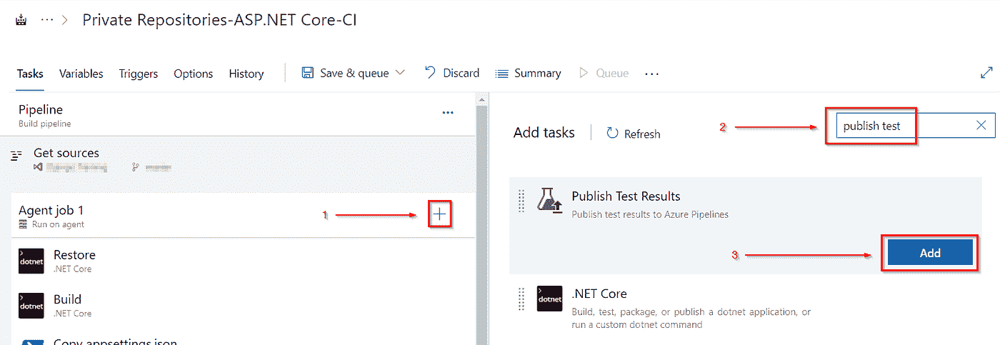

作者图片

最后，设置发布测试结果任务:

1.  点击任务。
2.  更改显示名称。
3.  将预期的测试格式更改为 XUnit。


作者图片

**TL；如果这个经典编辑器过时了，你可以在这里复制 YAML 版本的管道:**

使用 Azure 管道进行端到端测试的管道

# 结论

在本教程中，您学习了如何使用 XUnit 创建一个基本的端到端测试，以及如何使用 Azure Pipelines 在 CI 管道上运行它们。进行端到端测试的目的是确保您的应用程序运行良好，在这种情况下，是确保您的 API 完美无缺。

通过本教程，我希望您可以将端到端测试无缝集成到您的 CI 管道中，现在您将有一本开放的食谱供您测试。