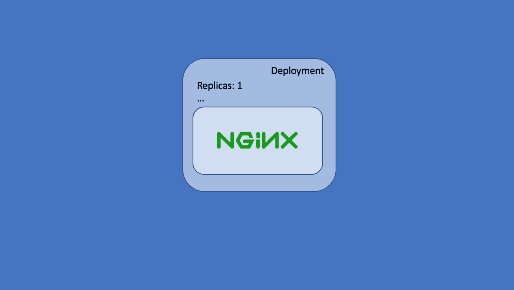
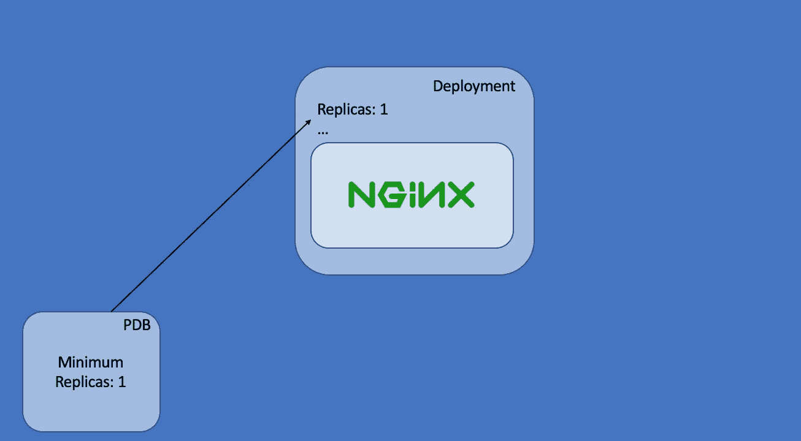
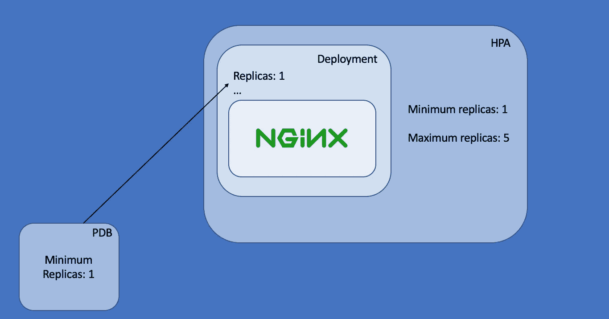
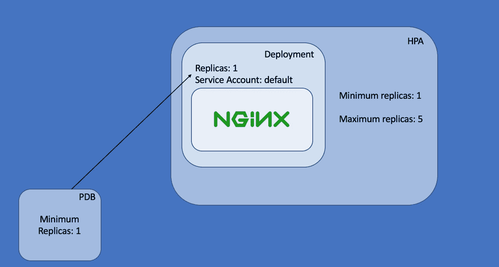

# Kubernetes 的基本资源

> 原文：<https://betterprogramming.pub/essential-kubernetes-resources-2ccb250bcf44>

## 你应该使用的资源


马丁·丹博尔特在[像素](https://www.pexels.com/)上拍摄的照片

Kubernetes 可能看起来令人生畏。凭借全新的集群和有限的经验，您将面临大量的建议、最佳实践、“必备品”、指南和文档。在你意识到之前，你已经快淹死了，你在抓任何东西。

别害怕。我在 Kubernetes 中构建应用程序已经有一段时间了，我已经收集了一个可以使用的资源列表。这些资源将确保您遵守安全性、弹性和可用性最佳实践。如果您将一些东西部署到您的集群，您至少应该*考虑*使用这些资源。我已经一步一步地做了，所以你可以看到我为什么添加了每一项资源，以及你将获得的价值。我也在上面撒了一些我自己的经验。我们开始吧！

# 部署

资源是你的基本构件。这是您应用程序的基础。它是如此的基础，人们可能想知道没有它他们如何部署一个应用程序。那么，在本地运行这个命令，检查创建了哪些资源:

```
kubectl run nginx --image=nginx --restart=Never
```

你会发现只有一个`Pod`存在。人们以前也这样做过，作为他们 CI/CD 的一部分。这看起来很傻，但作为第一遍，这似乎并不疯狂。尽可能以最简单的方式让事情运转起来。

## 为什么要部署？

通过部署，您可以声明您想要多少个 pod 实例，您可以定义部署策略，获得自我修复行为，等等。这为部署应用程序提供了一个可伸缩的平台。

## 什么时候不应该使用部署？

唯一不使用`Deployment`的时候是当你部署不需要一直运行的东西的时候，比如`Job`。在这种情况下，你的 pod 将由一个`Job`资源控制。我还没有见过你只需要一个单独的`Pod`资源的用例——我会怀疑任何说他们需要的人！

## 利用亲和力！

具体来说，`podAntiAffinity`。亲和力有很多种类型——你可以在这里阅读它们。我经常用的一个小宝石是`podAntiAffinity`。这告诉 Kubernetes，没有两个 pod 应该在同一个节点上。在一个节点故障的情况下，你不会一下子失去所有的吊舱。

你可以把它变成一个`should`而不是一个`must`。这意味着不能保证它在不同的节点上，但也意味着自动伸缩可能会更快，因为等待新节点启动的机会更少。

## 小心资源扩展

当你声明你的`Deployment`时，你可以定义一些要使用的资源。如果您没有定义任何资源，这意味着您的 pod 作为`BestEffort` [服务质量](https://kubernetes.io/docs/tasks/configure-pod-container/quality-service-pod/#qos-classes)运行。Kubernetes 不知道它需要多少电力，所以它只是把它放在任何地方。这是非常非常坏的消息。`BestEffort`豆荚可以杀死邻居的容器。

为了使您的集群尽可能可预测，我一直提倡`Guaranteed`服务质量。这意味着 Kubernetes 知道你的 pod 需要的资源的确切数量。当然，你的 pod 不会总是使用那个空间，但是它们也不会扩展到另一个 pod 需要的空间。



我们的分离舱现在正处于部署中

# Pod 中断预算(PDB)

因此，您已经得到了跨几个节点的部署，并且对此感到满意。有人开始执行节点维护怎么办？如果你的团队有能力，他们会使用`kubectl drain`命令。典型的命令如下所示:

```
kubectl drain <node name> --ignore-daemonsets --force --delete-local-data
```

这将吹走节点上当前运行的所有内容。问题？如果您在该节点上运行了一个 pod，那么您就丢失了一个应用程序实例。如果这是一个 HTTP API，您可能会影响响应时间和高可用性。

## 为什么是 PDB？

一个 [PDB](https://kubernetes.io/docs/tasks/run-application/configure-pdb/) 将确保在任何给定的时间，你的吊舱的最小数量在运行。它实际上会阻止一个`kubectl drain`，直到你的新吊舱已经展开。这不仅有助于实现零停机时间节点维护，而且有助于实现*零影响*节点维护。

典型的 PDB 看起来有点像下面的。在里面，我们声明你的新 nginx pod 可以处理一个 pod 的中断。如果有人对`kubectl drain`命令不严格，它会阻止它，直到你的新 pod 在其他地方恢复。

```
apiVersion: policy/v1beta1
kind: PodDisruptionBudget
metadata:
  name: nginx-pdb
spec:
  maxUnavailable: 1
  selector:
    matchLabels:
      app: nginx
```

## 在让你的 PDB 防弹之前想一想！

要求你绝对不能容忍任何打扰可能很有诱惑力。对于执行节点维护的工程师来说，这样做的结果将更加令人头痛。您不希望让保护您的应用程序安全的人感到头疼。将你的应用程序设计成容错的是现代软件工程的一个基本标准——你应该允许一点中断。



您的 PDB 正在监视您的部署

# 水平 Pod 自动缩放器(HPA)

所以，节点维护超级快。您的应用程序可以自我修复，并在部署中合理地分组。打包回家？绝对不会。让我们来看看这张我从互联网上偷来的网络流量图:


来源:[佩斯勒](https://blog.paessler.com/the-top-5-causes-of-sudden-network-spikes)

你将如何处理这些突然增加的交通流量？你将如何度过你的营销部门和他们的新噱头:"我们的产品是正常价格的 10%，只有下一个小时"…？！*伟大的*。

## 为什么是颐康保障户口？

一个 [HPA](https://kubernetes.io/docs/tasks/run-application/horizontal-pod-autoscale/) 将使您的应用能够在 CPU、内存或[您喜欢的任何自定义指标](https://kubernetes.io/docs/tasks/run-application/horizontal-pod-autoscale/#support-for-metrics-apis)上扩展。很像 AWS 中的自动缩放组，它会自动旋转新的 pod，直到预设的最大值。这将使您能够快速处理网络流量的峰值，而不会过载并最终破坏您的运行 pod。

## 但是要小心你的尺度

Goldratt 的约束理论告诉我们，我们的系统只能以其最大约束的速度运行。如果你的应用程序是由一个 99%运行的数据库支持的，那么更多的 pods 并不能解决任何问题。最有可能的是，它们会导致更多的停机。

## 确保你做了一些实验

毫无疑问，您会发现最初尝试自动缩放有点慢。它会在几秒钟内错过峰值。然后你会让它触发快乐，每一个请求都会旋转出新的豆荚。做好这件事需要一些努力。



当你的期望指标开始下降时，你的 HPA 会帮你解决

# 基于角色的访问(RBAC)和服务帐户(SA)

你的豆荚最近看起来很可爱！就在不久前，一个流程故障还会彻底毁掉您的应用程序。现在，它可以承受世界抛给它的大部分东西。下一步是什么？

好吧，让我们想象有人未经授权进入你的集装箱。你打开了一个端口，或者你喝醉了，把 SSH 密码凭证推到 twitter 上，这是一种毫无意义的企业暴力行为。不管怎样，就目前情况来看，黑客能做什么？

不管他们喜欢什么！如果他们可以运行一些命令，他们可以在您的环境中造成各种破坏。删除 pod、有状态集、读取秘密——世界是他们的牡蛎。

## 为什么选择 RBAC 公司？

一个`Service Account`会为你的应用提供一些内部权限。如果您的应用程序不需要对集群做任何事情，那么它就不需要任何权限，不是吗？

Kubernetes 已经帮你搞定了。假设您已经在集群中设置了 [RBAC](https://kubernetes.io/docs/reference/access-authn-authz/rbac/) ，部署您的应用程序将自动为您的 pod 提供该名称空间的`default` SA，该名称空间没有权限。这意味着您不需要手动声明它，除非您的 pod 需要用 Kubernetes API 做一些事情。

## 最小特权！

信息安全专家喜欢谈论最小特权原则。这很容易描述:只给某些东西它需要的权限。不多不少。常识吧？可惜没有。“以防万一”的心态在这里很常见。现在不需要编辑 pod*，但是将来可能会，对吗？*

*答案很简单。如果它不需要，就不要给。如果它需要，就引进它。现在就和自己做个交易。从现在开始，你应该只给那些需要它的人许可…不顾一切地。需要它，就像微软需要收购，苹果需要继续剥削第三世界工人的劳动力，以进一步提高他们已经很高的利润率。*

**

*您的 pod 现在有了一个不错的默认服务帐户。*

# *网络策略*

*您的 pod 具有有限的权限、自我修复、自动伸缩、高可用性，并且像老板一样运行。还剩下什么！？好吧，再一次，让我们假设你又喝了威士忌。您泄露了一些 SSH 凭证，在您意识到这一点之前，您的容器已经被破坏了。说真的，放下酱！*

*没关系，你的攻击者不能从你的吊舱做太多。但是……如果这个恶意用户可以进入另一个 pod 呢？我想知道另一个吊舱有什么`ServiceAccount`？！*

## *为什么是网络策略？*

*一个`NetworkPolicy`将阻止进出你的吊舱的交通。它的行为有点像防火墙规则，或者夜总会的保镖。如果你不在名单上，你就不能进来。除此之外，为了保持类比的一致性，保镖也不会让任何人离开俱乐部…这有点令人毛骨悚然。所以，更像是狱警。*

*一个`[NetworkPolicy](https://kubernetes.io/docs/concepts/services-networking/network-policies/)`将确保只有有意的流量是可能的。这给你或你的工程师造成了一点开销，但这是没有商量余地的。你不能让豆荚在任何他们喜欢的时候接触宇宙。如果他们能做到，攻击者也能做到。这可能不方便，但该死的是有用的！*

## *但是它会阻止所有流量…包括 DNS*

*如果你读了这篇文章，并决定全力以赴，再猜一次。如果您创建这样的策略，您将会遇到一些令人头痛的问题:*

```
*apiVersion: networking.k8s.io/v1
kind: NetworkPolicy
metadata:
  name: nginx-np
  namespace: default
spec:
  podSelector:
    matchLabels:
      app: nginx
  egress:
  - to:
    - podSelector:
        matchLabels:
          app: nginx
  policyTypes:
  - Egress*
```

*事实证明，您的 pod 需要能够与您的 DNS 服务器通信。DNS 是一个非常有用的特性，虽然我喜欢安全性，但我更喜欢 DNS。那么，如何只允许 DNS 呢？*

```
*apiVersion: networking.k8s.io/v1
kind: NetworkPolicy
metadata:
  name: nginx-np
  namespace: default
spec:
  podSelector:
    matchLabels:
      app: nginx
  egress:
  - to:
    - podSelector:
        matchLabels:
          app: nginx
 **- to:
    ports:
    - protocol: UDP
      port: 53**
  policyTypes:
  - Egress*
```

*这将允许您的 pod 运行，但它将无法与单个外部服务对话。如果一切顺利，那你就安全了。*

## *想想你的默认行为*

*如果你想确保没有人可以默认部署开放舱，你可以设置一个`NetworkPolicy`来清除任何掉队者。我们称之为我们的`default-deny`政策。*

```
*apiVersion: networking.k8s.io/v1
kind: NetworkPolicy
metadata:
  name: default-deny
  namespace: default
spec:
  podSelector: {}
  policyTypes:
  - Ingress*
```

*这只适用于`default`名称空间，所以要注意这一点。这将确保那些还没有建立他们的`NetworkPolicy`资源的人需要这样做，否则他们不会走远。通过勒索获得安全——强有力的东西！*

**

*有点苛刻的网络政策，但好吧，当然，无论你的船漂浮(嘿)*

*您已经有了一个 pod，它可以自我修复，在节点维护中以最小的中断存活下来，可以自动扩展，具有最小的权限，并且锁定了网络访问。想象一下在更古典的架构中实现这一点需要做多少工作。几个 yaml 文件，几个糟糕的笑话(抱歉)，然后你就走了。*