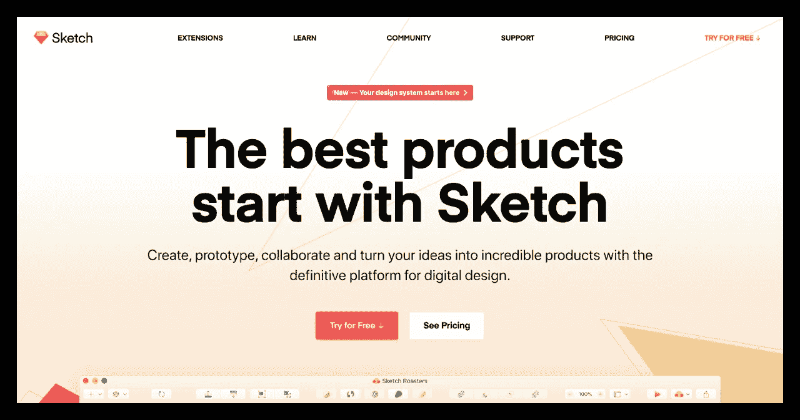
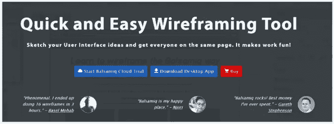
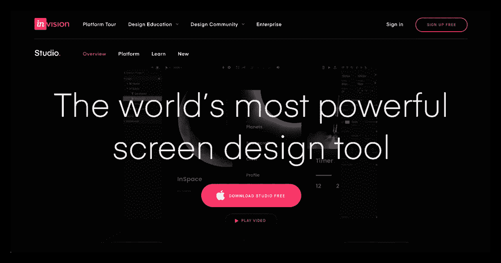
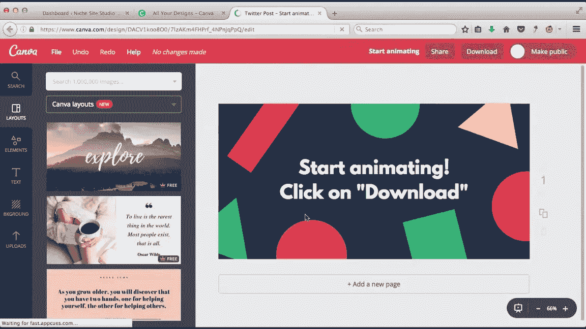
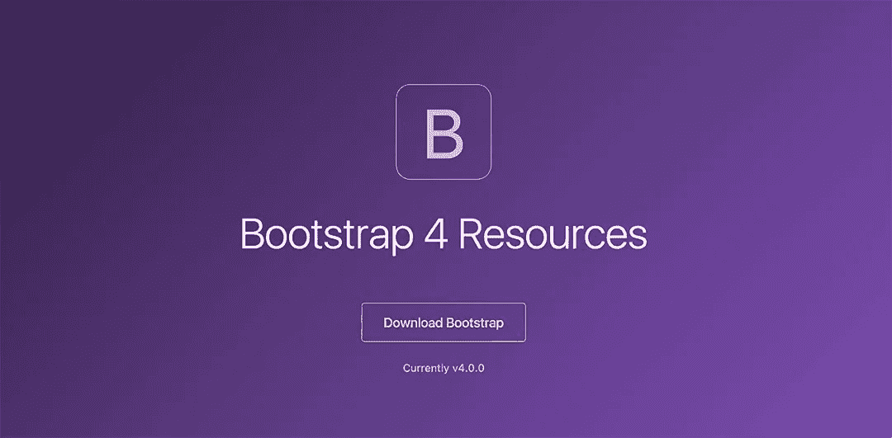
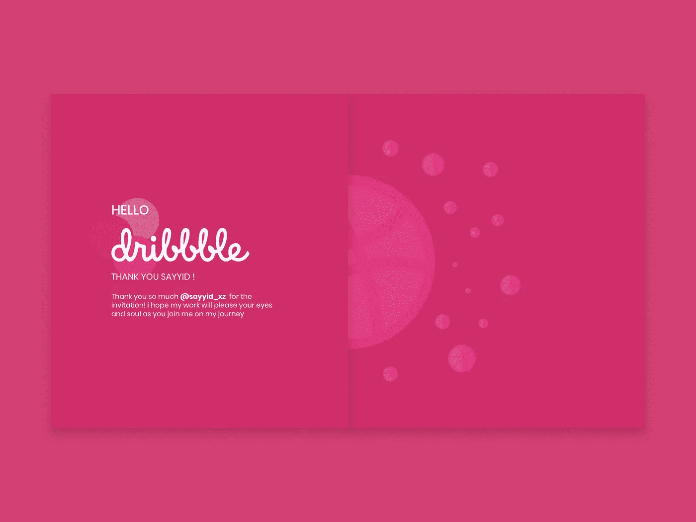
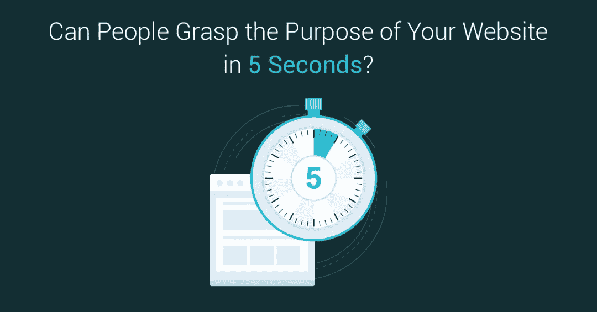

# 开发者必备的 11 种网页设计工具和资源

> 原文：<https://betterprogramming.pub/every-front-end-developers-web-designing-cheatsheet-9851771eb5b6>

## 你的前端备忘单上应该有什么

马库斯·斯皮斯克在 [Unsplash](https://unsplash.com/s/photos/tools?utm_source=unsplash&utm_medium=referral&utm_content=creditCopyText) 上的照片

> “专注和简单。简单可能比复杂更难:你必须努力让你的思维变得清晰，让它变得简单。但最终还是值得的，因为一旦你到了那里，你就可以移山。”
> 
> —史蒂夫·乔布斯

将要提到的大多数工具和资源也是我收集的由高级开发人员推荐的工具，其中一些我今天还在使用。

如果你没有读过我以前的文章，我是一名自学成才的网络和移动开发者——已经四年了。我获得了商业信息管理学位。我第一次接触技术是通过使用商业数据库、MySQL 和 Visual Basic，以及会计科目和投资。当时我没有想过继续攻读学位的技术方面，但三年后，我找到了一个对 web 开发非常感兴趣的朋友。他激励我接受挑战，参加了一个为期 4-6 个月的“现在学习，以后付钱”的训练营，因为那时我们讨厌自己的工作。

我感兴趣是因为它的潜力，我做的研究越多，我就越兴奋；然而，由于我不太可能的情况，我不能离开我的工作，回去学习。我在养活自己，所以我需要一份工作。我当时经济上还没准备好，但我无法停止思考这个问题。

快进一下:我追求学习 web 开发。我制定了一个计划，一个为期一年的计划，我承诺我会尽我所能努力工作。我决定至少再坚持一年——我已经浪费了好几年的时间，每天在小隔间里过着同样的日子，除了跟着老板和人力资源部走，别无选择。我厌倦了这个驱动我、给我加油、让我如此疯狂的系统，我知道我需要做一些新的工作，否则我将永远无法改变我的生活。

所以我朝九晚五地做着非技术性的工作，在上班前三个小时和下班后三个小时，在我办公室附近的咖啡馆里自学。我在周末和假期每天学习 10 个小时。我避开了很多聚会、朋友、聚会、旅行和开销。我向自己承诺一年——如果不管我怎么努力都没有效果，那就没关系。我尽力了，不后悔。

如果你有勇气做所有需要做的工作，没有任何借口，没有任何抱怨——如果你只是努力——最终运气会找上门来。就我而言，六个月后我得到了我的第一份网络开发工作。我在新的雇佣合同上用大写加粗字体签下职位名称 **WEB DEVELOPER** 的那天，也是我递交辞职信的那天。那是美好的一天。

所以回到学习前端开发:我无法充分发挥这一点。我在以前的文章中多次提到这一点——建立良好基础的重要性。作为一名前端开发人员或一名鼓舞人心的前端开发人员，了解这些基本工具非常重要，它们将帮助您更快更好地进行设计——并将增强您的创造力。

把想法变成现实需要几个阶段。就像构建一个应用程序一样，它会从一个想法开始。它会形成文字，首先存在于文字和草稿中。很快，它就会有自己的形式、形状和功能。然后，它将进入开发、品牌、营销等领域。

把它们收藏起来，下载下来，作为你的参考。相信我:即使你已经工作了四年或十年，最终你会忘记它们，并试图再次找到它们。现在，我给你列了一个清单。

# 1.素描

我还没有使用[草图](https://www.sketch.com/docs/)，因为即使我在编码前做了部分设计过程，我也没有完全融入所有的设计细节。但是我知道你们都听说过 Sketch，我知道你们都同意这是最流行的工具之一。

根据互联网上的反馈，Sketch 对于线框图和原型制作非常有用，我确信大多数专业的 UI/UX 设计师会强烈推荐使用这个工具，尤其是对于初学者。

# 2.Adobe XD

[Adobe XD](https://www.adobe.com/products/xd.html) 是基于矢量的，所以对于持续的设计和原型制作，它非常适合 UI 设计师和 UX 设计师，包括前端开发人员。我个人使用 Adobe XD 来设计和制作我的演示文稿。这是每个设计师的必备工具，也是所有有抱负的 UI/UX 设计师的必备工具。

它非常容易使用，最好的部分是我免费得到它。

# 3.巴尔萨米克

说到简单的线框制作，Balsamiq 是设计师们最喜欢的工具之一。它非常容易使用，直接，也可用于您的桌面和云应用程序。在团队中工作也很好——您可以轻松地创建并邀请其他团队成员进行协作。

从手机设计到网站设计，他们有大量的功能可供选择。你可以简单地将几个 UI 元素拖放到你的项目线框中。一旦您的原型项目完成，您可以轻松地将其打印出来或进行测试，然后再将其发送给前端开发人员。

他们提供一个月的免费试用。

# 4.视觉

我强烈推荐[InVision](https://www.invisionapp.com/)——我已经使用 InVision 好几年了。我只是觉得它很容易使用，它的黑色主题吸引了我。

我也在我的 UI/UX 创作项目和移动应用程序演示中使用 InVision。我只是觉得这个工具很舒服，我希望你也会喜欢它。

最棒的是它是免费的。

# 5.坎瓦

[Canva](https://www.canva.com/) 现在越来越受欢迎了。你可以免费创建你的数字设计，它非常容易使用，并且有成千上万的免费资源可供选择。它们还提供了各种各样的示例，您可以轻松地使用这些示例并替换文本。你也可以上传你的图片并保存在那里以备将来使用。

他们也有数百万张照片、标识和图标，你可以从每张 1 美元开始购买，或者你可以使用 40 多万张免费照片、插图和模板。我已经使用 Canva 两年多了，我无法相信他们免费提供如此多种多样的服务。它仍然让我吃惊。

# 6.引导程序

[Bootstrap](https://getbootstrap.com/) 很受所有前端开发者的欢迎。这有助于使你的网站反应灵敏和移动友好，因为他们正在推广移动优先的网页设计方法。

Bootstrap 是由 Twitter 背后的开发人员和工程师设计的。平台本身是可下载的——可以预编译，也可以通过源代码下载。

它功能齐全，非常容易使用。它的主要特性之一是能够轻松地设计一个包含全功能 HTML 和 CSS 元素的网格。您可以通过名称调用这些来使用组件。它们是每个前端开发人员的最爱——它节省了大量开发时间，并提供了非常容易理解的代码。

# 7.运球

这个网站是灵感的广泛来源。你必须把这个收藏起来——里面的一切都很神奇。

> “通过焦点小组设计产品真的很难。很多时候，人们不知道他们想要什么，直到你给他们看。”
> 
> —史蒂夫·乔布斯

# 8.移除. bg

这可能解决了一个非常简单的问题，但却是最关键的问题之一。因为有了 [Remove.bg](https://www.remove.bg/) ，你不再需要成为 Photoshop 的专家来移除你照片的背景。你可以上传任何图片到 Remove.bg，剩下的就交给它了。

这是免费的，不需要注册。它会完成所有需要的工作。

# 9.五秒钟测试

一旦您的项目准备就绪，请务必记住已被证实的调查结果，即大多数用户希望您的网站在大约两秒钟内加载，如果花费的时间超过这个神奇的数字，用户或访问者很可能会退出或关闭您的网站。

[五秒测试](https://fivesecondtest.com/)是解决这个问题的好办法——你所需要做的就是分享你的主页、图片、登陆页面和所有其他营销材料给他们，然后他们会检查你所有的网站资产，以确定是否有任何需要改进甚至删除的地方。

# 10.Adobe 颜色

这是[每个设计师和开发人员不可协商的工具](https://color.adobe.com/create)。当您想要探索或测试您的设计提案或项目所需的颜色组合时，强烈建议您这样做。

有成千上万种颜色组合可供选择，也有几个推荐你可以很容易地用于 Photoshop，Illustrator 等。

# 11.谷歌字体

这也是所有设计师和开发人员不可协商的工具之一，谷歌字体可能是这个领域最好的。

把这个加入书签，把它放在你的首要清单的最上面。这是必须的，最好的部分是它是免费的，而且很容易使用。