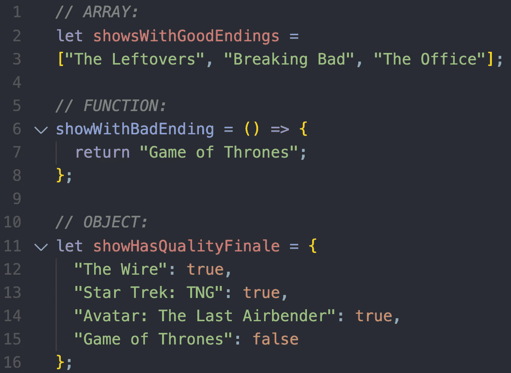

# JavaScript 中的一切都是(不是)对象

> 原文：<https://betterprogramming.pub/everything-in-javascript-is-an-object-except-for-when-it-isnt-305bc65a3410>

## …或者是吗？


图为:现金(照片由 [Erik Mclean](https://unsplash.com/@introspectivedsgn?utm_source=unsplash&utm_medium=referral&utm_content=creditCopyText) 在 [Unsplash](https://unsplash.com/s/photos/money?utm_source=unsplash&utm_medium=referral&utm_content=creditCopyText) 上拍摄)

如果你必须回答“JavaScript 中的一切都是对象”这句话对还是错，你的答案会是什么？你会问观众吗？给朋友打电话？好吧，就说你打电话给我吧(老实说，这是个冒险的举动；但我很荣幸)。现在我们是一个团队，让我们一起解决这个问题，赢得现金。

# 什么是 JavaScript 对象？

来自 [MDN](https://developer.mozilla.org/en-US/) :

> 在 JavaScript 中，对象是独立的实体，具有属性和类型。例如，与杯子相比。杯子是一种物体，具有属性。一个杯子有一种颜色、一种图案、重量、一种材料等等。同样，JavaScript 对象也可以有属性，这些属性定义了它们的特征。”

我们已经知道哪些 JavaScript 结构是对象？



我不痛苦...

数组、函数和对象(显然)都是 JavaScript 中的对象。

# 那还剩下什么？

剩下的是 JavaScript 原语。什么是原始人？这个定义就是数据，它不是一个对象，也没有方法。JS 原语包括:

*   `string`
*   `number`
*   `boolean`
*   `null`
*   `undefined`
*   `symbol`

# 问题解决了，对吧？

所以对象是对象，原语不是对象，我们百万美元问题的答案是*假*，对吗？不完全是。对象和原语之间的一个主要区别是，对象是可变的(意味着它们可以被改变)，而原语是不可变的(意味着它们不能被改变)。基元类型不可变的原因是基元没有附加方法，这意味着首先不可能改变字符串。一个原语有一个值，没有属性。

在 JavaScript 中，这些都是真的。你不能改变一个字符串，它是一个原语。您可以重新分配变量，但这不会影响原始值。虽然这个事实可能会让我们相信我们的案例已经结束，但是当我们运行像`string.length`或`string.split(',')`这样的代码时，问题就出现了。正如我们在上面发现的，如果一个字符串确实是一个原语，它就不应该访问像`.length`或`.slice`这样的属性和方法。那是一种仅限于物体的能力。那么这是否意味着原语*是*对象？

# 这是怎么回事？进入自动装箱

答案是一点 JavaScript 魔法，包括包装对象和自动装箱。这听起来很复杂，但是深呼吸，我保证很快就会明白。当一个像`string.length`这样的方法在一个像字符串这样的原始类型上被调用时，JavaScript 发起一个叫做*自动装箱*的动作。

自动装箱是 JavaScript 将原语包装在对象中的过程，但只是暂时的。详细由[李彦宏](http://blog.brew.com.hk/not-everything-in-javascript-is-an-object/)，

> `String`是一个全局函数，它在传递参数时创建一个原始字符串，但是您也可以将`String`函数用作构造函数。这将创建一个表示字符串`"dog"`的新对象(通常称为*包装对象*),具有以下属性:

```
**const pet = new String("dog")****{
  0: "d",
  1: "o",
  2: "g",
  length: 3 
}**
```

当在原始字符串上调用`.length`时，JavaScript 引擎将该字符串转换为一个`String`对象，如上所示。然后它是可变的，您可以访问许多附加到`String`的内置方法。一旦方法被解析，上面的包装对象就被丢弃。这同样适用于数字和布尔值(不适用于 null 和 undefined)。

下面是 JavaScript 在幕后所做工作的分类:

1.  创建一个`String`包装对象，相当于使用`new String()`。
2.  在`String`包装对象上调用继承的`.length`方法。
3.  一旦方法完成，包装器`String`对象被丢弃。
4.  返回变异后的原始字符串(如果使用了类似`substr( )`的方法)。

# JavaScript 中的一切都是对象吗？

不完全是。更准确地说，JavaScript 中的所有东西都可以表现得像一个对象*。*像`String`、`boolean`和`number`这样的原语可以表现得像对象一样，这要感谢 JavaScript 的对象包装和自动装箱特性。希望这有帮助！

继续回答*假* 领取您的现金！