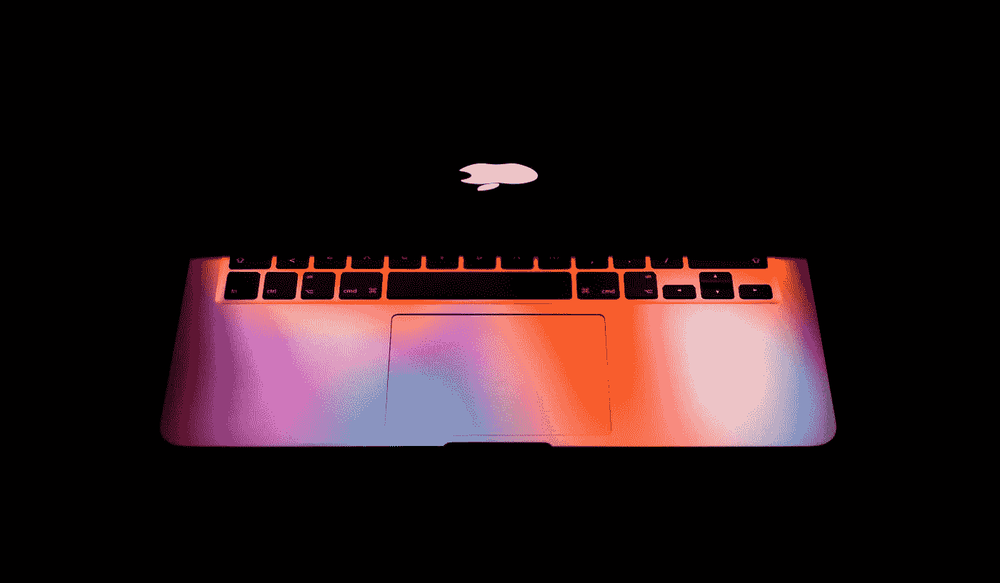

# 学习 R 数据科学所需的一切

> 原文：<https://betterprogramming.pub/everything-you-need-to-learn-r-for-data-science-ea0b169cc410>

## 一个免费资源的集合，用于学习数据科学、机器学习和统计学



纳吉·阿诺在 [Unsplash](https://unsplash.com?utm_source=medium&utm_medium=referral) 上的照片

自从个人电脑和互联网出现以来，现在每天有数百万用户使用社交网络应用程序、流媒体服务和电子商务服务，数据量明显激增。

存储在数据中心或云中的这些万亿字节的数据具有产生有用见解的巨大潜力，并且非常有价值。分析这些数据并从中提取有用信息的行为本身已经成为一个受欢迎的行业。

# 数据分析的艺术

数据分析的艺术和科学结合了多种学科和方法，变得越来越容易接近和大众化。

数据分析的整个过程非常简单。它的简短版本是:从多个来源获得数据→合并和探索并清理它→用最先进的方法分析它→用彩色的图形和图表展示你的发现。

它的中心目标是在一个图形媒体中呈现信息，可以很容易地将结果传达给观众。但是不同的语言有各种各样的细微差别，这使得一种语言比另一种语言更好，所以您应该选择哪种语言进行数据分析呢？

# 为什么要学 R

有几种编程语言可以让你进行数据分析，目前最流行的是 Python、 [R](https://www.r-project.org/about.html) 和 [Julia](https://julialang.org/) 。

我可能有偏见，但我发现 R 是目前最好的选择，特别是对于数据分析。首先，它是为统计目的而构建的，这使得它非常适合分析数据。其次, [Tidyverse](https://www.tidyverse.org) 库拥有您直观处理数据科学各个方面所需的所有包，

我特别喜欢 ggplot2 包，它提供了[惊人的图形功能](https://www.r-graph-gallery.com)和 dplyr 管道功能。最后，因为它有一个了不起的社区，为各种目的创造了许多很酷的软件包。

我可以列出很多其他的理由来说明为什么你应该学习 R，但是最终还是取决于你学习它的动机和你工作的公司。尽管如此，R 是一门学习起来很有用的语言，至少了解一下它的基础知识也无妨。

# 免费学习 R

我的目标是建立一个参考列表，供我在学习 R 的过程中参考，因此我一直在汇编一个资源列表，包括书籍、在线课程、YouTube 频道、播客等等。它们都是免费的(耶互联网)，如果我曾经使用过或目前正在使用它们，我会写一些小趣闻。

如果你想学习 Python 或者想要 Python 的资源汇编，我最近也为 [Python](https://towardsdatascience.com/everything-you-need-to-learn-python-from-zero-to-hero-3dc950cb1b4c) 写了一个。如果你想的话，可以去看看。

# 目录

```
1\. [Books](#11a7)
2\. [Online courses](#2c24)
3\. [YouTube](#a01a)
4\. [Coding challenges](#2cc1) 
5\. [Blogs](#eb8f)
6\. [Websites](#f1e2) 
7\. [Cheatsheets](#b3be)
**8\.** [**Podcasts**](#deb1)9\. [Communities](#bdda)
10.[IDEs and environment](#f367) 
11.[Twitter Hashtags / Accounts](#5768)
12.[Reddit](#fc66)
13.[GitHub](#afca)
```

# 1.书

这些书大部分都在 [Bookdown](https://bookdown.org/home/) 上，上面有用 R Markdown 写的免费开源书籍。最受欢迎的应该是数据科学的 R，如果您熟悉 R 和编程的基础知识，我建议您从 R 开始。

## 一切

*   [R 的大书](https://www.bigbookofr.com/index.html) —这本书有 100 多本 R 的书，向作者和编辑这本书的贡献者致敬。

## 新手

*   对 R 的充分介绍——由德里克·l·桑代雷格撰写。这本书指导完全的初学者使用 r。
*   [与 R 一起动手编程](https://rstudio-education.github.io/hopr/) —与 R 一起动手做一个有趣的项目
*   [R 提示](https://bookdown.org/lyzhang10/lzhang_r_tips_book/preface.html) —使用 R 的指南列表

## 先进的

*   [高级 R](https://adv-r.hadley.nz)——为想要加深对语言理解的 R 程序员设计
*   [高效的 R 编程](https://csgillespie.github.io/efficientR/) —本书中的效率→在给定的时间内增加你可以用 R 完成的工作量

## 数据科学

*   [R for Data Science](https://r4ds.had.co.nz/) — R4DS 是从 R 开始学习数据科学的最佳书籍，作者是 Tidyverse 的创始人 Hadley Wickham。
*   [数据科学简介](https://rafalab.github.io/dsbook/) —快速介绍什么是数据科学。
*   数据科学的 R 程序设计(R Programming for Data Science)—Roger Peng 为 Coursera 上的课程 R Programming 编写的书
*   [R](https://bookdown.org/rdpeng/exdata/)的探索性数据分析——也是 Roger Peng 的《Coursera 上的探索性数据分析》一书
*   [数据科学的艺术](https://bookdown.org/rdpeng/artofdatascience/)——一本让所有人了解什么是数据科学艺术的通用书籍

## 统计数字

*   [通过数据科学进行统计推断](https://bookdown.org/cteplovs/moderndive/) —学习统计推断以及如何使用 R 进行统计分析
*   [统计学习介绍](http://faculty.marshall.usc.edu/gareth-james/ISL/) —本书提供了统计学习方法的介绍，并给出了 R
*   [带 R 的应用统计学](https://daviddalpiaz.github.io/appliedstats/index.html#acknowledgements) —这本书水平相当高，仅供对统计学有足够理解的人阅读

## 机器学习

*   [机器学习](https://m-clark.github.io/introduction-to-machine-learning/) —机器学习介绍，带 R 代码
*   [用 R 动手机器学习](https://bradleyboehmke.github.io/HOML/) —题目说明了一切。

## 其他人

*   [使用 R 进行文本挖掘](https://www.tidytextmining.com) —这本书是使用 R 中的 [tidytext](https://cran.r-project.org/web/packages/tidytext/vignettes/tidytext.html) 包和其他整洁工具进行文本挖掘的介绍。
*   R 图形食谱，第二版——一本实用指南，提供了 150 多种食谱，帮助你快速生成高质量的图形
*   [掌握 Shiny](https://mastering-shiny.org/index.html) — [Shiny](https://shiny.rstudio.com/) 帮助你用 r 创建 web 应用，这本书帮助 app 作者对它有更深的理解。
*   [ggplot2:用于数据分析的优雅图形](https://ggplot2-book.org/index.html) — ggplot2 是一个创建图形的神奇库。这里有一本书来创造优雅的发型。
*   [用 R 掌握软件开发](https://bookdown.org/rdpeng/RProgDA/) —这本书是给那些想通过开发软件与 R 更进一步的人看的。

更多书籍，请查看 GitHub 上的这篇[精彩汇编。](https://github.com/iamericfletcher/awesome-r-learning-resources#books)

# 2.在线课程

我最近上了很多关于 R 的在线课程，其中一门是 JHU 的 DS specialization。它在许多方面都很好，也有它的缺点。你可以查看我的 [GitHub repo](https://github.com/benthecoder/JohnHopkinsDataScience) 中的分配代码。

带 R 的统计学是我计划学习的另一个专业，只是为了加强统计学的概念。

*   [约翰·霍普斯金大学的数据科学专业](https://www.coursera.org/specializations/jhu-data-science)—副标题为“开启你的数据科学生涯”,这是一个由十门课程组成的数据科学入门课程，由顶尖教授开发和教授。
*   [杜克大学统计学专业](https://www.coursera.org/specializations/statistics)—统计学硕士。旨在掌握数据分析的统计知识，包括推理、建模和贝叶斯方法。
*   [统计学习](https://www.edx.org/course/statistical-learning) —通俗读物[统计学习入门的课程版本，应用于 R](http://faculty.marshall.usc.edu/gareth-james/ISL/) 。如果你更喜欢通过阅读来学习，那么这门课程对你没有任何好处，你应该坚持看书。

# 3.油管（国外视频网站）

R 的 YouTube 频道不多，所以这些大多是 R 教程和项目的播放列表。

## 频道

*   [RStudio 频道](https://www.youtube.com/channel/UC3xfbCMLCw1Hh4dWop3XtHg/videos)—r studio 的 YouTube 频道
*   [大卫·罗宾逊](https://www.youtube.com/user/safe4democracy/featured)—[整洁星期二 R 放映的巨大播放列表](https://www.youtube.com/playlist?list=PL19ev-r1GBwkuyiwnxoHTRC8TTqP8OEi8) ( [列表](https://github.com/dgrtwo/data-screencasts/tree/master/screencast-annotations))
*   [TidyX](https://www.youtube.com/channel/UCP8l94xtoemCH_GxByvTuFQ)——一个解释[剧集](https://www.youtube.com/playlist?list=PLdb0LTjA9iQziLrE4ZpudgJyWDIwbmyQo)中整洁星期二代码提交的频道
*   [Julia Silge](https://www.youtube.com/c/JuliaSilge/featured)——使用 R 进行数据分析、分类、建模等。
*   [安德鲁·库奇](https://www.youtube.com/c/AndrewCouch/featured)——另一个很棒的频道，有一个[播放列表，可以播放“整洁星期二”项目](https://www.youtube.com/playlist?list=PLJfshcspBCYeJeO8YFT5e5HxuYOb5a_1W)

## 播放列表

*   [R 教程—学习 R 编程](https://www.youtube.com/watch?v=SWxoJqTqo08&list=PLjgj6kdf_snYBkIsWQYcYtUZiDpam7ygg)—[R 程序员 Twitter](https://medium.com/u/e18542fdcc02#what-you-can-get-out-of-twitter)。

    ## 标签#

    *   [#rstats](https://twitter.com/search?q=%23rstats&src=typed_query)
    *   [#TidyTuesday](https://twitter.com/search?q=%23TidyTuesday&src=typed_query&f=live) — [网站格式](https://nsgrantham.shinyapps.io/tidytuesdayrocks/)

    ## 帐户@

    *   [罗杰·婷·彭](https://twitter.com/rdpeng)
    *   [哈德利·韦翰](https://twitter.com/hadleywickham)
    *   [埃廷卡亚-伦德尔矿](https://twitter.com/minebocek)
    *   [托马斯·林·彼得森](https://twitter.com/thomasp85)
    *   [RStudio](https://twitter.com/rstudio)
    *   [RStudio 提示](https://twitter.com/rstudiotips)
    *   [一天一个 R 提示](https://twitter.com/RLangTip)
    *   [内森·姚](https://twitter.com/flowingdata)
    *   [rstatsweet](https://twitter.com/rstatstweet)

# 12.Reddit

Subreddits 是一个很好的资源来源，也是一个讨论事情的地方。这里有一些很棒的 r。

*   [r/r 语言](https://www.reddit.com/r/Rlanguage/)
*   [r/rstats](https://www.reddit.com/r/rstats/) —带 R 子编辑的统计计算
*   [r/RStudio](https://www.reddit.com/r/RStudio/)
*   [r/数据科学](https://www.reddit.com/r/datascience/)
*   [应收账款统计](https://www.reddit.com/r/AskStatistics/)
*   [r/统计](https://www.reddit.com/r/statistics/)

# 13.开源代码库

这些存储库挤满了令人难以置信的资源。别忘了开始他们的回购，以备将来参考。

*   awesome-R-learning-resources—有用的 R 学习资源，旨在帮助所有技能水平和背景的用户加深对 R 的理解
*   [DataScienceR](https://github.com/ujjwalkarn/DataScienceR) —数据科学、NLP 和机器学习的 R 教程精选列表
*   awesome-R—awesome R 包和工具的精选列表。受令人敬畏的机器学习的启发

# 摘要


由 [Roman Synkevych](https://unsplash.com/@synkevych?utm_source=medium&utm_medium=referral) 在 [Unsplash](https://unsplash.com?utm_source=medium&utm_medium=referral) 上拍摄的照片

r 是数据科学世界中的一种基本语言。学习曲线可能在开始时很难，但它有大量令人惊讶的软件包和一个伟大的在线社区，使学习变得有趣。

# 如何开始学习 R

如果你还不知道，学习一门新语言的最好方法不是完成几门在线课程，读几篇文章，然后称自己为 R 大师。这需要专注和承诺，至少每周，甚至每天练习写代码。

1.  参加知名的在线课程。我推荐 Coursera 上 JHU 的数据科学专业或者杜克大学的统计学专业。
2.  读 R 看数据科学。(值得。)
3.  一旦你适应了 R，想出你想做什么项目的主意。参加 Tidy Tuesday 是激励你写 R 代码和分析数据的好方法。
4.  根据你学习 R 的目的是什么(大部分是为了统计学而学的)，读一下《统计学学习入门》这本书。它将带你进入你今天看到的许多机器学习算法的旅程，并向你展示它们背后的统计概念。
5.  最后，如果可能的话，找一个伙伴和你一起学习 R，因为两个人总比一个人好。

感谢阅读，我希望你发现这篇文章足智多谋。