# 现场与工作室表演:使用 YouTube 评论探索 Opeth 的唱片目录

> 原文：<https://betterprogramming.pub/exploration-sentiment-analysis-and-classification-of-opeths-discography-de61961bfcbf>

## 人们更喜欢现场录音还是录音室录音？执行探索、情感分析和分类


克里斯·阿蒙和 T2【雨果·卡萨诺瓦在 [Unsplash](https://unsplash.com/s/photos/metal-music?utm_source=unsplash&utm_medium=referral&utm_content=creditCopyText) 的照片

我最喜欢的三件事是编程、机器学习和音乐。所以，这是我前几天想到的另一个使用这些东西的项目。我想回答的问题很简单:

"人们更喜欢艺术家的现场录音还是录音室录音？"

所以很自然地，我转向机器学习来尝试回答这个问题。在本文中，我将使用 NLP 和数据科学技术来尝试确定人们是否喜欢我最喜欢的乐队之一:Opeth 的所有歌曲的现场录音或录音室录音。

除此之外，我将提供可视化来显示各种指标，以显示在 Opeth 27 年的跟踪记录过程中情绪是如何变化的。就他们的发展而言，Opeth 是一支非常整洁的乐队，因为他们的声音自 1995 年发行的第一张专辑“兰花”和 2019 年发行的最新专辑“在 Cauda Venenum”以来发生了变化。他们在过去几张专辑中声音的变化在歌迷中引发了争论。

这个项目的另一个目标是通过 YouTube 数据生成一个可以区分现场表演和演播室表演的分类器。我想建立一个小应用程序，你可以提供一个 YouTube 视频的 URL，然后算法会告诉用户视频是对应于演播室还是现场表演。我用 Streamlit 做了一个应用程序，你可以在这里用[玩](https://victormurcia-liv-live-vs-studio-classifier-streamlit-app-6we98r.streamlitapp.com/)。

如果一个朋友给你发来一首他们想让你听的歌曲的 YouTube 链接，但你真的不喜欢歌曲的现场版本，那么拥有这种能力会很有帮助。除此之外，由于一些奇怪的原因，链接的 URL 预览不起作用，你真的不想冒险点击一个链接，然后让自己经历现场表演会给你带来的失望。

听着，我要完全坦白。我做这个项目是因为我觉得这样做很酷。如果你能想到一个更好的、更有商业价值的应用，请务必告诉我！

生成这个分类器的第一次尝试将在这里显示，我用一个评论数据库训练了一组 18 个不同的分类器(高斯 NB、多项式 NB、伯努利 NB、逻辑回归、SGD、感知器、Ridge、SVC、线性 SVC、NuSVC、决策树、MLP、KNeighbors、AdaBoost、Bagging、GradientBoosting 和 Random Forest ),我使用一些自定义编程例程以及它们的 API 从 YouTube 提取评论数据库。如果你只是想要结果，这个分类器的准确率目前是 82.2%。

这是一个正在进行的项目，但我想我会分享它，以防你们中的一些人愿意与我合作，并就你认为哪些方面值得探索展开对话。很快，我可能会将这篇文章分成与项目的每个部分相对应的多篇文章，以便更容易理解。

我还将使用我在本文中使用的一些方法来探索更多的乐队/艺术家，并继续扩大我的数据集。*让我知道你想让我探索哪个艺术家/乐队！*

然而，对于那些喜欢在一个地方拥有你需要的所有资源的人(像我一样)，我将把它作为一篇长篇文章发布。这个项目中使用的所有代码和资源都可以在 GitHub 资源库中找到，这个资源库位于[这里](https://github.com/victormurcia/Live-vs-Studio-Classifier-From-YouTube-Comments)。

这篇文章有点长，所以这里有一个可点击的目录，可以帮助你找到你最感兴趣的部分:

*   [第 1 部分:获取数据](#6ac8)
*   [第 2 部分:预处理 YouTube 评论](#d0a9)
*   [第 3 部分:YouTube 评论的探索性数据分析](#d669)
*   [第四部分:YouTube 评论的情感分析](#de55)
*   [第五部分:训练分类器](#2842)
*   [第 6 部分:部署模型](#5cc8)
*   [第 7 部分:结论](#fbd7)

说完了，我们开始吧！

# 步骤 1:获取数据

任何数据科学项目的第一步(在你建立了你试图回答的问题之后)是弄清楚你需要什么数据以及你将如何获得这些数据。在这种情况下，我决定使用 YouTube 评论这个信息宝库。在这些评论中，人们很容易表达他们对视频中呈现的东西的欣赏、冷漠、厌恶以及介于两者之间的一切。

对于 Opeth 的每一首歌，我都是手动找到评论最多的 YouTube 视频对应一个录音棚录音和一个现场录音。我最终得到了 191 个不同网址的列表，因为 Opeth 在 YouTube 上的一些最新专辑已经关闭了评论，这使得它们对我想要进行的分析有些无用。

(To Opeth:如果出于某种原因你偶然发现了这篇文章，请允许人们对你的视频进行评论，以便我的研究更容易些:)。这仍然代表了 90%以上的 Opeth 的椎间盘。

收集这个 URL 列表总共花了大约两个小时。制作一个从 Opeth 的 YouTube 频道下载所有与录音室/现场录音相对应的歌曲的例程会相对容易，但他们的一些视频已经关闭了评论。所以，我不得不求助于人工提取。

YouTube API 允许进行搜索查询，但是每个查询包含 100 个请求，每天最多 10，000 个请求。我做了手动提取网址，试图避免这一限制。*如果你有解决这个问题的建议，我很想听听，因为我想建立一个由不同流派的艺术家组成的大得多的数据库！*

我将这些 URL 与视频名称、歌曲名称、专辑、发行年份、曲目编号以及 URL 对应的是现场演出还是录音室演出放在一个电子表格中。我将电子表格保存为. csv 文件，然后将它加载到熊猫数据框架中。


包含 YouTube 视频的 Excel 电子表格的前 40 个条目的屏幕截图，将为这些视频下载评论和元数据。该电子表格将用于制作熊猫数据帧，该数据帧随后将与接下来提取的评论和视频元数据合并。图片作者。

现在我已经加载了数据帧，我将开始构建获取评论和其他视频信息的例程。我首先使用我的`api_key`初始化 YouTube API:

接下来，我需要从 URL 获取视频 ID，我可以通过以下函数轻松完成:

然后，我将提取以下内容:

*   评论
*   评论作者
*   评论 ID
*   评论中的喜欢
*   视图数量
*   喜欢
*   视频的收藏和评论

所有这些将在查询时使用下面的函数收集:

最后，我将使用下面的函数将查询结果保存到一个. csv 文件中:

现在我可以把这三个例程放到一个包装函数中。代码如下:

我可以使用我的熊猫数据帧中的 URL 循环运行这个函数:

运行上面的例程将生成一个. csv 文件，其中包含我收集的每个 URL 的信息。提取注释并生成。所有 191 个视频的 csv 文件需要大约两分钟，因此该例程以每个视频大约一秒的速度处理一个视频。当然，这里有差异，因为评论越多的视频处理时间越长，但总的来说…还不错！

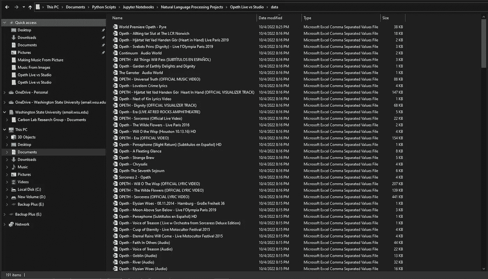

。从例程生成的 csv 文件。作者图片

最后，我可以把这些都拿走。csv 文件，并将它们与我之前创建的初始数据帧合并成一个数据帧。数据帧产生这样的结果:


包含所有从 Opeth YouTube 视频下载的评论的 Dataframe。作者图片

这个数据帧包含了所有处理过的 URL 的结果，总共有 35，572 条评论可供我用于这个项目，这是一个相当不错的开始！我可以尝试使用我的相同程序通过额外的 YouTube 视频以及通过其他流媒体/讨论网站(如 Reddit 或 Twitter)收集更多数据，但我会将这些纳入未来的项目中。

让我们开始看看我在做什么吧！

# 步骤 2:为分析准备数据(预处理)

现在我已经下载了数据集，可以开始为 NLP 做准备了。在进行任何文本分析项目时，我通常遵循的一般步骤顺序是标记化、标注、词条化和去噪。

## 处理多种语言和非字母数字的东西

YouTube 上的评论是世界各地的人用多种语言发表的。因此，我想尽我所能来处理这些语言。首先，我首先想确定评论是用哪种语言写的。

这可以通过' [langdetect](https://pypi.org/project/langdetect/) '和' [iso639](https://pypi.org/project/iso-639/) '包的组合轻松完成。`langdetect`包可以通过生成语言概率列表并选择具有最高值的语言来快速确定字符串中存在的语言。只要你有一根足够长的绳子，它就能很好地工作。否则，结果可能是错误的。

我尝试在我的项目中使用 Google translate API，但是我遇到了各种各样的问题和 bug，据我所知这些问题和 bug 还没有得到解决。不管怎样，我继续写了下面的函数，返回语言 ISO-639 代码:

然后，我还编写了以下函数，使用以下函数将 ISO-639 代码转换为完整语言:

接下来，我可以将这些函数与 pandas 的`.apply`方法结合使用，为我的数据帧中的每个注释生成一个 iso639 列和一个 language 列:

除了试图确定评论是用哪种语言写的之外，我认为用同一种语言写所有的评论有助于简化事情。因此，我开始尝试这样做。我尝试了一些不同的包，比如`TextBlob`和`googletrans`。然而，它们一直存在一些问题，使我无法充分利用它们。

我确实找到了[深度翻译](https://pypi.org/project/deep-translator/)包，它能让我翻译评论，还能自动检测语言。完成注释翻译的例程如下所示(注意:处理我的数据集中所有 35，572 条注释花费了大约 15 分钟):

我想提一下，深度翻译 API 也允许语言检测，效果相当好。然而，他们将免费用户限制在每天 1000 个请求，不幸的是，这对我的项目来说太低了。不管怎样，现在我有了一个不错的翻译评论专栏，可以进一步处理！

## 将数据符号化

标记化是将文本分解成更小的单元(称为标记)的过程，这些单元可以更容易地赋予它们意义。您想要考虑的令牌有多小取决于您以及您的特定数据和应用程序。

对于这个项目的第一次迭代，我决定使用单词标记化。似乎有理由期待某些关键词在与现场录音相对应的视频评论中更为普遍。

这个项目的未来迭代可能会实现 n 元语法或句子标记化的使用。

为了标记注释，我做了以下工作:

1.  确保注释列被视为字符串
2.  将缩写拆分成单独的单词(例如，不能拆分成不能),因为分词器会将不能这样的单词拆分成 can 和 t。

如果你对涉足或从事任何种类的 NLP 工作感兴趣，我推荐你去看看`[contractions](https://pypi.org/project/contractions/)` [库](https://pypi.org/project/contractions/)。它非常有用，可以节省你很多时间！有了这些之后，我开始使用 NLTK 包中的`word_tokenize`标记注释。


YouTube 评论的符号化过程示例。作者图片

完成此任务的代码如下所示:

## 标记标记化的注释

既然我已经标记了注释，我可以开始标记它们了。标记过程实质上是将标记中的每个元素与词性(即动词、名词、形容词等)配对。)这样我们就可以开始给课文中的每个单词指定含义。换句话说，标记过程允许对语料库中的单词进行分类。

通过 NLTK 中的`pos_tag` 函数，标记单词非常容易。标记的结果如下所示:


标记化 YouTube 评论的标记流程示例。作者图片

通过下面的代码可以很容易地完成标记:

## 符号化评论的词汇化

整洁！我们正在取得进展。现在，我将开始通过词汇化来规范化文本。词汇化是单词被追溯到其规范形式的过程。例如，单词“ran”和“running”来源于单词“run”在这个例子中，`run`被称为词位，因此词位化过程会将`ran`和`running`的任何实例转换为`run`。

该过程的结果如下所示:


标记化 YouTube 评论的词汇化过程示例。作者图片

完成词汇化的代码如下所示:

## 去除词条注释中的噪声

最后一个预处理步骤是对文本数据进行去噪。通过去噪，我的意思是从我们的数据中删除没有意义的单词和/或元素。一些可能被认为是干扰的文本元素是标点符号和停用词(即，像“the”或“of”这样的词)。什么被认为是停用词或干扰取决于您正在处理的数据和您试图提取的信息。

由于 YouTube 上的评论有多种语言，我决定使用 NLTK 内置的停用词来使用一组多语言停用词。NLTK 有 30 种语言的停用词。使用下面的简单代码可以很容易地生成这个多语种停用词列表:

我确实翻译了我的评论，所以它们应该已经是英文了。因此，我应该真的只需要对应于英语的停用词。不过，我稍后会为未翻译的评论运行多语言停用词例程，只是为了好玩。

我的多语言停用词表包含 10，436 个单词。纯英语的停用词表由 179 个单词组成。除了从我的数据中删除这些停用词，我还从评论中删除了数字、各种标点符号和非字母数字字符。

去噪过程的结果如下所示:


YouTube 评论的去噪过程示例。作者图片

完成去噪的代码如下所示:

多语言例程完全相同，只是您要用我之前提供的代码定义`stop_words`条目。

太棒了。现在我们准备开始探索我们的数据！

# 步骤 3:探索数据(EDA)

好吧，让我们来看看评论是怎么说的！在这一节中，我将提供一些可视化的展示，比如数据集中评论中出现最频繁的词，以及各种视频指标的显示。这些指标包括不同级别(如专辑、歌曲)的浏览量、点赞数、评论数和每个评论的字数。

## 字频率

我先从一个简单的词频图开始，分别是录音棚和现场录音的前 100 个词。我还应该注意到，我发现去噪评论的频率分析确定在我的数据集的评论中存在 21，932 个不同的单词。


Opeth YouTube 现场和录音室录制视频中的前 100 个单词。作者图片

酷！因此，有几件事可以立即引起注意，那就是在录音室和现场录音中，`opeth`和`song`分别是出现频率最高和第二高的词。这表明这些词可能对我使用评论来区分现场版和录音室版的目标没有用。

因此，如果分类器表现不好，我会考虑将它们从去噪的评论中移除。我还注意到“live”这个词是现场录音中出现频率第四高的词。

“Live”出现在录音室录音的前 100 个单词中，但它位于第 39 位。单词`album`是录音室录音中出现频率第三高的单词。它也出现在现场录音中，但它发生在第 13 位。`performance`这个词在现场录音中出现在第 16 位，但在录音室录音中根本没有出现在前 100 个词中。因此，我认为这个词是我模型中的一个关键区别/属性。

如果你感兴趣的话，我会列出下面 100 个最热门单词的放大版本:

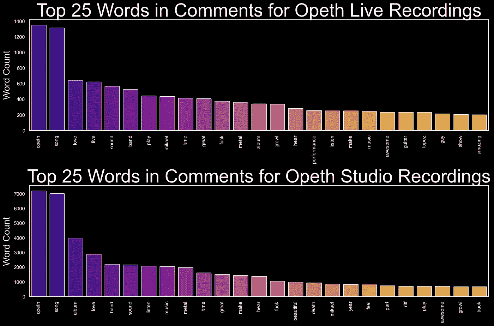

Opeth YouTube 现场和录音室录制视频中的前 25 个单词。作者图片


Opeth YouTube 现场和录音室录制视频中的前 25-50 个单词。作者图片

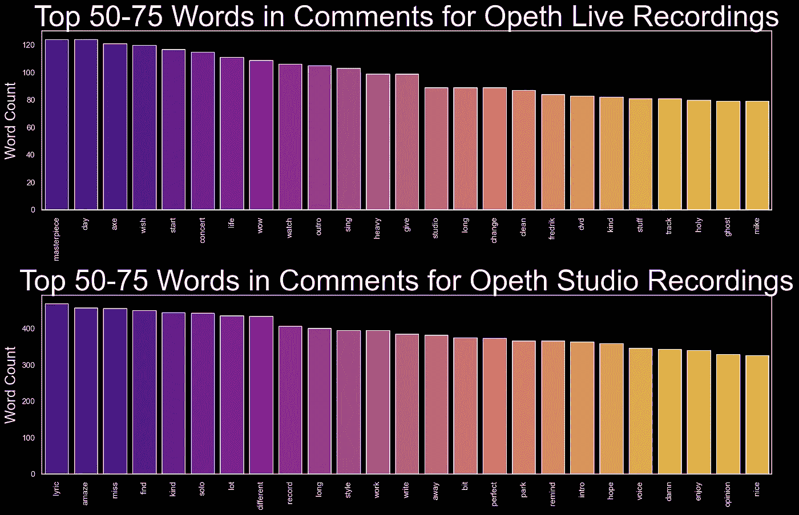

Opeth YouTube 现场和录音室录制视频中的前 50-75 个单词。作者图片


Opeth YouTube 现场和录音室录制视频中的前 75-100 个单词。作者图片

## 基于专辑和发行年份的视频指标

接下来，我想了解每张专辑和每首歌曲在专辑发行年份的表现。我将使用三个不同的指标来衡量我从 YouTube API 中提取的视频性能，还有一个是我自己制作的。这些指标是视频中的浏览量、点赞数、评论数和每条评论的字数。为了获得每个评论的字数，我使用了下面一行代码:

我将首先显示从每个相册中获得的每个指标的合计值。

我想提醒你的是，这个项目的视频是根据评论的数量来选择的，而不是根据它们的浏览量。Opeth 的官方 YouTube 帐户有一些关闭了评论的视频，我的主要兴趣是试图根据 YouTube 评论来确定视频是否对应于现场或演播室表演。

一个潜在的解决方案是将这些视频的浏览量和点赞数添加到总计数中。你怎么想呢?


Opeth 所有专辑的总浏览量、点赞数、评论数和每条评论的字数。相册按最新到最旧的顺序显示。专辑发行年份绘制在右边的 y 轴上。图片作者。

酷！从这四张图中可以看出很多东西。从这张图表中，我们可以看到专辑“女巫”(2016)和“幽灵幻想”(2005)中的视频是浏览量和点赞数最多的两个专辑。

我想指出的是，我们还可以看到“遗产”专辑中的视频比其他任何专辑都有更多的总评论。除此之外，“遗产”也是评论中出现次数最多的词。这很有意思，因为《遗产》是 Opeth 的声音开始向一个全新的方向转变的专辑。

在《遗产》之前，欧佩斯的大多数专辑都以“沉重”为特征。《遗产》标志着欧佩斯的音乐可以开始被归类为更“进步摇滚”而不是“进步金属”

他们声音的这种巨大转变在歌迷中引发了强烈的两极分化。一个有趣的问题是:*“遗产前/后视频评论中表达的观点是否有重大转变？”*

换句话说，人们在遗产发布后的评论中似乎表达了更多/更少的积极/消极情绪？

如果你是 Opeth 的粉丝，也许可以通过回答下面的投票来帮助我的研究:

最喜欢的 Opeth 专辑。作者进行的投票。

接下来，下面的图表显示了根据我之前讨论的指标排名的前 30 首歌曲:

*   根据总浏览量，《女巫》，《向你告别》和《毁灭之鬼》是排名前三的歌曲。
*   根据总喜欢度，《毁灭之鬼》、《女巫》和《向你告别》依次是最受欢迎的三首歌曲。
*   根据评论总数，“女巫”，“毁灭之鬼”和“恶魔果园”是排名前三的歌曲。

总的来说,《女巫》和《毁灭之鬼》似乎是最受欢迎的欧佩斯歌曲。

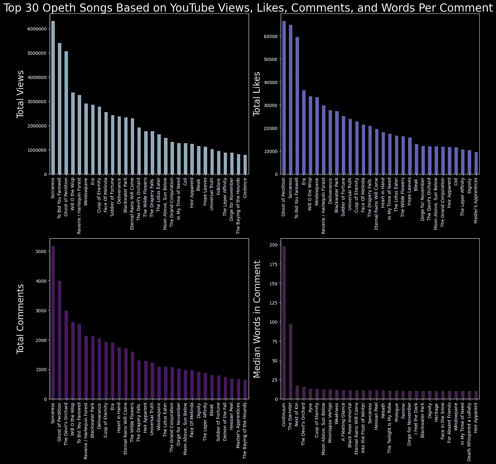

基于总浏览量、总点赞数、总评论数和评论中词数的前 30 首最佳运营歌曲。图片作者。

每个评论的平均字数看起来确实有点奇怪。

“Continuum”无论如何都不是一首糟糕的歌，但我对每条评论近 200 字的评论长度中值表示怀疑。这是怎么回事？我查看了我的数据集并过滤了数据帧，这样只有包含歌曲名“Continuum”的结果才会被包括在内。

我发现那个视频只有一条评论！此外，评论的内容只是这首歌的歌词。我需要一种更好的方法来表示这一指标，所以我查看了视频中评论数量的分布，如下所示:


Opeth YouTube 视频中评论数量的概率分布。白色痕迹是 KDE。图片作者。

从这个图中，我可以看到评论数的第一个“集群”(对应于其中评论量最低的视频)发生在 100 个评论处。因此，我重新处理了“评论字数”指标的中位数，这样只有包含至少 100 条评论的视频中的评论才会被包括在内。其结果如下所示:

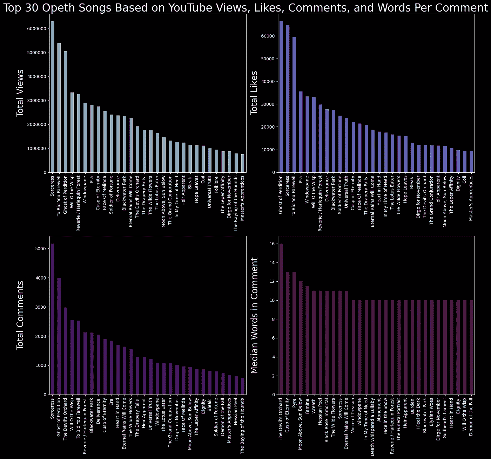

基于总浏览量、总点赞数、总评论数和评论中词数的前 30 首最佳运营歌曲。删除评论少于 100 条的视频后确定的评论中的单词。图片作者。

哦，这太有趣了！每条评论中词数最高的五首歌曲来自最近的三张 Opeth 专辑。正如我前面提到的，“遗产”是这张专辑标志着 Opeth 的声音的一个重大转变，它在歌迷中引发了热烈的讨论和分歧。

我个人非常喜欢《遗产》。我想知道评论中字数的增加是否与积极/消极情绪有关？我很快就会知道了！

在继续下一件事之前，我将提供一些我注意到的关于这个数据集的有趣事实:

*   评论以 46 种不同的语言发表。英语是最常见的语言，其次是西班牙语和德语。

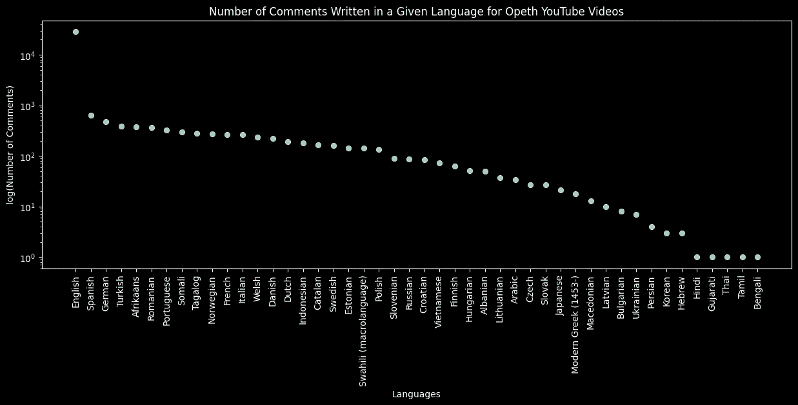

Opeth YouTube 视频中评论与语言的对数。图片作者。

*   最长的评论有 1328 个单词。大多数评论只有九个字。


Opeth YouTube 视频中每个评论的字数分布。图片作者。

*   最多产的评论者在所有视频中发表了 81 条独特的评论
*   观看次数最少的视频是歌曲“Continuum ”,有 355 次观看
*   点赞数最低的视频是《连续体》和《人间乐事花园》，各有六个点赞。


Opeth YouTube 视频中的评论数、浏览量和每条评论的字数散点图。图片作者。


在 Opeth YouTube 视频中，浏览量和点赞数是评论数的函数。图片作者。

*   “悲伤”这个词在这些评论中出现了 100 次(这是粉丝群中的一个迷因/笑话)。这是所有评论中第 367 个出现频率最高的词。我很惊讶它没有更经常出现！

## 现场评论与工作室评论的分布

我想检查的下一件事是我的数据集有多少评论对应于现场录音或录音室录音。下图显示我的数据集高度不平衡！78%的评论是在录音室录制的，而 22%是在现场录制的。

换句话说，我将处理一个不平衡的分类问题，这在现实世界的数据中很常见。


该饼图显示了对现场录制和录音室录制的 Opeth 歌曲的 YouTube 视频的评论分布情况。图片作者。

我有很多种方法来处理不平衡的数据。这些方法包括:

*   过采样实时评论
*   欠采样工作室评论
*   添加类别权重
*   使用交叉验证
*   使用集合模型

一旦我开始训练/构建分类器，我将尝试其中的一些方法。

# 步骤 4:对评论进行情感分析

我现在对自己的数据有了相当充分的了解。现在我准备对评论进行情感分析了！

## VADER

首先，我将运用 VADER 词典来判断一个评论是积极的、消极的还是中性的。这可以通过下面的代码来完成:

此过程的结果如下所示，其中显示了数据集中所有评论的正面、负面和中性分数的分布。从这些图表中，我们可以看到，VADER 分析确定，大多数评论在情感方面是中性的。

*   大部分评论都是 0 分或 1 分的正数。其余意见大致呈正态分布。
*   大部分评论都是 0 分或 1 分的负分。其余意见大致呈右偏分布。
*   大部分评论的中性分是 0 或 1。其余意见大致呈正态分布。

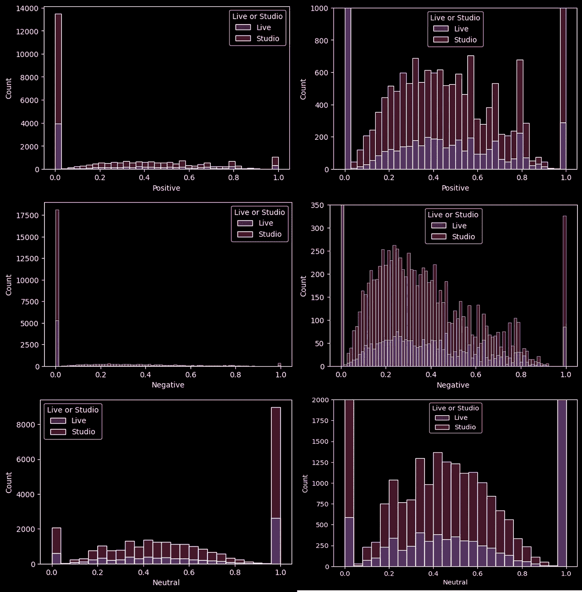

来自 VADER 对 Opeth YouTube 评论的情感分析的正面、负面和中性分数。图片作者。

复合 VADER 得分如下所示。复合分数表示通过将正分数、负分数和中性分数相加而获得的分数。正值表示评论在情感上是积极的，而负值表示评论在情感上是消极的。很容易看出，大多数评论的复合得分为 0。剩下的评论形成了两个很好的集群，集中在-0.5 和+0.6 左右。这表明在评论中传达的情绪之间有一个相当平均的分裂。

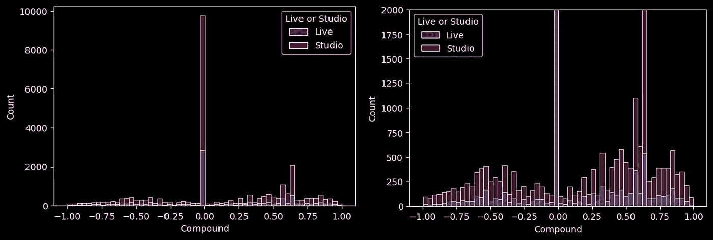

复合 VADER 评分对 Opeth YouTube 的评论。图片作者。

在这一点上，我认为这将是有用的/适当的标准化 VADER 评分的基础上的意见，因为工作室表演似乎获得更多的意见比现场表演。我还会根据喜欢、评论和每个评论的字数来标准化这些分数。

正如我之前提到的，绝大多数评论(超过 90%)的综合得分大约为 0。因此，我将 x 轴刻度设置为 0.00001 及以上，因为包含它们会使剩余的结果更难看到。通过观看次数、喜欢和评论数量标准化的 VADER 复合得分表明，现场表演总体上比录音棚录音有更多正面得分的评论。这可能表明了 Opeth 一贯的高质量现场表演。


通过原始视频观看计数标准化的 VADER 分数。x 轴已设置为从 0.00001 开始，表示正面、负面和中性得分，以帮助强调较小的特征。y 轴读数设置在 0–1.2%之间，有助于突出特征。图片作者。


VADER 得分通过视频中的评论数标准化。x 轴已设置为从 0.00001 开始，表示正面、负面和中性得分，以帮助强调较小的特征。y 轴读数设置在 0–3%之间，有助于突出特征。图片作者。

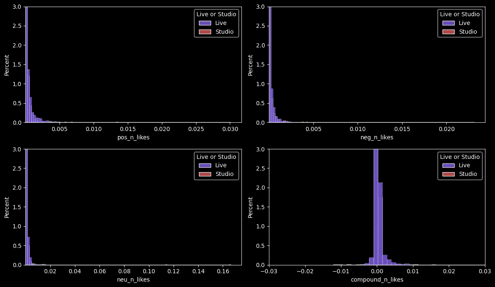

VADER 分数根据视频中的点赞数进行标准化。x 轴已设置为从 0.00001 开始，表示正面、负面和中性得分，以帮助强调较小的特征。y 轴读数设置在 0–3%之间，有助于突出特征。图片作者。

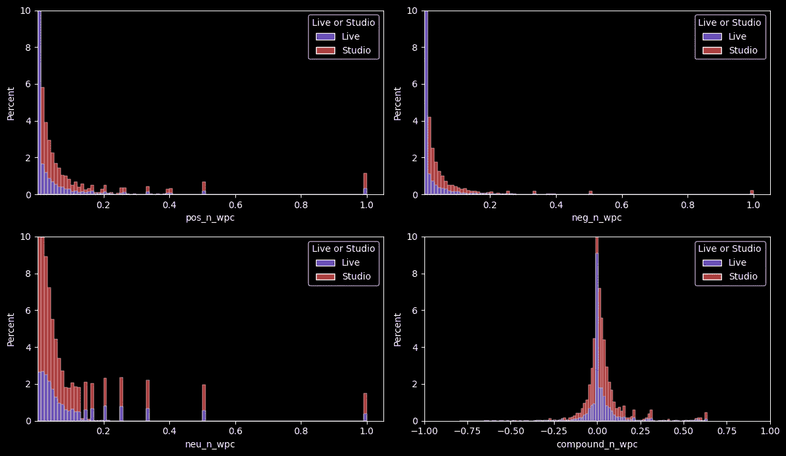

VADER 分数由视频中的原始点赞数归一化。x 轴已设置为从 0.00001 开始，表示正面、负面和中性得分，以帮助强调较小的特征。y 轴读数设置在 0–10%之间，有助于突出特征。图片作者。

我检查了是否有任何有趣的相关性，但我没有发现任何值得注意的东西，比如情绪与评论长度、观点或喜欢有关。从下面显示的相关矩阵来看，需要注意的唯一两件事是:

*   浏览量和点赞数彼此正相关
*   评论数量也与视频的浏览量和点赞数呈正相关

这些都是人们容易预料到的事情。


VADER 分数和视频指标的相关矩阵。颜色越亮表示正相关性越高。颜色越深表示负相关性越高。图片作者。

让我们看看《遗产》上映前后的情绪有没有什么有趣的趋势。下图显示了《遗产》发布前后，与歌曲相对应的 Opeth 视频的正负复合得分分布有几件事需要注意:

*   遗产后视频的评论是遗产前视频的 2 倍。
*   在两种情况下(遗产前和遗产后),正面评价多于负面评价
*   负面评论通常得分约为-0.6，而正面评论得分约为+0.6
*   现场表演相对于演播室表演的评论比例大大降低了后遗产

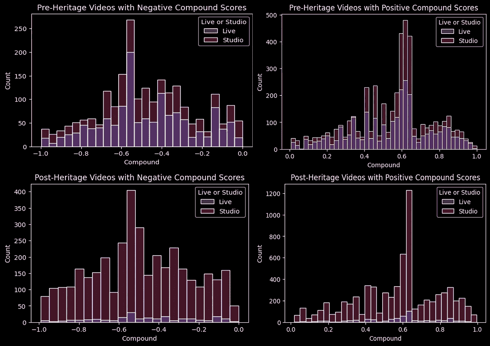

YouTube 评论“遗产”前后发布的 Opeth 视频的 VADER 分析综合得分。图片作者。

让我们通过下面的小提琴图来看看 VADER 复合得分作为专辑/发行年份的函数。该图显示，所有专辑的平均复合得分约为 0.0。除此之外，我们可以从图的宽度中看到，评论具有中性情绪得分或正面情绪得分的可能性更高。

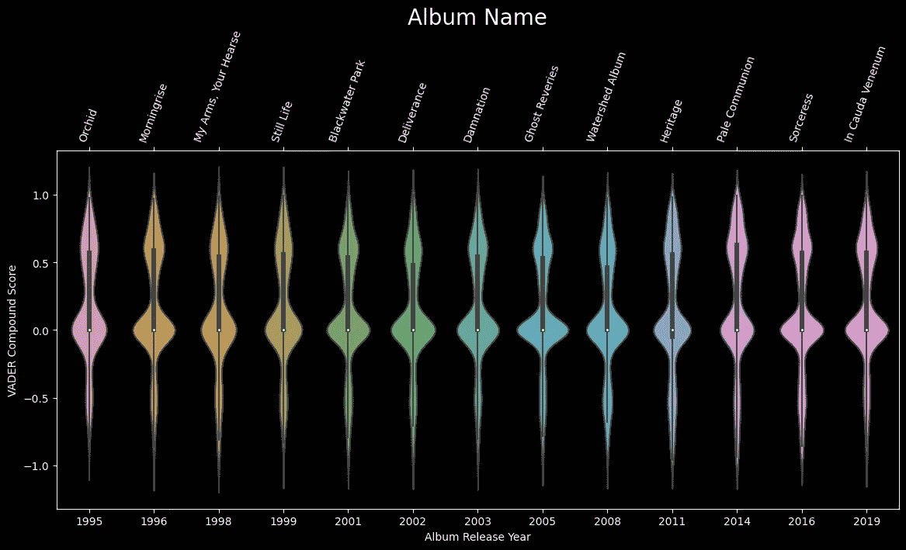

Violinplot 展示了基于 YouTube 评论的 Opeth 视频的 VADER 复合乐谱的传播和分布，作为专辑发行年份的函数。图片作者。

我们可以在下面的小提琴图中仔细看看复合乐谱的组成部分。通过视觉检查，基于相应的正分数和负分数的图的宽度，看起来遗产包含许多积极的感觉和许多消极的感觉。这可能表明了这张专辑在歌迷基础上的两极分化。


Violinplot 展示了基于 YouTube 评论的 Opeth 视频的 VADER 正面和负面得分的传播和分布，作为专辑发行年份的函数。图片作者。

另一种可视化这种趋势的方式是通过下面的散点图，可以看到，情绪得分不会随着时间的推移而发生很大变化。然而，我们可以看到，VADER 的平均正面分数(蓝点)总是比 VADER 的平均负面分数(橙色)高(大约 2 倍)。换句话说，这表明人们倾向于对 Opeth 的音乐持积极态度。

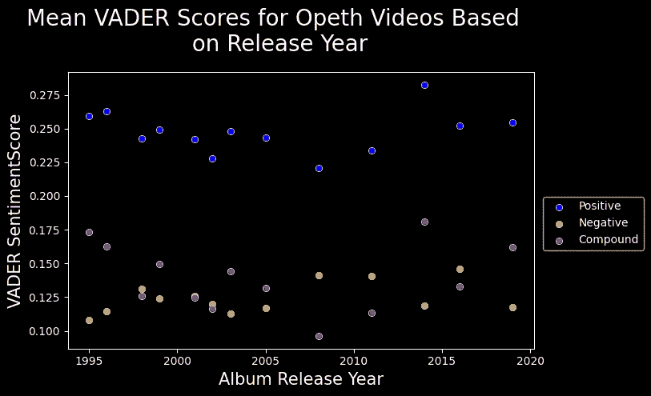

作为时间函数的平均 VADER 分数散点图。蓝色圆圈代表正分数，橙色代表负分数，紫色代表复合分数。图片作者。

好吧，关于这个我还可以做更多的分析，但是我会继续深入下去，永远不会结束。因此，目前，我将继续进行下一部分的分析。

## 表演的类型会影响人们对它的感受吗？

我原本想回答的问题是:

"对于一首歌，人们更喜欢现场表演还是录音室表演？"

我可以通过 VADER 分析计算出的情感分数来评估偏好。我也有每个评论归类为现场或工作室。是时候建立一些列联表，做一些假设检验了！这个实验的零假设(H0)是:

H0:人们不喜欢/不喜欢现场演出，就像不喜欢/不喜欢录音室演出一样

这个实验的列联表可以通过 pandas 中的 crosstab 函数使用下面的代码来制作:

在上面的代码中，“情绪”将是我计算的情绪得分之一。这就产生了一个频率表，我可以用它来进行卡方检验，最终得到我决定检验的每个变量的 p 值。结果总结在下表中:


VADER 分数的假设检验。图片作者。

p 值按升序排序。p 值允许我们确定是否可以拒绝零假设。我会考虑这样的结果，拥有一个 p 值< 0.001 as being statistically significant. The first thing that we can see is that the neutral and compound scores determined through normalization via views, comments, and likes have p-values of 0.

However, as a reminder, the VADER neutral scores mean that there is no positive or negative sentiment associated with a given piece of text. In a similar vein, the compound scores were shown to have scores mostly of 0 (i.e., indifference). In other words, neutral and compound scores in this situation could be thought of as representations of the null hypothesis.

The sheer magnitude of comments with neutral scores and compound scores of 0 would suggest that people don’t seem to have a preference towards Opeth’s live vs studio performances. To rephrase, the null hypothesis is confirmed (for Opeth’s studio/live performances at least).

Let’s check the other sentiments. The positive and negative sentiment scores normalized by views, likes, and number of comments all have p-values below the 0.001 threshold. It may be tempting to claim that the normalized positive scores have a smaller p-value than the normalized negative scores and thus conclude that people have a preference for one type of performance over the other.

However, both normalized sentiment scores are way smaller than the threshold value and could be considered to be identical for all intents and purposes. Therefore, the VADER sentiment analysis paired with the Chi-Squared analysis would lead me to conclude that people have no preference for live or studio performances.

## NRC lexicon

The [的 NRC 词典](https://saifmohammad.com/WebPages/NRC-Emotion-Lexicon.htm)可以对一段文本中的情绪进行更详细的分析。NRC 词典中的 10 种情绪是快乐、积极、愤怒、厌恶、消极、期待、惊讶、信任、恐惧和惊讶。

这也可以通过下面的代码以更简洁的方式完成:

首先，我将通过下面的关联矩阵检查是否有任何有趣的交互。我注意到的一些事情如下:

*   评论中的字数与快乐和积极的感觉有中度到高度的相关性
*   快乐与积极和信任有中度到高度的相关性
*   预期与信任有中度到高度的相关性
*   悲伤与消极、愤怒、厌恶和恐惧有中度到高度的相关性
*   消极与悲伤、愤怒、厌恶和恐惧有中度到高度的相关性
*   愤怒与期待、消极、厌恶和恐惧有中度到高度的相关性

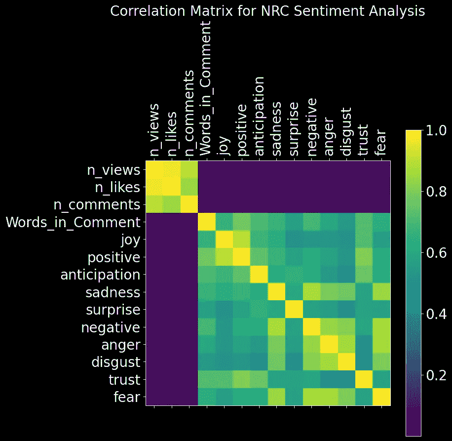

美国国家研究委员会对 Opeth YouTube 评论的情绪分析结果的相关矩阵。图片作者。

让我们来看看这些情绪的分布，以及他们是如何在现场和工作室表演方面分裂的！结果可以在下面的直方图中看到:

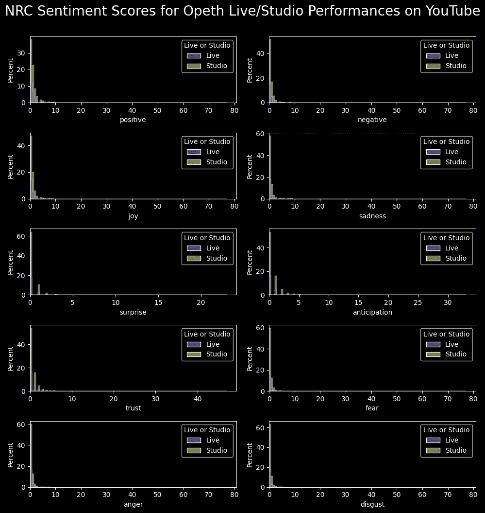

NRC 情绪得分的分布源自现场和演播室表演的 Opeth 视频的 YouTube 评论。图片作者。

总的来说，我可以看到情绪得分的值大多在 0 到 10 之间。显然有一些异常值，所以我将在缩小的范围内再次显示该图，以便更容易地看到大多数数据发生了什么。

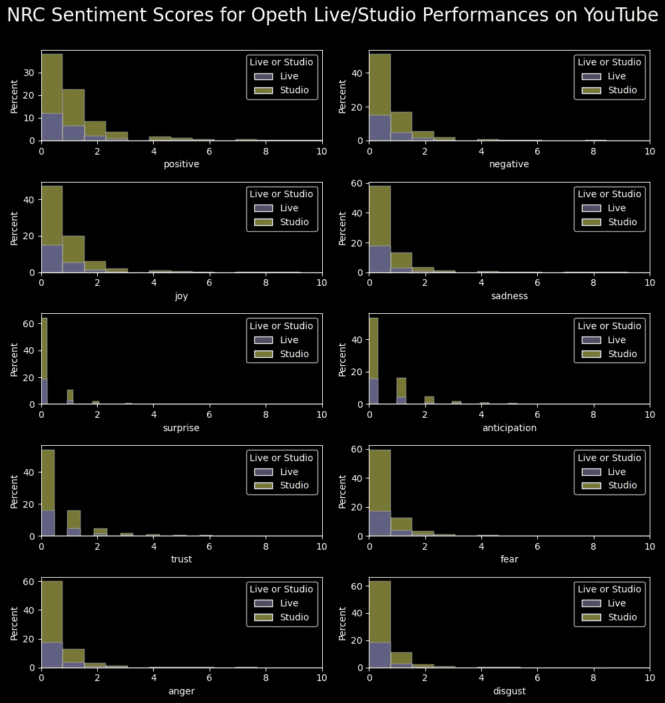

NRC 情绪得分的分布源自现场和演播室表演的 Opeth 视频的 YouTube 评论。情绪分数以最大值 10 来绘制，以帮助可视化。图片作者。

好多了。从这些图表中，我们可以看到以下内容:

*   负 0 分的评论比正 0 分的多。这支持了之前的 VADER 调查结果(即，对 Opeth 视频的总体评价更积极)。
*   近 50%的评论欢乐分为 0。
*   近六成评论悲伤度为 0。
*   超过 60%的评论有 0 分的惊喜。
*   超过 50%的评论的预期得分为 0。
*   超过 50%的评论信任度为 0。
*   近六成评论恐惧分为 0。
*   近 60%的评论的愤怒分数为 0。
*   超过 50%的评论厌恶度为 0。
*   所有情绪的第二个最常出现的分数是 1。

这些结果似乎与我早先从 VADER 获得的结果一致。也就是说，“对于 Opeth 乐队来说，似乎没有明显的现场或录音室演出偏好。”*你同意这个结果吗？在评论里告诉我:)*

好了，现在，我准备好进入项目的建模部分了:)

# 步骤 5:训练和测试分类器模型

现在我对我的数据有了更多的了解，我将尝试制作一个分类器，它能够根据所述视频上留下的评论，准确区分与现场表演和演播室表演相对应的 YouTube 视频。为了准备用于培训和后续验证的数据，我采取了以下步骤:

## a)将数据划分为现场和演播室评论

我的数据集混合了来自现场和录音室表演的评论。我将把数据分成两个数据帧，分别包含现场表演和录音室表演的评论。这可以通过下面的代码来完成:

## b)将每个单词与真值配对，将每个评论与标签配对

为了适应这个模型，我需要将每个评论中的每个单词与一个真值配对。然后，我可以将每一个真实的评论与“现场”或“工作室”标签配对。这可以通过以下代码行来完成:

## c)生成组合数据集

不错！现在，我已经为“Live”和“Studio”数据集添加了漂亮的注释和标签。现在，我可以通过下面的代码将它们组合在一起，打乱它们，并将这个组合的数据集分成训练集和测试集:

我尝试了几种不同的劈叉。我从标准的 80/20 开始，调整这个比例，直到我发现一个持续良好的准确性。

## d)训练高斯朴素贝叶斯并测量性能

太棒了。现在，我可以训练模型，看看它的表现如何！这可以通过下面的代码来完成:

该模型的准确率为 82.2%。还不错！我想提到的是，我实现了一个简单的 k-fold 交叉验证(使用 k = 10)来测试模型的稳定性，发现该模型的平均准确率为 81.6%。下面列出了 10 个最能提供信息的特性。“摄像机”、“表演”和“阵容”这三个词是区分现场录音和录音室录音的三大特征。非常酷！


高斯朴素贝叶斯分类器的性能和 10 个最有信息的特征。图片作者。

我尝试了 17 种其他的分类器，但是朴素贝叶斯分类器的表现比所有使用准确度作为度量的分类器都要好。这些其他模型的精度结果如下所示。这些模型的性能介于 65.4%和 82.2%之间。性能最低的模型是线性感知器，性能最好的模型是高斯朴素贝叶斯。


各种分类器在基于 YouTube 评论识别视频是实况还是演播室中的性能。模型按降序排序。图片作者。

我暂时对自己做的高斯朴素贝叶斯分类器模型的性能很满意。我还可以做很多事情来改进它，使它更健壮，提高它的分类精度。除此之外，我还可以对其他模型进行参数调整，看看能否让它们表现得更好。

我还想建立和训练一个神经网络，看看我是否能提高性能。然而，我将把我想到的改进留到这个项目的未来迭代、合作中，或者看看你们中是否有人有兴趣尝试一下这个问题！因此，我将继续部署它。

# 步骤 6:保存和部署模型

既然我已经训练了一个运行良好的模型(或者至少在给定我的标准和自己强加的时间限制的情况下足够好)，我准备通过一个基于 web 的应用程序部署它以供一般使用。为此，我将利用 Streamlit 来构建应用程序并托管它。你可以在这里找到 app [。](https://victormurcia-liv-live-vs-studio-classifier-streamlit-app-6we98r.streamlitapp.com/)

该应用程序将按如下方式工作:

1.  用户将输入对应于一首歌曲的 YouTube URL
2.  将生成一个包含 URL 注释的数据帧
3.  评论将经过预处理(去除不需要的字符、翻译成英语、标记化、词条化和最终去噪)。
4.  去噪后的评论将作为输入输入到分类器中
5.  分类器将返回视频是对应于现场表演还是演播室表演

下面是这款应用的几张截图:

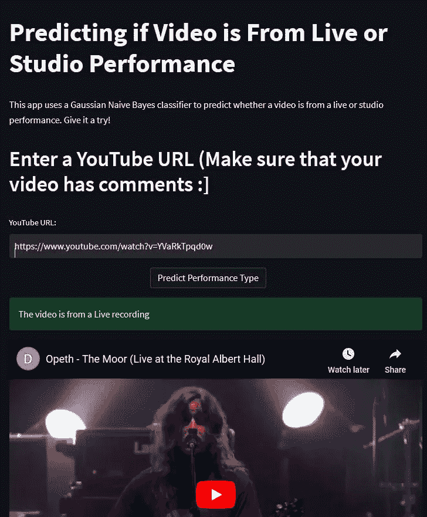

使用 YouTube 评论进行视频表演类型分类的 Streamlit app 截图。作者图片


使用 YouTube 评论进行视频表演类型分类的 Streamlit app 截图。作者图片

然而，分类器仍然需要工作！对于除了 Opeth 以外的艺术家来说效果不太好。我需要让更多的艺术家进入我的数据集，以提高其可靠性。不过，这将是我长期以来一直在做的事情。如果您想帮助扩展数据库、改进模型或只是分享想法，请联系我:)

# 第七步:结论

以下是迄今为止我在这个项目中所有工作的主要收获:

*   评论对欧佩思的音乐普遍持肯定态度
*   VADER 情感分析结合卡方分析表明，人们对现场或录音室表演没有偏好。
*   NRC 词汇情感分析的结果似乎支持上述观点
*   高斯朴素贝叶斯分类器使用 YouTube 评论将视频分类为来自现场或演播室表演的准确率为 82.2%
*   模型已作为 webapp 部署在 [Streamlit](https://victormurcia-liv-live-vs-studio-classifier-streamlit-app-6we98r.streamlitapp.com/) 中

还有其他的东西，我会添加到这个项目中。例如，我正在为歌曲中的抒情主题开发一个情感分析和分类系统。看看一首歌的歌词中表达的情感与人们通过评论同一首歌的表演来表达自己的方式有何相似/不同，这将是一件有趣的事情。

我还在通过 spotipy 模块为艺术家们收集 Spotify 的数据。我还将开始一系列类似的分析，就像我在这里展示的对跨越多种流派的各种艺术家的分析，以增加我的数据集的大小。

希望增加的数据集，加上后续在训练和优化分类器方面的努力，将导致比我已经获得的性能更好的性能。

如果你做到了这一步，感谢你的阅读！

```
**Want to Connect?**Consider following me on [Twitter](https://twitter.com/vmmr_anisotropy) or adding me on [LinkedIn](https://www.linkedin.com/in/vmmr5596/) if you liked my work. I’ll be posting projects like this a bit more regularly.
```

我希望你从中有所收获！

如果你愿意支持我的编码工作，请考虑通过我的推荐链接加入 Medium:【https://victormurcia-53351.medium.com/membership 