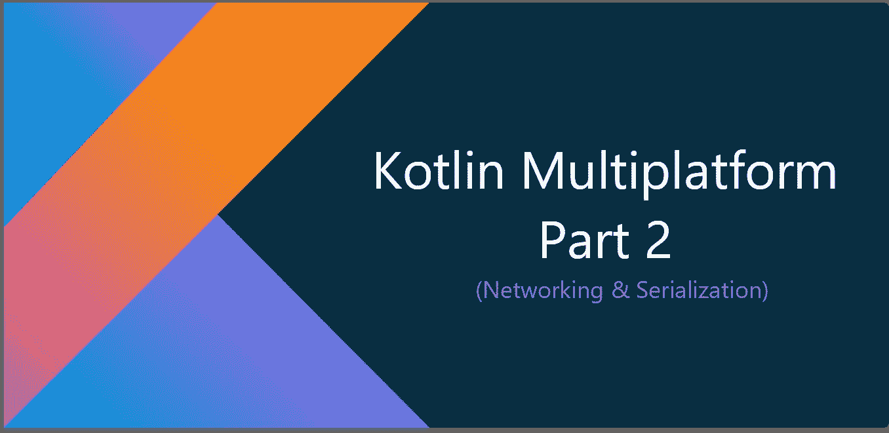

# 探索 Kotlin 多平台(第 2 部分)

> 原文：<https://betterprogramming.pub/exploring-kotlin-multiplatform-part-2-89086f78e654>

## 具有联网和序列化的 Kotlin 多平台项目



# 介绍

这是通过 Kotlin 探索多平台开发系列文章的第二部分。

在第一部分中，我们讨论了几件事:Kotlin 如何让 Android 开发更有趣，为什么移动应用开发采用多平台架构，选择 Kotlin 多平台架构的原因，以及如何设置项目的必要细节。

在本文中，我们将跨越一步，在多平台项目中实现联网。我们使用 [Ktor](https://medium.com/better-programming/how-to-use-ktor-in-your-android-app-a99f50cc9444) 与服务器通信，使用 [Kotlinx.serialization](https://medium.com/better-programming/why-and-how-to-use-kotlins-native-serialization-library-c88c0f14f93d) 库将 JSON 响应反序列化为 Kotlin 数据类。 [Ktor](https://medium.com/better-programming/how-to-use-ktor-in-your-android-app-a99f50cc9444) 和[kot linx . serialization](https://medium.com/better-programming/why-and-how-to-use-kotlins-native-serialization-library-c88c0f14f93d)都支持开箱即用的 Kotlin 多平台。

在进入实现部分之前，让我们先了解一下 [Ktor](https://medium.com/better-programming/how-to-use-ktor-in-your-android-app-a99f50cc9444) 和 [Kotlinx.seralization](https://medium.com/better-programming/why-and-how-to-use-kotlins-native-serialization-library-c88c0f14f93d) 库，以确保我们都在同一页上。

# Ktor 是什么？

据[其官网](https://ktor.io/):

> Ktor 是一个开源框架，使用强大的 Kotlin 编程语言在连接的系统中构建异步服务器和客户机。“它运行在协程上，由 [JetBrains](https://www.jetbrains.com/) 开发。

Ktor 旨在提供一个端到端的多平台应用程序。还是个 WIP。目前，它有 JVM、iOS、JavaScript 和 Android 客户端。

[](https://medium.com/better-programming/how-to-use-ktor-in-your-android-app-a99f50cc9444) [## 如何在你的安卓应用中使用 Ktor

### 了解关于这个 Kotlin 本地网络库的所有信息

medium.com](https://medium.com/better-programming/how-to-use-ktor-in-your-android-app-a99f50cc9444) 

# 什么是 Kotlinx？连载？

Kotlix.serialization 是在 Kotlin 基础上从头构建的库，没有对数据进行序列化和反序列化的反射，主要是在联网期间。像 Moshi 和 Gson 这样的序列化库都是使用反射的 Java 库，对于 Android 开发来说很好。

Kotlin 并不局限于 Android(JVM)——它支持 JavaScript (JS)和 IOS(原生)开发。反射肯定不会与 [Kotlin.js](https://kotlinlang.org/api/latest/jvm/stdlib/kotlin.js/) 和本机模块一起工作。此外，在 Android 中使用反射也是一个缺点。

[](https://medium.com/better-programming/why-and-how-to-use-kotlins-native-serialization-library-c88c0f14f93d) [## 为什么以及如何使用 Kotlin 的原生序列化库

### 在 Android 中序列化 JSON 响应的最简单方法

medium.com](https://medium.com/better-programming/why-and-how-to-use-kotlins-native-serialization-library-c88c0f14f93d) 

# 综合

从本系列的第一部分，我们知道 Android、iOS 和公共目录有不同的`sourcesets`。因此，我们需要添加必要的依赖项，如[协程](https://medium.com/better-programming/kotlin-coroutines-from-basics-to-advanced-ad3eb1421006)、 [Kotlinx.serialization](https://medium.com/better-programming/why-and-how-to-use-kotlins-native-serialization-library-c88c0f14f93d) 和那些`sourcesets`内的 [ktor](https://medium.com/better-programming/how-to-use-ktor-in-your-android-app-a99f50cc9444) 。

为了集成 [Ktor](https://medium.com/better-programming/how-to-use-ktor-in-your-android-app-a99f50cc9444) 、[协程](https://medium.com/better-programming/kotlin-coroutines-from-basics-to-advanced-ad3eb1421006)和 [Kotlinx.serialization](https://medium.com/better-programming/why-and-how-to-use-kotlins-native-serialization-library-c88c0f14f93d) ，我们需要在 common 和 Android `sourcesets`下添加以下代码行。

接下来，我们需要添加`Kotlinx.serialization`插件，在`Sharedcode`级 build.gradle 文件的顶部添加下面一行:

```
id("kotlinx-serialization")
```

之后，在应用程序级 Gradle 文件中，添加以下类路径:

```
classpath "org.jetbrains.kotlin:kotlin-serialization:$kotlin_version"
```

最后，在 repositories 块中添加以下 maven:

```
maven **{** url "https://kotlin.bintray.com/kotlinx" **}**
```

我们完成了`Sharedcode`库导入；现在我们需要添加`okhttp` Ktor 客户端。在应用程序级 build.gradle 文件的 dependencies 标记下添加以下行:

```
implementation ("io.ktor:ktor-client-okhttp:1.0.0")
```

我们已经完成了整合部分。

# 创建模型

第一步是创建 Kotlin 数据类。这里我们用的是 Spotify API。明确地说，我正在实现 categories 端点。当我们调用 API 请求时，我们将收到一个类别及其图标的列表。创建一个名为 Models.kt 的 Kotlin 文件，并添加以下数据类:

`CategoriesResponse`表示请求的最终响应。Kotlin 团队的这个原生库可以很快完成序列化。我们需要在预期的类之上添加`@Serializable` 注释。

仅此而已——您不需要像处理常规库那样用可序列化标签来注释每个变量。这很简单。

# 与 Spotify 的集成

现在我们已经完成了数据类，下一步是通过 Ktor 实现联网。首先，创建一个 Kotlin 文件并将其命名为 SpotifyApi.kt，然后在该类中创建一个 Ktor `Httpclient`实例。看一看:

```
val client = ***HttpClient***()
```

为了反序列化从 Spotify API 获得的数据，我们需要使用 [Kotlinx.serialization](https://medium.com/better-programming/why-and-how-to-use-kotlins-native-serialization-library-c88c0f14f93d) 库。我们可以通过使用 Ktor 中的`Jsonfeature`和`install`功能来实现:

现在我们已经完成了客户端设置，是时候实现网络调用了。不同于 Android 中流行的网络库，如 renewal 和凌空，Ktor 很简单。要发出一个`GET`请求，我们必须使用 Ktor 的 HttpClient 上的`get` inline 函数以及一个响应数据类和请求 URL，如下所示:

```
client.**get**<CategoriesResponse> **{** *url*("${*baseUrl*}browse/categories?country=IN&limit=5&offset=0")
**}**
```

添加头、接受类型和更多自定义选项也很简单。看看 categories 端点的最终实现:

当我们将所有代码片段放在一起时，它看起来会像这样:

# 从 Android 应用程序调用请求

`getCategories`是一个挂起函数，所以我们需要使用协程作用域来触发网络调用。为了简单起见，我没有使用阿迪框架，只是创建了一个`SpotifyApi`类实例。

如果你感兴趣，我们可以使用 [Koin](https://medium.com/android-dev-hacks/koin-kotlin-native-dependency-injection-library-f1daddc1ef99) 来实现 DI。我将在本系列的后续部分解释如何使用 [Koin](https://medium.com/android-dev-hacks/koin-kotlin-native-dependency-injection-library-f1daddc1ef99) 在多平台项目中实现 DI，敬请关注。

回到代码，我们需要用`Dispatchers.IO`打开一个协程，并触发`getCategories`函数。一旦我们得到响应，切换到`Dispatchers.Main`并更新 UI。看一下代码:

# 结论

在本文中，我们学习了如何使用 Kotlin 本地库 [Ktor](https://medium.com/better-programming/how-to-use-ktor-in-your-android-app-a99f50cc9444) 和[kot linx . serialization](https://medium.com/better-programming/why-and-how-to-use-kotlins-native-serialization-library-c88c0f14f93d)在公共模块中实现联网和反序列化响应。这很简单。

在本系列的后续文章中，我们将学习如何实现数据库、DI 框架、架构模式等等。

你可以在下面的回购中找到所有代码。请在分支之间切换，为系列中的每篇文章找到合适的代码。本文参考`networking`分支。

[](https://github.com/SG-K/KotlinMultiplatformExperiments/tree/networking) [## SG-K/kotlin 多平台实验

### 此时您不能执行该操作。您已使用另一个标签页或窗口登录。您已在另一个选项卡中注销，或者…

github.com](https://github.com/SG-K/KotlinMultiplatformExperiments/tree/networking) 

# 奖金

要了解更多关于 Kotlin 多平台的信息，请阅读本系列的其余部分:

*   [“探索 Kotlin 多平台(第一部分)”](https://medium.com/better-programming/exploring-kotlin-multiplatform-part-1-b73f59d61135)

要了解更多关于 Kotlin 的信息，请阅读 Kotlin 高级编程系列的前几部分:

*   [“使用 Kotlin 进行高级编程](https://medium.com/better-programming/advanced-android-programming-with-kotlin-5e40b1be22bb)”
*   [“使用 Kotlin 进行高级编程—第 2 部分](https://medium.com/android-dev-hacks/advanced-android-programming-with-kotlin-part-2-aae2a15258b0)”

要了解更多关于 Kotlin 协同例程和 Kotlin 的其他高级特性，请阅读以下文章:

*   [“科特林协程，从基础到高级](https://medium.com/better-programming/kotlin-coroutines-from-basics-to-advanced-ad3eb1421006)
*   [“如何使用 Kotlin 密封类进行状态管理”](https://medium.com/better-programming/how-to-use-kotlin-sealed-classes-for-state-management-c1cfb81abc6a)
*   [“使用新 Kotlin 流异步加载数据](https://medium.com/better-programming/asynchronous-data-loading-with-new-kotlin-flow-233f85ae1d8b)
*   [“探索 Kotlin 中的集合和序列”](https://medium.com/better-programming/exploring-collections-and-sequences-in-kotlin-3a324ea08fb9)
*   [“学习如何组合科特林流](https://medium.com/@sgkantamani/learn-how-to-combine-kotlin-flows-317849a71d3e)”

要了解 Kotlin 多平台库，请阅读以下文章:

*   "[为什么以及如何使用 Kotlin 的本地序列化库](https://medium.com/better-programming/why-and-how-to-use-kotlins-native-serialization-library-c88c0f14f93d)"
*   [“如何在你的安卓应用中使用 Ktor”](https://medium.com/better-programming/how-to-use-ktor-in-your-android-app-a99f50cc9444)
*   [《Koin—kot Lin 原生依赖注入库》](https://medium.com/android-dev-hacks/koin-kotlin-native-dependency-injection-library-f1daddc1ef99)

目前就这些。希望你学到了有用的东西，感谢阅读。