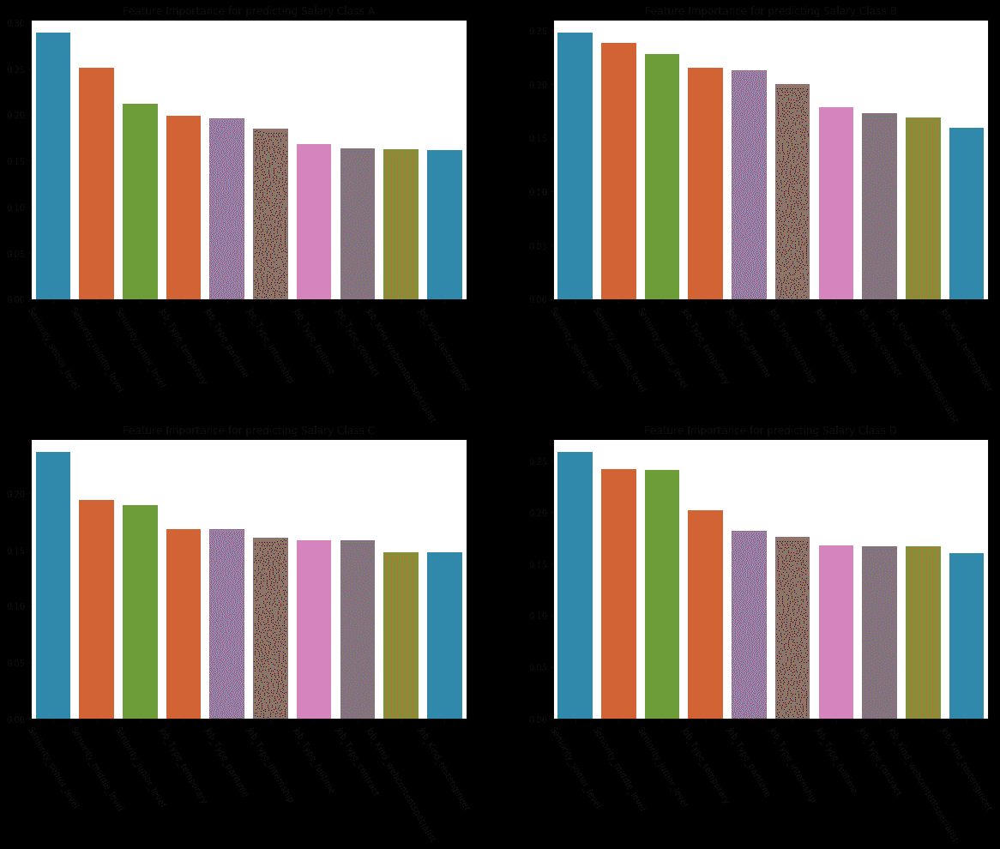

# 面对机器学习中的分类项目

> 原文：<https://betterprogramming.pub/facing-a-classification-project-in-machine-learning-462b319873de>

## 温和的逐步指导


来源:unsplash 免费库存图片

分类是你在数据科学和机器学习领域可能面临的主要项目之一。下面是维基百科的定义:

> 分类是根据包含已知类别成员的观察值(或实例)的训练数据集，识别一个新观察值属于哪一组类别(子群体)的问题。例如，将给定的电子邮件分配到“垃圾邮件”或“非垃圾邮件”。

在这篇文章中，我将介绍一个来自我的[大会的沉浸式数据科学](https://generalassemb.ly/education/data-science-immersive/)的项目。在这篇文章中，我使用 Indeed.co.uk 的出版物，探索了不同的机器学习分类模型，以预测数据科学职位的四种工资类别:

*   工资低于 25%
*   工资介于 25%和 50%之间
*   工资介于 50%和 75%之间
*   工资高于 75%

我们不可能详细介绍项目的每一个方面，但是请注意，在我的 [GitHub 简介](https://github.com/gonzaferreiro)中可以找到整个资源库。

# 第一阶段:刮擦和清洁

首先，没有数据，任何项目都不会有任何意义。因此，我开始搜寻 Indeed.co.uk，以便获得在英国几个城市寻找“数据科学家”的职位列表。我不会在这里讨论如何实际做抓取，但是我使用了我的另一篇文章中提到的相同的技术和工具:[五分钟内抓取网页](https://towardsdatascience.com/web-scraping-in-5-minutes-1caceca13b6c?source=friends_link&sk=3d2c281449fc6584e4efb272245f8865)。

值得一提的是，尽管网络搜集对那些从事数据科学的人来说很棒，也很有用，但是一旦你完成了搜集，一定要检查你的数据的完整性。例如，在这种情况下，拥有岗位工资当然是关键。然而，并不是所有的出版物都包含薪水，所以为了至少有 1000 个包含薪水的职位，有必要删除数千个页面和职位。

处理抓取的数据通常还涉及大量的特性工程，以从我们已经拥有的数据中增加一些价值。例如，对于这个项目，我开发了一个“资历”功能。根据每个出版物的标题和摘要创建，使用两个不同的列表，其中包含属于高级或初级职位的单词。如果每个级别的任何一个词出现，无论是在职称上，还是在摘要中，都会指定相应的资历级别。如果这些特征中没有一个单词，那么该职位将被分配为中级。

# 第二阶段:建模

我开始探索三种不同的模式:

*   **KNN 装袋模型** : KNN 代表 K 近邻模型。这是通过检查与被预测点最近的点的类别来进行分类的。将它与 bagging 结合起来，我们可以提高稳定性和准确性，同时还可以减少方差并有助于避免过度拟合。*如何？* Bagging 是一种集成方法——一种将多种机器学习算法的预测结合起来的技术，可以做出比任何单个模型都更准确的预测。虽然它通常应用于决策树方法，但它可以用于任何类型的方法。
*   **带有 boosting** 的决策树模型:在这种情况下，决策树作为一个类似流程图的结构工作，其中每个内部节点代表对一个属性的“测试”(例如，掷硬币是正面还是反面)，每个分支代表测试的结果，每个叶节点代表一个类别标签和一个决策。从根到叶的路径代表分类规则。在此模型中，虽然 boosting 是一种与 bagging 非常不同的方法，但它也是一种集成方法，其工作方式是从训练数据构建一个模型，然后创建第二个模型，尝试纠正第一个模型的错误。添加模型，直到训练集被完美预测或者添加了最大数量的模型。

由于这两个模型高度依赖于给定的超参数，您可能想要使用 `GridSearch`来尽可能地优化它们。`[GridSearch](https://scikit-learn.org/stable/modules/generated/sklearn.model_selection.GridSearchCV.html)`是一个简单的工具，用于训练多个模型，从给定的参数和值列表中寻找最佳参数。

因此，举例来说，要创建一个带有 boosting 和`GridSearch`的决策树模型，您需要采取以下步骤。

## **1。实例化模型**

```
from sklearn.tree import DecisionTreeRegressortree_to_boost = DecisionTreeRegressor(random_state=123)
```

## **2。实例化集成方法算法**

```
from sklearn.ensemble import AdaBoostClassifierboosting_trees_model = AdaBoostClassifier(base_estimator = tree_to_boost, random_state=123)
```

## **3。实例化 GridSearch 并指定要测试的参数**

当使用`GridSearch`时，您可以通过在之前实例化的模型上调用`get_params()`来获得要调整的可用参数:

```
tree_to_boost.get_params()
```

记住:你可以在 Sklearn 的文档中找到关于如何优化任何超参数的更多细节。例如，下面是[决策树文档](https://scikit-learn.org/stable/modules/generated/sklearn.tree.DecisionTreeClassifier.html)。

最后，让我们导入`GridSearch`，指定想要的参数并实例化对象。请注意，Skelarn 的`GridSearchCV`包括算法中的交叉验证，因此您也必须指定要完成的 CV 数量，

```
from sklearn.model_selection import GridSearchCVtrees_params = {‘base_estimator__max_depth’: [80,100,120,150],
‘base_estimator__max_features’: [0.93,0.95,0.97], 
‘n_estimators’: [1200]}boosting_tree_grid = GridSearchCV(estimator=boosting_trees_modeel, param_grid=tree_params, cv=5)
```

## **4。适合您的组合网格搜索并检查结果**

装配`GridSearch` 就像装配任何模型一样:

```
boosting_tree_grid.fit(X_train, y_train)
```

一旦完成，你可以检查最佳参数，看看你是否还有机会优化它们。只需运行下面这段代码:

```
boosting_tree_grid.best_params_
```

在任何模式下，您都可以使用`GridSearchCV`对象来使用`.score()`和`.predict()`。

# 第三阶段:功能重要性

在建模之后，下一个阶段总是分析我们的模型是如何执行的，以及为什么它在做它正在做的事情。

然而，如果你有机会使用集成方法，你可能已经知道这些算法通常被称为“黑盒模型”。这些模型缺乏可解释性和可解释性，因为它们通常的工作方式意味着除了一组规则或参数集之外，机器的一个或几个层在没有人类监督的情况下做出决策。通常，甚至该领域中最专业的专业人员也不能理解例如通过训练神经网络实际产生的功能。

从这个意义上说，一些最经典的机器学习模型实际上更好。这就是为什么，为了这篇文章，我们将使用经典的逻辑回归来分析我们项目的特性重要性。然而，如果你对如何分析黑盒模型的特性重要性感兴趣，在我的另一篇文章[中，我开发了一个工具来做这件事。](https://towardsdatascience.com/unboxing-machine-learning-feature-importance-for-black-box-models-ea12268ddb23?source=friends_link&sk=52d12526d6c199d78d680ad05118449d)

从逻辑回归模型开始，获取特性重要性就像调用:

```
logistic_regression_model.coef_[class_number]
```

查看整体特性重要性的一个简单方法是为每个类创建一个具有特性重要性的`DataFrame`。我喜欢使用每个特性的绝对值，以便查看每个特性在模型中的绝对影响。但是，请记住，如果您想要具体分析每个特性如何帮助增加或减少成为每个类的可能性，您应该采用原始值，无论它是负的还是正的。

记得我们试图预测四个职业，所以这就是我们应该如何创建熊猫`DataFrame:`

```
feature_importance_df = pd.DataFrame({‘feature’: logistic_regression_model.columns,‘coefA’: np.abs(logistic_regression_model.coef_[0]),‘coefB’: np.abs(logistic_regression_model.coef_[1]),‘coefC’: np.abs(logistic_regression_model.coef_[2]),‘coefD’: np.abs(logistic_regression_model.coef_[3]),})
```

我们终于可以把所有东西都放在图中，看看每个类是如何表现的:



尽管标签的大小可能没有帮助，但我们可以从这些图中得出结论，在预测工资类别时，数据集的以下特征是相关的:

*   资历:正如我们所看到的，树的级别在所有类别中都产生了非常强烈的影响，是绝对大小的第一系数。
*   第二点，来的时候`Job_Type`确实直接刮来了
*   最后，对于所有的工资类别，有两个职位名称被剔除:网页内容专员和测试工程师。

该数据集包含数百个特征，但很高兴看到在所有类别中都有一个清晰的趋势！

# 第四阶段:结论和可信度

最后剩下的就是评价我们模型的性能了。为此，我们可以使用几个指标。不幸的是，对于这篇文章来说，遍历一个分类问题中所有可能的度量标准太长了。但是，我可以向您推荐 Medium 中的一个非常好的工具，它提供了所有关键指标的详细信息。在这里享受它[。](https://medium.com/thalus-ai/performance-metrics-for-classification-problems-in-machine-learning-part-i-b085d432082b)

正如可以在上面链接的 Mohammed 的故事中读到的，混淆矩阵是涉及所有其余度量的母概念。简而言之，它在一个轴上有真实的标签或类别，在另一个轴上有预测的标签或类别。最后，我们希望在我们的预测和真实标签之间有一个对角线匹配，理想情况下没有或很少出现不匹配。Sklearn 的指标库有一个漂亮而简单的表示，我们只需向算法提供真实的标签和我们的预测就可以绘制出来:

```
from sklearn import metricsskplt.metrics.plot_confusion_matrix(y_test, y_predictions)plt.show()
```

使用这个库，我们可以在下面的图中看到，对于这个项目，训练组和测试组在四个工资类别中都预测得非常准确:


一个重要的最终澄清是，尽管我们的最终模型看起来是准确的，但当类别的重要性相等时，它可以很好地预测类别，并且我们不需要考虑任何类别。

例如，如果我们为一家公司创建这个模型，错误地告诉一个人他们将得到一份*低*薪水的工作比错误地告诉一个客户他们将得到一份*高*薪水的工作更重要，我们的模型将会很困难，因为它不能将一个类的所有正值预测为正值，也不能错误地预测许多负值。在这种情况下，我们应该用另一种方法来解决这个问题—例如，通过创建一个带有加权类别的模型。

好了，暂时就这样吧！如果你喜欢这个故事，别忘了看看我最近的一些文章，比如[提高你绘图技能的 10 个技巧](https://towardsdatascience.com/10-tips-to-improve-your-plotting-f346fa468d18?source=friends_link&sk=b2f7a584a74badc44d09d5de04fe30d8)、[我在使用火车测试分割](https://towardsdatascience.com/6-amateur-mistakes-ive-made-working-with-train-test-splits-916fabb421bb)或[5 分钟内抓取网页时犯的 6 个业余错误](https://towardsdatascience.com/web-scraping-in-5-minutes-1caceca13b6c)。在[我的媒体简介](https://medium.com/@g.ferreiro.volpi)中可以找到所有这些以及更多信息。另外，**如果你想直接在你的邮箱里收到我的最新文章，只需** [**订阅我的简讯**](https://gmail.us3.list-manage.com/subscribe?u=8190cded0d5e26657d9bc54d7&id=3e942158a2) **:)**

也可以通过…取得联系

*   领英:[https://www.linkedin.com/in/gferreirovolpi/](https://www.linkedin.com/in/gferreirovolpi/)
*   GitHub:[https://github.com/gonzaferreiro](https://github.com/gonzaferreiro)(那里有我所有的代码)