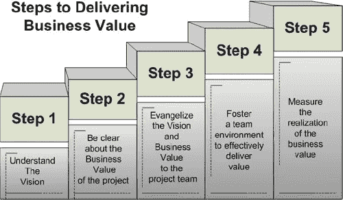
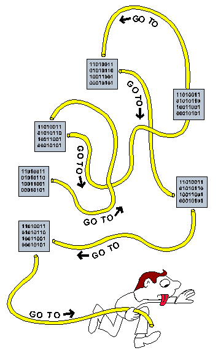

# 用于真正连续部署的功能标志

> 原文：<https://betterprogramming.pub/feature-flags-for-true-continuous-deployment-14175f825ac5>

## 在没有特性标志的情况下，有可能实现真正的连续生产部署吗？

[来源](https://pbs.twimg.com/media/Dwpl5eSWsAEB3rX.jpg)

即使是我工作过的最好的软件开发团队也很难解决将*完全自动化部署到他们的生产环境中的问题。这方面的最大障碍往往表现为:*

*   需要人工批准的生产变更管理
*   甚至依赖于捆绑和部署在一起的多种服务的微服务架构
*   无法将版本和部署的概念分开

我们可以应用几种策略来分别解决这些问题，但是用一种模式解决所有这些问题的一个简单技巧是将**特性标志**应用到您的代码中。

# 终极左移开发实践

[来源](https://www.techarcis.com/wp-content/uploads/2016/06/shift-left-testing-1.jpg)

无论您是在旧的单片应用程序上开发，还是在新的微服务架构应用程序上开发，都没有关系；您可以在任一模式中引入特征标记。此外，根据敏捷开发的行业标准，在一次 sprint 中编写一个完整的全新特性几乎是不可能的。使用特性标志，我们可以简单地将新代码默认为“off ”,无论在我们的 sprint 期间谁要求什么，我们都可以打包并部署我们的应用程序，而不用担心会有什么东西损坏。

# 生产中测试！

是的，你没看错。我提倡你在产品中使用特性标志来测试！好吧，等一下——在你开始胡思乱想，认为我疯了之前，让我澄清一下。

我们可以在几个方面使用功能标志，并在生产中打开这些功能，而不会对我们的最终用户造成重大影响:

*   **后台负载测试**:假设我们有了一个新特性，我们知道它会非常有趣。也许是向其他用户发送实时消息的能力，或者是在一个文档上的实时协作。在生产和发布我们闪亮的新功能之前，我们可以使用真实的用户来模拟流量负载，而不是试图在 QA/performance 环境中模拟用户负载和行为。这实际上是脸书在向其用户群推出消息之前使用的一个著名策略。几个月来，一些 JavaScript 向你的其他朋友发送消息，除非你打开了数据包嗅探器，否则你永远不会知道！
*   部分用户部署(Partial user rollout):这更类似于金丝雀部署，但我们为用户子集确定一些标准，并为他们推出新功能，而其他人甚至没有看到它的选项。当你有一个大的用户群时，这是非常好的。这使您能够确保您构建的功能是用户可以利用的，否则就关闭它，专注于不同的东西。非常适合假设驱动的开发。

# 提供终极商业价值

[来源](https://www.pmi.org/kasimage/bde2aba1-ed4d-40c5-890b-f6a5bf085f9a/p3_01.jpg)

暂时后退一步；让我们回顾一下我们试图解决的问题。很多时候，我们的 GIT 分支策略很难与可部署的工件保持一致。这在开发和生产之间的环境中变得非常明显。在一些情况下，我们希望 QA 和完整的端到端测试在生产前进行，但我们的业务合作伙伴需要为关键利益相关方演示功能。那么，我们是否在 CI/CD 管道中放置手动闸门？嗯，如果我们在特定的环境中没有任何利益冲突，那可能会很痛苦。然而，就像生产一样，如果我们启用了自动部署，可能会有一些外部因素影响我们的部署流程，而这些因素在 CI/CD 管道的设计中几乎是不可能考虑的。

对此的唯一解决方案变成了**特征标记**。特性标志将版本代码从版本中具体化。因此，虽然我们可能继续增加我们的工件的版本，但是特性不再直接与工件联系在一起。这给了企业更多的控制权来决定何时开启(或关闭)并简化我们的渠道。

# 警告:防止意大利面条代码

[来源](https://i.pcmag.com/imagery/encyclopedia-terms/spaghetti-code-spageti.fit_lim.size_955x99999.gif)

现在让我提出一个警告:特性标志是很好的，但是**不要在没有计划的情况下使用这种模式开始开发**。太多时候，令人讨厌的意大利面条式代码在没有对这种编程范式进行适当审查和标准化的情况下就被实现了。

像大多数事情一样，不要多此一举。利用这些标准开源库之一来保持代码整洁:

*   [FeatureFlags.io](https://featureflags.io/)
*   [FF4J](https://github.com/ff4j/ff4j/wiki)
*   [释放](https://github.com/Unleash/unleash)

## **特征标志代码示例:**

# 结论

特性标志解决了当我们试图通过自动化将代码部署到产品中，并且代码一准备好就发布时出现的大量问题。

作为开发人员，我们不再担心“发布”，而是开始简单地发布代码，让业务在他们认为合适的时候打开功能。

在幕后，我们可以对用户子集测试功能，甚至在真实用户不知情的情况下对他们进行测试，从而让我们最真实地了解我们的应用程序如何扩展。

最终，它需要一个渴望在这个新范例中编码的开发团队，以及希望更快地为他们的用户提供特性的**商业伙伴**！