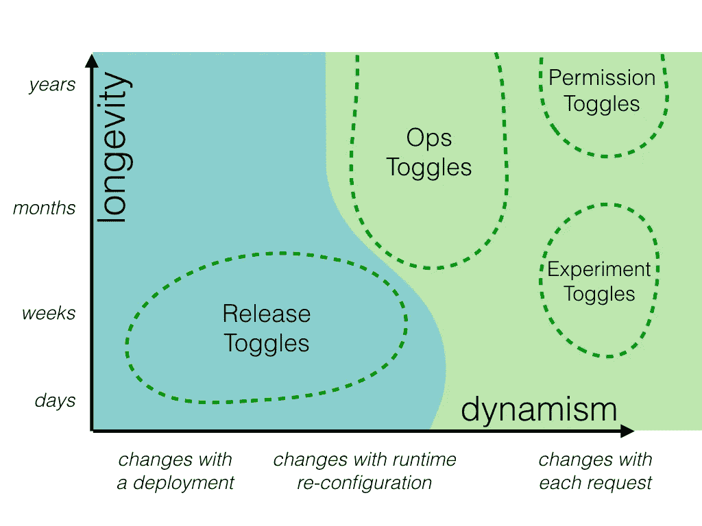

# 功能切换简介—类型、使用案例和实施

> 原文：<https://betterprogramming.pub/feature-toggle-introduction-68d58f5c709>

## 了解可以使用功能切换的许多场景，以及如何正确对待它们


[亚瑟·马齐](https://unsplash.com/@arthurbizkit?utm_source=medium&utm_medium=referral)在 [Unsplash](https://unsplash.com?utm_source=medium&utm_medium=referral) 上的照片

我已经使用[基于主干的开发](https://lazypro.medium.com/trunk-based-development-can-help-4bb425595c00)一段时间了，以提高我管理的团队的生产力。为了顺利地执行基于主干的开发，特性切换在其中起着重要的作用，所以我用这篇文章来介绍特性切换，包括哪些种类的切换以及如何使用它们。

但在此之前，我们先来说一个容易混淆的概念。功能切换和配置有什么区别？

首先，无论一个配置存储在哪里，比如一个文件，或者一个中央存储系统，比如 HashiCorp 咨询的[，它都被认为是静态的。当系统初始化时，整个配置文件存储在每个实例的内存中，以减少不必要的 I/O 开销。也就是说，如果要修改设置，必须重新启动相关的实例，以便将设置重新加载到内存中。](https://www.consul.io/docs/intro)

另一方面，功能切换不是这样工作的；特性切换每次都会调用管理系统来获取实例甚至特性的当前设置。因此，功能切换比配置更加动态。

让我们以代码为例。

如果它是一个配置文件，它将如下所示。

```
const config = loadConfigFromSomewhere();
function foo() {
    if (config.featureA) doA();
    else doB();
}
```

至于特性切换，就有点不一样了。

```
const connection = initFeatureToggle();
function bar() {
    if (connection.isEnabled("featureA")) doA();
    else doB();
}
```

从上面的例子可以看出，配置在`loadConfigFromSomewhere`之后是固定的，然后值就只是从变量中取的。但是，根据当前环境，每次调用`isEnabled`时，特性切换可能会得到不同的结果。

# 有哪些类型的特征切换？



[https://martinfowler.com/articles/feature-toggles.html](https://martinfowler.com/articles/feature-toggles.html)

有四种类型的特征切换。

1.  释放开关
2.  操作切换
3.  实验切换
4.  权限切换

图表中有两个维度，活力和寿命。

*   Dynamism 表示拨动开关的频率将会改变，越靠近右侧意味着拨动开关将会改变得越频繁。
*   寿命是指切换将在源代码中停留多长时间，越靠近底部，停留时间越短。

蓝色区域中的释放开关是相对静态的，仅在某个功能发布时使用，当该功能稳定时将被移除。另一方面，绿色区域中的切换是相对动态的，并且可以根据各种需要而改变。

# 释放开关

释放切换是最常用的切换形式，旨在控制每次释放的影响范围。

假设这个版本有一个新的需求，这个新需求的代码应该被这个版本的 toggle 完全封装。在发布的时候，默认的切换应该是关闭的，换句话说，这个发布和上一个发布的行为应该是完全一样的。

当释放成功时，可以根据需要逐渐打开开关。起初，可能会有 1%的电话接通，然后是 5%，10%等等。就这样，功能性逐渐开放到 100%。这种方法也被称为金丝雀释放。

或者，在开始时一直打开切换。一旦遇到任何问题，开关就会完全关闭，以避免灾难影响整个系统。这种做法被称为蓝绿部署。

值得注意的是，这些释放开关的生命周期应该很短。一旦确定功能稳定，就应该从代码中删除这些切换。如果不这样做，代码将被越来越多的切换所填充，这反过来又会导致维护工作。

# 操作切换

Ops 切换不同于 release 切换，因为 release 切换旨在对每个版本做出反应，而 ops 切换旨在处理基础架构的更改。当基础架构因某种原因需要升级或迁移时，可以通过 ops toggles 进行管理。

例如，如果一个系统以名为`Elastic APM`的分布式跟踪系统开始，出于预算或维护的原因，想要用`jaeger`替换它，那么可以使用 ops toggle 在两个系统之间切换。在我们确定`jaeger`可以正常运行之前，这两个系统将共存，可能是对半监控。在我们确信可以用`jaeger`替换原来的系统之前，ops 切换将一直保留，因此持续时间将比释放切换长得多。

使用 ops toggle 的另一个例子是手动断路器。对于高吞吐量的系统，通常会实施速率限制算法，但是一旦流量达到一定程度，就需要直接切断多余的流量，避免对整个系统造成冲击。对于系统来说，能够自我调整和恢复是理想的，但是，这样的机制非常复杂，并且在开始时很难做好，所以 ops toggle 是一个不错的选择。

这种切换还将存在很长一段时间，直到开发人员找到实现自动机制的方法。

# 实验切换

实验开关，顾名思义，是用来进行实验的开关。当一个特性有两种不同的行为，我们想要评估这两种行为的有效性时，我们使用实验切换，实验的过程称为 A/B 测试。

它的操作有点像释放开关，但与允许新旧行为共存的释放开关不同，实验开关允许两种新行为共存。甚至有可能通过实验切换引入更多的实验参数，使整个实验过程更加灵活高效。

是的，大多数特性切换可以携带额外的参数，而不仅仅是真或假。所以，对于不断变化的实验环境，这可以起到最大的加速作用。

就像其他切换一样，实验切换应该在实验完成并确认结果后从代码中删除。

# 权限切换

最后一种是最复杂的适用情况。从图表中，我们可以看到，它是动态的和长期的。

那么，这个 toggle 到底是什么样的存在呢？

在我看来，它有两个场景，一个是系统级的访问控制，另一个是产品级的访问控制。

系统范围的访问控制意味着某些功能或操作只对特定用户可用，因此我们通过权限切换来管理这些受限的功能。有点难以想象？我会提供一个伪代码。

```
function restrictedFunction() {
    const metadata = {userId, userLevel, userRole};
    if (connection.isEabled("featureA", metadata))
        doFunction();
    else return;
}
```

从上面的例子我们可以知道，这个特定的功能只允许某些用户使用，用户必须验证自己的`Id`、`Level`和`Role`，确保自己符合资格标准，才能使用该功能，否则将被跳过。

这样的拨动看起来很稳吧？其实不是，验证方式可能会改变，原本可能只需要`Id`和`Level`，直到有一天由于需求而增加`Role`。因此，切换的规则可能会随着需求的变化而变化，切换的使用环境也可能会随着需求的扩展而变化。

# 如何正确使用功能切换？

我们已经看到了使用特性切换时代码的样子。

```
const connection = initFeatureToggle();
function bar() {
    if (connection.isEnabled("featureA")) doA();
    else doB();
}
```

当进行越来越多的切换时，中间会出现越来越多的 if-else，这实际上违反了大多数干净代码原则。因此，在使用功能切换时应该格外小心，并遵循一些基本原则。

1.  仅在需要的地方使用。
2.  控制切换次数。
3.  切换不会彼此重叠。
4.  定期清理无用的开关。

另外，使用 toggles 的代码最终会变成如下。

```
function bar() {
    doB();
}
```

因此，能够轻松地移除切换是非常重要的。我推荐使用*工厂方法*并用特性切换封装代码，这样在移除切换时只有*工厂方法*内部的产品被移除，而不是所有的外部调用者都被触及。这里有一个简单的演示。

```
function factory()
{
    if ( connection.isEnabled("featureA", metadata) ) {
        return new NewHandler();
    } else {
        return new OrigHandler();
    }
}// qwer.js
factory().doA();
// asdf.js
factory().doB();
// zxcv.js
factory().doC();
```

将整个特性切换判断包装在工厂方法中，外部调用者不需要知道他得到的是新的还是旧的处理程序。将来移除特性切换时，我们只需修改工厂方法并删除`OrigHandler`。

```
function factory()
{
    return new NewHandler();
}
```

因此，无论是`qwer.js`、`asdf.js`还是`zxcv.js`都不需要改变。

# 结论

这次我们讨论了可以使用特性切换的许多场景以及如何正确对待它们，您应该知道为什么基于主干的开发如此需要特性切换，因为新版本频繁发布，并且避免影响在线环境。所以所有不稳定的修改都必须有一个隔离它们的机制。特征切换正是这样一个角色。

使用特性切换的另一个常见用例是，一旦切换被修改，它必须立即对一些在线功能做出反应。这样的要求可以通过*观察者模式*来实现，但我不推荐这种连词。毕竟，我们知道这些切换最终会被移除，它们不应该参与到整个领域模型中，相反，它们扮演协调者的角色，在人和系统之间进行协调。

在本文中，我们只讨论了特性切换的使用及其注意事项，没有提到具体的解决方案。下一次我将介绍两个著名的特性切换提供者，[launch blackly 和 Unleash](https://lazypro.medium.com/unleash-vs-launchdarkly-c35f586ccf49) ，并分别根据我对它们的体验提供一些评论和指导。