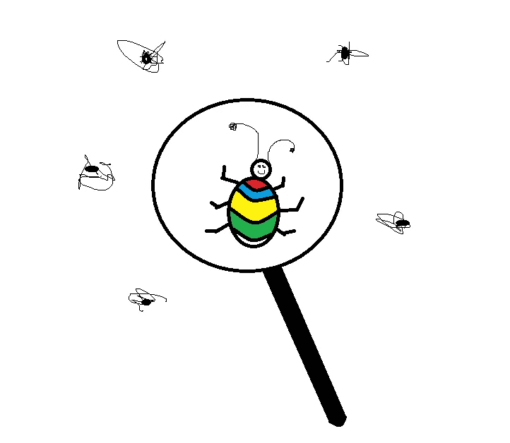

# 在 Python 代码中找到一个 Bug:一件小事做了这么多

> 原文：<https://betterprogramming.pub/find-a-bug-in-python-code-a-little-thing-does-so-much-89d0abd0300c>

## 即使是最小的字符也会带来大问题

用放大镜找窃听器。来源:图片由作者的妻子 Justyna 提供。

在本文中，我将向您展示 Python 中的一个小 bug。这很常见，因为我经常犯这种错误。也许十几次，也许甚至二十次——远远超过我认为可以接受的次数。但是因为我经常犯这个错误，所以我通常很容易发现它。

下面，我将解释一个策略，你可以用它来找到这个和其他的 bug。虽然这看起来像是我们的小游戏，但这实际上是您可以进行调试的方式。

你的任务是找出代码中的一个或多个错误。怎么做？这是你的决定，所以选择你的方法。例如，您可以:

1.  只要阅读代码和回溯，并尝试找到错误。这对于某些代码片段来说比其他代码片段更容易。
2.  将代码复制并粘贴到您的 IDE、文本编辑器或您使用的任何工具中。然后运行应用程序，并尝试使用回溯来找到错误。您还可以使用最简单的非交互式工具来帮助调试，比如`print()`、`logging`模块等等。
3.  如上所述，将代码复制并粘贴到您的编辑器/IDE 中，然后使用您选择的调试器来查找 bug。这是交互式调试。

这些方法都不比其他方法好。每一种都教授不同的技能，所以你应该全部尝试。也许一个好的方法是从方法(1)开始，然后，如果那不起作用，尝试方法(2)，如果你仍然不能找到 bug，尝试方法(3)。

这样，你就从最简单快捷的方法变成了最先进的方法。这部分反映了现实生活中的编码实践，我通常就是这样进行的。老实说，当我第一眼看不到 bug 时，也就是说，当使用第一种方法时，我通常会立即转向第三种方法。

但是，不要低估第二种方法。这很重要，并且教导了一些非常重要的东西:阅读和理解追溯。

所以，让我们直接进入代码。试着找到错误。好消息是这个很容易修复。但要修复它，你必须找到它。当你成功地找到它，修复它是几秒钟的事情。

# 代码

假设您有一个包含数字(整数和/或浮点数)的列表，您希望将每个元素都称为一个数学函数。在我们的例子中，它将乘以 3，我们将在函数`multiply(x, by)`中实现，然后求平方根:

显然，`x_squared`应该是`[1, 9, 49]`。相反，我们得到以下错误:

什么？刚刚发生了什么事？

是你采取行动的时候了。花些时间，试着找出问题所在。回到上面关于如何查找 bug 的描述。

这是有趣的部分，因为你不必担心任何事情。不是你的错误，不是你的问题——但是你的技能会提高！

# 虫子

如果你找到了 bug，恭喜你。很小，很小，几乎可以忽略不计。但它有所不同，它打破了密码。问题是很难捕捉到，因为异常并不是在引入 bug 的地方引发的。因此，这一次，追溯并不是很有帮助。

有用的是信息。让我们再看一遍上面写的:

显然，我们对列表使用了`**`操作数(或者，等价地，使用了`pow()`函数)。当然，这不是我们想要做的，但它应该有助于我们找到问题发生的地方。是吗？

不是一开始。我们在`square_root()`函数中使用了`**`，但是看起来这个函数工作得很好。代码如下:

让我们再一次回到追溯。它提到了`'list'`，但是为什么呢？我们肯定不想要一个列表的平方根，是吗？我们只有一份名单。`x`中定义的那个。让我们仔细检查一下它的定义:

乍一看，这个定义似乎不错。但是仔细看:在右方括号后面有一个奇怪的逗号(通常称为“尾随逗号”)。为什么会在那里？还有 Python 为什么不养个`SyntaxError`？如果是的话，我们就能毫不费力地找到漏洞。但事实并非如此，这就是为什么回溯没有直接把我们带到错误发生的地方。

有趣的是，用分号(`;`)代替逗号没有任何意义，因为在 Python 中，可以在行尾添加分号。任何其他字符(不包括空白字符)都意味着一个`SyntaxError`。但是除了`,`、`;`和空白字符之外，所有其他字符都意味着打字错误和由此产生的`SyntaxError`。

然而，行尾的逗号变化很大。它使`x`成为一个元组，而不是一个列表！而且搞笑的是，这个元组的第一个元素是 list `[1, 3, 7]`。看起来是这样的:

这是因为在创建元组时不必使用括号。这里有一个例子:

包括我在内的许多开发人员在从一个函数中返回两个(有时是三个)元素时使用这种结构。例如:

如您所见，在`return`语句中没有括号。对我来说，这个版本的`return`:

看起来比这个更自然更好:

定义不带括号的元组时，可以用逗号结束。因此，我们得到以下结果:

但是要小心！看下面一行，这与我们在示例中得到的情况非常相似:

这就是我们代码片段中 bug 背后的原因。当您在要指定名称的对象后添加逗号时，该名称不是指该对象，而是指新创建的元组。看起来是这样的:

# 结论

像这样的错误可以通过添加一个逗号来避免。这种情况对您来说可能并不常见，但它发生的频率比您想象的要高，或者至少我在编码实践中制造了太多类似的错误。我认为在大多数情况下——如果不是全部的话——它发生在我修改代码的时候。这听起来奇怪吗？

不是的。例如，您可以在以下情况下引入这样一个 bug 假设您有一个包含几个值的字典:

这里，省略号表示字典中更多的键值对。您决定将密钥直接移动到代码中。看起来像这样:

当这样做时，很容易出现我们在本文中讨论的错误。你注意到我确实做到了吗？就在`end_date`的定义里。至少在这种情况下，这个小而重要的错误背后的主要原因是，对代码的这种修改需要您对每一行做一些不同的事情。

这里，你需要先删除`settings`字典的定义。然后，您必须删除每行中的前导空格和尾随逗号。当你不小心的时候——至少对我来说，当我不得不一件接一件地做这些无聊的事情时，这是一种很难达到的精神状态——你可能会忘记移走留在线末端的几个小东西中的一个。

感谢阅读！我希望你喜欢阅读这篇文章和做练习。这是最基本的，但是我会在以后给你提供一个有更多困难问题的查找 bug 游戏。最重要的是，我希望如果你犯了这样的错误，或者在别人写的代码中遇到了这样的错误，你能毫无问题地发现它。

正如我上面写的，我已经犯过几次这样的错误了。你做过这样的虫子吗？如果是，你发现它没有问题吗？

请在评论中分享你的想法和经历。