# 使用 React and Go 设置 Firebase 身份验证

> 原文：<https://betterprogramming.pub/firebase-authentication-with-react-and-go-3784f91fa760>

## 使用 create-react-app 和 Go API 设置 Firebase 的简单教程


图片来源:作者

在本文中，我将向您展示使用 create-react-app 和 Go API 通过一个简单的 SPA 应用程序实现 Firebase 身份验证的过程。

# 回购示例

以下是完整代码库的链接，以供参考:

[](https://github.com/manakuro/firebase-authentication-with-react-and-go) [## mana kuro/fire base-验证-反应-开始

github.com](https://github.com/manakuro/firebase-authentication-with-react-and-go) 

# 设置 React 应用程序

首先，我们用 [create-react-app](https://github.com/facebook/create-react-app) 创建一个 SPA 应用程序:

```
npx create-react-app firebase-authentication-app --template typescript
```

注意:如果您遇到这样的警告，请卸载 create-react-app 并重试。

```
A template was not provided. This is likely because you're using an outdated version of create-react-app.
Please note that global installs of create-react-app are no longer supported.
```

卸载:

```
npm uninstall -g create-react-app
```

如果不起作用，只需移除`/usr/local/bin/create-react-app`:

```
rm -f /usr/local/bin/create-react-app
```

# 创建注册页面

为了快速创建注册页面，我们使用了[材质 UI](https://material-ui.com/) 。

安装一些依赖项:

```
yarn add @material-ui/core @material-ui/icons react-social-login-buttons
```

添加`src/SignUp.tsx`:

并在`src/App.tsx`导入:

然后，您将在`http://localhost:3000`处看到该页面:

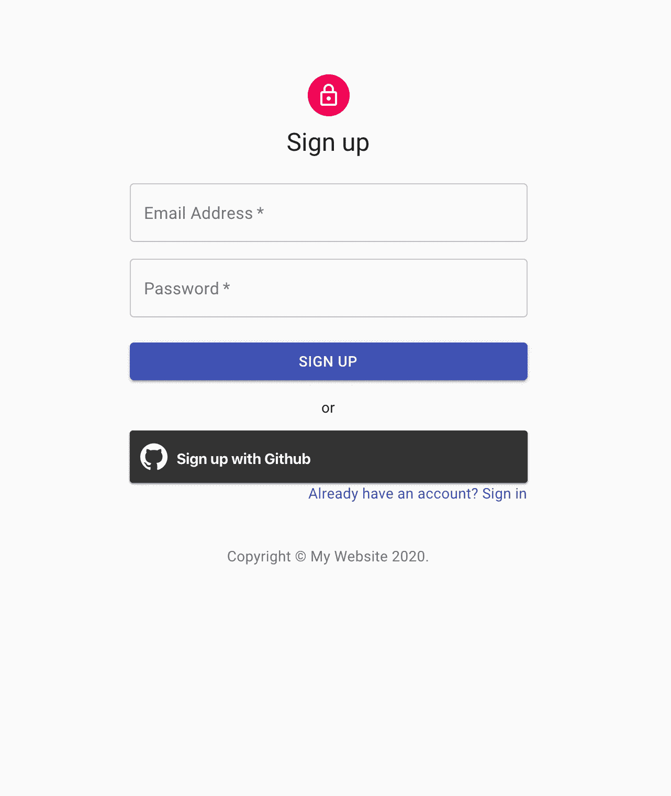

注册页面

在这一部分中，我们允许用户用他们的电子邮件和密码以及 GitHub 帐户注册。

# **安装燃烧底座**

接下来，我们将把 [Firebase](https://firebase.google.com/docs/?gclid=EAIaIQobChMIsfDlvYnr5wIVCp53Ch0vVwVKEAAYASAAEgJCjfD_BwE) SDK 引入到我们的应用程序中，并使其能够与 Firebase 认证服务器连接。

如果您不熟悉 Firebase，请阅读[了解 Firebase 项目](https://firebase.google.com/docs/projects/learn-more?hl=en)并学习最佳实践。

## 创建一个 Firebase 项目

转到 [Firebase 控制台](https://console.firebase.google.com/)并点击添加项目:


添加项目

继续执行一些步骤并查看概述页面:

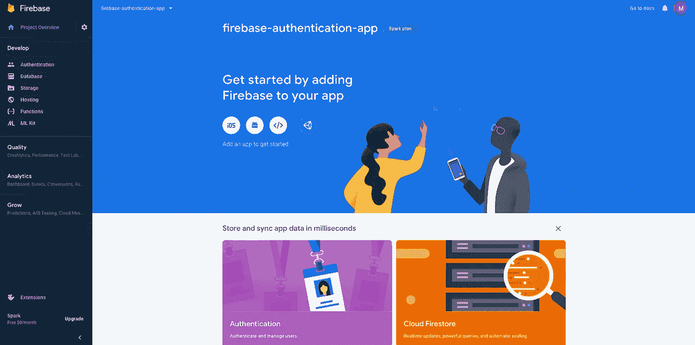

Firebase 控制台页面

## 向 Firebase 注册应用程序

在 Firebase 控制台中，单击 Web 图标(>):

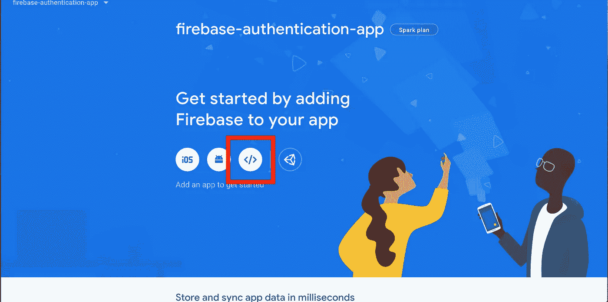

网络图标

输入应用昵称，然后单击注册应用:

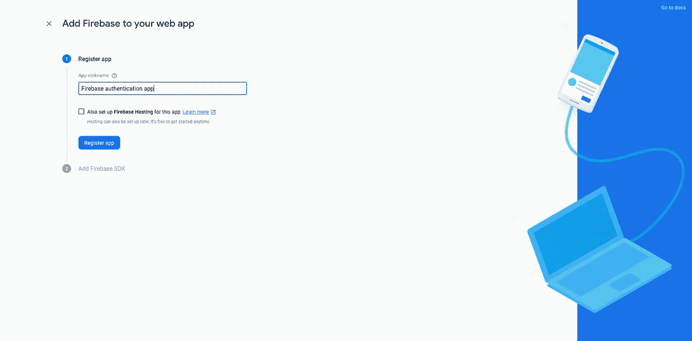

将 Firebase 添加到您的 web 应用程序

设置完成后，您将看到 Firebase 配置，稍后我们将使用它来启用 Firebase SDK，因此请记下它。

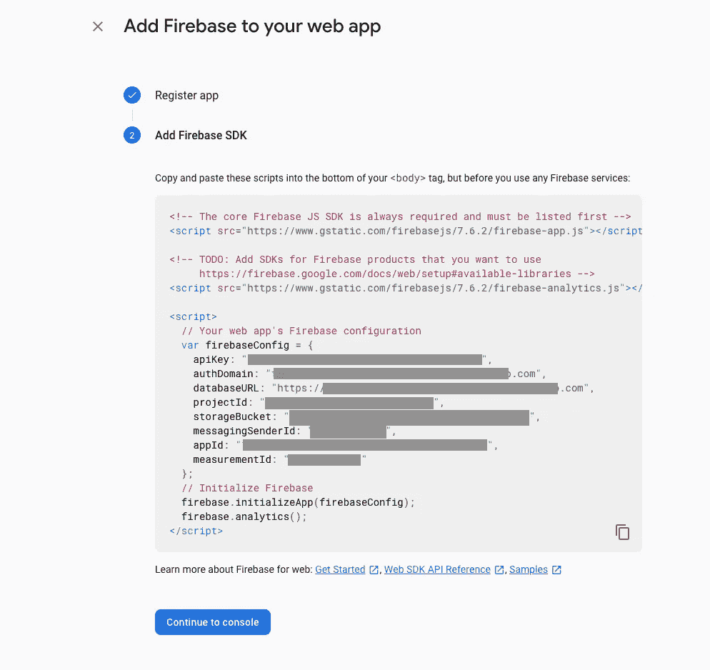

Firebase 配置

## 包括 Firebase SDKs

接下来，我们将把 Firebase SDKs 添加到我们的应用程序中并启用它。

安装`firebase`模块:

```
yarn add firebase
```

添加`src/utils/firebase.ts`初始化 Firebase app:

添加`src/const/index.ts`:

在根项目中添加`.env`,并应用我们上面得到的配置:

您需要在 create-react-app 中创建以`REACT_APP_`开头的环境变量。在[文档](https://create-react-app.dev/docs/adding-custom-environment-variables/)中阅读更多细节。

# 使用电子邮件和密码进行身份验证

接下来，我们将使用电子邮件和密码实现身份验证，这是 Firebase 中基于密码的帐户。

要启用`Email/Password`登录，请转到 [Firebase 控制台](https://console.firebase.google.com/)中的认证:


Firebase 控制台中的身份验证

转到登录方法选项卡，然后单击电子邮件/密码:

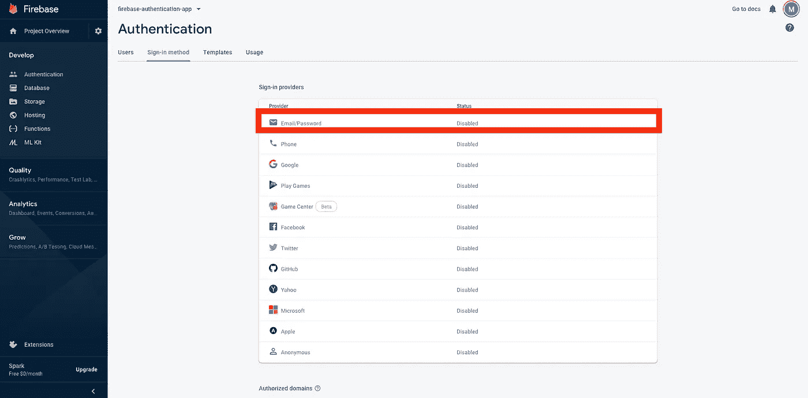

电子邮件/密码登录方式

启用并单击保存:


我们已经准备好使用 Firebase SDKs 了，那就注册吧。

增加`src/SignUp.tsx`提交处理:

填写电子邮件和密码(确保电子邮件格式有效，密码至少为六个字符):

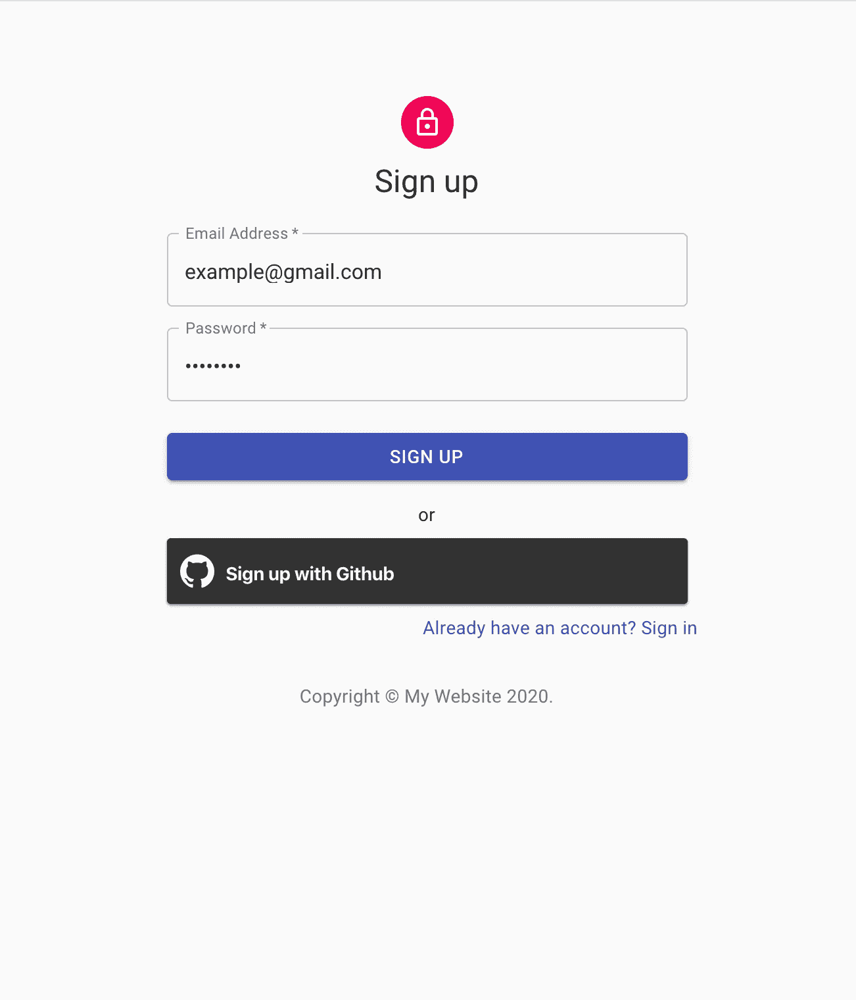

单击注册后，您可以看到用户已经在 Firebase 控制台中创建:

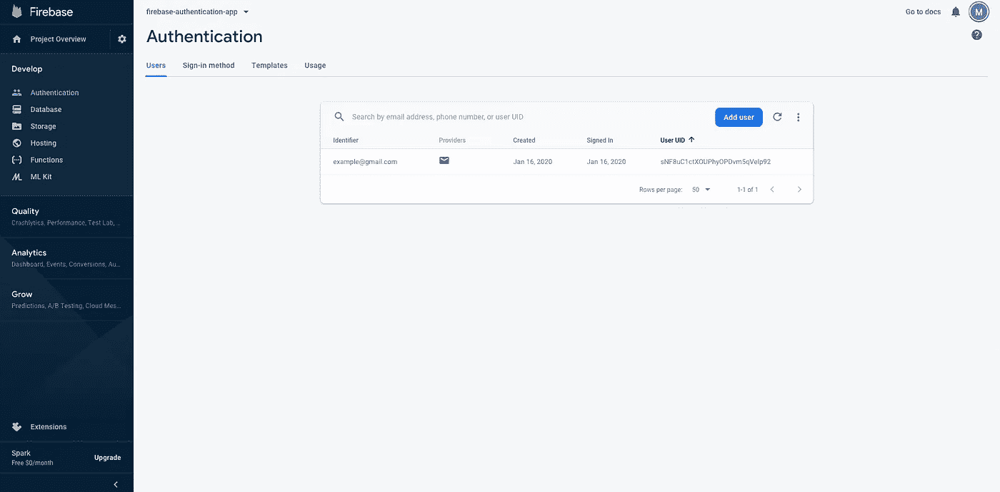

# 通过 GitHub 认证

既然我们已经创建了基于密码的身份验证，接下来我们将使使用 OAuth 和 GitHub 成为可能。

将 GitHub 身份验证集成到我们的应用程序中的步骤如下:

*   在 GitHub 上注册 app 为开发者应用，获取 OAuth 2.0 客户端 ID 和客户端密码。
*   在 Firebase 控制台中启用 GitHub provider，并添加客户端 ID 和客户端密码。

转到 [GitHub 设置](https://github.com/settings/profile)并点击开发者设置:

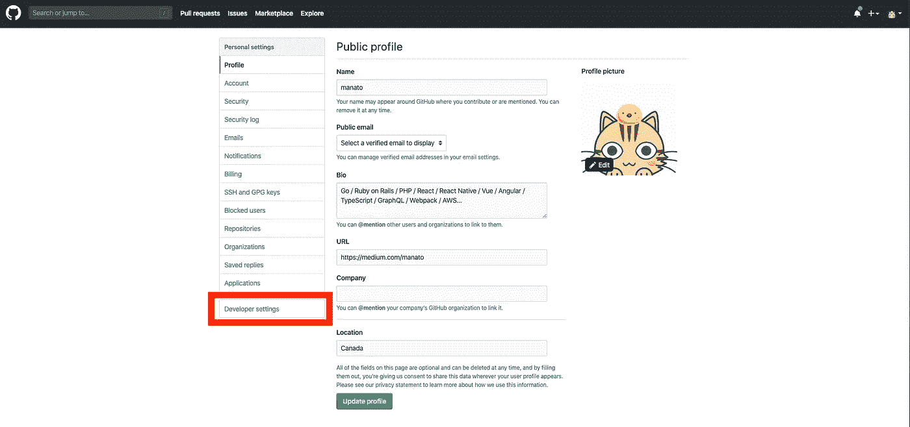

开发者设置

转到 OAuth 应用程序部分，然后单击新建 OAuth 应用程序:

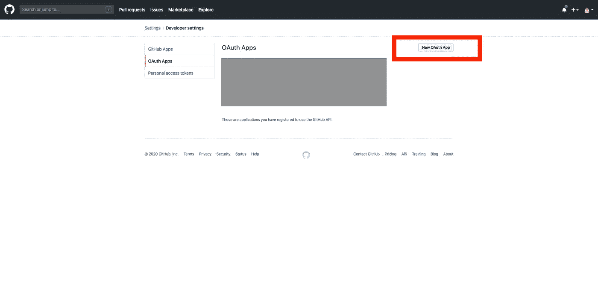

您会看到注册页面:


`Authorization callback URL`应该是 Firebase 身份验证的回调 URL，所以让我们转到 Firebase 控制台上的登录方法。您可以在提供商列表中找到 GitHub:


单击它并复制 URL:

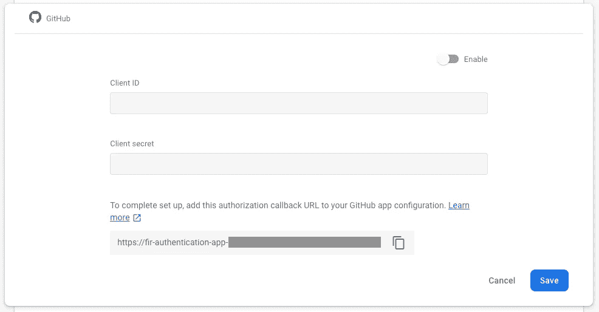

返回 GitHub 页面并将其粘贴到授权回调 URL 框中:

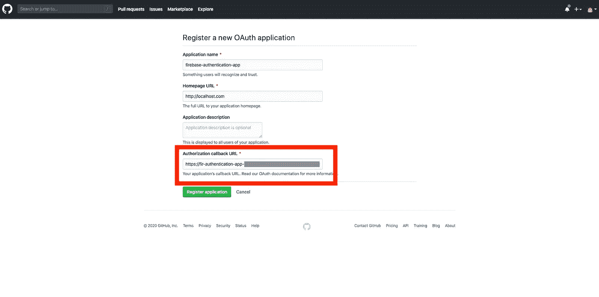

成功创建后，您可以获得客户端 ID 和客户端密码:

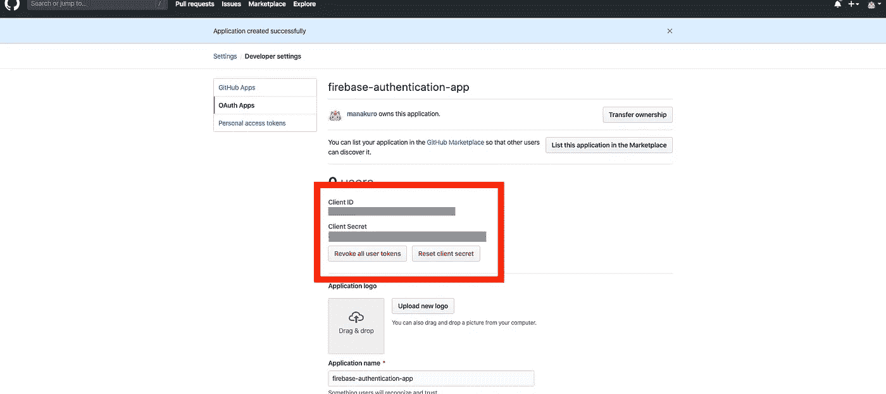

复制它们并回到 Firebase 控制台。

启用它并填写客户端 ID 和客户端密码:

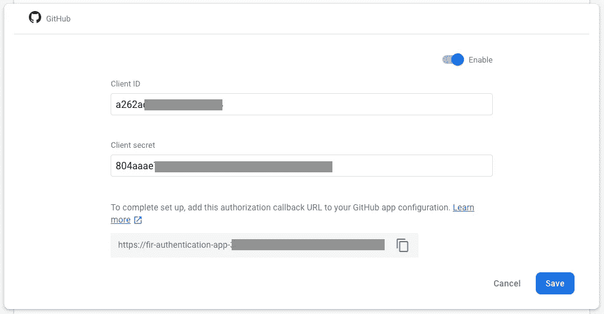

现在我们已经添加了 GitHub 作为提供者。

接下来，回到源代码，处理注册流程。

在`src/SignUp.tsx`添加注册 GitHub 的处理程序:

如果用户已经登录，`linkWithPopup`将凭证链接到一个现有帐户，以免重复用户。关于链接的更多细节可以在 [Firebase 文档](https://firebase.google.com/docs/auth/web/account-linking?authuser=0)中看到。

让我们试一试，看看效果如何。

点击注册 Github，你会看到弹出窗口:

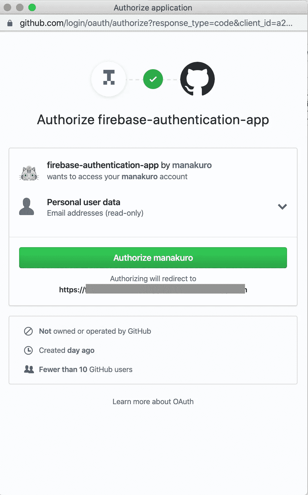

看起来效果不错。

授权后，如果您已经登录，Github 已被添加为 Firebase 控制台中的提供者:


# 实现 Go API

现在我们已经在前端客户端实现了基于密码和 GitHub 的认证流程。

接下来，我们将创建一个在数据库中注册用户的 API。

## 属国

需要获取一些依赖项，所以安装它们:

```
go get github.com/labstack/echo
go get github.com/jinzhu/gorm
go get github.com/jinzhu/gorm/dialects/mysql
go get bitbucket.org/liamstask/goose/cmd/goose
```

## 用 Docker 设置 MySQL

我们使用 Docker 来设置 MySQL8.0。

在根项目中添加一个`docker-compose.yml`:

并运行它:

```
docker-compose up
```

## 创建数据库

在 MySQL 控制台中创建一个名为`firebase-authentication-app`的数据库:

```
CREATE DATABASE `firebase-authentication-app`;
```

## 创建用户表

[goose](https://github.com/pressly/goose) 是 Go 中的迁移工具之一，提供了通过 SQL 或 Go 函数管理数据库模式的能力。

添加`db/dbconf.yml`:

```
development:
  driver: mysql
  open: root:root@tcp(127.0.0.1:3306)/firebase-authentication-app
```

确保正确连接到:

```
$ goose statusgoose: status for environment 'development'
    Applied At                  Migration
    =======================================
```

通过以下命令创建用户表:

```
goose create CreateUsers sql
```

您将看到在`db/migrations`中生成的迁移文件:

```
-- +goose Up
-- SQL in section 'Up' is executed when this migration is applied

-- +goose Down
-- SQL section 'Down' is executed when this migration is rolled back
```

将 SQL 添加到:

执行 SQL:

```
goose up
```

`uuid`应该是 Firebase 中唯一的 ID。您可以在 Firebase 控制台上看到它:


## 连接到 MySQL

我们使用 [gorm](https://github.com/jinzhu/gorm) 来连接 MySQL。

添加`datastore/db.go`:

## 设置回显服务器

添加`main.go`:

## 注册用户

接下来，我们将添加一个在数据库中注册用户的端点。

首先，在`domain/model/user.go`中添加用户模型:

并在`main.go`中添加一个处理程序:

让我们在`http://localhost:8080/users`的 Postman 中测试一下:

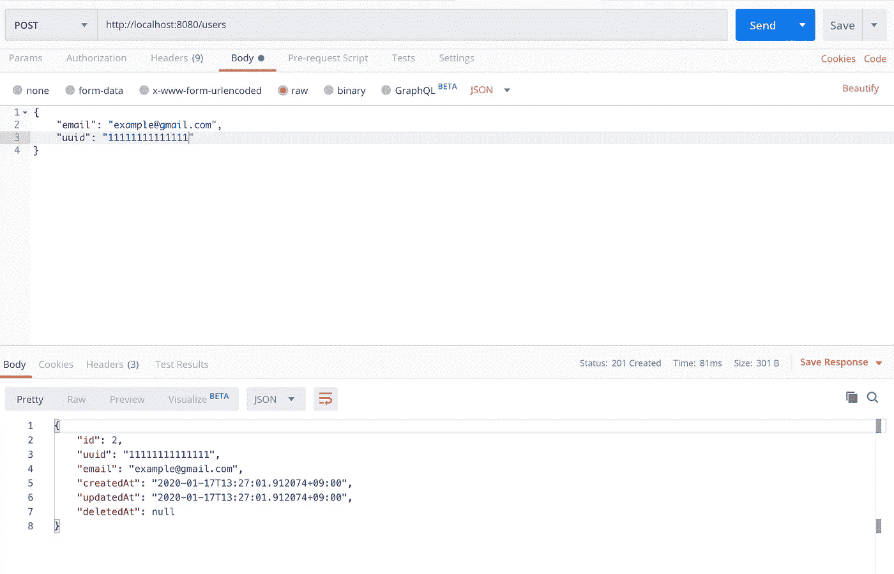

它成功地在数据库中创建了用户并对其进行了响应。

如果用户已经注册:

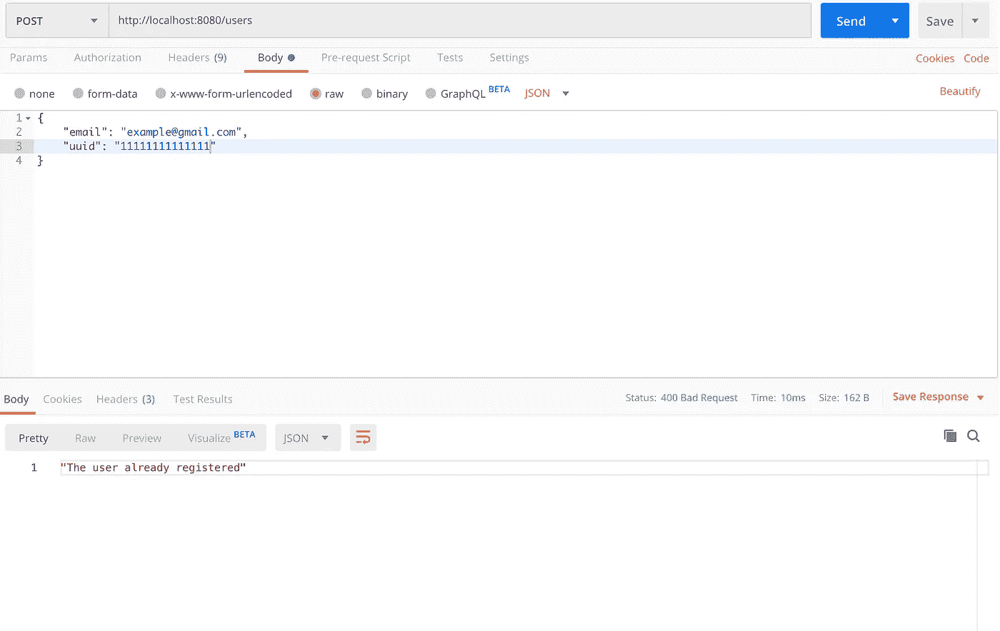

返回“用户已经注册”。看起来效果不错。

# 限制 API

`/users`现在可以从客户端获得任何访问。我们希望通过安全地验证传递的令牌来限制访问。Firebase 为此提供了 SDK。

首先，创建一个使用 SDK 的凭证。进入 Firebase 控制台，打开设置>[服务账户](https://console.firebase.google.com/project/_/settings/serviceaccounts/adminsdk)。

单击生成新私钥:

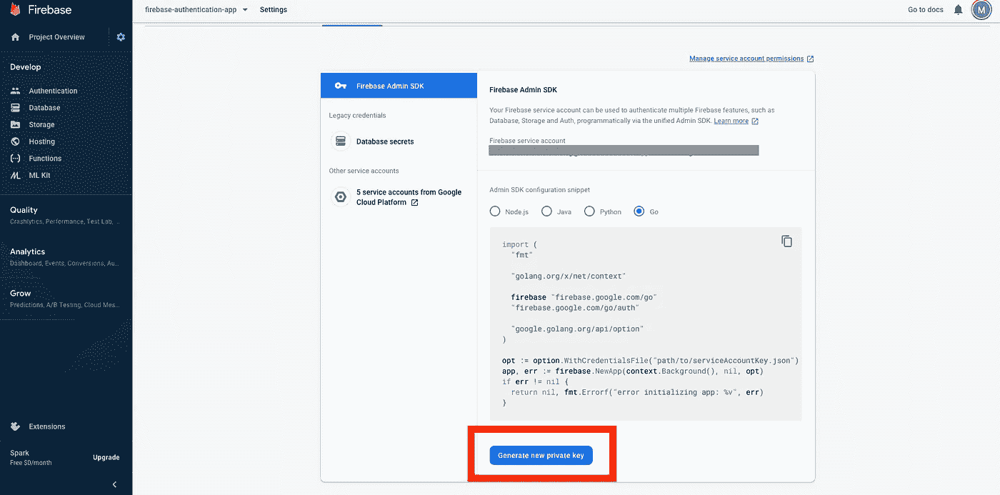

您可以下载私钥。

接下来，我们将创建一个用于认证的中间件。

添加`router/middleware/auth.go`:

将服务密钥路径传递给`option.WithCredentialsFile(...)`。

将`echo.context`设置为认证后 Firebase 提供的`token`数据。

并添加`router/context/context.go`:

包含`main.go`中的中间件:

现在`http://localhost:8080/api`被限制。要访问它，我们需要将令牌添加到 HTTP 头中。

# 连接 API

我们已经创建了端点，所以接下来，我们将把前端客户端连接到 Go API。

在 Firebase 认证之后，我们希望通过 API 在我们的数据库中注册用户数据。

我们使用 axios 作为 HTTP 客户端:

```
yarn add axios
```

添加`src/api/index.ts`:

在`.env`中增加`API_URL`:

```
REACT_APP_API_URL=http://localhost:8080
```

和`src/const/index.ts`:

```
export const API_URL = process.env.REACT_APP_API_URL as string
```

使用`src/SignUp.tsx`中的 API:

`api.setToken(idToken)`为 Firebase 访问令牌设置 HTTP 头，以便与我们的 API 进行通信。

让我们来测试一下:

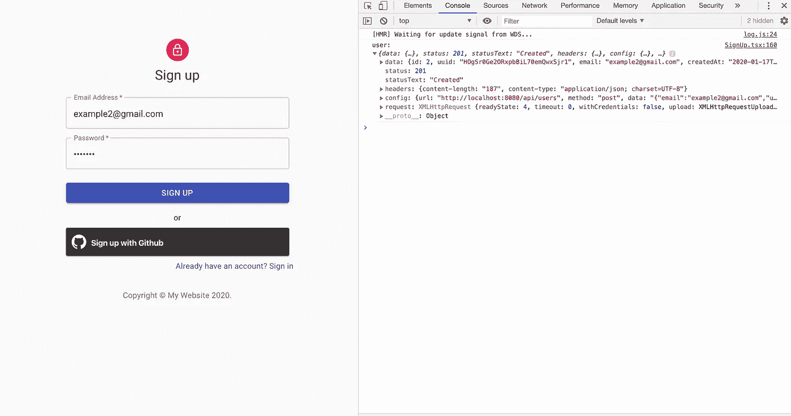

您可以看到用户是在控制台和数据库中创建的:


# 结论

就是这样。我们用 React and Go 实现了一个简单的注册页面。希望这篇文章能够帮助您进行身份验证。

您可以在以下网址查看最终代码库:

[](https://github.com/manakuro/firebase-authentication-with-react-and-go) [## mana kuro/fire base-验证-反应-开始

github.com](https://github.com/manakuro/firebase-authentication-with-react-and-go)