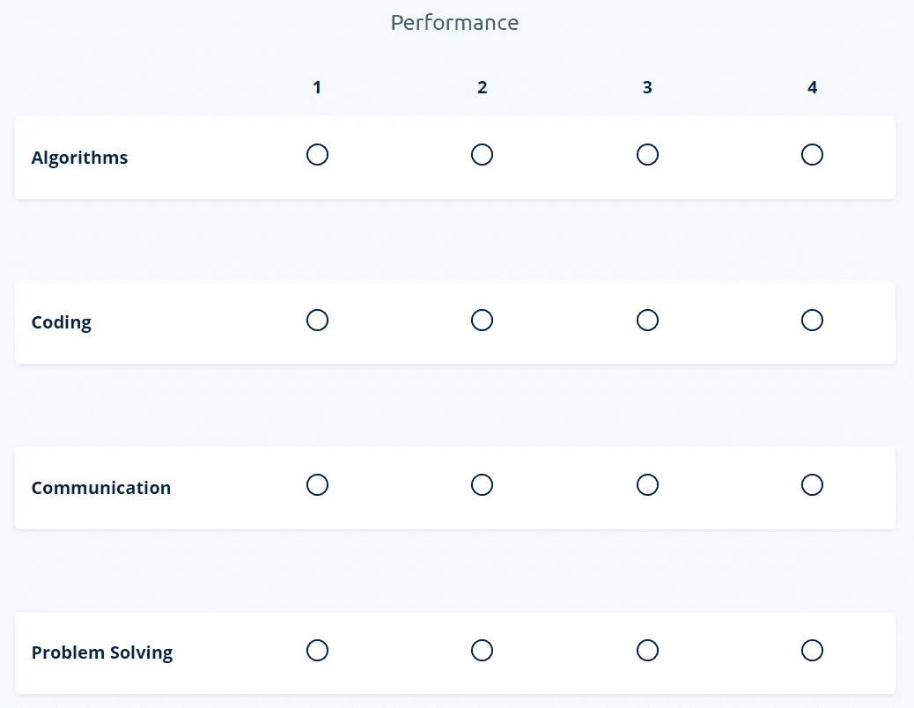
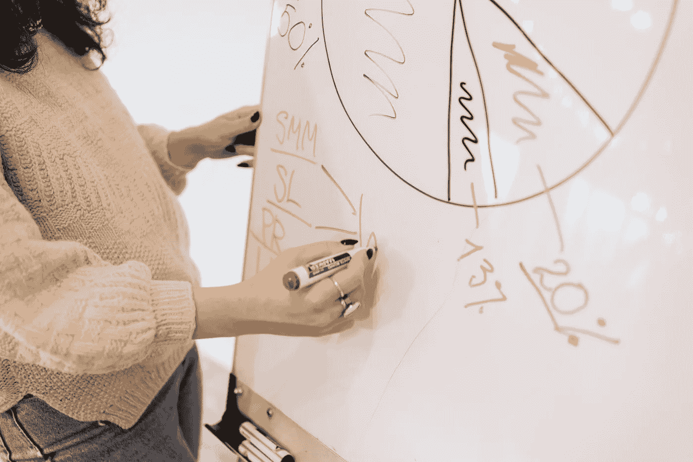

# 我再也不会犯的五个面试错误

> 原文：<https://betterprogramming.pub/five-interview-mistakes-i-am-not-doing-anymore-85bbd0f234c5>

## 你可以在下次面试中运用的经验

莎拉·基利安在 [Unsplash](https://unsplash.com?utm_source=medium&utm_medium=referral) 上的照片

在我短暂的软件工程师生涯中，我已经有机会参加了数百次面试。

就在疫情开始之前，我开始寻找我的第一份开发人员工作，我花了六个月和几十次面试才找到我的第一个角色。

从那以后，我已经换了两次角色，2021 年 9 月加入 Glovo，现在是 2022 年 11 月加入优步。最初我应该在九月加入梅塔，但是我的邀请在开始日期前不久被取消了，尽管有一份签署的合同。

我决定在 Linkedin 上写一篇[帖子来发泄我的沮丧，我被社区的支持和收件箱里的几十个招聘人员淹没了。在此过程中，我有机会与许多不可思议的人互动，并面试了许多公司，如 Spotify 和优步，这些公司之前拒绝了我的申请。](https://www.linkedin.com/posts/fmabss_meta-layoffs-activity-6975533047198691329-g5qS?utm_source=share&utm_medium=member_desktop)

我已经从 Glovo 辞职加入 Meta，在没有任何其他工作的情况下，我参加了 20 多家公司的近 50 轮面试。

在这段经历中，我犯了很多错误，多次面试失败，但由于我所学到的东西，我也得到了很棒的工作机会。下面是我犯的五个最大的错误以及从中得到的教训:

# 1.没有意识到软技能的重要性

如果你从这篇文章中只学到一件事，那就是，任何面试的目标，包括技术面试，都是向面试官展示你是如何在压力下工作和交流的。

我想把重点放在沟通部分！

对于大多数公司来说，沟通是评估的一个重要部分，一个候选人完美地完成了任务，但未能解释他们的思维过程，很可能会得到“不录用”的分数。

一位前工程师称，谷歌算法面试的评分框架来自[来源](https://www.algoexpert.io/mock-interviews/feedback?id=fake_feedback_form)

在谷歌和其他大型科技公司的编码面试中，沟通和编码能力在他们的评分标准中同样重要。

我失败了很多面试，因为我认为一些细节是显而易见的，或者面试官不需要进一步的解释，或者没有解释我自己就编码。

现在，我总是确保自己清楚地表达了自己的想法，并询问面试官他们是否明白我的思路。

# **2。立即跳转写代码**

一旦得到一个技术评估，我通常会思考一会儿，然后立即开始朝着我认为可能是解决方案的方向编码。
出于几个原因，这是一个巨大的错误。

首先，你在面试中的主要任务不是解决技术问题，而是展示你如何在压力下工作，如何沟通，以及消除歧义。

你必须通过提问来证明你能够果断地处理不确定性，从而确保你理解了问题。

照片由[帕维尔·丹尼柳克](https://www.pexels.com/it-it/@pavel-danilyuk/)，[来源](https://www.pexels.com/it-it/foto/persona-scrittura-maglione-disegno-6340674/)

其次，你不想只为了你的考官在面试结束时告诉你而走上错误的解决方案。

在写一行代码之前，提出多种解决方案，并在浪费时间写一个不能满足需求的实现之前寻求面试官的一致意见。

# 3.不听我的面试官

当我开始担任面试官时，这一点变得非常明显，但这也是我过去多次面试失败的原因。

我的印象是，我们这个社会的人似乎真的很难积极倾听。

我们不善于倾听的最大原因是，我们没有全神贯注地积极倾听，而是已经在思考我们要说什么。

这一点在压力大、时间有限的面试中更加突出。

我想充分利用我的时间，但这实际上经常导致我不理解提示，在几分钟内被纠正，并不得不从头开始重新评估问题。

> “听觉是被动的。倾听是主动的。最好的倾听者会集中注意力，并调动其他感官来努力。理解是倾听的目标，需要付出努力。”
> 
> —凯特·墨菲，[你没在听:你错过了什么，为什么这很重要](https://www.goodreads.com/work/quotes/69682531)

这不是可以立即纠正的事情，但是意识是一个很好的开始，像这本书这样的资源可以提供难以置信的帮助。下次记得关注你的面试官在说什么，并确保你理解他们(问一些澄清性的问题！).

我作为面试官看到的另一个常见模式是固执。如果面试官告诉你有些事情不对劲，或者建议你做些什么，仔细考虑他们的观点是个好主意！没有什么比候选人顽固地拒绝走正确的方向更糟糕的了。

要在现实世界中实践这一点，你可以亲自尝试面试官的角色。自愿去你的单位面试，或者和你的朋友一起组织模拟面试，利用这个机会！

# 4.低估第一次招聘电话

我总是把第一个招聘人员的电话看作仅仅是一种形式。当我被一个我感兴趣的职位以“不符合文化”为由拒绝时，这让我更加惊讶。

在与从事招聘工作的朋友交谈后，我很快意识到自己的错误有多大。
招聘人员的作用不是浪费你的时间，而是评估你的简历和职位是否匹配，评估你对公司的动机和兴趣。

照片由[勒内·拉尼什](https://unsplash.com/@frame_media?utm_source=medium&utm_medium=referral)在 [Unsplash](https://unsplash.com?utm_source=medium&utm_medium=referral) 拍摄

不知道公司做什么，或者对公司文化不感兴趣，可能是你在这个过程中没有进一步发展的原因，或者是另一个候选人最终被选中的原因。

比大多数候选人优秀不需要太多，你需要做的就是:

*   仔细阅读职位描述，在面试时让它清晰可见，用要求中的词语突出你的技能。
*   简要调查该公司，了解主要产品。
*   找到公司网站，特别是列出公司价值观的页面；在你对这家公司感兴趣的原因中提到其中的一两个会给面试官留下很好的印象。

> 我对透明的承诺印象深刻，我觉得这真的符合我的个人价值观

# 5.没有为行为面试做准备

今年 6 月，我参加了亚马逊公司的中级工程职位面试。任何对亚马逊招聘感兴趣的人都知道，他们非常重视文化契合度和 [14 领导原则](https://www.amazon.jobs/en/principles)。

我的招聘人员非常详尽地解释了行为部分的重要性，如何使用[明星技巧](https://careersblog.enterprise.ie/tips-on-using-the-star-technique-to-answer-job-interview-questions/)，并建议我为主要原则准备几个故事。

> 描述**情况**
> 解释你的**任务**，你试图实现什么你采取了什么**行动**？
> 分享**结果**和你产生的影响

我低估了这部分，毕竟我过去做过很多行为访谈。

当时间到来时，我没有准备好面对接二连三的问题，我的故事也没有想象中那么有力。

由于技术部分的执行力非常强，我得以获得一份工作，但由于在领导部分没有表现出足够的资历，我被降级为初级。

事后看来，如果我更仔细地准备我的故事，我本可以很容易地得到一份更高的工作。

为了防止这种情况发生在你身上，研究一下[最常见的面试问题](https://www.themuse.com/advice/behavioral-interview-questions-answers-examples)，准备几个能让你处于有利地位的答案。
我也强烈建议采用[明星技巧](https://careersblog.enterprise.ie/tips-on-using-the-star-technique-to-answer-job-interview-questions/)，只谈论实际经历，你做了什么，而不是在某种情况下你会做什么。

感谢您阅读到目前为止，如果您想为下一次面试做准备，请随时在 [LinkedIn](https://www.linkedin.com/in/fmabss/) 上与我联系或阅读另一个故事。

 [## 解决 500+ Leetcode 问题后学到的五件事

### 为什么研磨 Leetcode 没那么糟糕

towardsdatascience.com](https://towardsdatascience.com/five-things-i-have-learned-after-solving-500-leetcode-questions-b794c152f7a1)