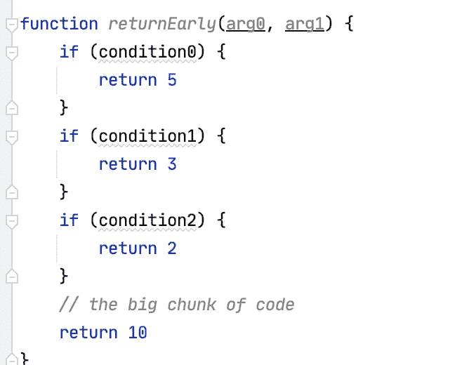
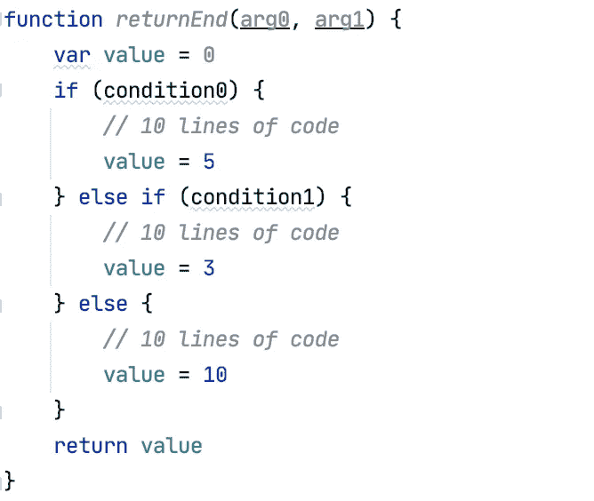

# 灵活的编码风格——你还坚持一种吗？

> 原文：<https://betterprogramming.pub/flexible-coding-styles-are-you-still-sticking-to-one-cd5234089ae4>

## 用实用性来指导你的编码决策


照片由[延斯·勒列](https://unsplash.com/@leliejens?utm_source=medium&utm_medium=referral)在 [Unsplash](https://unsplash.com?utm_source=medium&utm_medium=referral) 上拍摄

在互联网上，有些人喜欢通过制造一维论点来吸引眼球，如语言 A 比语言 X，Y 和 z 更好。他们旨在通过展示各种证据来保持客观。然而，你知道，这些证据总是偏向于支持自己的论点。你可以很容易地在互联网上找到同等数量的文章，认为语言 X 比语言 A、Y 和 z 更好。

除了关于不同语言的优越性的争论，我最近看到了一些关于如何在最初选择的编程语言之外进行编码的一般性讨论。毫无疑问，比起关于哪种语言更好的讨论，我更欣赏这些讨论。因为我相信每种语言都有它自己的优点和缺点，如果没有适当的背景，这种争论实际上是没有意义的。相比之下，无论选择哪种语言，编码风格都具有更广泛的适应性。

然而，我确实注意到许多人认为我们应该这样做而不是那样做，而其他一些人则认为应该不惜一切代价避免那样做。就我个人而言，我不喜欢拘泥于一种特定的编码风格。相反，我使用不同的，有时相反的编码风格，即使在同一个项目中。我遵循的唯一原则是使我的代码易于阅读，并且不会给我的同事和我自己造成混乱。

在这篇文章中，我想回顾一下我最近看到的五个讨论。我想说的是，我们不应该拘泥于一种编码风格，而是应该尽量灵活。你的目标是以合理的可维护性完成你的项目。

# 1.功能:是否提前返回

如果你的函数执行操作而不输出任何值，我们不返回任何东西。但是，如果您的函数输出值，您需要确定何时应该返回值。特别是，基于输入参数，您的函数将执行不同的操作。考虑下面这个微不足道的例子。出于本文讨论的目的，代码示例只是一些伪代码。

是否提前返回

## 守则摘要

*   第一个函数`doOperation0`按顺序计算一些条件，并在到达函数末尾之前返回适用的值。
*   第二个函数`doOperation1`用一个大的 if/else 语句评估各种条件。它在开始时创建返回值，不同的操作相应地应用和修改返回值。

## 讨论

我理解有人更喜欢其中一个并坚持下去，但我两个都用。这是我的经验法则——结构清晰。

*   当条件的替代评估很短并且预期发生的频率较低时，我会让我的函数提前返回值。我将首先列出这些可供选择的条件，可能只占几行。该代码的读者首先会知道，对于这些不太常见的情况，该函数不会做太多事情。然后，他们可以专注于代码的其余部分，这是该函数打算处理的大部分操作。
*   **当不同的条件以大约相同的频率发生，并且每个计算都包含相似长度的代码时，我会让我的函数在最后返回。**这种风格将隐含地迫使读者阅读整个函数，他们将了解将会发生多少种情况，以及如何检查和评估每一种情况。

下面的截图给你一个概念证明。左边的函数对前三个条件有非常简单的操作。因此我把它们放在顶部，这样读者就知道这些条件不是函数的焦点，他们可以很快继续。相比之下，右边的函数在每种情况下都有相似的代码长度，因此我想让它们并行，并在函数中具有相同的权重。



何时在函数中返回

# 2.逻辑流程:使用或不使用“else”

与上一节相关，我们通常必须根据是否满足特定条件来执行特定操作。为了创建所需的分支，我们通常需要多个 else/if 语句。然而，很多人讨论我们是否需要一个 else 语句，有时它看起来是可选的。考虑下面的小例子来展示两个逻辑流。


有无 else 的逻辑流

对于这两个逻辑流，假设我们理解旧值可以是 a、b 或 c，并且我们想要重新编码旧值。像其他用例一样，人们对这两个选项有不同的偏好。你只是坚持其中之一吗？我不得不说，在不同的场景中，我两者都用。

*   **当我处理一些比较稳定的数据时，有时会省略 else 语句。**换句话说，数据除了 a、b 和 c 之外没有其他条件。这种情况只会发生在你做一个小项目，并且数据被彻底检查和了解的时候。
*   当我处理可能发生变化的数据时，不管可能性有多大，我都会使用 else 语句。尽管除了 a、b 或 c 之外的情况极有可能发生。你想安全起见。

因此，在大多数情况下，您可能仍然希望在您的逻辑流中包含一个 else 语句，因为很可能会发生意想不到的事情。如果不想使用 else 语句，也可以为要更新的`recodedValue`设置一个默认值，作为后备值，如下所示。

```
var recodedValue = 999
if (oldValue == "a") {
    recodedValue = 0
} else if (oldValue == "b") {
    recodedValue = 1
} else if (oldValue == "c") {
    recodedValue = 2
}
```

# 3.访问范围:是否使用全局变量

当涉及到全局变量的讨论时，一些经验丰富的开发人员完全反对这种行为，他们认为肯定会引入 bug。然而，其他一些开发人员非常开明，倾向于大量使用全局变量——这都是因为它们非常方便。

我的观点是**我们可以使用全局变量，但要谨慎使用**。以下是需要澄清的其他几点。

*   在大多数情况下，如果您确实需要经常使用常量变量，可以将它们设置为全局变量。不要在代码中写神奇的数字，你应该总是使用变量来捕捉这些值，即使你认为它们不太可能改变。因为谁知道呢？
*   如果您的项目使用一些全局变量，并且它们会相对频繁地发生变化，那么您需要非常小心。您需要考虑该值是否有可能在项目中不同组件的使用过程中发生变化。
*   在上面的例子中，你可以考虑使用一个 singleton 对象来捕获相关的变量，并最小化对象可以被更新的地方，这样你就可以准确地知道对象的值在哪里会变得不正常。在大多数其他地方，它们被用作对象的引用。

# 4.设计模式:功能型还是面向对象型

许多编程语言同时具有函数和面向对象的特性。当您在项目中使用这些语言时，您可以灵活地以一种更具功能性的方式或面向对象的方式实现您的代码。例如，我使用 Python 进行我的数据科学研究。鉴于 Python 的灵活性，我可以编写一堆函数来显式传递数据，也可以编写类，类的实例保存数据。

你应该选择哪种设计模式？我喜欢两者都用，但是使用哪一个取决于几个因素，如下图所示。

*   **如果数据本身并不复杂，我将坚持使用功能方法。**这是因为你会看到数据是如何在你的代码中流动的，而且用嵌套较少的结构通常更容易调试。
*   如果数据很复杂，不能用内置的数据类型来表示，你可以创建自定义的类来获取数据。以自定义类为脚手架，你可以用 OOP 的方式构建你的项目。当然，这伴随着管理需要实现额外方法的类的代价，但是这是值得的。我们应该意识到，无论我们选择什么样的设计模式，任何程序的核心都是操纵数据。如果您的数据能够以一种有意义的方式来表示——通过一个类实例——那么它的所有相关功能就能得到更好的理解。

# 结论

在本文中，我们回顾了一些人喜欢坚持的编码风格。但我的观点很简单:你不应该只局限于一个。您应该根据项目的范围和代码的基本业务需求来做出决定。

唯一的原则是您希望您的代码可读和可维护。此外，你可以在合理的时间内完成你的项目。你可以花很多时间遵循固定的编码原则来试图完善你的代码，这可能会大大降低你的进度。因此，您应该更明智地使用您的工具集，并对工具箱中可用的工具持开放态度。