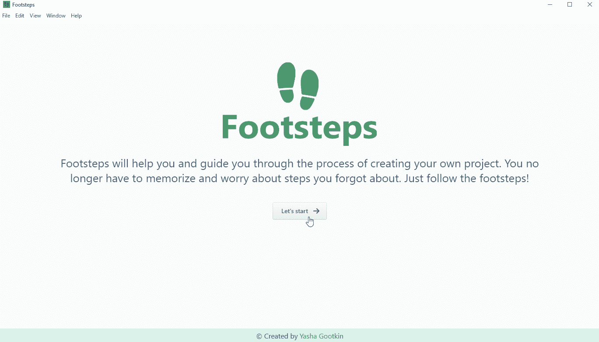
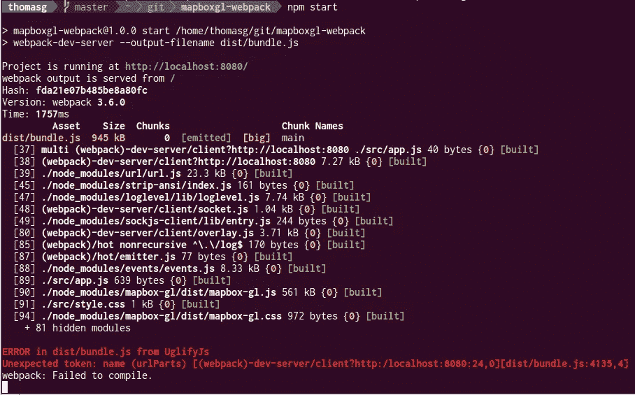

# 介绍 footwes 1 . 0 . 0:从头开始创建新项目的更好方法

> 原文：<https://betterprogramming.pub/footsteps-1-0-0-the-better-way-to-create-a-new-project-from-the-ground-up-1e01b4dec15b>

## 电子、Node.js、React 和 TypeScript chimera 应用程序的故事，以及如何选择(或淘汰)技术和框架

在过去的一年里，我的重点从 Node.js 和 React 转移到了 less Node.js 和 less React。它们仍然是我的开发堆栈的一部分，但是我发现我自己开发 Ruby on Rails 微服务，并且在 Kubernetes 上部署服务的频率更高了。在某一点上，我最接近前端的是 Grafana 仪表板，上次我检查时，我没有开发那个。

但是这就是一个软件工程师的生活:你根据什么是最高优先级的来循环完成许多不同的任务。因此，当我从“WeWorker”职位过渡到新的“前 WeWorker”职位时，我决定要补上我错过的一切。

这就是脚步声出现的地方。

 [## yashag/脚步声

### 创建 node.js 项目/包的可视化指南。因为这是一个开发中的电子项目，你必须…

github.com](https://github.com/yashag/footsteps) 

我曾设想过一个很酷的新产品，我可以在开发的过程中磨练自己的技能，学习新技术。对于那些根据最佳实践不断努力创建新项目的开发人员来说，这将是一个令人惊叹的桌面应用程序。它将指导他们完成整个过程，为他们生成大部分样板文件，每个人都将使用它，因为马克·扎克伯格是犹太人，我们有这一点。

我想这就是下面这句话存在的原因:“保持低标准，期望更低。”

显然，学习许多新技术并不容易。在我的时间范围内，实现我所有的梦想是不可能的。相反，我建立了非常坚实的基础，并从中学到了很多东西。最重要的是，我没有建立另一个待办事项清单。

让我们回顾一下我所做的。也许你会喜欢它，并想尝试自己建立一个类似的项目。或者你想继续我的。无论情况如何，我保证提供关键的投入和结论。

# 跟随脚步

建议以 x0.25 的速度观看。

通过我的经验，我了解到种子项目和项目生成器经常会制造更多的问题而不是解决方案。更具体地说，它们创建了一个需要较少工作和维护的错误概念，只是为了让您稍后发现将分叉的项目与种子同步或升级您生成的代码是一个巨大的麻烦，并且比您所期望的要多得多。但是，有两种更好的方法:

1.  展示建议的设置的示例存储库。
2.  解释和比较不同选择与建议的指南，说明在每个特定情况下什么是更好的选择。

输入脚步声。

目前，足迹包含以下内容:

*   欢迎步骤—不客气。
*   项目选择步骤—您可以在 Node.js 项目按钮和另一个禁用的按钮之间进行选择。
*   基本信息步骤——在这里输入项目的名称、代码名称(代码中引用它的方式)和简短描述。我的意图是稍后使用这些信息来生成适当的样板文件。
*   存储库步骤——在这里，我鼓励用户在一个更常见的供应商上打开一个存储库，同时提供关于创建和克隆项目的必要信息。
*   自述步骤——这是迄今为止最重的一步。它包含了自从互联网发明以来所有关于如何编写`README.md`文件的可用数据。

理想情况下，我也有机会实现以下内容:

*   许可步骤
*   贡献步骤
*   依赖性管理步骤
*   目录结构步骤
*   自动文件创建
*   步骤完成检查

这些增加显然会将脚步带到下一个层次，对于那些更愿意有帮手而不是脚本接管他们的开发过程的开发人员来说，这是一个有吸引力的选择。我正看着你，创建-反应-应用和约曼发电机*。*

但就目前情况来看，这个项目最重要的收获是在技术方面，而不是内容方面。因此，让我们更深入地研究这些，看看这个想法如何取代你相对普通的待办事项列表、博客和聊天。

# 高科技

## 电子

提到 Node.js 桌面应用，首先想到的框架是[电子](https://www.electronjs.org/)。这个基于 Chromium 的开源库最初是由 GitHub 为 Atom 编辑器创建的，但后来成为了其他巨头的支柱，如 VS Code、Slack、Discord、等等。虽然像 [NW.js](https://nwjs.io/) 和[node GUI](https://github.com/nodegui/nodegui)/[React node GUI](https://github.com/nodegui/react-nodegui)(由 Qt5 而不是 Chromium 驱动)这样的其他项目取得了进展，但 Electron 最终成为了我的选择，因为它拥有更大的社区/支持，我也已经从以前的经验中熟悉了它。我将着手处理许多其他新技术/框架，所以当时电子感觉是更聪明的选择。

## 电子锻造

瞧，我做了正确的选择。具有讽刺意味的是，为创建项目而创建项目最困难的部分是创建项目本身。我的意思是，我正在寻找一个结合了以下最佳实践的好模板:

*   电子
*   创建-反应-应用
*   TypeScript(稍后将详细介绍)

虽然看起来很琐碎，但我找不到任何令人满意的解释或例子来说明如何用良好的实践建立这样一个庞然大物。在某一点上，我放弃了这个“神圣的三位一体”,而是决定专注于我的主要目标:一个用 TypeScript 编写的电子应用程序，并为任何客户端代码提供服务(认为我稍后会简单地添加 React)。

这就是电子锻造的用武之地。正如他们的网站所说:

> "电子锻造是一个完整的工具，用于创建，出版和安装现代电子应用程序."

听起来很有希望，对吧？好吧，我很高兴地告诉你它非常有效。我使用了他们的 TypeScript+Webpack 模板，最终得到了一个包含主和渲染器进程的电子应用程序。这个想法是让主进程负责基本的桌面应用程序配置，而渲染器进程将服务于我的 React 应用程序(对于电子设置来说很常见)。

我还遵循了这个伟大的指南，以确保我朝着正确的方向前进，并且我的网络包设置正确:

 [## 用 Electron Forge，React，Webpack & TypeScript 开发一个跨平台的桌面应用程序

### 设置并准备在电子应用程序中使用 React & Webpack，通过 Electron Forge 构建。

itnext.io](https://itnext.io/develop-a-cross-platform-desktop-application-with-electron-forge-react-webpack-typescript-ac2c7452b71f) 

## 网络包

哦，网络包，你到底为什么这么受欢迎？说真的，一个以拥有大量不清楚的配置并通过复制粘贴带有 jibberish 文本的问号来解决问题而自豪的模块捆绑器是如何在 GitHub 上获得 53，000 颗星的？

听着，我不是为了好玩而讨厌它。我想说的是，我怀念 Gulp 统治 Grunt 的日子，因为 Grunt 是一堆复制粘贴的配置，而 Gulp 要求你编写自己的任务，并理解管道步骤背后的逻辑。我想历史会重演。

不过，在这一点上，我想承认两件事:

1.  在我看来,[package](https://parceljs.org/)和 [rollup](https://rollupjs.org/guide/en/) 正在将模块捆绑推向正确的方向，我强烈建议您去看看它们。一切都是开箱即用，无缝运行。
2.  一旦你克服了对 Webpack 配置的恐惧，我可以看到这样一个社区最喜欢的 bundler 处理你的项目有一定的吸引力。

大约两年前，我已经克服了对 Webpack 的恐惧，所以这一次，它肯定不像以前那样令人痛苦。但是我不得不感谢我上面的文章和 Lewis Fairweather 给我的网络包设置注入了秩序。我最终得到了以下 Webpack 文件:

*   `webpack.main.config.js` —主进程的 Webpack 配置所在的位置。
*   `webpack.renderer.config.js` —渲染器进程的 Webpack 配置所在的位置。没想到会这样，是吧？
*   `webpack.rules.js`——包含我的捆绑规则。它们在上面的两个配置文件之间共享。
*   `webpack.plugins.js` —对于我的 Webpack 插件，虽然我承认这里只有[fork-ts-checker-web pack-plugin](https://www.npmjs.com/package/fork-ts-checker-webpack-plugin)用于类型脚本检查。

我还要感谢我的好朋友[吉拉德·巴尔](https://medium.com/@giladbar)和他的精彩文章:

 [## 我如何克服对 webpack 的恐惧

### 你也可以

medium.com](https://medium.com/better-programming/how-i-got-over-my-fear-of-webpack-2f66218bb18b) 

它真的启发了我，并帮助我通过这样的错误屏幕:

他们有很多人。

## 以打字打的文件

因此，在这一点上，我有一个无用的桌面应用程序，我几乎是从其他来源复制和生成的。我开始怀疑这一切是否值得，如果我想吹嘘自己学到了新东西，为什么不列一个简单的待办事项清单。

这使得这一部分更加有趣。还记得一分钟前我的网络包咆哮吗？嗯，这不是我第一次使用 TypeScript，我以前对它也有同样的反应。主要原因是 TypeScript 最初是由微软开发的，更确切地说是由安德斯·海尔斯伯格开发的。Hejlsberg 先生是 C#的首席架构师，也是 TypeScript 的核心开发者和设计者。现在我对他没有任何不满。恰恰相反，我非常尊重他和他的许多荣誉。但是我觉得 JavaScript 就在我们的眼皮底下被一群固执己见的人“偷走”了，他们想把它变成另一个 C#。

它显示了。尽管 TypeScript 开源了，Google 对它有很大的影响，但在我看来，作为 JavaScript 的 C#类型的超集还是引起了相当多的问题。最好的例子可能是私有字段/函数。它们是“以 C#的方式”开发的，只是为了通过 ECMAScript 提案(用散列符号替换`private` 关键字)把地毯从地毯下面拉出来。此外，我遇到的许多 TypeScript 项目严重滥用了`any` 关键字，并包含了一个无人愿意组织的接口黑洞目录。

我意识到我使用了非常极端的措辞，但是我一直喜欢 JavaScript 的本来面目:一种动态函数式编程语言。ECMAScript 语言规范和来自不同背景的多位专家的意见支持它，这一事实加强了我的信念，即它正朝着正确的方向发展，很快就完全不需要 TypeScript 的特性了(即使我自己不同意几个 ECMAScript 提案)。显然，我意识到了 JavaScript 的缺点，但我相信这一切都归结于技能和知识。如果你了解你的 JavaScript，你不应该太纠结于它的怪癖。

那么，什么发生了变化？

我不确定。我猜我对软件工程整体的经验和展望。也许我不得不用 Ruby 写了整整一年的代码的事实耗尽了我使用动态类型语言的乐趣。我不知道。我确定的是，我现在将 TypeScript 视为基于 JavaScript 的开发栈的重要部分。

因为仔细想想，如果你把你的 JavaScript 项目管理技能倾注到 TypeScript 中，你不应该以一个随机的接口目录而告终。如果你足够专业，你会禁止在你的`tsconfig`文件中使用`any`关键字，并以一致的方式输入所有内容。只有在最严重和最合理的情况下，你才会使用`unknown` 关键词(顺便说一下，这是对这个关键词的褒奖)。

所以，基本上，我所有的抱怨都能得到回应。由于 TypeScript 团队增加了对 ECMAScript 方式的支持，甚至`private`关键字冲突也很快得到了解决。现在我冷静下来，可以享受添加 TypeScript 的好处了:

*   惊人的智能感知(这本身就值得包含在 TypeScript 中)。
*   更多的 OOP 概念支持(比如抽象、多态等等)。
*   支持能够组织和帮助我的代码可读性的特性，比如可枚举类型、名称空间和装饰器。
*   自动生成对 OpenAPI 3.0 等规范的支持。
*   运行前更容易的调试和错误预防。

还有几个，但是考虑到上面所有的，我不得不承认我对 TypeScript 的看法是错误的，它对专业项目非常有益，甚至是必要的。展望像 [Deno](https://deno.land/) 这样的倡议，我内心的信念变得更加坚定。现在我算是它的头号粉丝了。

所以没错，《脚步》从上到下全是打字稿。

## 反应

这对我来说绝不是一项新技术，但我会第一个承认我还没有太多使用 hooks 和不再那么新的 ContextAPI 的经验。为了补救这一点，我确保 Footsteps 使用这两者，遵循它们的最佳实践(在这种情况下，这意味着上下文不会被滥用，而是仅用于“全局”数据)。

举个例子，我已经创建了一个上下文来存储用户在基本信息步骤中输入的项目数据，然后通过利用适当的钩子在存储库步骤中使用它(尽管我的代码中有更多的钩子)。总体而言，我对 React 的这些新增功能非常满意(尤其是如果它们有助于淘汰 Redux)。

我想指出的是，我也考虑过使用 MobX 进行状态管理，但还没有找到合适的用例以及足够好的教程来展示与现有 React TypeScript 代码库的良好集成。不过，我会继续寻找，希望将来有机会在脚步中实现一个 MobX 解决方案(我可能会在脚步移动中使用它)。

## UI 框架——常青树 UI

实际上，为 React 项目选择 UI 框架非常简单。只需选择 Material-UI，继续前进。现在让我以一种非愤世嫉俗的方式来解释它。

我以前在很多项目中使用过 [Material-UI](https://material-ui.com/) 。这是一种首选框架。GitHub 上有 55，000 颗星星，这其中的原因可能不言自明。但它最大的优点也是最大的缺点:如此受欢迎意味着你看到的几乎每个网站都是用 Material-UI 编写的。在某一点上，你开始想是否所有的网站都应该看起来一样，并联合成一个巨大的网站。

巧合的是，我也和[语义 UI](https://semantic-ui.com/) 合作了一年多。现在我知道了，它在 GitHub 上只有 47000 颗星，这怎么能比呢？开玩笑的说，它有一个很好的演示，良好的 RTL 支持(这是我当时最需要的)，以及各种各样的组件。

那么问题是什么呢？好吧，我记得有三个:

1.  它在他们的网站上看起来可能很好，但是当你把这些组件带到你的网站上，并试图定制它们以适应你的总体设计时，你有时会发现这是不可能实现的。一些组件看起来很不自然——就像嵌入了 iframe 之类的东西。
2.  支持非常有限。我会使用下拉列表，并尝试实现有效的搜索或下拉列表中的下拉列表，但两个小时后我意识到这是不可能的。为什么？因为在他们工作正常的例子下，有一个小标签说它目前不受支持，只有在需求增加时才会被开发。
3.  它几乎不会更新。我真的不希望 dropdowns 能在最后期限前及时修好。这真的让我很失望。

距离我上次接触语义 UI 已经过去了一年，我注意到他们取得了一些进步。在这一点上，对我来说，这可能是一个太少、太晚的问题，但它们可能已经解决了大多数问题。

既然我已经排除了材料用户界面和语义用户界面，是时候尝试一些新的东西了。正如我之前所说的，我的目标是尝试很多新的技术和框架。所以，我选择了[蚂蚁设计](https://ant.design/)。那么它是 GitHub 上仅有 57000 颗星的其他框架的可行竞争对手吗？

答案大概是肯定的，但是我不确定。事情是它在他们的网站上看起来非常好，他们有许多有用和漂亮的组件，一个巨大的社区，他们甚至最近发布了他们的 4.0 版本，引入了重新设计，RTL 支持，等等。但是为什么所有好东西的价格都很高呢？Ant Design 是用 Less CSS 扩展编写的，这意味着几乎不可能用自己的主题定制它，除非你使用 Less(所有双关语都是有意的)。他们的网站上确实有一个说明页面，解释了如何在没有它的情况下完成这项工作，但即使按照他们的说明做了，它还是不起作用。我不打算向 Footsteps 引入更少的内容，也不打算让我的 UI 框架决定我的选择，所以我把 Ant Design 留在了后面。希望这个问题可以很快得到解决。

我们已经到达[长青 UI](https://evergreen.segment.com/) 。我知道这看起来毫无希望，因为它不是我的第一选择，但我实际上对 Evergreen 非常感兴趣。我遵循这个框架已经有一段时间了。我真的很喜欢他们创造的一些组件设计，想尝试一下。我对 GitHub 上的 9000 颗星很警惕，因为它实际上无法与其他框架相比，但我没有太多损失，真的很想尝试一下。

正如你所看到的，它给了脚步一个非常独特的外观，但男孩，哦，男孩，我挣扎着。首先也是最重要的，是 JS 驱动的非常 CSS。我从 scss 文件开始，只是为了让我后来承认我不能同时用 Sass 和 JS 处理设计。所以我不得不转向样式组件。根据我对 Ant 设计的批评，这是一种讽刺，但实际上是塞翁失马，焉知非福。稍后会详细介绍。但是很明显，Evergreen 不能很好地处理样式化组件(根据他们的 GitHub，他们知道)。最好的例子是侧边标签，它在引入样式化组件后失去了整个设计。

此外，他们的许多组件 API 非常有限，图标支持被绑定到 Blueprint JS，就是这样，表格大小调整很难处理，主题化文档仍然不清楚，缺乏解释，这只是冰山一角。我真的希望它取得巨大成功，但不幸的是，情况并非如此。

也许未来的版本可以挽救这个框架，并使它以一种积极的方式脱颖而出，但现在，我想转向 Material-UI，并努力以我自己独特的方式进行主题化和定制。在这种情况下，经验证的解决方案遥遥领先。

## JS 样式组件中的 CSS

我们已经到达[风格组件](https://styled-components.com/)。不要担心，这将是短暂的。我以前使用过样式组件，但是我不喜欢 JS 中的 CSS，因为我认为它会带来额外的混乱。至于打字稿，我已经改变了主意。

我对样式化组件的处理是被迫的，因为 Evergreen UI 的 API 让我别无选择，只能将我的整个设计转移到 JS。但在逐渐从 Sass 过渡到我的风格功能相同的方式后，我发现它可以以一种美丽的方式完成。这是它的要点:

*   与 Sass 一样，您的 syles 仍然是分开的，保存在以`.styles.ts` 或`.styles.tsx`结尾的不同文件中。
*   您可以为您的样式组件和 UI 框架重用常量 JavaScript 值(如调色板、间距等)。
*   样式化组件可以接受默认属性或者处理基于属性的设计逻辑。我怎么强调这些功能的实用性和优雅性都不为过。
*   JS 和 CSS 文件中不再处理层次结构。您只需定制您想要更改的特定组件，并保留 Sass 管理层次结构的方式。

所以总的来说，一旦我浏览了样式化组件文档，又试了一次(只是这一次记住了最佳实践)，我感觉很爽。在我看来，这真的是这个时代的风格。

我也考虑过[情感](https://emotion.sh/docs/introduction)，但最终选择了风格化组件，因为它似乎有更多的追随者，我也更熟悉它。

# 接下来的步骤

我想向您展示我对我选择使用的技术/框架的看法，并为您提供一个可以自行尝试开发的待办事项列表的想法。我还想向您展示一个项目的潜力，如 Footsteps，以及它如何在未来变得对开发人员非常有用。希望它以某种方式帮助了你。

就个人而言，我不得不说，总的来说，我非常喜欢从事足迹的工作。这是一个有趣且具有挑战性的想法，我从中学到了很多。但由于我主要是出于教育目的，在可预见的未来，我可能不会继续这样做。所以，如果你想加入并推动脚步前进，我们非常欢迎你！

看看下面的足迹:

 [## 亚沙格/脚步声

### 创建 node.js 项目/包的可视化指南。因为这是一个开发中的电子项目，你必须…

github.com](https://github.com/yashag/footsteps)