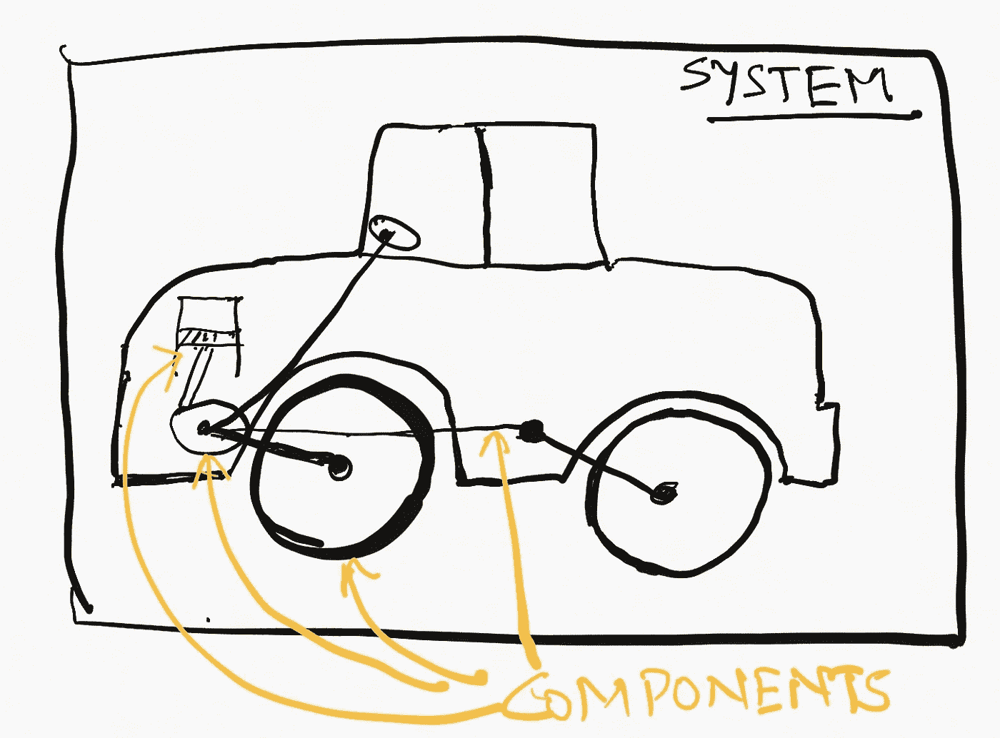
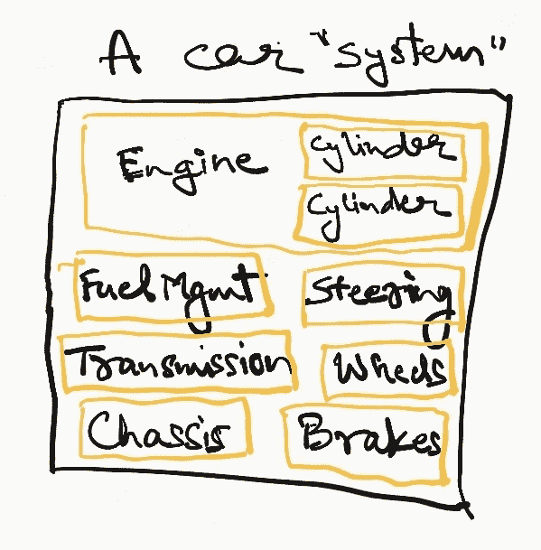
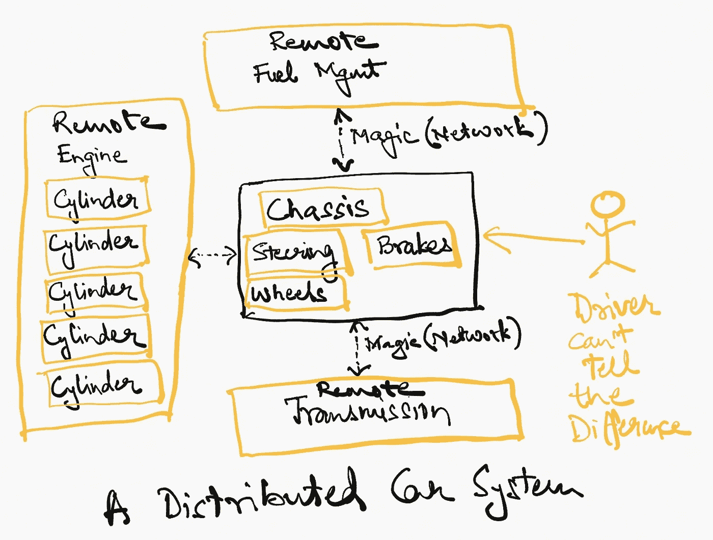
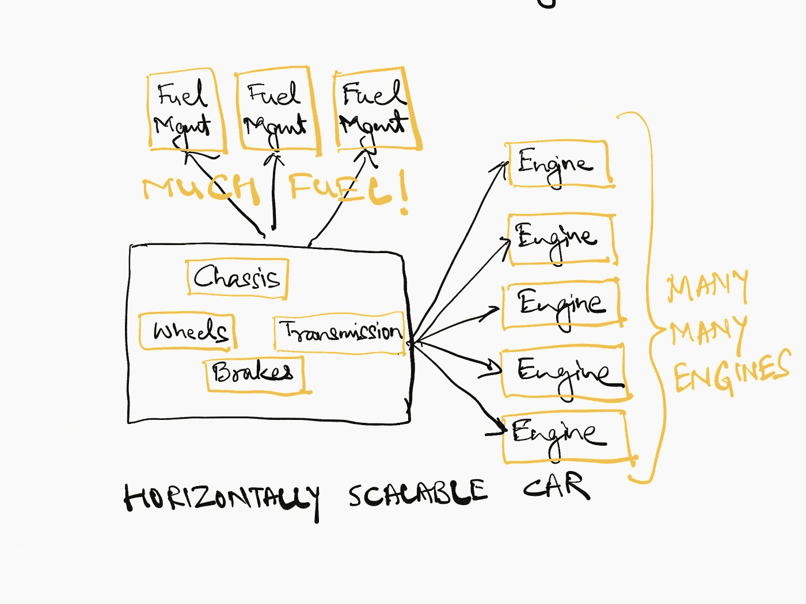
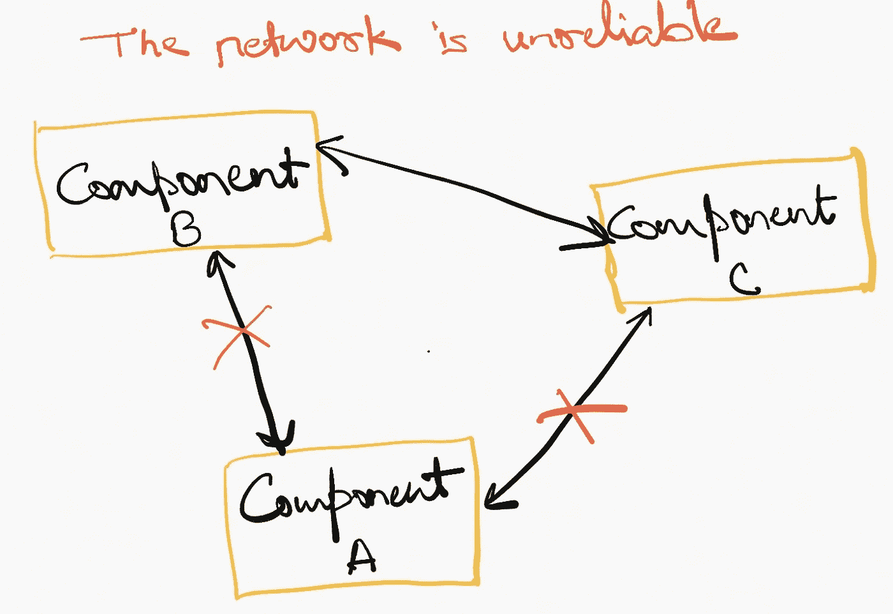
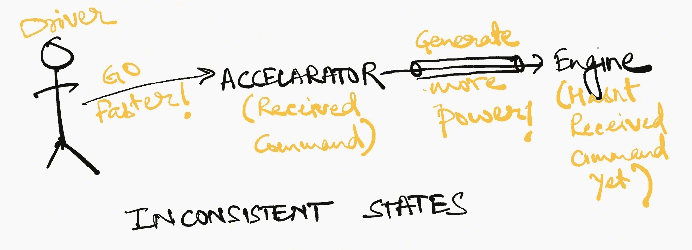

# 对于外行来说，什么是分布式系统？(第一部分)

> 原文：<https://betterprogramming.pub/for-the-layman-ep-1-what-is-a-distributed-system-87277b9723e0>

## 分布式系统变得简单

图片来源:作者

本文最初发表在我的主页上—[https://www . kislayverma . com/post/for-the-外行-EP-1-what-a-distributed-system](https://www.kislayverma.com/post/for-the-layman-ep-1-what-is-a-distributed-system)

大家好！

我正在开始一个名为“外行人”的新系列文章，涵盖非开发人员或初学者经常遇到的一些软件工程概念。文章试图用简单的术语解释这些概念，尽可能少用术语。

在本系列的第一篇文章中，让我们了解一下*分布式系统*。

顾名思义，分布式系统是由*分布式*组成的*系统*。让我们分别看看这两个词。

# 什么是系统？

一个*系统*是一组协同工作以提供特定功能的部件。钟表是一个由弹簧和齿轮组成的系统，能可靠地报时。汽车是由许多零件组成的，这些零件使我们可以从一个地方开到另一个地方。让我们称每个部分为一个*组件*。

## 独石:非分布式系统

大部分机械系统都不是也不可能是分布式的。大多数硬件系统中的组件都假定它们的合作组件在本地可用。活塞杆被焊接到曲轴上，键盘被连接到处理器上，等等。沿着这些构建的软件系统有时被称为*整体*。

## 垂直缩放

不得不将所有组件放在一起的一个副作用是，为了建立一个更强大的系统，我们需要在同一个机箱上安装更多的部件(可以这么说)。如果我们想增加更多的引擎，让我们的车跑得更快，我们需要增加更大的引擎和更多的汽缸。这反过来需要大型汽车，等等。

您还可以考虑通过添加更多处理器或更多内存来增强笔记本电脑的性能。这是可以做到的，但会使笔记本电脑越来越大——最终，我们得到的是台式机而不是笔记本电脑。这个向单个物理系统添加越来越多功率的过程被称为*垂直扩展*。这是一个重要的策略([摩尔定律](https://en.wikipedia.org/wiki/Moore%27s_law)本质上是关于垂直扩展的)，但是有很难超越的物理限制。

## 位置耦合

机械系统在相互协作方面也有一定的保证。齿轮的转动和时钟指针的转动之间不存在不可靠性(可能存在精度误差，但这不是这里的问题)。时钟的设计是基于这样的假设，即某些事情会导致某些其他事情发生，如果它们没有发生，那么就认为时钟坏了。整个系统的功能在很大程度上依赖于所有组件在特定时间、特定地点的物理存在。这种类型的依赖模式被称为组件之间的一种紧密耦合形式。

## 全局一致状态

这种对所有部件严格协同工作的硬性依赖有一个有趣的含义。这意味着，如果我们知道一个组件处于什么状态(例如，位置、地点)，我们必然也知道所有其他组件的状态。如果组件 A 不在组件 B 期望的位置，那么我们就有问题了。因此，我们在任何时间点对系统的了解都是完整和一致的。这叫做*全局状态*。

正如您现在所看到的，当所有的东西都必须放在同一位置并且必须一直工作时，很难构建非常大的系统。使用这些原则构建的大型系统是脆弱的——任何小的故障都可能导致完全停机。它也是不可扩展的——随着规模的增长，我们不仅必须不断地将所有的东西一个接一个地安装(想象一下，一台发动机有数千个气缸，所有的气缸都必须一个接一个，并且必须完全协调一致),而且我们还必须随时了解所有组件，以便能够了解系统是否正常工作。这样一个系统所产生的认知负荷是巨大的，并且随着每一个新组件的出现而呈指数增长。

现代软件架构在解决业务问题的同时，也在处理前所未有的规模。无论是使用脸书的数十亿人，还是光棍节的网上购物者，今天的软件系统都有望提供巨大的性能，即使在部件出现故障时也能继续运行。为了满足这些需求，分布式系统作为一种替代范例出现，用于构建由许多组件构建的系统。

# 什么是分布式系统？

*服务器*:连接到互联网或其他网络的电脑。

分布式系统是由“独立的”组件组成的，这些组件不一定彼此相邻。

这个看似简单的分布式系统的定义有着巨大的分歧，并赋予这些系统独特的优势和弱点。让我们详细讨论其中的一些。

## 位置透明性

分布式系统中的组件通过不需要调用组件知道被调用组件的位置的方法/协议相互通信。因此，即使当你开车时，发动机也可能位于家中。不知何故，当踩下加速器时，发动机产生更多的动力，这些动力以某种方式转移到车轮上。另一个类比是我们现在随处可见的远程工作方式。团队成员并不在一起，但仍然通过执行各自的工作为共同的目标而合作。

这叫做*位置透明*，是*松耦合的一种形式。*(所有开发人员听到这个词时都会有一种梦幻般的眼神——试试看！)

位置透明的优点是显而易见的。如果软件组件不需要位于同一位置，那么我们可以将它们移动到不同的物理机器上，每个物理机器都可以垂直扩展。也就是说，我们可以为每个组件分别购买功能强大的机器，而不是将所有组件都安装在一台机器上。这直接导致了一个更强大的系统。请注意，我们并没有强制要求组件必须位于不同的服务器上，只是说只要有办法找到它们，它们位于哪里并不重要。

这些分布式组件如何找到彼此？有很多方法可以做到这一点。最流行的机制之一是 [DNS(域名系统)](https://en.wikipedia.org/wiki/Domain_Name_System)，它将域名映射到 IP 地址(整个互联网上服务器的唯一标识)。所有网络的基础是根据 IP 地址或域名定位特定机器的能力。这种看似很小(但实际上极其复杂)的技术已经让软件吃掉了世界。

## 部分失效模式

分布式的一个后果是，我们的故障模式不再是全有或全无。读卡器组件可能已失败，但帐户管理组件可能正在运行。这意味着，即使我们的刷卡用户感到沮丧，一些与账户管理相关的功能仍然可以使用。

## 水平可扩展性

位置透明性的另一个推论是，组件不需要只有一个实例。如果发动机的位置不重要，我们现在可以添加十个或更多的独立发动机来增加更多的功率。

甚至可以根据需要添加和移除汽车的发动机。这种添加更多组件实例的能力被称为*水平扩展*，并且是当前扩展软件系统的首选机制，因为它绕过了单个服务器可以有多强大的物理限制——我们只需添加更多低功耗服务器来进行补偿。

所以我们有一堆组件生活在不同的服务器(机器)上，并通过网络(互联网/局域网)进行通信。就这样吗？

## 最终一致性

这里还有一点要理解的比较有意思:网络不可靠，速度慢。

如果你的 Zoom 调用曾经挂在句子中间或者 YouTube 已经缓冲，你知道我在说什么。数据从一个组件发送到另一个组件，但有时没有到达或在一段明显的时间后到达。也许线路被切断了，也许另一个组件读取了数据，但在它能做任何事情之前崩溃了，也许很多数据在线路上流动，因此一切都被卡住了。

无论以哪种方式发生，都会导致系统的不同部分没有关于彼此的完整信息。在我们在网上遇到的系统中，这种情况经常发生——支付已完成，但订单无法下达(支付组件无法与订单组件对话),资金转账已触发，但将在 24 小时内反映出来(转账组件知道将有转账，但账户组件尚未被告知)。

换句话说，分布式系统的独立组件完全了解它们自己的状态(例如，位置、方向、负载量)，但是可能与其他组件不同步(或多或少)。不同步是网络充当它们之间的非共享知识队列的结果。

这叫做*不一致性*，是我们在非分布式系统中遇到的全局状态的另一面。在分布式系统中，解决这个问题的方法是*最终一致性*，这意味着我们必须实现一些机制，确保所有组件最终在系统的整体状态上相互一致。请注意，这是一个追赶游戏，组件不同步是设计造成的，而不是错误造成的。这给了我们一些缓冲时间，我们可以在这段时间内进行知识转移，而不是让每个组件都立即知道所有的事情(在分布式世界中，这在物理上是不可能的，因为没有什么可以超过光速)。

## 不好的部分

虽然分布式系统对故障具有极强的恢复能力，并且在高负载下响应迅速，但是构建设计良好的分布式系统是一项极其复杂的任务。

第一个问题是用户体验。没有办法向用户隐藏系统最终的一致性。随着即时满足成为越来越被接受的标准，有时需要很多聪明的 UX 来保持系统的分布式和用户的快乐。

为了弥补分布式计算的谬误，分布式系统必然比单一的(所有东西都在一个地方)设计复杂得多。许多新的工具已经发展到可以帮助开发人员构建可靠的分布式系统，但是这仍然远不是一个容易或解决的问题。

我希望您从这篇文章中对分布式系统有了基本的了解。如果你是一个初学者，发现这篇文章的某些部分仍然太专业而难以理解，请在评论中告诉我，我会试着用更简单的术语来解释。

注册[我的邮件列表](https://kislayverma.com)，直接在你的收件箱里收到更多的系列文章(和我的其他消息)