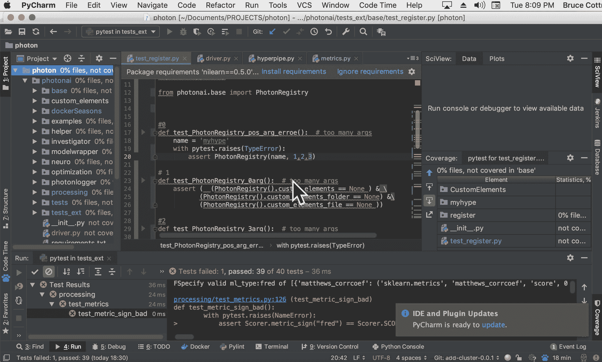
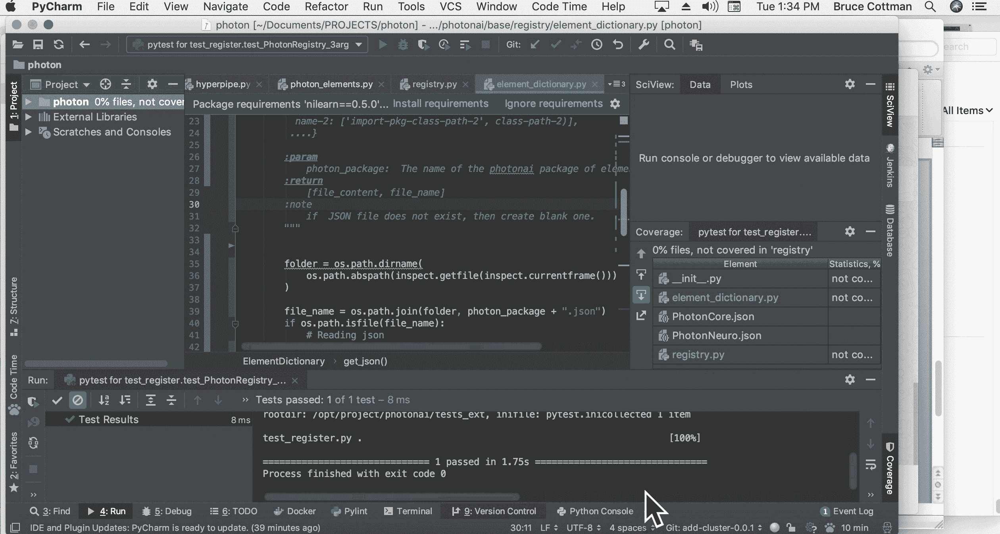
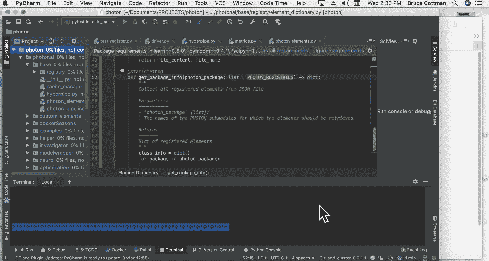
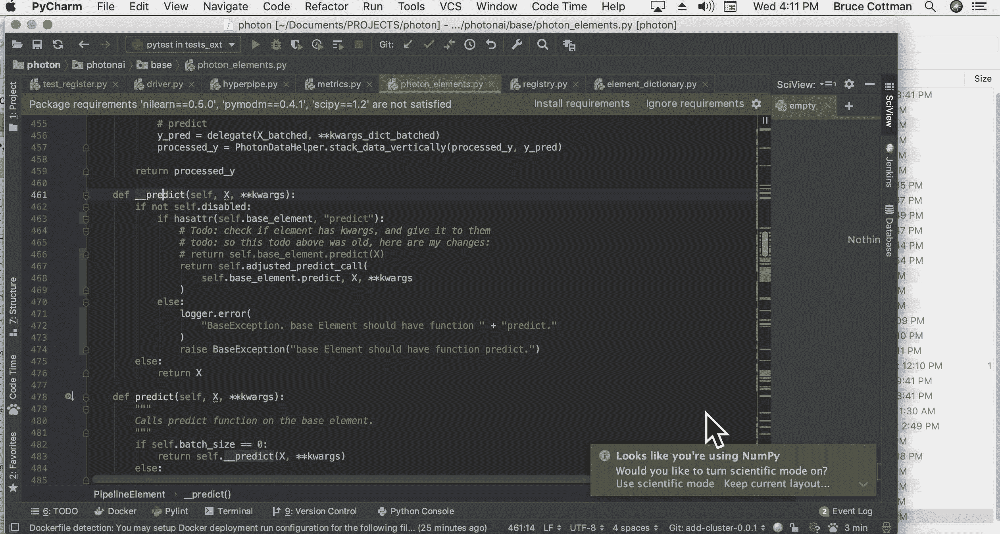
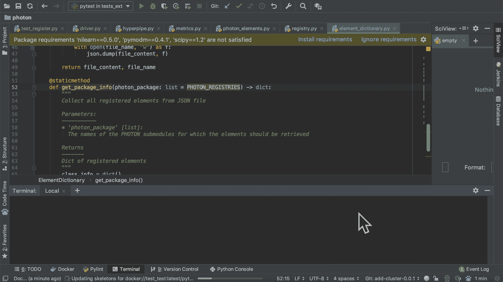
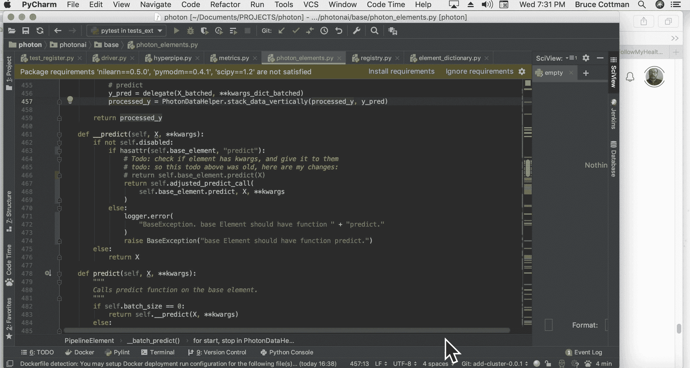
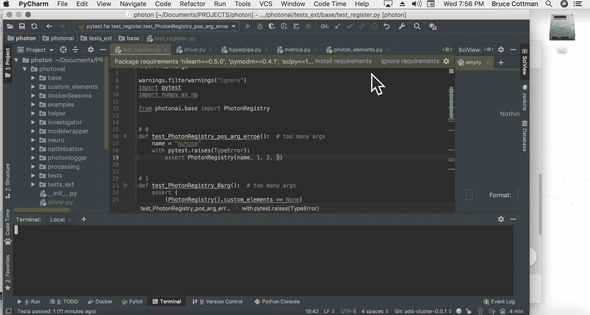

# 为了更好的 Python 代码，47 种最佳实践重构技术

> 原文：<https://betterprogramming.pub/forty-seven-best-practice-refactoring-techniques-for-better-python-code-6e5d6e091f9a>

## Python 最佳实践重构

## 从我的同事那里收集的用于 Python 文档、编码、测试、验证和持续集成的技术和代码片段


Python 编程。图片来源:截图和 Python logo

我从同事那里收集了这四十种重构技术，多年来，我和他们一起学习了很多高级软件工程。三十多年来，编程之旅一直在多个项目中使用多种语言。

应用每种技术之前和之后都有 Python 代码示例。

这些技术分为五类:

*   文档技术
*   编码技术
*   测试技术
*   验证技术
*   持续集成(CI)技术

但是首先，我将介绍我们将用于应用这些技术的项目或代码库。

> **注意** : PyCharm 是本博客使用的 IDE。这里显示的所有技术也可以用 MS Visual Basic IDE 来完成。

# PHOTONAI 是什么？

PHOTONAI 将 sci-kit-learn 和其他机器学习(ML)或深度学习(DL)框架整合到一个统一的范例中。PHOTONAI 采用 sci-kit-learn `Transformer`类方法架构。

几位软件工程师对 PHOTONAI 进行了重构，以进行机器学习(ML)的快速实验，因为时间限制，我们使用了大型数据集的样本。

我使用 PHOTONAI，而不是作为一个 ML 框架的好(或坏)例子。而是展示代码重构。

我给出了 Python 之前和之后的代码示例，展示了 PHOTONAI 使用该技术的转变。

## 文档技术

## **技术# 1–3**

创建新版本，并记录主要更改。

*   如果有大量的架构变更、大量的代码变更和/或大量的新行为添加，创建一个新版本，a+1.0.0。
*   创建一个新的 subversion，a.b+1.0，如果有微小的架构变化，微小的代码变化，和/或微小的新行为增加。
*   如果添加少量代码和/或有错误修复，创建一个新的 subversion，a.b.c+1。

## 技巧 4

我使用 [PyCharm](https://www.jetbrains.com/pycharm/) 到【PHOTONAI 1.1.0 项目的所有变更和新文件。



PyCharm git 为 project PHOTONAI 1.1.0 中所有更改的文件添加了。瑞秋·科特曼的动画。

> **注意**:你可以用和项目一样的方式`git add`一个单独的文件。左键单击文件名，而不是项目目录名。

这里显示的变化导致了一个新的 subversion，从 1.0.0 到 1 . 1 . 0 *。

## 技巧 5

我使用 Git 进行版本控制和协作。代码如下:

```
git checkout -b 1.1.0
git status
```

终端输出:

```
On branch 1.1.0Changes to be committed:(use "git reset HEAD <file>..." to unstage)
modified:   photonai/base/registry/element_dictionary.py
modified:   photonai/base/registry/registry.py
new file:   photonai/custom_elements/CustomElements.json
new file:   photonai/driver.py
modified:   photonai/processing/metrics.py
modified:   photonai/tests/processing_tests/metrics_test.py
new file:   photonai/tests_ext/CustomElements/CustomElements.json
new file:   photonai/tests_ext/base/test_hyperpipe.py
new file:   photonai/tests_ext/base/test_register.py
new file:   photonai/tests_ext/processing/test_metrics.py
new file:   photonai/util.py
```

> **注:**以上是 PHOTONAI 1.1.0 项目更改或添加的所有文件列表。

## 技巧 6

在本地记录任何重要的代码添加或更改

```
class Scorer(object):
    *"""
    Transforms a string literal into a callable instance of a
    particular metric
    BHC 1.1.0 - support cluster scoring by add clustering 
    scores and type
            - added METRIC_METADATA dictionary
            - added ML_TYPES = ["Classification", "Regression",
                                "Clustering"]
            - added METRIC_<>ID Postion index of metric 
              metadata list
            - added SCORE_TYPES
            - added SCORE_SIGN
    """*
```

## 技巧 7

为常量、变量、函数和类方法创建长的描述性名称

## 技巧 8

将行为上不恰当的评论转化为行为上正确的评论，以降低维护成本和 bug 的生成

## 技巧 9

添加注释以增加代码的可读性。

评论是有维护成本的，不恰当的评论维护成本更高。

注释是代码的一部分。他们有与任何行为改变相关的维护成本。

下面是修改前的评论:

```
@staticmethod
def **get_json(photon_package):** *"""
Load JSON file in which the elements for the PHOTON submodule are stored.**The JSON files are stored in the framework folder by the name convention 'photon_package.json'**Parameters:
-----------
* 'photon_package' [str]:
  The name of the photonai submodule**Returns:
--------
JSON file as dict, file path as str
"""*
```

更改后的注释:

```
@staticmethod
def **load_json(photon_package: str) -> Any**:
    *"""
    load_json Loads JSON file.**The class init PipelineElement('name',...)
    stores the element metadata in a json file.**The JSON files are stored in the framework folder
    by the name convention 'photon_<package>.json'.
    (example:$HOME/PROJECTS/photon/photonai/base/registry/PhotonCore.json)**The file is of format
    { name-1: ['import-pkg-class-path-1', class-path-1)],
      name-2: ['import-pkg-class-path-2', class-path-2)],
     ....}**Parameters
    ----------
        photon_package:  The name of the photonai package of element metadata
    Returns
    -------
        [file_content, file_name]
    Notes
    -------
    if  JSON file does not exist, then create blank one.
"""*
```

## 技巧 10

选择一个 [docstring 样式，并在整个项目(包、库等)中一致地使用它。我们使用 NumPy 风格，因为它适合于类、方法、函数和参数的详细文档。](https://www.datacamp.com/community/tutorials/docstrings-python)

## 技巧 11

PyCharm docstring 格式是从顶部功能区序列 py charm | Preferences | Tools | Python 集成工具中设置的，如下图 GIF 所示。我在苹果电脑上。在 Windows 或 Linux 上是不同的。



PyCharm 为 PHOTONAI 1.1.0 项目设置了 docstring 样式。瑞秋·科特曼的动画。

使用 NumPy 样式并纠正任何缺口，注释变成:

```
@staticmethod
def get_json(photon_package: str) -> Any:
    *"""
    get_json Loads JSON file.**The class init PipelineElement('name',...)
    stores the element metadata in a json file.**The JSON files are stored in the framework folder
    by the name convention 'photon_<package>.json'.
    (example:$HOME/PROJECTS/photon/photonai/base/registry/PhotonCore.json)**The file is of format
    { name-1: ['import-pkg-class-path-1', class-path-1)],
      name-2: ['import-pkg-class-path-2', class-path-2)],
     ....}**Parameters
    ----------
    photon_package:  The name of the photonai package
    of element metadata.**Returns
    -------
    [file_content, file_name]**Notes
    -------
    If  JSON file does not exist, then create a blank one.
    """*
```

## 技巧#12

类型提示减少了函数或方法的文档。

## 技巧 13

PyCharm 进入 NumPy docstring 模板。PyCharm 只插入`return`，因为函数没有参数。如果右键单击，它会列出所有允许的 NumPy docstring 关键字。酷！


## 技巧#14

应用 PEP-8 命名约定

在下面的例子中，全局常量`ELEMENT_TYPE`是大写的，变量`machine_learning_type`是小写的。

```
Globals:ELEMENT_TYPE -> ML_TYPE
ELEMENT_DICTIONARY   ->  METRIC_METADATAvariables:*machine_learning_type -> element_type*
```

## 技巧 15

PyCharm 可以运行外部工具进行格式化。我使用 black，它将一个`.py` 文件或整个项目格式化为符合 PEP-8 的格式。结果是所有文件的格式都相同。接下来的结果是可读性分数增加了。



PyCharm 外部工具:黑色适用于所有。PHOTONAI 1.1.0 项目的 py 文件。瑞秋·科特曼的动画。

## 技巧 16

PyCharm 可以更改包中任何地方使用的名称。我知道有些人可能认为重构这个词是有害的。但是，在整个项目中更改名称是有用的。请忽略 PyCharm 如何对其特性进行分类。从头开始使用`rename`，这样你就不必重构你的代码了！



PyCharm git 重命名特性。瑞秋·科特曼的动画。

## 技巧#17

PyCharm `find usage`查找项目引用中的所有文件——例如常量、变量、函数、类或类方法。



PyCharm 查找用法功能。瑞秋·科特曼的动画。

## 技巧 18

向每个函数或类方法添加类型提示。

Python 是一种动态类型语言。Python 3.5 及更高版本允许启用类型提示( [PEP 484](https://www.python.org/dev/peps/pep-0484/) )。我想强调单词*提示*，因为类型提示不会影响 Python 解释器。就你而言，Python 解释器会忽略类型提示。

类型提示(注意:不是强类型检查)使得在第一次通过编码和单元测试后完成 bug 搜索、发现安全漏洞和静态类型检查成为可能。

```
def is_machine_learning_type(ml_type: str) -> bool:
```

## 技巧#19

docstring 不再需要记录每个`arg`和`return`数据类型。签名变得不言自明。

## 技巧 20

可读性以及后期代码检查工具的信息都增加了。

## 技巧 21

将不相关的评论转化为相关的评论

版本 1.0.0(原始版本)

```
# register new **object**
PhotonRegister.**save**("ABC1", "namespace.filename.ABC1", "Transformer")
```

版本 1.1.0

```
*# register new* ***element*** *PhotonRegister.****register****("ABC1", "namespace.filename.ABC1", "Transformer")*
```

## 技巧 22

只保留建筑方面的`#todo`评论

## 技巧 23

PyCharm 已经为 PHOTONAI 1.1.0 项目找到了所有的`#Todo`。


PyCharm 找到了 PHOTONAI 1.1.0 项目的所有 Todo。瑞秋·科特曼的动画。

## 技巧 24

删除被注释掉的旧代码。

版本 1.1.0(注释掉 1.1.0 代码之前):

版本 1.1.0(删除注释掉的 1.1.0 代码后):

```
def __post_init__(self):
    if self.custom_elements_folder:
        self._load_custom_folder(self.custom_elements_folder)
```

> **注意** *:* 代码行(LOC)的复杂性通过消除被注释掉的旧代码而降低。可读性分数增加。

# 编码技术

## 技巧 25

不要多此一举

在你为你的想法或任务写一行代码之前，搜索其他人已经编码的解决方案。外面有很棒的仓库。发现你的最爱。

为了让你开始，这里有一些我最喜欢的:

*   [编号为](https://github.com/paperswithcode)的文件
*   [牛逼的饭桶](https://github.com/dictcp/awesome-git)
*   [牛逼榜单](https://github.com/sindresorhus/awesome)
*   [牛逼牛逼(编程语言)](http://Awesome Awesomeness)
*   [牛逼的机器学习](https://github.com/josephmisiti/awesome-machine-learning)
*   [视觉机器学习](https://paperswithcode.com/lib/mmdetection)

## 技巧 26

借鉴别人的代码。

NumPy、 [pandas](https://pandas.pydata.org/) 、Keras、fast.ai、TensorFlow、 [PyTorch](https://pytorch.org/) 、Kubernetes、Hadoop、PySpark 以及其他数百个软件包教授先进的计算机科学和最好的编码技术。

利用 Python 和其他语言的开源世界。

## 技巧#27

日志；不要打印

## 技巧 28

不要编码全局数据结构；使用参数文件

日志和参数文件是您的实体或在线课程中很少涉及或根本不会教授的主题。

你可以在硬碰硬的学校里学习日志和参数文件，或者，如果你幸运的话，通过观察一位高级软件工程师(或者通过使用技巧 12 和 13)。

我在下面的文章中详细介绍了日志和参数文件的优点:

[](https://medium.com/codex/pasos-offering-of-logging-and-parameter-services-for-your-python-project-c3ae2fd6869a) [## Python 项目的日志记录和参数服务

### 日志和参数文件对于任何生产可维护服务的部署都是至关重要的。

medium.com](https://medium.com/codex/pasos-offering-of-logging-and-parameter-services-for-your-python-project-c3ae2fd6869a) 

## 技巧 29

创建一个函数或方法来封装值检查

下面的例子创建了一个方法来检查一个值是否在全局常量*中。*

```
@staticmethod
def is_machine_learning_type(ml_type: str) -> bool:
    *"""* ***:raises*** *if not known machine_learning_type* ***:param*** *machine_learning_type* ***:return****: True
    """* if ml_type in Scorer.ML_TYPES:
        return True
    else:
        logger.error(
            "Specify valid ml_type to choose best config:  {}".format(ml_type))
        raise_PhotonaiError(            "Specify valid ml_type. invalid :{} of supported: [{}]".format(ml_type, Scorer.ML_TYPES))
```

## 技巧 30

创建包错误类型

对于包 Photoai，我们创建了错误类型`Photonai`。

## 技巧 31

创建一个具有包错误类型的提升函数

对于错误类型，我们创建了函数`raise_PhotonaiError`。

```
import loggingclass PhotoaiError(Exception):
    passdef raise_PhotoaiError(msg):
    logger.error(msg)
    raise PhotoaiError(msg)
```

方法`is_machine_learning_type`变成了:

```
@staticmethod
def is_machine_learning_type(ml_type: str) -> bool:
    *"""
    Parameters:
    -----------
    machine_learning_type**Returns**-----------
**True**Raises**-----------
   if not known machine_learning_type
   """* if ml_type in Scorer.ML_TYPES:
        return Trueraise_PhotoaiError(
        "Specify valid ml_type:{} of [{}]".format(ml_type,
        Scorer.ML_TYPES))
```

**注:** `raise_PhotoaiError`结合了日志和运行时错误。*不是* `true`的情况下停止并显示堆栈。作为一个运行时错误，如果它传递一个未知的值，它的行为与预期的一样。请注意可读性和维护成本的提高。

## **技术#32**

使用`faulthandler`

从 Python 3.3 开始，一个名为[错误处理程序](https://pypi.org/project/faulthandler/)的库显示错误或 Python segfault 的调用堆栈回溯。

## **技术#33**

消除全局变量——或者至少尝试一下

您使用`globals()`列出您的包中的所有全局变量。

## **技术#34**

消除所有未使用的局部变量

通常，您的 IDE 会为您识别所有悬挂变量。如果没有，你用`locals()`，用搜索。

## **技术#35**

在类定义之前应用 Python 3.7+ `@dataclass`装饰器。

`@dataclass`是Python 3.7 的新增特性。主要的驱动力是在一个`def class`定义中消除与国家相关的样板文件。

`@dataclass`修饰一个`def class`定义，自动生成五个 double dunder 方法:`__init__()`、`__repr__()`、`__str__`、`__eq__()`和`__hash__()`。

`@dataclass`几乎消除了定义一个基本类所需的重复样板代码。注意，所有这五个 double dunder 方法都直接处理类的封装状态。

```
class PhotonRegistry:
    *"""
    Helper class to manage the PHOTON Element Register
    ...
    """*base_PHOTON_REGISTRIES = ['PhotonCore', 'PhotonNeuro']
PHOTON_REGISTRIES = ['PhotonCore', 'PhotonNeuro']def __init__(self, custom_elements_folder: str = None):
    if custom_elements_folder:
        self._load_custom_folder(custom_elements_folder)
    else:
        self.custom_elements = None
        self.custom_elements_folder = None
        self.custom_elements_file = None
```

在`@dataclass`装饰器之后:

```
@dataclass
class PhotonRegistry:
    *"""
    Helper class to manage the PHOTON Element Register
    ...
    """*
    custom_elements_folder: str = None
custom_elements: str = None
    custom_elements_file: str = None
    base_PHOTON_REGISTRIES: ClassVar[List[str]] =/
   ["PhotonCore", "PhotonNeuro"]
    PHOTON_REGISTRIES: ClassVar[List[str]] =/
   ["PhotonCore", "PhotonNeuro"]def __post_init__(self):
    if self.custom_elements_folder:
        self._load_custom_folder(self.custom_elements_folder)
```

关于`dataclass:`使用的详细博客文章

[](https://towardsdatascience.com/12-examples-of-how-to-write-better-code-using-dataclass-d7c121ee0239) [## 如何使用@dataclass 编写更好的代码的 12 个示例

### 我们正在将使用 scikit-learn、Keras 和其他包的聚类算法添加到 Photonai 包中。有了十二个…

towardsdatascience.com](https://towardsdatascience.com/12-examples-of-how-to-write-better-code-using-dataclass-d7c121ee0239) 

**注**:通过将`@dataclass` 与 `type hinting`配合使用，可读性大幅提高。

# 测试技术

## **技术#36**

代码开发人员开发单元测试

## **技术#37**

在 PyCharm 中设置工具 [pytest](https://pytest-cov.readthedocs.io) 。



在 PyCharm 中为项目 PHOTONAI 1.1.0 设置工具 [pytest](https://pytest-cov.readthedocs.io) 。瑞秋·科特曼的动画。

## **技术#38**

单元测试有 80%以上的覆盖率。我们使用[覆盖](https://coverage.readthedocs.io/en/coverage-5.0.4/)。

## **技巧 39 号**

集成测试必须 100%覆盖所有外部(API)函数、类、类属性和类方法。

## **技术#40**

开发人员没有完成验收测试。

例如，我们从`test_metrics.py`中的 24 个单元测试中选择了这些单元测试。

```
# 22
def test_is_machine_learning_type_bad():
    with pytest.raises(PhotoaiError):
        assert Scorer.is_machine_learning_type("fred")# 23
def test_is_machine_learning_type():
    assert Scorer.is_machine_learning_type("Clustering")
```

## **技术#41**

一旦选择了测试工具，PyCharm 就会标记各个可运行的测试。这些在左栏中用实心箭头标记。使用 pytest 进行单独测试的示例:


使用 PyCharm **、**，您可以使用 pytest **、**运行一个测试文件或整个测试文件夹，结果会显示出来。参考底板-色带(通过 39/40 测试— 32 毫秒)。



为项目 PHOTONAI 1.1.0 指定的 PyCharm 测试工具。瑞秋·科特曼的动画。

## **技术#42**

代码类型提示检查。

类型提示只是像 Mypy 这样的第三方工具可以用来指出潜在 bug 的提示。

## **技术#43**

测试覆盖率

## **技术#44**

性能分析

## **技术#45**

检查安全性

## **技术#46**

代码可靠性

下面的文章详细介绍了可用于测试覆盖率、性能分析、检查输入数据安全性和代码可靠性的工具。

[](/seventeen-coding-tools-for-your-python-developer-sandbox-35d033c3075a) [## Python 开发者沙盒的 18 种编码工具

### 编写 Pythonic 代码

better 编程. pub](/seventeen-coding-tools-for-your-python-developer-sandbox-35d033c3075a) 

# 验证技术

## **技术#47**

代码审查

# 摘要

我从 Python 3.5 和更早版本的同事那里收集了这 47 种重构技术。这些技术中的大部分在 Python 3.9 中仍然有效。Python 3.9 中包含了其中的一些技术。

随着我加入你的评论和更多的技巧，我的清单会继续增长。

我没有提到使用数据类的技术。但是，您可以在以下位置找到讨论:

[](https://medium.com/geekculture/nine-dataclass-techniques-for-better-python-code-e56b8aa98d8b) [## 九个@dataclass 技术可以获得更好的 Python 代码

### 我展示了 29 个用@dataclass 替换 def 类的 Python 示例。

medium.com](https://medium.com/geekculture/nine-dataclass-techniques-for-better-python-code-e56b8aa98d8b) 

继续高效地编码！

