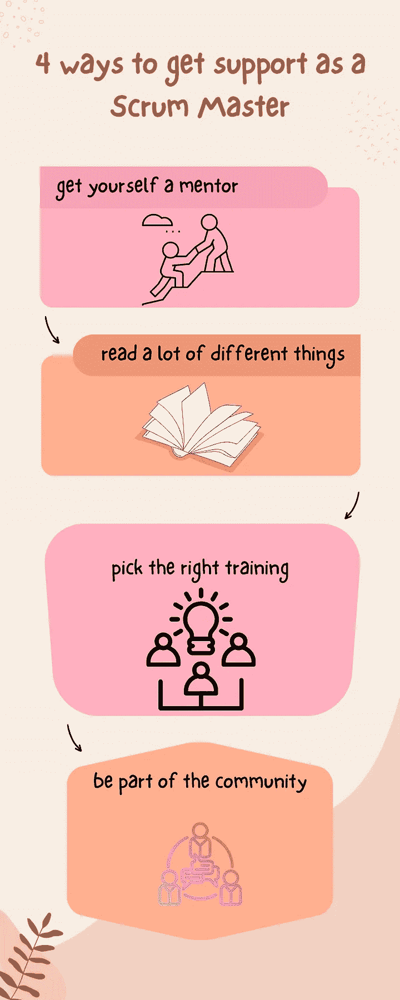

# 作为 Scrum 大师获得支持的四种方式

> 原文：<https://betterprogramming.pub/four-ways-to-get-support-as-a-scrum-master-8a506a7199ff>

## # 2——阅读许多不同的东西

Scrum Master 角色在 Scrum 团队和敏捷组织中至关重要。Scrum Master 帮助团队保持专注，消除障碍，并促进持续改进——以及许多其他重要的职责。

在过去的几年里，我看到 Scrum Master 在这个角色上苦苦挣扎。要么是因为他们对这个角色不熟悉，要么是因为他们缺乏在工作中取得成功所需的特定知识。了解他们自己，学习如何与他们所在的系统合作，以及了解如何与他们的团队成员相处。我不是在谈论团队中有一个“20% Scrum Master”的最近趋势——这是另一篇文章的内容。

现在写这些台词对我来说很容易，主要是因为我自己也经历过这些。当我在 2016 年开始我的敏捷之旅时，我是一个新的 Scrum 大师。我没有经验，当时，我不知道这个角色会对我的生活产生重大影响。我很快发现 Scrum Master 的角色不仅仅是促进会议和帮助团队解决问题。这是一个了解自己、发展技能、在工作和家庭中成为更好的人的机会。

作为一名 Scrum 大师，我学会了以下四种寻找支持的方法:

# 给自己找个导师

有一个好的导师可能是你在 Scrum 中成功的关键。你的导师可以帮助你了解你的角色，并帮助你克服前进道路上的挑战。回想我这些年的项目，我在每家公司都有导师。虽然他们中的一些人是 Scrum 大师或敏捷教练，但大多数不是。相反，他们是领导者，是我感到鼓舞的人，是我想学习的榜样，是我钦佩的人。所以，花点时间去寻找激励你的导师，花点时间去倾听他们。在风险很高的情况下，观察他们的行为，他们如何与他人互动，或者问他们关于你可能希望改善自己的事情的具体问题，甚至与他们分享你自己的目标或愿望。并虚心听取他们的反馈。我不得不承认，我经常并不真正理解我的导师在做什么，只是后来才意识到并理解，比如，与一位出色的产品经理一起工作，每天都看到他在工作。直到后来，我才通过对这个话题的理解和兴趣，发现他在做什么，以及他是如何在团队中塑造产品文化的。

# **阅读所有你能找到的东西**

我相信这就是 Scrum Master 角色及其行业的魅力所在。许多充满激情的人也愿意并乐意与他人分享他们所知道的。在 Scrum Master 社区中，网上有大量的博客、文章和播客，你不仅可以阅读和学习如何成为一名成功的 Scrum Master，还可以学习很多 Scrum 世界之外的话题，比如领导力、管理、时间管理、解决问题、协作、沟通等等。只要你愿意花时间去做，并且不害怕寻求帮助，你可以从现有的资源中学到的东西是无限的。以你想要前进的步伐阅读你觉得适合自己的东西，阅读与你成长阶段的时刻相关的东西。我记得从一些“经典”开始，比如 Geoff Watts 的“Scrum Mastery”或者 Esther Derby 和 Diana Larsen 的“敏捷回顾”。紧随其后的是迈克·科恩的博客文章以及巴里·奥弗利姆和克里斯蒂安·维尔韦杰斯的文章。随着时间的推移，我开始寻找不同的方式:去聚会，参加会议，加入在线社区，向其他人提出不同的问题。在过去的几年里，我的阅读经历了不同的阶段，总是取决于我当前的兴趣和痛点——一些主要的主题是系统思维(彼得·圣吉的《第五项纪律》)、团队发展(帕特里克·兰西奥尼的《团队的五大功能障碍》)、自我发展书籍(迈克尔·辛格的《不受束缚的灵魂》)或关于公司内部不断变化的文化的书籍(迈克尔和奥德里·萨霍塔的《超越变化的领导》)。作为一个人和一名专业人士，这一直是一个不断学习和成长的过程。不要害怕问别人他们在读什么，他们会向你推荐什么资源，因为我们都是来学习的。

# **选择适合你的培训**

这里显而易见的选择是参加另一个 Scrum 培训，我也是这样做的。它们是我能够从中得到的许多很棒的教训。总体来说，它们的确帮助我成为了一名更好的 Scrum 大师。然而，你可能也想看看其他的选择。尤其是那些不是特别关注 Scrum 的选项。寻找你个人感兴趣的事情，最重要的是，寻找你可以立即付诸实践的事情。这样，你就避免了在培训中学习一些东西的陷阱，认为这是一个好主意，但你没有付诸实践，而是很快就忘记了。

我在参加敏捷教练营(另一个很好的获得灵感和学习的资源)时偶然看到一个培训课程，当时那里的一个同事提到了 Michael Sahota 所做的工作。当时我一点也不知道迈克尔和奥德里提供的 CAL1 和 CAL 2 培训会对我产生什么影响。不仅仅是关于领导力的知识，更重要的是，在一个高度上了解我自己。

根据您的环境，与产品管理相关的一切也可能非常有帮助。例如，参加 Jeff Patton 的课程，让我对产品所有权的想法受到挑战，对我来说是一个真正的游戏规则改变者。它帮助我更有效地支持产品经理。

无论你决定做什么，明智地选择它！看看培训是如何组织的，培训师是否是你感到受鼓舞的人，培训后是否有一个参与者社区等等…

# **成为社区的一员**

我已经说过，作为一名 Scrum 大师，学习和发展社区是多么重要。参加培训或阅读讲述如何成为优秀 Scrum 大师的书籍是一回事；被一群和你有同样热情、想学习、好奇并愿意帮助你学习的人包围完全是另一回事。如今，由于各种社交媒体的选择，与同龄人联系非常容易——有 LinkedIn、Slack spaces 和 Discord 服务器。选择一个最适合你的，并参与其中。乐于分享你的知识、挑战、问题等。，并帮助他人成长。我在澳大利亚的时候学到的一件事是，一个社区是关于给予和接受的。没有必要隐瞒信息，因为你害怕其他人可能会取代你的角色或比你有优势。这只是你的自我引发的恐惧。如果你担心这一点，是时候放手，作为一名社区成员成长了。我自己的经历告诉我，当你向社区敞开心扉，与他人分享你的知识时，奇迹就发生了。你向他人学习，你可以激励他人，机会会以最令人惊奇的方式出现。

如果你正在考虑寻求支持，我希望这篇文章能帮助你。这是必要的一步，如果你决定不寻求支持，你会错过一个很好的机会。如果你需要在哪里寻找它的建议，请联系我，我会尽力帮助你。