# 从 HTML 到用 React 理解现代 Web 应用程序开发

> 原文：<https://betterprogramming.pub/from-html-to-understanding-modern-web-application-development-with-react-99637dd8682d>

## 完全理解一个技术领域中的所有概念不应该是能够构建令人敬畏的东西的先决条件

阿曼达·拉塞尔截图

# 什么反应？

[React](https://reactjs.org/) 是一个 [JavaScript](https://www.w3schools.com/js/) 框架，允许开发者创建用户界面。

它是最常用和最流行的现代 JavaScript 框架之一；尽管其最接近的竞争对手(Vue.js)在过去几年越来越受欢迎，但开发人员就业市场似乎仍然非常倾向于使用 ReactJS，而不是其他框架:

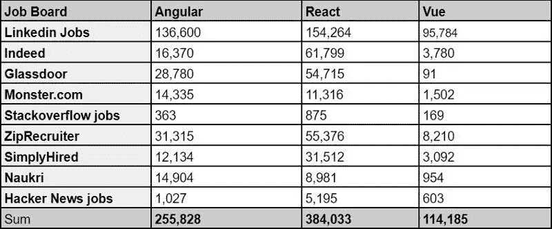

一些流行的求职网站上的 Angular、React 和 Vue 职位

我将要谈到的许多概念并不一定是 React 框架独有的(例如，基于组件的设计、热重载等)。)—这是一件好事，如果您理解这里的概念，它们无疑将适用于其他上下文和技术。

虽然对于一个接触过各种其他 JavaScript 编程语言和框架的经验丰富的开发人员来说，使用 React 的好处似乎是显而易见的，但是对于那些接触不多或者认为自己不是技术人员的人来说，很难清楚地说明这些好处和特性。

仅供参考，我坚信*非技术人员* 不是东西***——*他们是虚构的。**

**我还坚信，完全理解一个技术领域的所有概念不应该是能够创造一些东西的先决条件。**

**通常，你只需要正确的直觉，用很少的背景知识就完全有可能创造出令人惊叹的东西。**

**React [“入门”](https://reactjs.org/docs/getting-started.html)文档明确肯定了这一理念:**

> **“React 从一开始就被设计为逐步采用，您可以根据需要使用或多或少的 React。无论你是想体验 React，给简单的 HTML 页面增加一些交互性，还是启动一个复杂的 React 驱动的应用程序，本节中的链接都将帮助你入门。”**

# **在针织图案中散开**

**我记得我妻子向我挑战，要我编写一个针织图案生成器。**

**除了我所看到的，我对编织一无所知，在阅读了更多关于图案的内容后，我记得自己很快就被编织图案符号(以及编织本身的一般行为)迷惑住了:**

**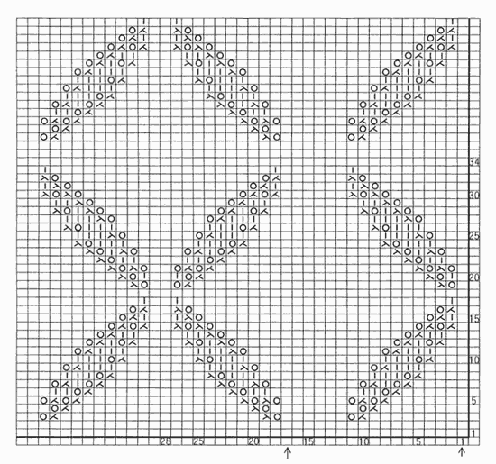**

**[水晶宫奇谈](http://www.knittingonthenet.com/patterns/motifclover.htm)**

****

***嗯……***

**对我的妻子来说，以上是她能像英语一样清楚地阅读的东西；编织的动作是自动的。**

**对我来说，当我的妻子编织时，她是一个强大的女巫在施魔法。我不知道——她挥动手臂，过了一会儿，一个跳跃者出现了。**

**尽管我尽了最大努力，尽管人们告诉我这很简单——我把它弄得太复杂了——但我的大脑拒绝接受它。**

**在我对编织的理解中，我一直缺少一些东西，我已经为进一步理解制造了一个精神障碍。**

**这看起来可能很傻，但是我妻子说的话改变了我的看法:**

> **“编织只是编程。纱线是你编程的东西；你打的结就是代码的行，最后的跳线就是完成的程序。”**

**有了这句简单的话，我觉得我能够克服我给自己设置的学习更多编织知识的心理障碍。我熟悉的概念和我不熟悉的概念之间的联系有效地消除了我给自己制造的精神障碍。**

**现在我肯定不是专家，但我知道如何铸造和如何做一个活结，有了它，我可以模糊地做一些东西。耶！**

****

**我强烈推荐[这个教程](https://www.designsponge.com/2013/01/how-to-knit-the-basics.html)给那些想学习基础的人**

**我已经开始思考，在使用技术*的时候，没有得到它是多么令人沮丧。***

**当你自称为非技术人员，但仍然需要围绕技术做出明智的决策时(例如，产品经理、技术招聘人员或产品负责人)*，*这种体验是一样的吗？**

**这不是一个新问题，也不是一件新鲜事，我认为解决办法显而易见。这取决于拥有专业知识的技术人员如何清晰地交流，提炼复杂性，并找到普遍理解的概念，作为一种我们可以将人们与他们做出决策所需的东西联系起来的方式。**

**显然，我能想到的用 React 做到这一点的唯一方法是利用真正将我们团结在一起的东西……MySpace。**

# **MySpace 和美丽丑陋的互联网**

****

**现在为……[某事](https://myspace.com/)准备一个地方？**

**MySpace 在最受欢迎的时候，是互联网上的一个辉煌时代。如果你是一个活跃的用户，毫无疑问，你会回忆起许多、许多、许多失去的时间去思考、修剪和完善你的[前 8 个朋友](https://www.urbandictionary.com/define.php?term=top%208)列表。**

**MySpace 也为互联网增光添彩的一些最棒最漂亮的东西负责:**

**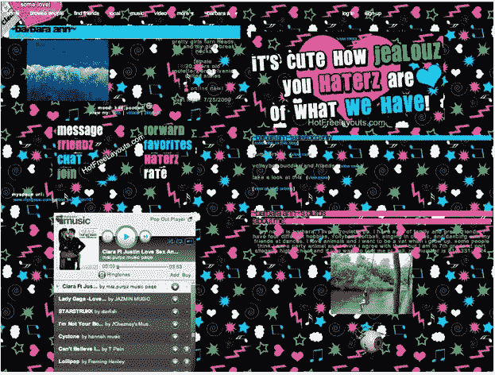**

**我全心全意地推荐[这部作品](https://medium.com/@amandagrussell/the-beauty-of-the-ugly-internet-6cd59cbba94a)，来一次丑陋的互联网记忆之旅**

**我们很多人都记得使用 MySpace 的时候，只要你半精通 HTML *，就可以无限定制你自己的 MySpace 主页的布局。***

**这是*半熟练*——我们这些曾经创建和使用 MySpace 布局的人，经常在没有太多了解 HTML 或编程基础的情况下这样做——仅仅依靠直觉，它从未阻止我们创造东西。**

**我的观点是，我们中的很多人，不管是否通过 MySpace，技术或非技术，都接触过 HTML 它的一些基础可能是你唯一需要获得一些反应的直觉的东西。**

# **那么仅仅使用普通的 HTML 有什么错呢？**

**对于呈现一个简单的网页，HTML 没有任何问题，如果您正在使用 React，掌握标记语言的基础知识是很好的。**

**假设我们想要建立一个简单的网页，向我们展示一个人，他们的职业和他们的原籍国。我们可以用 HTML 非常简单地做到这一点，就像这样:**

**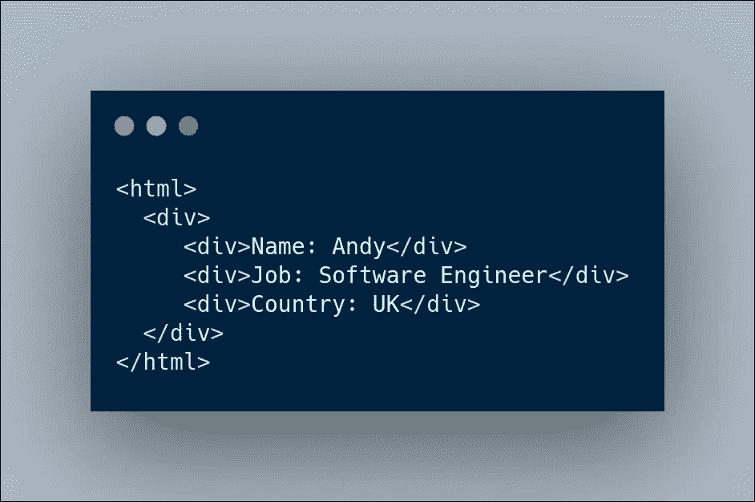**

**如果你以前遇到过 HTML，这应该看起来很熟悉。HTML 是一种标记语言，它使用开始和结束标记来定义特定的 HTML 元素。**

**一个`
` *(或 division)* 是一个简单抽象的容器 HTML 元素，可以在一个 HTML 页面上完成多个角色。我们可以在标签中添加值，它们将呈现在我们的页面上。**

****

## **让我们添加更多的人…**

**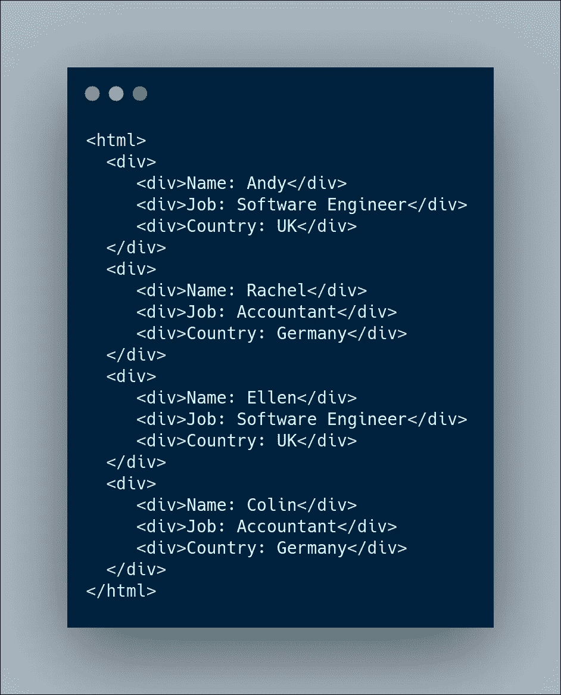****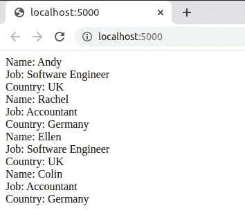**

**你可以看到我们开始出现一个问题——随着我们添加更多的名字，我们需要维护更多的`div`。上面的内容很好，也很实用——但是有点乏味。如果我们想通过 [CSS](https://www.w3schools.com/css/) 给这些`div`添加样式，那么我们有几个地方需要给每个`div`添加样式。如果我们添加更多的名字，这个问题只会变得更糟，页面会变得更难管理。**

## **反应过来，JSX，还有救援的组件**

**React 使用[JSX](https://reactjs.org/docs/introducing-jsx.html)——一种 JavaScript 和 HTML 的混合体，允许我们在 JavaScript 代码中有效地编写 HTML 片段来制作 React 组件。**

**让我们看看一个简单的 React 组件能为我们做些什么。为了简单起见，我们将假设一个已经使用 [Create React App 创建的现有 React 项目。](https://reactjs.org/docs/create-a-new-react-app.html)**

**我们首先从我们的工作、姓名和国家列表中提取一段 HTML 代码，并将其转换成 React 组件。我们将不再硬编码名称，我们将使用`props`模板化值，这样我们就可以将它们传递给组件:**

****

**我们的第一个“ProfileEntry”组件**

**现在，我们可以将组件连接到我们的 React 应用程序中，让它做与我们的 HTML 相同的工作。**

**要做到这一点，我们只需在我们的根应用程序组件中通过名称引用新创建的组件(为了简洁起见，将其排除在外)，并传入我们作为`props`模板化的值。**

**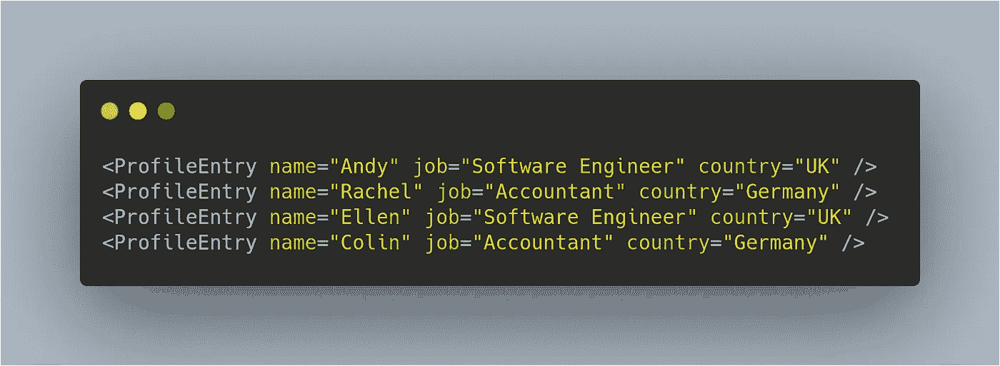******

**客观地说，它比 HTML 例子中的行数要少，但是一行一行地，我们正在创建的东西的类型和组件正在接收的数据是非常清楚的。**

**不过，可读性稍微提高并不是唯一的好处。假设我们想对我们最初的 HTML 例子进行修改。我们将不得不返回并更改每个相关`div`中的每个相关值。**

## **组件为我们提供了一个进行跨领域更改的地方。**

**例如，如果我们想用粗体文本呈现我们示例中的姓名、职业和国家:**

**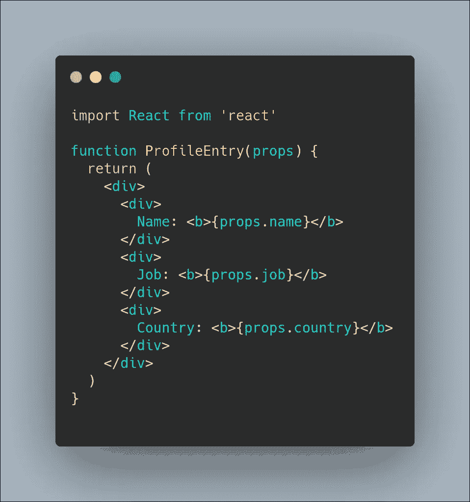**

**上面的例子和下面的例子做同样的事情。**

**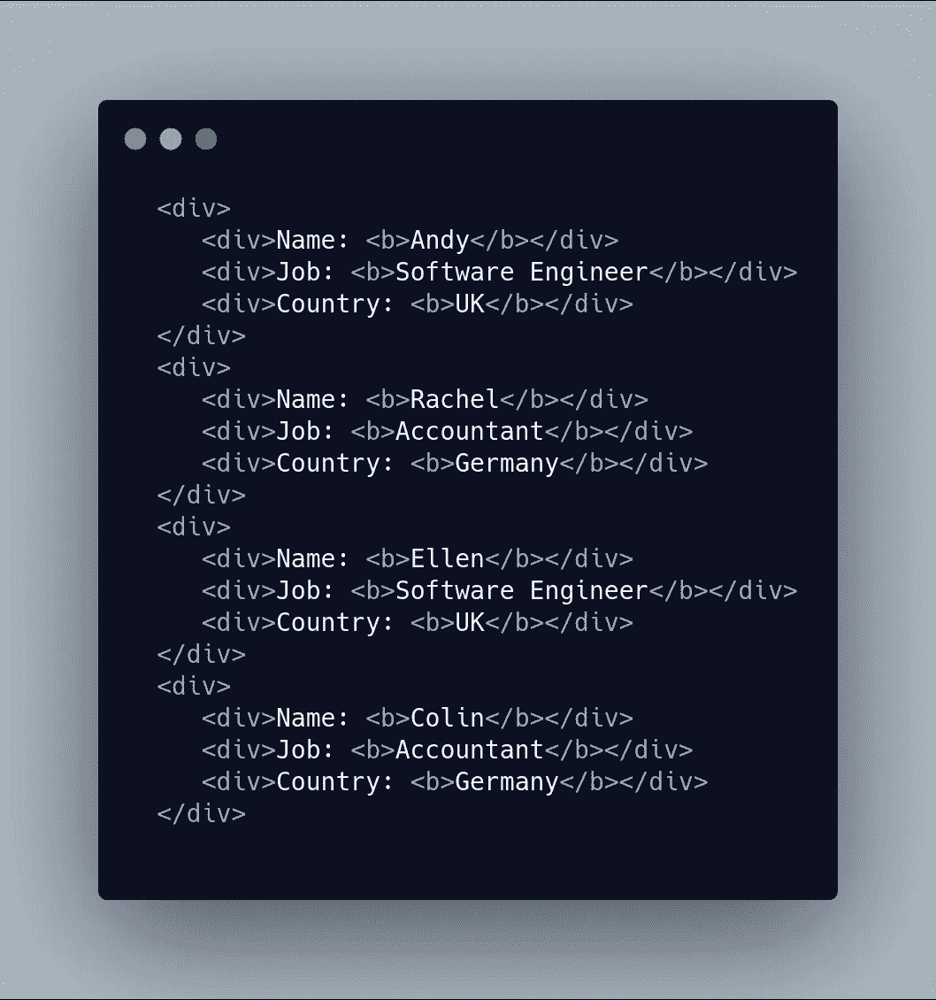**

**使用我们的组件，可以很容易地进行修改，同时影响所有的概要文件条目。**

**当我们开发这个应用程序时，这最终意味着更少的错误和充分的信心，我们的更改将覆盖所有当前和未来的配置文件条目。**

**让我们再做一些改变，使用一些额外的样式和 JavaScript 来使我们平淡无奇的列表更加引人注目。**

**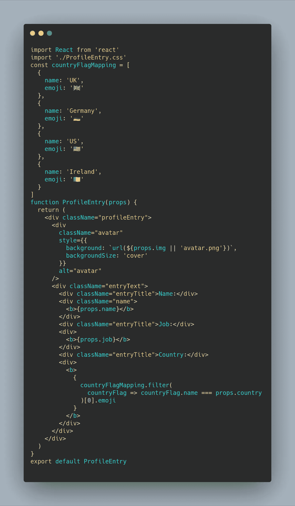**

## **瞧啊。**

****

**所以这绝对是对无聊列表的一个改进。上面的代码片段一开始可能很难理解，但是，希望你能看到我们只需要做一次修改——在一个描述我们的东西是什么的自包含代码段中:a `ProfileEntry`。**

**更重要的是:由于 [Create React App](https://reactjs.org/docs/create-a-new-react-app.html) (通过一种叫做 [webpack](https://webpack.js.org/) 的技术)中包含的热重新加载功能，所有这些美学上的改变只需要很少的时间就能实现。**

**借助热重新加载，我能够在更改发生时进行试验并实时查看更改的效果:**

**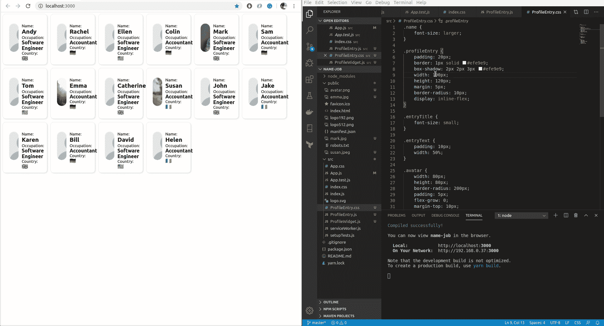**

## **将组件包装在其他组件中，并将数据与视图逻辑分开**

**当您制作一个新组件时，考虑您希望该组件做什么工作或扮演什么角色是很有用的。**

**组件只是一个代码单元，可以构建每个代码单元来完成特定的角色。我们之前已经创建了一个`ProfileEntry`组件，它的作用是呈现个人资料卡片。**

**我们可以制造一个具有新角色的新组件；本质上，它的作用是接收传入的数据，并呈现尽可能多的组件。**

**这样，我们不必在每次向列表中添加一个人时都创建一个新的组件——我们可以让数据本身生成组件。**

**我们将把这个新组件称为`ProfileWidget`(给事物命名很难)。**

**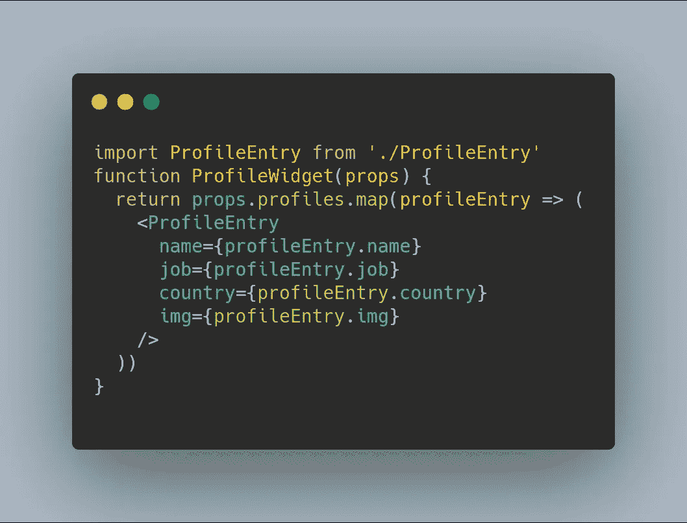**

**这里的“地图”允许你取一组东西(通过“道具”传入)，把它分解成每个东西，然后声明你想要每个东西呈现什么**

**因此，如果我们获取我们的原始人员列表，将他们添加到一个合理的数据结构中(使用 [JSON](https://www.w3schools.com/js/js_json_intro.asp) ，并将值传递给上面的`ProfileWidget`组件…**

****

**…上面的代码现在将生成与下面相同的代码，但现在我们只需维护我们的`profiles`数据。为了清楚起见，上面的例子和我们声明每个`ProfileEntry`的例子是一样的，如下所示:**

**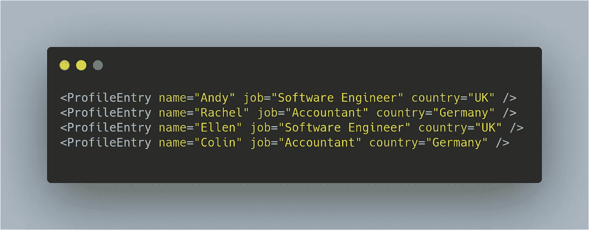**

**但是我们现在可以负责创建来自另一个组件的`ProfileEntry`行——该组件本身只是根据传入的数据生成这些行:**

****

**现在添加更多的概要文件变得非常容易，而不必担心对单个行应用样式或为每个概要文件条目编写行——我们只需更新数据，其他所有内容都会随之更新:**

**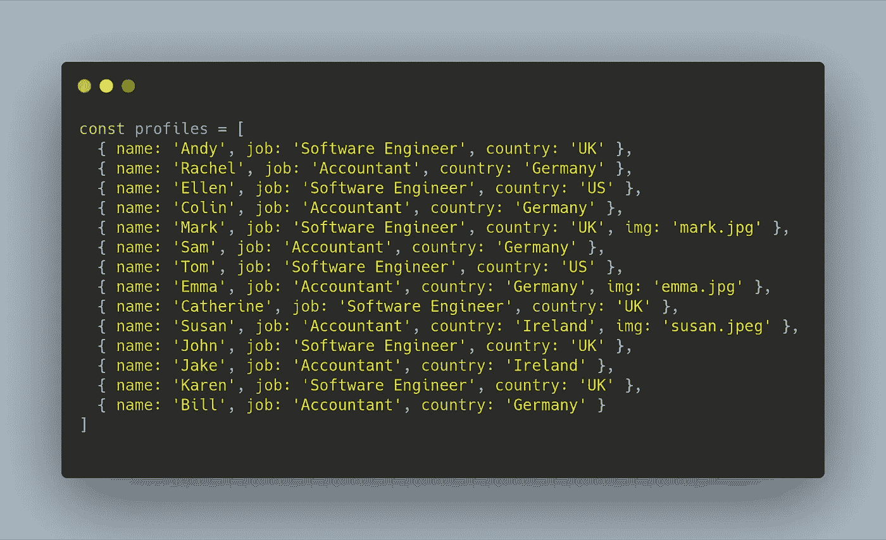******

**🎉**

**本例中的上述`profiles`数据是与组件一起硬编码的。但是想象一下这个`profiles`数据现在来自另一个来源；也许它是作为一个单独的文件加载的，包含在项目中，或者也许数据是通过调用后端服务返回的。**

**有了 React 组件，我们现在只需更改底层数据，就可以轻松地动态维护我们的页面`profiles`。**

# **就这样**

**重申先前的信息:**

**完全理解一个技术领域的所有概念不应该成为创造的先决条件。通常，你只需要正确的直觉，用很少的背景知识就完全有可能创造出令人惊叹的东西。**

**最近，我的一个非技术同事想学习 React。**

**尽管这位同事之前没有丰富的编程经验——在分配给[黑客日](https://medium.com/better-programming/we-overengineered-a-teapot-c718251ce897)的两天内，我们和其他团队成员一起，与我的同事一起完成了[我们❤️茶](https://team-teapot.netlify.com/)的开发和代码的实际编写。**

**所需要的只是一个想法，一些 HTML 的基础知识，一块白板，一台笔记本电脑，当然，还有许多杯茶。**

****

**完成一个随机生成的当天茶相关的报价**

**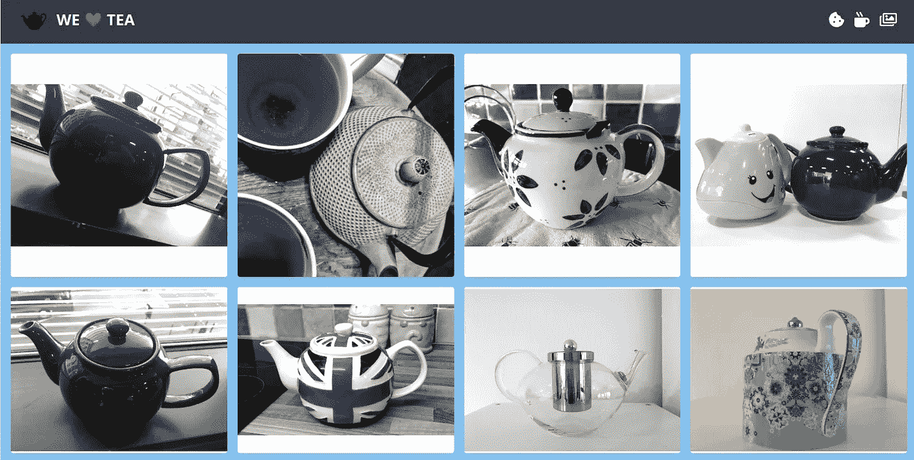**

**茶壶廊墙上挂满了中国传统名句**

****

**一个旋转的泡茶计时器，这样你就可以根据你对茶的颜色的喜好知道什么时候停止泡茶**

## **感谢阅读！**

**显然，这并不是学习 React 的详尽指南，而是向那些不熟悉或没有现代 web 开发经验的人介绍概念的一种方式。**

**要想更好地了解 React，只需看看 React“入门”文档本身就行了:**

** [## 开始行动-做出反应

### 用于构建用户界面的 JavaScript 库

reactjs.org](https://reactjs.org/docs/getting-started.html)**