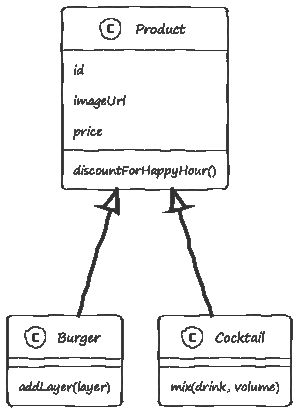

# 从面向对象的 JS 到函数式脚本

> 原文：<https://betterprogramming.pub/from-object-oriented-js-to-functional-rescript-dcaf25e4bc16>

## 改变你的心态

Prawny 的图像

这篇文章也可以很容易地命名为“从面向对象的 C++到函数式 Haskell”或“从面向对象的 C#到函数式 F#”或“从面向对象的 Python 到函数式 OCaml”。

主要思想是展示 OOP(面向对象编程)概念如何在完成相同任务的同时投射到 FP(函数式编程)中。为了举例，以细节为基础总是好的。所以，我选择了 JavaScript 和 ReScript 的组合作为例子，因为这是我目前使用最多的语言。

我希望你是一个熟悉 JS 的开发人员，经常使用对象、它们的方法和属性。不确定，你正在创建你自己的类来完成事情，但是肯定使用来自第三方库的对象，感受一下`myObj.foo.func()`是什么意思，看那个“嘣！undefined 不是一个函数”，甚至可能从未想过是否可以用另一种方式来做事情。

# 解构面向对象编程

OOP 是一种编程范式。它是一个综合的概念，提供了一种组织你的程序的方法。你知道，OOP 无处不在:大多数流行的编程语言都允许或强制以这种方式构建程序和库。

然而，对象不是编程的唯一方式，也绝对不是解决所有问题的灵丹妙药。对象被证明有缺点:可组合性问题、隐式状态依赖、独石等等。一个可能的选择是函数式编程范式。

“功能性”在实践中是什么意思？我将把 OOP 分解成几个部分，看看它们打算解决什么问题，并尝试找到一种函数式编程方法来做类似的事情。我所指的零件是:

*   包装
*   抽象
*   遗产
*   多态性

# 第 1 部分:封装

封装，可以说是 OOP 中最被认可的部分。正是这个点(`.`)允许您向下钻取对象，以获得您想要的值或您将要调用的方法。

从形式上讲，封装是一种能够:

*   将相关的数据和功能组合在一个单一的事物中(称为*对象*)；
*   使用对对象的引用，访问数据(称为*字段*)；
*   使用对对象的引用，调用它的函数来操作数据(称为*方法*)。

许多语言用“属性”(实际上是方法的字段，也称为 getter/setter)、“事件”(实际上是回调函数指针数组的字段)和其他特性来扩展这个概念。然而，这并没有改变大局。

为了说明封装，让我们用 JavaScript 做一些汉堡。

我们建立了一个(过于简化的)系统来描述汉堡作为物品。现在，我们可以通过应用程序来计算价格、显示菜单、接受订单、管理烹饪队列等等。

好的，如果我们使用函数式编程范式开发一个应用程序，代码会是什么样子？大多数 FP 语言，包括 ReScript，完全缺乏类的概念以及它们的属性和方法。函数式语言将数据与行为和算法严格分离。数据和函数是函数式编程的面包和黄油，明确指出面包≠黄油。鉴于此，让我们从我们操作的数据的定义开始:

这里我们定义了一个新的类型，它将所有与汉堡相关的数据进行分组。该类型是一个具有两个字段的记录，用于模拟我们的汉堡。就这么简单。没有方法，没有间接方式，没有时髦的语法:就像 JS 程序员所说的“普通的旧 JavaScript 对象”

`t`名称是描述当前模块主要数据类型的类型的一个重写约定。这很方便，因为你可以从其他模块中流畅地引用这些类型，比如:`Burger.t`、`Layer.t`、`Order.t`等等。

我们有数据。让我们继续讨论行为，也就是函数。首先，我们要为我们的类型添加一个构造函数。`Burger.t`的用户可以通过逐个指定所有字段来轻松地直接创建一个新实例:

…但遵循与 JavaScript 示例中相同的逻辑，让我们用一个非常基本的成分堆栈来预填充层:

再说一次，这里没什么特别的。构造函数只是常规的命名为`make`或`makeBlahBlahBlah`的函数。我们的构造函数将一个字符串作为参数，并返回一个新的`Burger.t`。

最后一点是我们的`addLayer`函数:

现在，开发人员可以使用我们的系统:

这两个之前的片段非常简单，但是承载了很多 FP 和 ReScript 的重要细节。我们一个一个来看。

## 管道

ReScript 中的`->`操作符被称为快速管道。这是常规函数调用的语法糖，它将左边的值作为右边函数的第一个参数。以下内容是等效的:

多亏了快速管道，在 OOP 中使用点符号处理数据就像处理对象一样。但与 OOP 相反，访问“对象”(数据)、“方法”(兼容函数)并不是一种独特的语言机制；这是传统普通函数调用的另一种语法。“对象”(类型为`t`的对象)通常作为第一个参数显式传递。很漂亮，是吧？

## 没有方法，没有猴子补丁

在上面的`kingburger`建设管道中，你可能会陷入`Burger.`、`Burger.`、`Burger.`的重复。这些限定符是`->`只是一个函数调用的直接结果；它不是属于“对象”的东西我们必须告诉 ReScript 定义函数的模块名，因此每一步都有模块前缀。

这可能看起来很烦人，但实际上，这是有益的。首先，当您阅读代码时，您可以轻松地遵循最复杂的处理管道，而不必猜测方法返回什么类型以及在哪里可以找到具有这样一个方法的类:代码更加自文档化。第二，像对象猴子修补或聚合填充这样的(丑陋的)事情在 ReScript 中是不相关的:如果你错过了你不控制的“对象”上的一个“方法”,继续在你控制的模块中编写想要的新函数并使用它。

注意，在上面的例子中，我使用了`ArrayX.last`来获取数组的最后一个元素。标准脚本库的`Array`模块不包含这样的函数，但是我发现它在这个项目中很方便。所以我可以自由地创建一个模块(比如说，`ArrayX`)并添加任何我认为有用的数组工具(比如，`ArrayX.last`)。选择我是应该对内置的`Array`对象打猴子补丁，还是继承一个新的`Array`类，还是将实用程序放在一个模块中，并编写混合方法/函数调用的代码，没有什么困难。

同样，即使给我一个库形式的`Burger`模块，我也可以扩展它:

然后使用新的“方法”:

如果您仍然觉得很烦，ReScript 提供了两种可能的快捷方式:

## 不可变数据

尽管 OOP 范例中没有任何东西强迫你改变对象字段的值，但这是使用类时完成这项工作的默认方式。一个方法访问`this`实例的字段并改变它们的值。或者它调用嵌套子对象上的另一个方法来改变它的值，等等。换句话说，OOP 传统上*在方法调用中改变*与对象相关的数据。

相比之下，FP 语言的默认方式是保存从不改变的数据，即*不可变的*数据。如果你想改变一个字段的值，你不需要。取而代之的是，你*克隆*你想要改变的数据，除了你想要改变的字段之外，保持所有数据的值不变。重新审视我们的浇头功能:

ReScript 中的`…`操作符克隆一个记录，复制除了明确指定的字段之外的所有值。因此，`addLayer`函数获取一个`burger`，制作一个*新的*它看起来和原来的一模一样，只是多了一层，然后把原来的那个扔进垃圾桶。我要说这是 OOP 封装的直接对立面，这是 FP 的正宗方式。

是的，我知道，扔掉一个汉堡，然后重新做一个，只是为了加一片奶酪，这很奇怪。戈登·拉姆齐可能没有明白这一点，所以他没能成为一名程序员(这其实很好)。然而，对于我们开发人员来说，不变性对程序的简单性和可靠性有着巨大的影响。使用不可变的数据结构，你甚至不会碰到共享状态的问题，这是很多错误的根源。在改变一个领域之前，你不会考虑你能影响哪些其他系统部分，以及在那之后它们会如何表现。您不会考虑多线程环境中不一致和不完整的数据更新。你不会想到孤儿嵌套对象。你只需要不局限于你正在写或回顾的函数。不可变数据减少了很多压力。

任何事情都是有成本的，不变性的成本就是性能。但是表演并没有达到你想象的程度。在保证递归不变性的情况下，通过在最外层嵌套层创建一个浅层副本，可以有效地创建一个复杂的深层嵌套对象的克隆。所有嵌套对象都将在副本中重复使用，因为它们无论如何都不能更改。所以，克隆在大多数情况下是廉价的。

当绝对需要时，ReScript 提供逃生舱口。也就是说，`mutable`关键字可以应用于记录字段声明。此外，标准库为潜在的繁重操作提供了一些就地修改功能。这些函数被谨慎地显式命名(例如，`stableSortInPlaceBy`)并返回`unit`(即“nothing”)，以禁止可能引入隐式可变依赖的进一步管道式处理。当你处于传统的混乱命令式编程的危险地带时，ReScript 在语言语法和标准库设计的层面上显示了这一点。

## 没有空引用

与面向对象编程或封装没有明显的联系，每个开发人员都熟悉编程中的一个诅咒。[十亿错误](https://en.wikipedia.org/wiki/Null_pointer)，空指。是的，空指针在 OOP 之前就被引入了，但是我确信主流的 OOP 语言，比如 C++，Java，C#，然后是 JavaScript 最终将这个问题升级到了历史的高度。这是因为 OOP 是围绕对象的概念构建的，并且每次都应该以某种方式传递对象。它们通过*引用*(又名指针)传递，这个引用后面的实际对象可以是——嗯——真实的对象，或者它可以是一个炸弹，一旦被触动就会使程序崩溃🍔💥

ReScript 让“未定义不是函数”成为不可能。让我们再看一下我们的函数:

首先，因为 ReScript 没有空引用，所以你可以 100%确定参数(`burger`和`layer`)确实是有效的数据值，也不能是`null` / `undefined`。所以程序在`burger.layers`上运行永远不会崩溃。此外，layers 数组永远不会意外地得到一个空层，这个空层将是一个随时会爆炸的定时炸弹。牛肉、番茄、**、空**、奶酪，有人要吗？

接下来，ReScript 使用一种惯用的函数式编程机制，使错误的可能性变得显而易见。例如，在我们的例子中，`ArrayX.last`返回一个*选项*，如果数组为空，它可以是**某个**值或 **none** 。这听起来和 JavaScript 做的事情很相似，但是有一个重要的区别。你被迫检查两种结果；否则，ReScript 编译器会向您发出一个错误。

具有讽刺意味的是，这种执行方式使得前面在 JavaScript 中实现的相同函数变得明显不正确:如果一个 burger 对象没有层，它不会添加任何东西。它不应该发生在我们过于简单的模型中，但不可避免地会发生在一个真实系统的进化过程中。

再说一次，当你知道你在做什么的时候，就有逃生出口。必要时，ReScript 有异常和不安全的例程。这种功能通常以类似`lalaExn`、`lalaUnsafe`的预防性后缀命名，以警告您地面可能会打滑。

# 第 2 部分:抽象

抽象是一个 OOP 特性，允许你隐藏一个对象的实现细节。给你一个抽象和一个定义良好的接口，你通过这个接口使用它，而不用考虑它是如何工作的。让我们再次看看我们的 JavaScript 类:

很明显，任何类型为`Burger`的对象都有一个名为`layers`的字段，该字段是一个数组。但是，如果我作为一个对象用户，被允许调整甚至直接访问这个字段，这并不明显。毕竟，没有什么可以阻止我弄乱层次:

现在我们有一个汉堡，底部没有面包，这是我们的 app 无法接受的。为了解决这个问题，OOP 语言允许隐藏对象的一些字段和方法，使它们对外界是私有的。C++、C#、Java 都有类成员关键字说明符；Python、JavaScript 建议遵循私有属性名从下划线`_`开始的惯例。现代 JS 还允许使用 hash `#`前缀将字段标记为 private，所以我们最好这样定义我们的类:

现在，`Burger`方法之外的任何人都无法洗牌。现在更好的保护它不进入无效状态。

我们能在函数式编程中隐藏实现细节吗？简单。不说所有的 FP 语言，ReScript 有几个特性可以完美地解决这个问题。它们是:

*   接口文件/模块签名
*   不透明类型

在本文的前面，我们在`Burger.res`源文件中实现了一个`Burger`模块。现在我们可以在`Burger.res`旁边添加一个`Burger.resi`文件来定义这个模块的 API，有效地限制了用户从外部使用这个模块的方式:

注意，我们在这个接口文件中声明了`t`类型，但是没有提供其底层结构的任何细节。那是一种*不透明*类型。有了这个限制，用户就不能创建任意的数据值，这可能违反了业务规则。现在制作新汉堡的唯一方法是`make`函数:你给它一个字符串(标题)，你就得到你的汉堡。同样，我们声明了`addLayer`函数的签名。

如果我们现在向`Burger.res`实现文件添加一个新的函数、常量、类型定义或任何东西，它们在`Burger`模块之外的任何地方都不可用。您还必须将它们添加到接口文件中，以表达公共的“导出”意图。

在这个例子中，我们创建了一个模块，然后声明了它的接口。实际上，大多数时候，我反过来做:首先，创建一个接口，然后写下实现。在第一步关注接口而不是实现细节迫使你为你的迷你库想象和设计最好和最干净的 API(考虑模块是迷你库)。并且只有在结构良好的框架准备好之后，您才能用最低要求的实现来完成它。这样的工作流程会自动让你遵循[亲吻](https://en.wikipedia.org/wiki/KISS_principle)和 [YAGNI](https://en.wikipedia.org/wiki/You_aren%27t_gonna_need_it) 的原则。

现在我们已经隐藏了模块签名背后的所有细节。我得说我们隐藏得太多了。到目前为止，不再可能得到汉堡的名称或层数。让我们修正它，发展我们的签名:

一个简单明了的 API，不是吗？是时候填补实现中的空白了，这很简单:

我发现这种让所有记录类型变得不透明，只发布一个最小的数据获取器/更新器集的模式对于域对象建模来说非常典型。到目前为止，只显示了一些技术，您可以走得很远，并且您的应用程序可能不需要任何进一步的东西。

# 第 3 部分:继承

当一个新类声明它是基于其他类时，OOP 提供了一种类扩展机制。在这种情况下，派生类*继承了*基类的所有属性和方法，然后在这个基础上添加新的东西。因此，无论何时我们有几个从同一个基类派生的类，我们都可以确定它们都提供了基类中声明的优点。

继承表达了“是”的关系:

*   按钮是一个用户界面组件
*   猫是一种动物
*   汽车是一种交通工具

在我们的餐厅应用程序中，除了汉堡，我们还可以提供鸡尾酒。汉堡和鸡尾酒都应该出现在菜单上，菜单上应该显示它们的名称、照片和价格。标题、照片和价格是它们共有的属性，因为任何这样的对象“都是”产品。但是，施工程序不同；因此，我们有不同的对象类。下面是一个可能的类层次结构:

在 JavaScript 中，层次结构可以这样表示:

现在，给定一个产品列表，无论是汉堡还是鸡尾酒，系统都可以使用公共字段和方法来呈现一个菜单，以计算欢乐时光的价格。

传统的问题:如何在函数式编程范式中表达继承？你没有！像大多数编程实践一样，继承是一个短暂的概念。你不会为了继承而继承类；你在努力解决问题。继承试图解决的问题是为不同的实体提供一个共同的基础。让我们专注于此。

OOP 有一个被证实的原则，即任何继承[都可以用组合](https://en.wikipedia.org/wiki/Composition_over_inheritance)代替。这很有用，因为一般来说，FP 语言没有共同的继承机制，但是组合是构建在它们的 DNA 中的东西。那么，在实践中，我们如何在 ReScript 中表达`Product`、`Burger`和`Cocktail`来呈现可用项目的菜单并保持结构上的差异呢？超越 JS OOP 继承的额外障碍:我们已经有了上面的`Burger`模块，我们对它很满意，我们不想改变那里的任何东西。

首先，让我们为菜单呈现服务建模:

好吧，我们需要一个产品，这就是:

很好。但是产品是不是太抽象了？是的，我们已经失去了这个东西是什么以及它是如何构造的任何线索。让我们来解决它:

这里我使用任何 FP 语言都提供的东西:代数数据类型(ADT)，在 ReScript 中称为*变体*。这是一个简单而强大的概念。variant 的值严格来说是枚举的情况之一，以及 parens 中指定的有效负载值。在这种情况下，产品种类可以是我们之前实现的具有`Burger.t`有效负载的`Burger`，也可以是具有`Cocktail.t`有效负载的`Cocktail`。

现在，每当我处理一个`Product.kind`类型的值时，我被迫向编译器解释所有的变量，否则它会对我咆哮:

概括一下，有什么大惊小怪的？对汉堡和鸡尾酒进行足够的抽象，以便“菜单”模块可以为我们的餐厅呈现一个漂亮的菜单图像，而无需过多考虑具体项目是什么。我们现在能做吗？肯定！

如果我在 10-15 年前读到这篇文章，我会抱怨:“——胡说！是精装的！广义的实体必须知道所有具体的规范，不灵活，无法工作！”现实是，你不能在抽象中的抽象之上创建一个抽象来建模世界上的一切。实际的业务需求不断发展，表明我们对事物进行分类的心理模型在大多数时间的某个点上是错误的。

好消息是这个世界其实很简单！如果你知道你正在做的软件只管理汉堡和鸡尾酒(好吧，一个产品负责人可能会在以后添加开胃菜和沙拉)，那么明确一点是完全可以的。如果你知道将会有数百种产品，那就进行逆向结构:让特定的类型提供一个`ProductDescription`，而不是将特定的类型保存在一个`Product`中。灵活而简单！

同样，对于最复杂的场景，ReScript 提供了像模块函子这样的有效机制来进行元编程。我不想在这篇文章中触及它们。他们可以创造比 OOP 技巧更令人印象深刻的奇迹。如果你只是为了一个案例而应用它们，你的代码将会变成一个骗局:对你的伙伴来说是有趣的，解决问题的乐趣就少了。凡事有利有弊。

# 第 4 部分:多态性

OOP 的最后一个支柱是*子类型多态性*，也称为虚拟方法或继承方法重载。目的如下。可以给你一个你认为是某个类的实例的对象的引用(姑且称之为`Base`)并调用它的方法(比如`doJob`)。但是在幕后——你既不知道也不想知道——这个对象可以拥有从`Base`继承的另一个类的类型(姑且称之为`Derived`)。在这种情况下，程序将执行`Derived.doJob`的代码，而不是`Base.doJob`中定义的代码。

在 C 风格的类出现在 ES6 的 JavaScript 之前，我会说 web 开发人员很少使用 OOP 多态性，因为 JS-native 原型链继承对于一个普通的开发人员来说太费脑筋了。然而，在其他语言中，它总是一个随意的工具，用来委托和分解各种问题。现在它也在 JS 中。想象一下，为给定的产品列表生成一个极简的 HTML 菜单。JavaScript 代码可能是:

这里我们有`ingredientsString`方法，它是多态的。它应该让顾客知道他点的是什么。该方法可以单独使用，但具体来说，它由基类`Product.menuItemHtml`调用，以生成菜单呈现时在其他地方使用的整个菜单项标记。多态性的技巧很方便，因为汉堡和鸡尾酒的最终结果相似，但细节不同。而方法重载可以在 OOP 中表达这种需求。

我们如何在脚本中表达这种多态性？你知道答案:“我们没有！”同样，多态性是一个用来解决特定问题的综合概念，而不是单独使用多态性，对吗？我们所需要的就是使用现有的工具来解决给定的问题。再次变招救援！我甚至觉得这和处理继承问题太相似到无聊的地步了:

我们的汉堡:

和鸡尾酒:

无聊？嗯，是的。不可扩展？不完全是。当然，当您有十几个虚拟方法时，一次又一次地添加基于交换机的调度会变得很乏味。然而，我不记得有哪一个案例是这一点成为样板的。首先，很少有一个真正宽的继承图，所有的类都有它们非常具体的方法实现:在大多数情况下，它们都是相同的，只有 10 个中的 1 个有一些不寻常的东西要说。第二，假设您绝对需要继承多态性，而不需要调度样板文件。在这种情况下，ReScript 提供了模块函子和一级模块来实现它，我仍然在文章中忽略它们，因为它们是其他问题的忍者武器，我敢打赌。第三…

先有鸡还是先有蛋？在我们的例子中，两者都应该知道 HTML。所以问题要展开了！先有鸡，先有蛋，还是先有 HTML？！一个鸡蛋应该如何看待它在菜单上的呈现？鸡蛋应该是 HTML 方面的专家，还是 PDF 或 SVG 方面的专家？见鬼不要。很多次，我看到一些物体对它们所处的环境过于敏感，我对这句名言击掌相庆。

> >因为面向对象语言的问题是它们拥有所有这些它们随身携带的隐式环境。你想要一个香蕉，但你得到的是一只大猩猩拿着香蕉和整个丛林。
> 
> Erlang 编程语言的创始人乔·阿姆斯特朗

子类型多态性是一个美丽的想法，但通常不能满足现实世界的需求。在上面的例子中，我将与 HTML 菜单生成相关的内容分组到一个单独的模块中，而不触及其本质。

现在，所有与 HTML 菜单相关的东西都被很好地组织在一个专用的模块中。易于阅读，易于推理，易于改变。

# OOP 有什么问题

没什么。不过，价格太高了。OOP 是作为主流开发中所有问题的通用解决方案提供给我们的。当然，你可以坚持面向对象的模式。问题是效率和开发经验。除了 OOP，其他世界也确实存在。我不是说它们是完美的，但我们有权知道选择。幸运的是，另类概念时不时地渗入主流世界，并因此而出名。以 React 为例；我会说这是一个面向对象的对映体；它与以前流行的 UI 框架有很大不同。我很高兴它得到了牵引。

重写也是如此。这是一种现实世界开发的实用语言，尽管是一种(宽松的)函数式范式。ReScript 也有轻量级的 JavaScript interop，所以很容易将 ReScript 部分混合到现有的 JS 代码库中，反之亦然。拿你的尺度来说:如果你对代码可靠性、简单性和健壮性的需求超过了使用新技术的风险，给函数式编程一个机会。顺便说一句，我不隶属于脚本团队；我只是一个谦逊而自豪的用户

*跨岗。本文原载于*[https://full steak . dev/posts/from-OOP-JavaScript-to-functional-rescript](https://fullsteak.dev/posts/from-oop-javascript-to-functional-rescript)