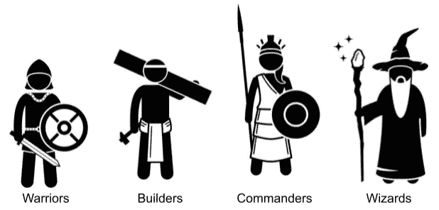
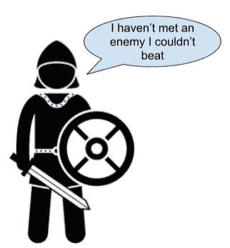
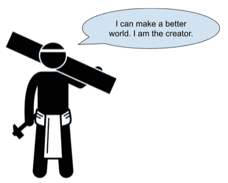
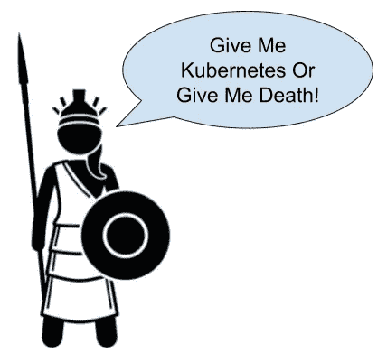
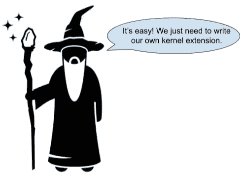

# 从勇士到奇才:DevOps 团队构成

> 原文：<https://betterprogramming.pub/from-warriors-to-wizards-devops-team-composition-254351b13a0b>

## 建立合作团队的技巧


由黑沙滩工作室的罗拉多制作

# 建立平衡的团队

一个好的 DevOps 团队由一个强大的指挥官、一个巫师、几个建造者和一个战士阵容组成。为什么要用这样的比喻呢——这看起来很傻，对吗？我相信最强的团队(无论是在角色扮演游戏中还是在现实生活中)都是由具有不同优势和能力的人组成的。如果你建立一个只有一个等级的战士的队伍，你将无法解决更大的 boss 战。

勇士到奇才的范例的目的是给你一个新的视角来评价和欣赏你的团队成员的长处。

首先，让我们对不同的类做一个简单的概述，以及如何将一个更大的 DevOps 组划分为小队。在这篇文章的后面，我将深入探讨上面提到的四个角色。在文章的最后，我将介绍评估团队需求的其他更传统的思维范式。

# 战士到巫师的范式



由 [Leremy](https://www.istockphoto.com/portfolio/www.leremy.com)

*   战士:他们是多面手，可以部署系统，自动化系统，并构建小型应用程序作为集成粘合剂。他们首先是解决问题的人。
*   构建者:他们是拥有中等基础设施技能的软件工程师。他们的强项是在现有系统不适合你的业务的地方创造新的工具。
*   指挥官:每个团队都需要一个领导，让团队朝着一个方向前进。最好的是鼓舞人心的领导者，而不是操练军士。DevOps 指挥官应该在每一场战斗中作为激励的支柱和混乱时期的果断决策者。
*   巫师:巫师能够从根本上解决别人解决不了的问题，或者构建别人想不到的复杂解决方案(比如魔法)。他们是在最深层次上理解团队核心技术的领域专家。巫师的技能往往是尖尖的(就像他们的帽子一样)，对于他们拥有的每一个优势，通常都有一个相应的弱点需要你去解决。

理想情况下，开发团队应该分成五到八个人的小组(两个披萨的小组)。你只想要一条线索，多一个巫师收益递减。战士和建造者的比例取决于你想从团队中得到什么样的结果。如果团队中大多数成员都是战士，那么可以预期他们会主要关注于部署行业标准的解决方案。如果团队的大多数成员都是构建者，那么可以期待更多的定制解决方案，这些解决方案是为企业面临的问题量身定制的。这两种策略都是有效的。

# DevOps 团队部门

DevOps 的挑战之一是期望他们是什么都能做的多面手——编码、部署、调试、保护和记录任何系统。这些系统可能已经发展了几十年，但仍有望快速发展并做出实质性的改变。

话说回来，这也是高级 DevOps 工程师如此有价值的原因(他们是 DevOps 军队的陆战队员)。然而，这些士兵所能做的是有限度的，这就是划分是如此有用的地方。

**将您的 DevOps 团队划分为子类别**，这些子类别限制了运营和决策所需的知识范围。花时间确保子团队相互交流，以避免重复工作。举个说明性的例子，假设您的基础设施作为容器部署在 Kubernetes 上。让五个子团队都运行他们自己的集群是没有意义的(随着时间的推移，每个集群都会发生分歧)。如果您试图让所有五个团队平等地负责一个共享集群，情况会更糟。

**根据离散团队成果调整子团队。**这可能是不言而喻的，但是把相似的系统放在一起，并指派一个团队来拥有每一套系统。每个团队都应该感觉到他们对自己的系统有自主权。

确保子团队有明确的团队间合同。如果您让一个 DevOps 团队来运行 Kubernetes 集群，请确保该团队有一份明确的责任合同，规定他们支持什么，不支持什么。

保持 5 到 12 名工程师组成的小组。这个已经被[写成了](https://www.devops-certification.org/How_Should_You_Build_Your_DevOps_Organization_And_Design_Your_Software_Architecture.php#:~:text=How%20Big%20Should%20Be%20Your,time%20with%20errands%20and%20overhead.) [关于](https://www.bmc.com/blogs/devops-team-structure/) [一个](https://www.artofteamwork.com/what-is-the-ideal-team-size/#:~:text=The%20higher%20the%20interdependence%20of,is%20between%204%20and%208.) [地段](https://www.infoq.com/news/2009/04/agile-optimal-team-size/)。核心的综合是一个超过 12 个 DevOps 工程师的团队将会有如此大的责任范围，以至于会使工程师们效率低下。

# 指挥官、战士、建筑者和巫师

让我们更深入地了解每种战斗机的特点。指挥官、战士、建筑者和巫师的具体特征描述如下。

# 战士(多面手)的理想品质



一般来说，每个 DevOps 工程师都擅长系统或编码。这通常取决于他们在职业生涯早期的表现。但是不管你是有一个学会编码的系统工程师还是一个偶然发现基础设施所有权的软件工程师，多面手都是你军队中最重要的工具。DevOps 通才非常强大，因为他们拥有广泛的技能，可以用来解决任何基础设施问题。他们是德沃普斯军队的陆战队员。

和海军陆战队一样，培养一名优秀的德沃普斯多面手需要多年的训练。事实上，找到建设者和领导者比找到优秀的 DevOps 通才更容易。一个有凝聚力的 DevOps 通才团队可以有效地维护大量的基础架构。他们也擅长拥有，因为他们倾向于以自己的工作为荣，不会让某件事成为“别人的问题”

关键品质:

*   技术切换者:无论是编码还是系统，Windows 还是 Linux，部署还是调试，这些 DevOps 工程师都足够灵活，可以做任何必要的事情来完成任务。请注意，这通常是以不是专家为代价的。
*   在压力下表现良好:每一位经验丰富的 DevOps 工程师都经历过技术冲突(凌晨 2 点令人讨厌的中断，永远无法解决的扩展问题，等等。).在敌人的攻击下，你需要冷静、量化、理性的思考，而不是那些开始表现出受到威胁的人(提高嗓门或做出惊慌失措的决定)。
*   毅力(愿意做需要做的事情):DevOps 不是那些不愿意根据需要通宵或周末工作的人的职业选择。有时候，在服务再次运行之前，您不会睡觉。一个健康的团队将有一个适当的系统，以确保人们在重大事故后获得所需的充电时间。

**注意**:在这篇文章的后面会有更多关于这方面的内容，但是在具体案例的基础上，当建立或雇佣一个 DevOps 团队时，弄清楚你的系统专业知识和编码专业知识之间的平衡是很重要的。

# 构建者的理想品质(专注于软件的工程师)



明确地说，所有 DevOps 工程师本质上都需要成为部分建设者，因为这是范式背后的整个思维模式。然而，有一些工程师只有在创造新东西的时候才会成功。对于一个只有构建者的团队来说，您将不断地重复发明轮子，并且永远不会利用现有的解决方案。这就是为什么你只希望你的团队中的一部分人成为构建者。

这种心态在来自纯软件工程背景的 DevOps 工程师中尤其普遍。他们一直做得最好的事情是从头开始创造新的东西，每次他们遇到一种情况，他们都会很快找到自己的解决方案。然而，构建自己的内部解决方案会带来永久的维护负担。优秀的建筑商意识到了这一点。

同样值得注意的是，构建者常常是可怜的战士。在紧急情况下，他们可以加入争论，但他们最好制定一个永久的解决方案。

关键品质:

*   优秀的软件工程基础:构建者在编码范例、API 设计和代码审查方面非常优秀。他们创造的东西质量很高，其他人很容易维护。
*   经验丰富:相比下载或购买现有解决方案，早期职业建设者更倾向于构建新的解决方案。一旦你不得不维护自己的代码足够长的时间，你就会意识到你的编码愿望和现实之间的巨大差异。这一经历锻炼了你的渴望，让你知道维护的成本。
*   以用户为中心:与产品团队相比，DevOps 团队不太可能获得产品经理、设计师或质量保证支持。一个天生以用户为中心的 DevOps 工程师更有可能构建一个有用的工具，而不是一个以技术为中心的工具。

# 指挥官(团队领导)的理想品质



每个队都需要一个指挥官(队长)。指挥官并不意味着是团队中最聪明、最快或最强壮的，但他们是最关注最终结果的人。工程师们可能会迷失在他们的建筑中，战士们可能不会后退一步去看更大的图景。团队领导是为了让团队保持专注。

关键品质:

*   远见卓识:优秀的指挥官能够把握未来，然后后退一步，创造一条通往未来的道路。他们不必是所有想法的创始人，但他们需要能够接受一个好想法，并将其转化为团队的一个引人注目的愿景。
*   出色的跨团队协作:团队领导的一半工作是因为<x>而说不。你需要一个善解人意、深思熟虑、坚强有力的领导者来驾驭这片水域。微弱的领先优势会导致过度承诺，不仅会导致当前项目失败，还会让基础架构的其余部分腐烂。一个难相处的领导会阻碍合作，他们的责任范围会随着时间的推移而缩小，直到他们解散。</x>
*   可以记住整个架构:所有的基础设施都会随着时间的推移而腐烂，需要定期维护。如果团队领导有盲点，他们不太可能花时间来支撑基础设施的所有不同方面。
*   能和勇士并肩作战，和建设者一起建设:最好的领导者以身作则。如果领导者不能和团队一起跳进战壕，他们就会变得脱节，最终导致团队走向毁灭。团队领导不需要是最好的，但他们需要保持相关性。

# 巫师(专家)的理想品质



巫师是我最喜欢的话题，也是我想写这篇文章的主要原因。对于任何一个功能性的 DevOps 团队来说，巫师都是一个惊人的补充。他们在他们的魔法塔里呆了这么长时间，以至于他们比任何人都有权知道的更了解系统管理的神秘艺术。他们通常喜欢被称为领域专家或专家。

向导在以下情况下尤其有用。

*   当运行复杂的系统(比如微软的 AD、Exchange、Kubernetes、Splunk)时，你需要一个对系统了如指掌的向导。偶尔，您会遇到需要对整个堆栈了如指掌的人才能解决的问题，而向导可以扭转局面。
*   当你需要解决一个时间敏感的，不可能的问题时，向导可能是至关重要的。当您的项目有一个面向外部的截止日期，而您只是处于“完成它”的模式时，向导对于应用完成项目所需的剩余胶水来说是非常棒的。

不过，这是一种谨慎的平衡。在上述两种情况下，你必须权衡你创造的解决方案的成本(比如[施咒的意外影响](https://www.imdb.com/title/tt10872600/))。你不想让一个向导成为团队日常运作的关键。这意味着您的基础设施是通过魔法结合在一起的，非常脆弱。

你还得小心黑巫师。黑巫师被正常社会所回避，他们在巫师塔里呆的时间太长了，以至于他们从来没有学会如何作为团队的一部分进行互动。结果，他们构建的解决方案很笨拙，社交互动很费力，而且他们在团队中会让人不愉快。文化把过程当早餐吃，一个有毒的巫师会吃掉你的团队。

关键品质:

*   在你的团队管理的事情上有非凡的天赋:奇才是行业知名的专家，擅长对你的团队或业务至关重要的特定技术。
*   战斗中期非常有用:巫师可以在停机时修复主要问题，或者在最后一小时完成一段定制代码来拯救项目。巫师在激烈的战斗中获得回报。

# 替代团队组成策略

虽然战士到巫师的比喻很有用，但它并不是评估你的团队组成的完全充分的工具。你需要多种方法来评估你的队伍以弥补弱点。本节提供了我在评估 DevOps 团队的潜在成员时使用的另外三种技术的快速概述。

## 评估团队的硬技术技能

当试图在一个团队中安置一个新的工程师时，你首先要回答一个问题:这是一个具有一些系统技能的软件工程师还是一个具有一些编码技能的系统工程师？

然后，你必须评估你所有的 DevOps 团队和他们的[板凳实力](https://simplicable.com/new/bench-strength#:~:text=Bench%20strength%20is%20an%20organization's,such%20as%20leadership%20development%20programs.)。一个团队是否缺乏构建他们需要的定制解决方案的软件工程能力？他们是否努力维护他们的复杂系统，并需要该领域的知识？

这种技术在团队已经筋疲力尽并且专注于负面影响最小化的时候最有用。换句话说，你专注于确保团队有足够的技能来维护健康的生态系统。

## 根据创收情况评估新员工

从理论上讲，如果你有一个甲骨文的水晶球，你就可以精确地量化你的新员工会产生多少收入，这取决于他们加入了什么团队(包括所有的副作用)。如果你有这个水晶球，那么这篇文章就是在浪费时间——只要展望未来。对于我们这些没有完美预见的人来说，我们最好的选择是尝试和估计。

一个技巧是将所有的 DevOps 团队领导召集在一起，一起审查候选人的反馈。让每个团队领导就他们将与该工程师一起做什么以及这会产生什么价值提出建议。如果有一个明显的赢家，那么也许这就是你的答案。

## 根据位置评估团队

另一个要问自己的重要问题是，你想如何根据他们的实际位置来建立你的团队。你希望你团队的大多数成员都在一个时区吗？或者，您希望它们分布在不同的地理位置，以便于跨时区支持？

也许这是一个需要额外指导的新员工。他们是否处于一个有优秀导师的时区，是否应该加入这个团队？也许你计划一次洗牌:把新员工派到团队<x>，然后把团队<x>的另一名工程师调到团队<y>。</y></x></x>

# 总结

战士到巫师的范例是一个有助于确保开发团队中技能组合平衡的框架。就像龙与地下城一样，每个强队都是由各种不同的职业组成的。每个 DevOps 团队都由指挥官、建造者、巫师和战士组成，他们只是不认为自己是这些名字。

根据你的领导风格，决定如何建立你的团队是一个非常个人化的选择。我非常相信情境领导。情境领导是指你让自己的领导风格适应你所领导的个人。当谈到团队组成时，它是仔细考虑每个成员的优点和缺点，并对团队进行补充。

一个把战士放在需要构建者的位置上的指挥官会感到沮丧(例如，一个领导把一个面向系统的工程师放在一个需要深厚软件工程技能的项目上)。我相信每一个阅读这篇文章的人都见过这样的情况，有人被安排了一个与他们的优势不相符的角色，而且结局很糟糕。如果你用简单的术语来思考你的团队(例如“一个 DevOps 工程师”与“我的 DevOps 向导”)，你将完全错过让人们变得伟大的细微差别。

如果你觉得这篇文章有用，欢迎评论。如果你以前没有读过我的任何文章，我推荐你看看[基础设施](https://medium.com/p/5664e433934e)的许多方面，尤其是谷歌表单，它是我所谈论的内容的路线图。

```
**Want to connect?**You can also find me on [LinkedIn](https://www.linkedin.com/in/elliotgraebert/).
```

感谢[泰勒](https://www.linkedin.com/in/wgass/)帮助我塑造内容，感谢[基冈](https://www.linkedin.com/in/keeganglennon/)深入的编辑技巧。