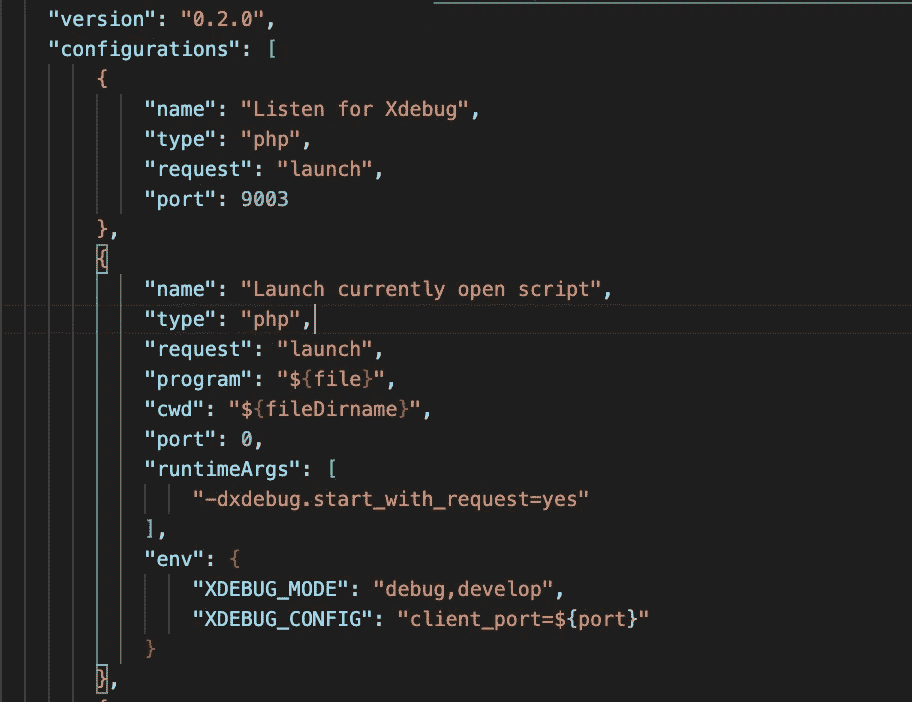

# 面向 macOS Monterey 的全栈 PHP 开发人员设置

> 原文：<https://betterprogramming.pub/full-stack-developers-setup-macos-monterey-2de8195d6178>

## 了解配置开发环境的工具


本文背后的主要思想是为希望安装/配置全栈开发所需的所有工具的开发人员开辟一条清晰的道路。本指南中的一些步骤是专门针对 Drupal 开发的，但是如果有人感兴趣，我们会指出来。

# 1.命令的

作为开发人员，我们需要安装以下工具；Xcode、brew、git、curl、vim 和 nvm。

Xcode 是一个包，为 git 或 gcc 等开发者提供了一些非常有用的命令行工具。

**家酿**是一个软件包管理器，使安装过程变得更快更容易。通过使用自制软件，我们可以安装一些其他重要的工具，如 vim(编辑文件)、git(以便正确管理版本)和 curl(主要用于安装)。

```
xcode-select --install/bin/bash -c "$(curl -fsSL [https://raw.githubusercontent.com/Homebrew/install/HEAD/install.sh](https://raw.githubusercontent.com/Homebrew/install/HEAD/install.sh))" brew install vim
brew install git
brew install curl
```

所有开发人员都需要一个文本编辑器，所以安装一个非常重要。Atom 和 sublime 是不错的选择，但我使用 Visual Studio 代码。在文章的最后，我将写一些对 VSC 有用的扩展。对于终端的选择，我们有 Hyper、iTerm2 或常规终端，但在本指南中，我们将使用 iTerm。

```
brew install --cask iterm2
brew install --cask visual-studio-code
```

安装 Visual Studio 代码后，运行应用程序并在内部按 CMD+SHIFT+P，在路径中搜索*安装代码命令。通过单击此选项，我们可以通过终端使用 VSC，正如我们将在本指南中使用的那样。*

# 2.结节

我们将使用 nvm 来安装节点，安装 nvm 后，按照我的 brew 信息中提供的信息来安装节点。

```
brew install nvm 
brew info nvm 
nvm install 12.11.1 #Node version of choice
```

# 3.街头流氓

我们将开始使用 brew 中的`httpd`，但首先，我们需要使用以下命令停止`apachectl`并卸载它:

```
sudo apachectl stop
sudo launchctl unload -w /System/Library/LaunchDaemons/org.apache.httpd.plist 2>/dev/null
```

然后我们用 brew 安装`httpd`，安装后有一些有用的命令我们需要知道，比如启动，停止，重启，获取错误日志。

```
brew install httpd
brew services start httpd
brew services stop httpd
brew services restart httpd
tail -f /usr/local/var/log/httpd/error_log
```

安装后，我们需要配置一些文件，为此，我们将使用 visual studio，所以我们建议已经完成了该部分的设置。如果没有，任何文本编辑器都可以。

```
code /usr/local/etc/httpd/httpd.conf
```

找到写着听 8080 的那一行，改成听 80。

接下来，我们将 DocumentRoot 从`/usr/local/var/www`更改为`/Users/your_user/Sites`，并对下面的目录标签进行相同的更改。

然后，我们将`AllowOverride`从 None 改为 All，并取消对`rewrite_module`的注释以启用它。

我们将改变用户和组线，这样我们就不会在将来遇到权限问题。将`User`换成`your_user`并分组给员工。

`ServerName`行也需要取消注释，值应该是 localhost。

在接下来的步骤中，我们需要创建一个 Sites 文件夹来存储我们所有的站点。`mkdir ~/Sites`。在这之后，我们将创建一个`index.html`文件，并写一行简单的代码来测试是否一切正常。还有，记得重启`httpd`。

```
echo “<h1> Apache config works!</h1>” > ~/Sites/index.html
brew services stop httpd
brew services start httpd
```

提示:如果不起作用，请再次检查用户。

# 4.数据库ˌ资料库

作为我们的数据库，我们使用的是 [MariaDB](https://mariadb.com/) ，它基本上是 MySQL，但更容易通过 brew 安装。运行以下命令:

```
brew update
brew install mariadb
brew services start mariadb
```

现在，我们将更改 MySQL 服务器密码，在下面的过程中，对每个选项按 enter 键，直到它要求输入密码，我建议使用像 root 这样简单的密码。

```
sudo /usr/local/bin/mysql_secure_installation
```

安装 MySQL 后，建议安装一个与数据库交互的接口，有几个不错的选择，如 [TablePlus](https://tableplus.com/) 或 [Sequel Pro](https://www.sequelpro.com/) 。在这种情况下，我将使用 TablePlus。

```
brew install — cask tableplus
OR
brew install — cask sequel-pro
```

如果 Mac 不信任它们中的任何一个，请前往“系统偏好设置”>“安全和隐私”,然后点按“通用”面板中的“无论如何都要打开”按钮，以确认您想要打开或安装该应用程序。

安装后，创建一个新的连接，使用任何名称，并保留默认设置，将密码更改为之前过程中使用的密码，例如 root。

如果我们需要停下`mariadb`只管跑:

```
brew services stop mariadb
```

# 5.服务器端编程语言（Professional Hypertext Preprocessor 的缩写）

由于 brew 已经贬低了 PHP 的一些版本，我们将使用 shivammathur 的 tap 进行 PHP 安装。

```
brew tap shivammathur/php
```

安装不同的 PHP 版本，以便我们可以在每个版本之间切换:

```
brew install shivammathur/php/php@7.1
brew install shivammathur/php/php@7.2
brew install shivammathur/php/php@7.3
brew install shivammathur/php/php@7.4
brew install shivammathur/php/php@8.0
```

此时，建议关闭终端，以便更新所有配置。

现在我们将链接所需的 PHP 版本，如果已经有一个版本安装运行:

```
brew unlink php && brew link — overwrite — force php@7.4
```

否则:

```
brew link — overwrite — force php@7.4
```

当链接一条消息时会弹出两个 echo 命令，复制并粘贴它们。之后，只需使用`php -v`来检查安装的 PHP 版本。

我们已经安装了 PHP，但是我们还需要为 PHP 配置 apache。

我们用同样的命令再次编辑 httpd 文件。

```
code /usr/local/etc/httpd/httpd.conf
```

找到“mod_rewrite”模块，并在下面添加以下模块:

```
#LoadModule php7_module /opt/homebrew/opt/php@7.1/lib/httpd/modules/libphp7.so#LoadModule php7_module /opt/homebrew/opt/php@7.2/lib/httpd/modules/libphp7.so#LoadModule php7_module /opt/homebrew/opt/php@7.3/lib/httpd/modules/libphp7.soLoadModule php7_module /opt/homebrew/opt/php@7.4/lib/httpd/modules/libphp7.so#LoadModule php_module /opt/homebrew/opt/php@8.0/lib/httpd/modules/libphp.so
```

只保留对应于当前使用的 PHP 版本的模块，在这种情况下，我们将使用 7.4。

目录索引目前只适用于 HTML，所以我们需要将它们更新到 PHP。搜索:

```
<IfModule dir_module>DirectoryIndex index.html</IfModule>
```

并将其更改为:

```
<IfModule dir_module>DirectoryIndex index.php index.html</IfModule><FilesMatch \.php$>SetHandler application/x-httpd-php</FilesMatch>
```

最后，取消 deflate 模块行的注释。

```
LoadModule deflate_module lib/httpd/modules/mod_deflate.so
```

此时，使用 brew 重启`httpd`。我们现在将检查到目前为止一切是否正确。使用 PHP 函数，`phpinfo();`我们可以检查 apache 正在获取的 PHP 版本。执行完 echo 命令后，转到 localhost/info.php，您将看到您正在运行的 php 版本。

```
echo “<?php phpinfo();” > ~/Sites/info.php
```

一些优秀的开发人员创建了一个脚本来在 PHP 版本之间切换，这不是强制性的，但如果需要多个 PHP 版本，这将节省一些时间:

```
curl -L https://gist.githubusercontent.com/rhukster/f4c04f1bf59e0b74e335ee5d186a98e2/raw/adc8c149876bff14a33e3ac351588fdbe8172c07/sphp.sh > /opt/homebrew/bin/sphpchmod +x /opt/homebrew/bin/sphp
```

下载后，它非常容易使用，只需运行`sphp`和所需的 PHP 版本。在下面的例子中，我们将改为 PHP 7.3。

```
sphp 7.3
```

一切就绪后做一个`brew update`和`brew updgrade`。应该就是这个了。如果有任何东西不工作，可能是因为需要一个`httpd`重启。

# 6.虚拟主机

在这一部分中，我们将配置 apache 中已经存在的功能，称为虚拟主机，它允许同时测试多个站点。为此将使用 Dnsmasq，我们将在后面讨论。

通过编辑前一个文件开始:

```
code /opt/homebrew/etc/httpd/httpd.conf
```

查找并取消注释以下行:

```
LoadModule vhost_alias_module lib/httpd/modules/mod_vhost_alias.so# Virtual hosts
Include /opt/homebrew/etc/httpd/extra/httpd-vhosts.conf
```

下一步也是最后一步是配置`vhosts`文件:

```
code /opt/homebrew/etc/httpd/extra/httpd-vhosts.conf
```

在这个文件中，我们基本上告诉 apache 在哪里可以找到不同的索引文件，以及我们将使用的服务器别名。我建议评论一下之前的配置。

对于我的配置，我使用 Drupal，所以有点复杂，但我将展示 Drupal 和常规配置:

**Drupal:**

```
<VirtualHost *:80>ServerName test
ServerAlias *.test
VirtualDocumentRoot /Users/your_user/Sites/site_directory/docroot
ErrorLog “/private/var/log/apache2/site_directory.local-error_log”CustomLog “/private/var/log/apache2/site_directory.local-access_log” common<Directory “/Users/your_user/Sites/site_directory/docroot”>AllowOverride All
Require all granted
Options FollowSymLinks</Directory></VirtualHost>
```

**其他:**

```
<VirtualHost *:80>DocumentRoot “/Users/your_user/Sites/your_folder”
ServerName *.test</VirtualHost>
```

检查您使用的用户是否与我们之前在配置文件中使用的用户相同。Your_folder 将是存储索引文件的文件夹。

# 7.Dnsmasq

前面提到的 Dnsmasq，会帮助我们动态改变主机。对于本指南，我们将使用`.test`作为域。先从安装开始吧。

```
brew install dnsmasq
```

我们使用以下命令编辑配置文件:

```
echo ‘address=/.test/127.0.0.1’ > /opt/homebrew/etc/dnsmasq.conf
```

现在，我们只需启动它并将其添加到解析器中:

```
sudo brew services start dnsmasqsudo mkdir -v /etc/resolver
sudo bash -c ‘echo “nameserver 127.0.0.1” > /etc/resolver/test’
```

您可以通过 ping any 来尝试它是否设置正确。测试域，如 test.test

```
ping test.test
```


更正 ping 结果

如果 ping 成功，那么您已经完成了环境配置！

# 8.Xdebug

Xdebug 是一个非常有用的工具，用来调试 PHP 代码，我们将把它和 Visual Studio 代码一起使用，使 web 开发变得更加容易。唯一的问题是没有 PHP 的 Xdebug 的通用版本，根据 PHP 版本的不同，有几个版本。考虑到 PHP 7.1+有两个 Xdebug 版本可用。

对于 PHP 7.1:

```
sphp 7.1
pecl uninstall -r xdebug
pecl install xdebug-2.9.8
```

对于 PHP 7.2 以上版本:

```
sphp 7.2
pecl uninstall -r xdebug
pecl install xdebug
```

现在让我们配置`xdebug`使其正常工作。首先删除`php.ini`文件中的`zend_extension=”xdebug.so”`行。我将使用 PHP 7.4 版，但每个版本都一样。请记住，如果您将来更改版本，则需要重复此步骤。

```
code /opt/homebrew/etc/php/7.4/php.ini
```

创建一个新的配置文件来配置`xdebug`:

```
code /opt/homebrew/etc/php/7.4/conf.d/ext-xdebug.ini
```

根据 PHP 版本粘贴以下配置。

7.2 之前的版本:

```
[xdebug]zend_extension=”xdebug.so”
xdebug.remote_enable=1
xdebug.remote_host=localhost
xdebug.remote_handler=dbgp
xdebug.remote_port=9000
```

职位 7.2

```
[xdebug]zend_extension="xdebug.so"
xdebug.mode=debug
xdebug.start_with_request = yes
xdebug.client_port = 9003 #Depending on the VSC configuration
xdebug.idekey = VSCODE #Only needed if you are using VSC
```

重启`httpd`并再次查看`php.info`页面，你会在信息页面找到正确版本的 Xdebug。

要完成 VSC 配置，请转到 VSC 部分，我们将看到设置应用程序的所有不同步骤。

# 9.密钥生成(ssh)

如果您想使用 git repos 或任何其他要求 ssh 密钥的工具，您将需要在接下来的步骤中创建一个公钥和私钥。

使用`ssh-keygen -t rsa`创建密钥。在生成过程中，它会要求一个位置，按 enter 键使用默认位置

换句话说，根据你想要的安全性，你可以按回车键或键入一些东西，我通常把它留空。

私钥将存储在。id_rsa 下的 ssh 文件夹，而公共文件夹将被命名为 id_rsa.pub。最后一个是我们将要复制和使用的文件夹。

使用以下命令将公钥复制到剪贴板并粘贴到需要的地方。

```
pbcopy < ~/.ssh/id_rsa.pub
```

# 10.自定义调整

## **1。Visual Studio 代码**

对 VSC 来说，如果你想遵循 Xdebug 指南，有一些有用的定制和一些强制性的步骤。

*   Xdebug——首先，要使 Xdebug 在 VSC 上运行，您需要安装 PHP Debug 扩展。在这之后，转到 VSC 的运行和调试部分，并点击生成一个新的启动。json。您应该检查端口是否与在 Xdebug 中配置的端口相同。该文件应如下所示:



要在任何地方添加断点，请转到“代码”>“先决条件”>“设置”，然后键入断点。选中允许在任何文件中设置断点。

*   有用的扩展:美化，括号对着色，Drupal 语法高亮显示(仅当使用 Drupal 时)，ESLint，Git 历史，GitLens，高亮匹配标记，更漂亮-代码格式化程序，彩虹括号，Stylelint

## 2.**外壳**

使用以下命令显示 finder 和终端中的隐藏文件。

```
defaults write com.apple.Finder AppleShowAllFiles true
```

转至 Iterm2 >安装外壳集成

在这之后，剩下的唯一事情就是让航站楼更有吸引力。以下链接是实现这一目标的不同方法，请选择您最喜欢的。

*   [https://github.com/mathiasbynens/dotfiles](https://github.com/mathiasbynens/dotfiles)
*   [https://github.com/ohmyzsh/ohmyzsh](https://github.com/ohmyzsh/ohmyzsh)