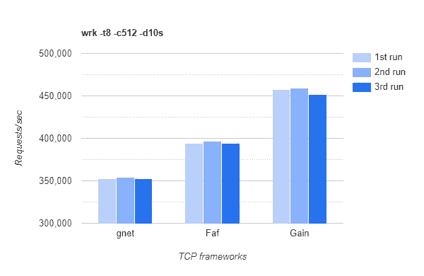

# 满足增益—最新最快的 TCP 框架

> 原文：<https://betterprogramming.pub/gain-the-new-fastest-go-tcp-framework-40ec111d40e6>

## 看看我的开源项目


一开始，我计划了一篇关于我的高性能 TCP 框架的很长的文章——the Gain，这篇文章将在框架在 Github 上发布的同时发表。但是当我在增益上工作的时候，我意识到我想要在文章中提到多少令人兴奋的事情。因此我决定发表一系列文章。本文是第一部分，也是引言部分。它包含了增益创作的起源，一些背景，和我的项目决策。最后，有基准测试的结果。

让我们从创世纪开始。开发高性能服务一直是我感兴趣的领域之一。几年前，我对公司的一个后端系统进行了大量优化。

长话短说，我把 CPU 负载降低了 100 多倍(！)在某些情况下，平均内存消耗超过 10 倍。我花了很多时间想出如何以那种方式改进我们的系统。

不幸的是，有一些我无法改变的技术限制(超过一个就非常讨厌)和无法偿还的技术债务。这两件事使得一些众所周知的解决方案无法实施，唯一的办法就是创建一个定制的系统。

我在空闲时间准备了一份概念证明(因为软件开发不仅是我的工作，也是我的激情所在)，然后向公司的人展示了基准测试结果。这是一个迅速的决定。我的设计得到了批准，一两个月后，我们系统的新版本投入生产。

除了获得有价值的知识和经验之外，那个项目还教会了我两件事:性能优化可能非常具有挑战性，也非常有趣。因为我喜欢挑战，并且现在有了更多的经验(不仅是高级网络应用程序编程，也包括低级网络编程)，我决定在那个项目之后的几年里验证我现在的技能。我有几个想法，但最终，赢家是开发一个 TCP(和 UDP)很快。Hello HTTP/3)在性能方面胜过别人的框架。

# 基准

我相信每个对高性能 TCP/HTTP 应用程序感兴趣的程序员都知道 TechEmpower Benchmark。

对于那些不了解的人来说，这是对许多执行基本任务(如 JSON 序列化、数据库访问和服务器端模板合成)的 web 应用程序框架的性能比较。我知道—基准测试结果可能会在某种程度上产生误导。

现实世界中的案例可能与基准测试中测试的案例大相径庭。此外，基准测试通常测试高峰性能，这通常不是商业项目中的基本特征。它不如低 CPU 使用率、低内存消耗或非常低的延迟那样令人满意。
这是一个个人挑战，主要目标是检查是否有机会开发出比 TE 基准测试更快的框架。出于本系列文章的目的和对我的框架性能的度量，我将重点放在“明文”测试类型上。这是一个简单的例子，HTTP 服务器用 JSON 数据进行响应。这里对它的描述是。

# 竞争对手

当您查看 TE 基准测试的最后一次运行时( [**这里是**](https://www.techempower.com/benchmarks/#section=test&runid=edd8ab2e-018b-4041-92ce-03e5317d35ea&hw=ph&test=plaintext&a=2) )，您可以看到几个框架有几乎相同的结果。因此，为所有顶级框架运行基准测试毫无意义。因此，我选择了两个竞争者:

*   因为它是最快的。用铁锈写的。正如作者所写的，它只有一个目标:“展示单节点性能的上限，同时在生产环境中保持可用。”当您查看源代码时，可以看到作者尽可能地进行了大量优化。
*   `gnet` —用 Go 写的最快的 TCP/UDP 框架。它可以在两种模式下运行:反应器模式和复用端口模式。在第一种情况下，一个线程(接受者)负责接受连接并将它们转发给独立的线程(反应者)。在第二个例子中，没有受体。相反，所有线程都有相同的职责。它们都接受连接和读/写数据。

# 后端

所有这些框架都是建立在 Linux epoll API 之上的。我不会描述它是如何工作的。许多文章可能比我做得更好。

对于本文，最重要的是要知道 epoll 是一个快速的解决方案，但它有一些警告——特别是在 Spectre/Meltdown 时期，此时系统调用不如以前便宜。因此，另一个 API 诞生了— `io_uring`。对于异步 I/O 来说，这是一个相对较新的接口。使用用户空间和内核之间共享的环形缓冲区实现了两个队列:

*   提交队列(SQ)，
*   完成队列(CQ)。

应用程序用一个或多个 SQ 条目填充第一个。然后内核消耗所有的请求，并创建完成事件，如果它们中的任何一个完成的话。完成事件总是与特定的 SQE 相关联，但是可能以任何顺序到达。如果您想了解更多关于 io uring 的信息，有许多很好的资源:

*   [UNIX ism——月神之王](https://unixism.net/loti/what_is_io_uring.html)
*   [高效 io 和 IO 期间](https://kernel.dk/io_uring.pdf)
*   [异步 I/O 框架介绍](https://blogs.oracle.com/linux/post/an-introduction-to-the-io-uring-asynchronous-io-framework)

# 程序设计语言

从一开始我就考虑了两种编程语言:Go 和 Rust。两者都是现代的，非常快的语言，两者也各有利弊。生锈一般比较快。它的性能与 C++的性能相当。有趣的是，它保证了内存安全。

有一个特性叫做所有权。所有权是一组编译器规则。如果违反了以下任何规则，程序将无法编译:

1.  Rust 中的每个值都有一个称为其所有者的变量。
2.  一次只能有一个所有者。
3.  当所有者超出范围时，该值将被丢弃。

Golang 使用了一个更流行的解决方案来达到同样的目的——垃圾收集器。因为 GC 在运行时工作，所以对程序性能有影响。许多技术可以帮助减少 GC 的开销，但是释放内存仍然比 Rust 慢。这两种语言还有另一个显著的区别。Rust 几乎可以毫无痛苦地绑定到本地库。从 Rust 调用 C 代码也没有固有的开销。为什么重要？因为 io_uring 的主要实现是用 c 写的，它叫做`liburing`，由《io_uring architecture》作者 Jens Axboe 维护。另一方面，Golang 有一个名为 CGO 的特性。不幸的是，这个解决方案没有预期的快，从 Go 调用 C 代码很慢。

所以，语言的选择似乎很简单。不一定。看起来使用 Rust 和提到的`liburing`库是最好的选择，但是在这个特殊的例子中，主要的目标是从 Linux 和 io_uring 中榨取尽可能多的东西。为此，您需要对自己选择的编程语言有深入的了解，并对内核端 IO 机制有透彻的理解。我对围棋的经验比 Rust 多得多，所以在这方面，围棋是更好的选择。上面提到的用 C 写的 io uring API 呢？CGO 通不过测试，所以解决方案可能是……用 GO 写一个类似的 API。Go 用户有一个低级的 sys/unix 包，其中包含调用 syscalls 的函数，还有一个不安全的包，其中允许手动分配内存。我仔细看了一遍 liburing 代码，自信这两个包足够了。由于这不是一个商业项目，没有必要节省工时，我可以走更长的路。在 Go 中编写库帮助我理解了如何更好地运行，现在回想起来，我认为这是正确的决定。

# 基准环境

硬件:

*   服务器:AWS m6i.xlarge 实例，4 个 vCPU，16 GB RAM
*   客户机:AWS m6i . 2x 大型实例，8 个 vCPU，32 GB RAM，与服务器位于集群放置组中的同一可用性区域

软件:

*   Ubuntu 22.04
*   内核:5 . 15 . 0–1004-AWS
*   去 1.18

配置:

*   512 个连接
*   8 个线程，每个 vCPU 一个
*   5 秒钟热身，然后进行三次测试，每次 10 秒钟

# 基准测试结果

我已经为每个框架运行了三次基准测试。每次运行的结果总是非常相似。下面你可以看到最好的。

## **Gnet**

```
ubuntu@ip-xx-xx-xx-xx:**~**$  wrk -t8 -c512 -d10s http://3.68.71.17:8080/plaintext  
Running 10s test @ http://3.68.71.17:8080/plaintext  
 8 threads and 512 connections  
 Thread Stats   Avg      Stdev     Max   +/- Stdev  
   Latency     1.45ms  544.73us  23.69ms   90.78%  
   Req/Sec    44.76k     3.50k   94.66k    97.64%  
 3579707 requests in 10.10s, 440.39MB read  
Requests/sec: 354443.98  
Transfer/sec:     43.61MB
```

## **FaF**

```
ubuntu@ip-xx-xx-xx-xx:**~**$ wrk -t8 -c512 -d10s http://3.68.71.17:8089/plaintext  
Running 10s test @ http://3.68.71.17:8089/plaintext  
 8 threads and 512 connections  
 Thread Stats   Avg      Stdev     Max   +/- Stdev  
   Latency     1.30ms    0.91ms  72.42ms   94.50%  
   Req/Sec    50.14k     5.43k  167.49k    98.63%  
 4005379 requests in 10.10s, 481.30MB read  
Requests/sec: 396598.02  
Transfer/sec:     47.66MB
```

## **增益**

```
ubuntu@ip-xx-xx-xx-xx:**~**$ wrk -t8 -c512 -d10s http://3.68.71.17:8765/plaintext  
Running 10s test @ http://3.68.71.17:8765/plaintext  
 8 threads and 512 connections  
 Thread Stats   Avg      Stdev     Max   +/- Stdev  
   Latency     1.08ms  253.02us  33.56ms   96.90%  
   Req/Sec    58.16k     3.12k  138.32k    97.88%  
 4634736 requests in 10.10s, 570.18MB read  
Requests/sec: 458908.65  
Transfer/sec:     56.46MB
```

下面的条形图比较了每个框架每秒的请求数。



如您所见，这一收益甚至超过了 TE 基准测试中最快的服务器。其结果比 gnet 好近 30%，比 FaF 好近 16%。也许它并不突出，但我们谈论的是一个基于 io _ uring 的框架，在不久的将来，它应该会更快，Gain 应该会从中受益。我非常感谢 Jenx Axboe 和所有的贡献者。他们已经做了很好的工作，并且一直在努力改进 iouring。因为我在增益上的工作仍在进行中，并且有一些事情我会改进，它还不可用，但会很快发布。

此外，还发布了具有一些令人兴奋的特性的新 Linux 内核(尤其是在版本 5.18 和 5.19 中)和一个新的 liburing 版本(2.2)。所以在发布之前，我还想检查这些新内核的性能，并实现(可能)新的操作系统特性。在下一篇文章中，我将描述 Gain 架构，并解释性能优化，敬请关注！

编辑:
Gain 的 Alpha 版本在 GitHub 上发布。

[](https://github.com/pawelgaczynski/gain) [## GitHub-pawelgaczynski/Gain:Gain 是一个高性能的网络框架

### Gain 是一个完全用 Go 编写的高性能网络框架。它使用 io——一种新的异步 I/O API…

github.com](https://github.com/pawelgaczynski/gain)