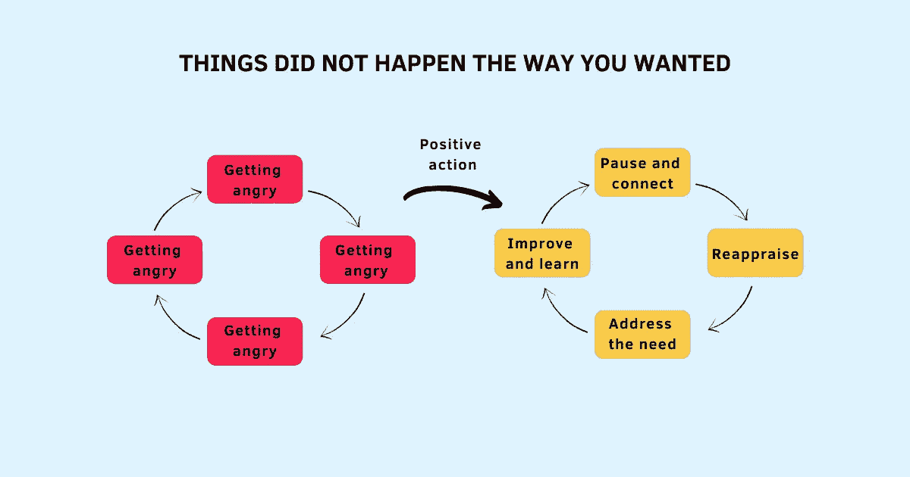

# 上班发火？以下是如何以更积极的方式使用愤怒

> 原文：<https://betterprogramming.pub/getting-angry-at-work-heres-how-to-use-anger-in-more-positive-ways-f46b44cf040a>

## 情绪调节是控制你负面情绪的关键

鸣谢:作者

你在工作中生气吗？这些重要的问题是让你生气还是让你在小事上失去冷静——经理期待一个及时的答复，同事在你已经淹没在工作中时寻求帮助，客户表现得漠不关心？

你的决定受到你感受到的情绪的影响。当你心烦意乱时，你不太可能以建设性的方式行事。强烈的负面情绪会缩小你的选择范围。你以某种方式思考是不利的。在愤怒的控制下，你的注意力被引向做错事，证明你的观点，并再次感到有价值。

一颗愤怒的心不适合进行战略思考。保持愤怒让你容易判断失误；它会让你说一些你以后会后悔的话。

保持冷静和镇定，尤其是当你握紧拳头，想要揍人的时候，这是将你的愤怒转化为生产力的唯一方法。情绪调节是控制自己负面情绪的关键。

研究心理学家、耶鲁情商中心主任马克·布雷克特称调节负面情绪的能力，尤其是愤怒的感觉，是一项主要技能。他说—

> 情绪调节不是没有感觉。它也没有严格控制我们的感觉。也不是要消除负面情绪，只感受正面情绪。相反，情绪调节始于允许我们自己和他人拥有我们的情绪——所有的情绪

通过练习，你可以学会情绪调节——以对你有益的方式处理愤怒的负面情绪的能力。

# 积极使用愤怒的 4 个步骤

## 步骤 1:暂停并连接

与情感联系起来。不要去评判它或者试图摆脱它。你越是试图赶走你的情绪，它们就变得越强烈。

找出让你生气的原因:

*   是害怕失去什么吗？
*   你对一个不公平的决定感到受伤了吗？
*   是没有达到别人期望的压力？
*   有人通过传递攻击性的评论让你觉得自己不值吗？
*   你是否为不知道如何应对挑战或困境而焦虑？
*   是工作压力让你发疯吗？
*   是别的原因吗？

原因可能有很多。愤怒是一种痛苦的情绪，多年来被告知它是有害的，对你没有好处，这会让你想要压抑它。不要。压抑不会让感觉消失。

这并不意味着你完全表达出来，并对别人发泄你的愤怒。把你的愤怒发泄在另一个人身上只会让事情变得更糟。

与其压抑或表达，不如重新评估你的愤怒。

> 当我们忽视或压抑自己的感觉时，它们只会变得更强烈。真正强大的情绪在我们内心积聚，就像一股黑暗的力量，不可避免地毒害我们所做的一切，不管我们喜欢与否。受伤的感觉不会自己消失。它们不会自愈。如果我们不表达我们的情感，它们就会像债务一样堆积起来，最终会到期的——马克·布莱凯特

联系的时候，让情感进来。让你的身体感受它。但不要判断它的对错。然后，重新评估你的愤怒。

## 第二步:重新评估和再评估

深入挖掘，识别你感受的错综复杂。让你生气的问题从表面上看是不是很小？是不是有隐藏的负能量导致了爆发？例如，你可能已经很长时间忽略了同事的不良行为。当你已经对超负荷工作感到压力时，所有那些被压抑的情绪都可能会表现出来。

将你的情绪与真正的原因联系起来，给你一个重新评估形势的机会。

> 对抗压力的最大武器是我们选择一种思想而不是另一种思想的能力

有没有可能你的老板没有邀请你参加那个会议，不是因为她不喜欢你，而是因为她认为那不会增加你的时间价值？

有没有可能你的团队成员拒绝帮忙是因为她在家里遇到了个人问题？

思考其他可能的解释让你有机会重新评估你的愤怒是否合理。

这是另一个重新评估的好策略。研究表明，将问题视为挑战而非威胁将有助于你集中注意力，更好地适应困难的环境，并采取必要的步骤取得成功。不要把这个问题视为威胁，而要把它视为挑战。

## 第三步:解决你情感背后的需求

如果你受到了不公平的对待，因为你没有做的事情而受到指责，或者某人的刻薄言论冒犯了你，你的愤怒是有道理的。然而，对问题保持愤怒并不能解决问题。另一方面，采取建设性的行动必然会分散这种影响。

问这些问题来解决你愤怒背后的需求，然后继续前进:

1.  什么样的结果会让我感觉更好？
2.  我可以采取哪些小步骤来实现这一结果？
3.  采取这些步骤会有什么风险？最坏能发生什么？
4.  保持愤怒的代价是什么？不作为会有什么影响？

通过采取与你期望的结果一致的行动，你可以将你的愤怒转化为对你有利的东西，而不是对你不利的东西。

有时候你的愤怒可能源于某人的行为——例如，假设某人刚刚对你大喊大叫——回吼或者自我感觉不好都无济于事。相反，和他们谈谈他们的行为如何影响了你。

例如，你可以说:你现在看起来很生气。心烦意乱解决不了问题。你建议我们做什么来解决你面临的问题？

或者:

你现在看起来很生气。当你大喊大叫的时候，我会心烦意乱，无法做出有成效的贡献。

谈论他们的愤怒对你的影响可能有助于他们重新调整自己的行为。

也有可能你会遇到一个难相处的或者有毒的老板(或者另一个人)，而无法分享你的感受。在那些情况下，不要对你的处境感到无助和绝望，提醒自己有些事情不在你的控制之下。与其浪费你的精力去解决它们，不如找出你能做些什么来减少它们对你的影响。

## 第四步:提高和学习

当你在寻找解决愤怒的方法时，你可能会求助于亲密的朋友、熟人或你关系网中的人。[向他人寻求帮助](https://www.techtello.com/how-to-ask-for-help/)了解他人如何处理类似情况，或者寻求如何更好地控制自己愤怒的建议是正确的做法。

但是，和别人说你的问题时，你可能会忍不住发泄，不要。重复问题而不试图找到解决方法，只会让你的愤怒升级。向别人发泄也许能暂时缓解，但只会让你和对方的心情更糟。这也让你成为一个说别人坏话的消极的人。

人类天生就会学习和成长。没有什么比学习新事物的快乐更能激励我们了。当感到愤怒时，不要发泄，而是把精力集中在如何提高或学习上。用这种态度去接近别人。

善待自己。当你感到愤怒时，自怜不仅会让你感觉更好，还会让你的大脑从不健康的沉思转为寻求解决方案的愿望。

> 当我们对痛苦的经历做出反应时，自我友善让我们感到安全，这样我们就不再害怕——一旦我们摆脱了不安全感，我们就可以带着实现梦想所需的信心去追求梦想——克里斯汀·内夫

一旦你感觉平静下来，把你的问题作为一个挑战，问这些问题:

*   当[某某发生…]时，我感觉到了[这…]。你以前遇到过类似的问题吗？
*   你是怎么处理的？
*   哪些策略对你有效？
*   应该避免哪些事情？
*   你学到了什么？

现在，运用这些策略，祝贺自己作为一个成年人通过处理困难的情况成为一个更好的人。

愤怒可能看起来是一种有害且具有破坏性的负面情绪，但只有当你无意识地投入其中时才会如此。通过暂停和联系，重新评估，解决你的需求，并把它看作是一个[提高和学习](https://www.techtello.com/fixed-mindset-vs-growth-mindset/)的机会，你可以把它转化为积极的能量——寻找创造性的解决方案，追求你想要的东西，并感觉控制着你的处境。

**总结**

*   保持愤怒对你的心理健康和个人幸福没有好处。它还会影响你与他人交往的方式以及你在工作中取得的成果。
*   不要在愤怒的影响下做出破坏性的选择，你可以采取措施以更积极的方式利用愤怒。
*   第一步:不要否认或试图压抑自己的情绪。让他们进来，不要评判他们的对错。
*   第二步:深入挖掘，找出真正的原因。重新评估你的处境，把它视为挑战而不是威胁。
*   第三步:确定你想要的结果，并采取措施实现它。
*   第四步:在向别人求教的同时，不要发泄，把它当成一个提高和学习的机会。

在[推特](https://twitter.com/techtello)上关注我，了解更多故事。

*这个故事最初发表于*[*https://www.techtello.com*](https://www.techtello.com/getting-angry-at-work/)*。*