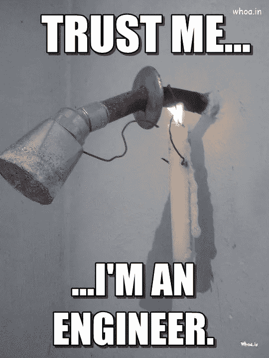

# 数据科学家入门

> 原文：<https://betterprogramming.pub/getting-started-as-a-data-scientist-270bd212c6a5>

## 闯入数据科学领域的技巧

[乔·塞拉斯](https://unsplash.com/@joaosilas?utm_source=unsplash&utm_medium=referral&utm_content=creditCopyText)在 [Unsplash](https://unsplash.com/search/photos/science?utm_source=unsplash&utm_medium=referral&utm_content=creditCopyText) 上的照片

数据科学似乎是许多人都想进入的神秘领域，但道路并不总是清晰的。

这是由公司和团队对数据科学家的要求不同、缺乏明确的培训计划以及数据科学家需要具备的各种技能造成的。

新数据科学家通常会问这样的问题:

*   应该重点学什么语言？
*   我学哪个工具？
*   我如何开始编码？
*   哪些课程值得上？
*   什么公司最适合我？

这些问题可能会在人们的数据科学之旅开始之前就让他们感到困惑。

那么，一个数据科学新手如何进入这个领域呢？下面是一些步骤，你可以遵循这些步骤来更好地为获得数据科学家的职位做准备。

# 弄清楚你更喜欢工程还是分析

在开始学习数据科学之前，我们认为反思和思考你喜欢做的工作类型是很重要的。

在数据行业，你可以找到数据工程师、机器学习工程师、数据科学家等各种令人兴奋的角色。

这些工作需要不同的心态、技能和背景，可能不适合每个人。找到适合你的领域需要时间，这可能取决于你的背景。

例如，如果你是一个喜欢分析性思考和问很多问题的人，你可能会喜欢数据科学。对于那些喜欢构建事物、软件和数据管道的人来说，数据工程可能适合你。在我们的[数据科学与数据工程帖子](https://towardsdatascience.com/what-is-the-difference-between-a-data-engineer-and-a-data-scientist-a25a10b91d66)中，我们将深入探讨这种差异。

一旦你知道你喜欢什么样的工作，那么你就可以做出更好的决定，如果你喜欢在数据科学领域或其他以数据为中心的领域工作。在一头扎进数据科学之前，这是很好的第一步。

# 课程工作和导师

在某种意义上，数据科学有点像 web 开发，在你的大学里可能会有一两门关于这个主题的课程。但是，并没有一套真正经过深思熟虑的课程让你为这个行业做好准备。

那么，有抱负的年轻数据科学家如何开始工作呢？这里有一些进入数据科学领域的可靠方法。

*   获得一份数据科学家的实习工作(这将使以后的工作变得非常容易)
*   在公司中横向移动到数据科学职位
*   完成数据科学训练营
*   开发你自己的包含数据科学的应用程序(这可能是最难的)

根据您的背景，您进入数据科学领域的途径会有所不同。例如，如果你有金融背景，并且你是一名金融分析师，那么在一家公司中横向移动到数据科学职位可能会很困难。

因此，如果你认为你对数据科学感兴趣，但没有技术背景，那么训练营可能是你最好的选择。这些可能很贵，但我们已经看到有英国背景的人在完成训练营后，作为数据科学家在伟大的科技公司找到工作。

当然，我们确实发现，在职业生涯早期获得实习机会是为未来的数据科学家角色做准备的最佳方式之一。这是因为面试官对你来说通常更容易一些，因为你是这个领域的新手，之后你会有真实的经验。

一旦你有了第一个角色，另一个无价的资产就是一个伟大的导师。一个伟大的导师不一定是致力于成为你的导师的人。取而代之的是，你公司里任何一个对自己的工作感到惊奇的人。老实说，每个人都可以成为你的导师。也许一个员工很擅长沟通，另一个擅长编程，还有一个擅长 UI。不要把自己局限于公司可能提供的导师。向团队中的每个人学习。

最后，获得第一个数据科学家角色有许多不同的途径。所以不要因为你尝试的第一条路失败了就放弃！如果你找不到实习机会，试着在一家公司内横向调动，如果你做不到，也许可以考虑一个新兵训练营。同时，确保你正在建立你的投资组合！

# 选择语言/工具

我们被问到的一个非常常见的问题是“作为一名数据科学家，我应该首先学习哪种工具或语言？”有大量的工具、API、语言和其他资源，你可以花一生的时间去学习，但永远不会成为一名更好的数据科学家。

所以问题仍然是:从哪种语言开始最好？我们列出了一些你可以开始使用的顶级工具/语言。这些只是开始。基于这些工具，你可以开始扩展到像 [Hadoop](http://www.acheronanalytics.com/acheron-blog/hadoop-vs-relational-databases) ，SageMaker，Redshift，Spark，SAS 等等。这取决于您想要的数据方向。

## 1.计算机编程语言

Python 是一种关注代码可读性的通用编程语言。它也有像熊猫这样的伟大的图书馆来分析数据。还有几个面向统计和机器学习的伟大库，可以帮助数据科学家更多地关注业务问题，而不是如何运行 PCA。这可以说是大众的最爱，因为即使是数据工程师、开发人员和软件工程师也非常依赖 Python。

## 2.稀有

r 是另一种强大的语言，广泛用于统计计算和数据分析。这种语言的软件包，如 readR、SparkR、ggplot2、 [ARIMA](http://www.acheronanalytics.com/acheron-blog/introduction-to-time-series-in-r) 和 tidyR，是为数据计算、操作和可视化而设计的。使用哪一种似乎是一个持续的争论。通常，我们的回答是，为什么不两者都要呢？

## 3.结构化查询语言

SQL 代表结构化查询语言。它仍然是处理数据的面包和黄油。即使像 Hadoop 这样的新数据存储技术出现了，SQL 仍然是用来与数据交互的主要工具。不相信我们？那 Hive 和 Presto 为什么会存在？

## 4.表格或其他数据，即技术

Tableau 是一个专注于商业智能和数据科学的数据可视化软件。它使您能够以互动的方式创建有影响力和洞察力的可视化效果。

# 关注数据科学的实际应用

虽然学校和新兵训练营很棒。获得实践经验无疑更有价值。它提供了对您正在使用的工具的更深入的理解，以及关于数据科学如何对业务有所帮助的更好的视角。

为了专注于实际应用，我们建议您:

*   使用开源数据集来应用你的知识
*   看看专家给出的解决方案。
*   确定一个有趣的数据集，并创建一个关于它的笔记本
*   寻找需要你帮助的开源项目

这样做不仅可以让你了解如何将数据科学知识应用于现实生活中的问题，还可以改善你的投资组合，并在试图获得面试机会时建立信心。

# 网络！

在你的职业生涯中，需要依靠同伴的互动来获得支持和建议。因此，参加行业会议、活动或黑客马拉松很有帮助。当您试图在数据科学社区留下自己的印记时，所有这些事件都变得非常有利。通过人际关系网，你可以结识和你兴趣相投的人，这样你就可以建立一个富有成效的关系。

例如，“ [DatSci Awards](https://www.datsciawards.com/) ”为您提供了一个绝佳的机会，让您聆听爱尔兰一些业内最佳数据科学家的成功故事，并有机会与正在寻找像您这样的人才的领先技术公司交流。

如果你不在爱尔兰，那么考虑去 Meetup.com 或类似的网站，寻找参与数据科学的团体。只要意识到你实际上需要社交才能从会议中得到任何东西。没有人会走到你面前把你带进这个团体！

# 结论

雇主现在在数据科学家身上投入大量时间和金钱。确保你在正确的项目上投入时间，尽早获得实践经验有助于尽早巩固你的技能。我们希望这些提示能帮助你成为一名数据科学家！