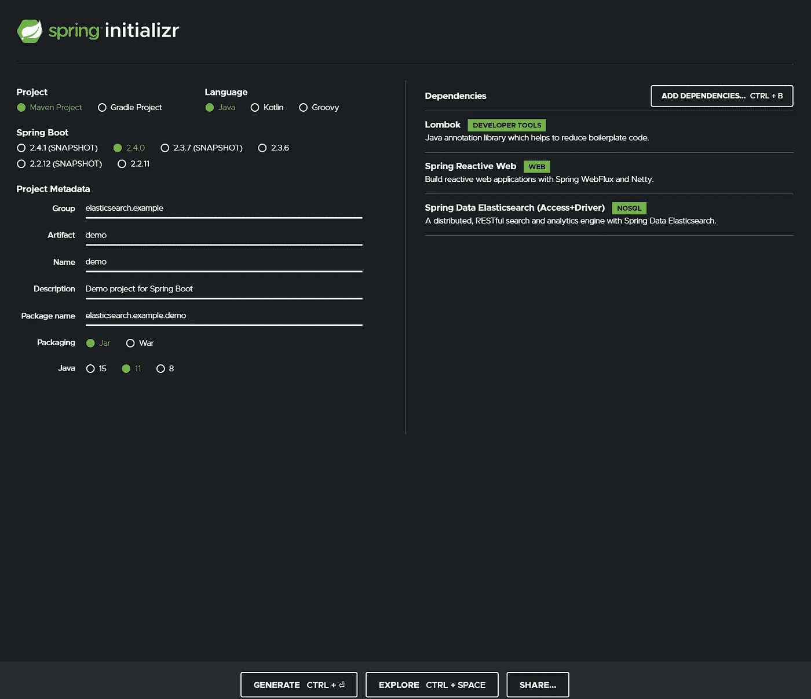

# Java Spring Boot elastic search 入门

> 原文：<https://betterprogramming.pub/getting-started-with-elasticsearch-in-java-spring-boot-d981c32b60b>

## 用 Elasticsearch 连接 Spring Boot


Java 和 Elasticsearch 都是公司使用的通用技术栈中的流行元素。Java 是一种编程语言，发布于 1996 年。Java 归甲骨文所有，仍在积极开发中。

与 Java 相比，Elasticsearch 是一项年轻的技术——它在 2010 年才发布(比 Java 年轻 14 岁)。它迅速流行起来，现在被许多公司用作搜索引擎。

看到这两者如此受欢迎，许多人和公司希望将 Java 与 Elasticsearch 连接起来，以便开发自己的搜索引擎。在这篇文章中，我想教你如何连接 Java Spring Boot 2 和 Elasticsearch。我们将学习如何创建一个调用 Elasticsearch 来产生结果的 API。

# 将 Java 与 Elasticsearch 连接起来

我们必须做的第一件事是将我们的 Spring Boot 项目与 Elasticsearch 连接起来。最简单的方法是使用 Elasticsearch 提供的客户端库，我们可以将它添加到我们的包管理器中(如 Maven 或 Gradle)。

对于本文，我们将使用 Spring Data 提供的`[spring-data-elasticsearch](https://spring.io/projects/spring-data-elasticsearch)`库，其中也包括 Elasticsearch 的[高级客户端库](https://www.elastic.co/guide/en/elasticsearch/client/java-rest/master/java-rest-high.html)。

## 开始我们的项目

让我们从使用 [Spring Initialzr](https://start.spring.io/) 创建我们的 Spring Boot 项目开始。我将配置我的项目，如下图所示，因为我们将使用一个高级客户端。然后我们可以使用 Spring 提供的一个方便的库，Spring Data Elasticsearch:



## 向 Spring 数据弹性搜索添加依赖性

如果您遵循了上一节中我的 Spring Initialzr 配置，那么您的项目中应该已经有了 Elasticsearch 客户端依赖项。但如果没有，可以补充一下:

```
<dependency>
  <groupId>org.springframework.boot</groupId>
  <artifactId>spring-boot-starter-data-elasticsearch</artifactId>
</dependency>
```

## 创建 Elasticsearch 客户端的 bean

有两种方法来初始化 bean——您可以使用 Spring Data Elasticsearch 库中定义的 bean，也可以创建自己的 bean。

更简单的选择是使用 Spring Data Elasticsearch 配置的 bean。

例如，您可以将这些属性添加到您的`application.properties`中:

```
spring.elasticsearch.rest.uris=localhost:9200
spring.elasticsearch.rest.connection-timeout=1s
spring.elasticsearch.rest.read-timeout=1m
spring.elasticsearch.rest.password=
spring.elasticsearch.rest.username=
```

第二种方法是创建自己的 bean。您可以通过创建`RestHighLevelClient` bean 来配置设置。如果 bean 存在，Spring Data 将使用它作为它的配置。

## 测试从我们的 Spring Boot 应用程序到 Elasticsearch 的连接

现在您已经配置了 bean，您的 Spring Boot 应用程序和 Elasticsearch 应该已经连接了。由于我们要测试连接，请确保您的 Elasticsearch 已启动并运行！

为了测试它，我们可以创建一个 bean，它将在`DemoApplication.java`中的 Elasticsearch 中创建一个索引。该类看起来像这样:

好的，在这段代码中，我们用`RestHighLevelClient,`调用了 Elasticsearch 两次，我们将在本文稍后学习。第一个调用是删除已经存在的索引。我们用了一个`try` / `catch`来表示，因为如果索引不存在。然后 elasticsearch 将抛出一个错误，导致我们的应用程序启动失败。

第二个调用是创建一个索引。因为我只运行单节点的 Elasticsearch，所以我将碎片配置为`1`，副本配置为`0`。

如果一切顺利，那么当你检查你的弹性搜索时，你应该看到指数。要检查它，只需转到`[http://localhost:9200/_cat/indices?v](http://localhost:9200/_cat/indices?v)`，您可以在您的弹性搜索中看到指数列表:

恭喜你。您只需将您的应用程序连接到 Elasticsearch！！

# 其他连接方式

如果你想用 Java 连接到 Elasticsearch，我推荐你使用`spring-data-elasticsearch`库。但如果你不能使用这个库，还有一种方法可以将你的应用程序连接到 Elasticsearch。

## 高级客户

从上一节我们知道，我们使用的`spring-data-elasticsearch`库也包括 Elasticsearch 的高级客户端。如果你已经导入了`spring-data-elasticsearch`，那么你已经可以使用 Elasticsearch 的高级客户端了。

如果你愿意，也可以不依赖 Spring 数据，直接使用高级客户端库。您只需要在依赖项管理器中添加这个依赖项:

```
<dependency>
    <groupId>org.elasticsearch.client</groupId>
    <artifactId>elasticsearch-rest-high-level-client</artifactId>
    <version>8.0.0</version>
</dependency>
```

我们也将在我们的例子中使用这个客户端，因为高级客户端的功能比`spring-data-elasticsearch.`更完整

有关更多信息，您可以阅读 [Elasticsearch 文档](https://www.elastic.co/guide/en/elasticsearch/client/java-rest/master/java-rest-high-getting-started.html)。

## 低级客户

使用这个库会比较困难，但是可以对它进行更多的定制。要使用它，您可以添加以下依赖项:

```
<dependency>
    <groupId>org.elasticsearch.client</groupId>
    <artifactId>elasticsearch-rest-client</artifactId>
    <version>8.0.0</version>
</dependency>
```

要了解更多信息，你可以阅读关于这方面的 [Elasticsearch 的文档](https://www.elastic.co/guide/en/elasticsearch/client/java-rest/master/java-rest-low.html)。

## 传输客户端

Elasticsearch 还提供了 transport client，这将使您的应用程序标识为 Elasticsearch 的节点之一。我不推荐这种方法，因为它很快就会被弃用。

如果你感兴趣，你可以在这里阅读关于运输客户端[。](https://www.elastic.co/guide/en/elasticsearch/client/java-api/current/transport-client.html)

## 休息呼叫

连接到 Elasticsearch 的最后一种方法是进行 REST 调用。由于 Elasticsearch 使用 REST API 连接到它的客户端，所以基本上可以使用 REST 调用将您的应用程序连接到 Elasticsearch。您可以使用 OkHttp、Feign 或您的 web 客户端将您的应用程序与 Elasticsearch 连接起来。

我也不推荐这种方法，因为很麻烦。既然 Elasticsearch 已经提供了客户端库，不如用它们来代替。只有在没有其他连接方式的情况下，才使用此方法。

# 使用 Spring 数据弹性搜索

首先，让我们学习如何在我们的 Spring 项目中使用`spring-data-elasticsearch`。`spring-data-elasticsearch`非常易于使用，是一个高水平的库，我们可以使用它来访问 Elasticsearch。

## 创建实体并配置我们的索引

当你用 Elasticsearch 连接好你的应用程序后，是时候创建一个实体了！使用 Spring 数据，我们可以将元数据添加到我们的实体中，这些元数据将被我们创建的存储库 bean 读取。这样，代码将会更干净，开发起来也更快，因为我们不需要在我们的服务级别中创建任何映射逻辑。

让我们创建一个名为`Product`的实体:

所以让我解释一下上面的代码块是怎么回事。首先，我不会解释`@Data`、`@AllArgsConstructor`、`@NoArgsConstructor`和`@Builder`。它们是来自 [Lombok 库](https://projectlombok.org/)的注释，用于`constructor`、`getter`、`setter`、`builder`和其他东西。

现在来说说实体中的第一个弹簧数据标注，`@Document`。`@Document`注释显示该类是一个包含 Elasticsearch 索引设置元数据的实体。为了使用 Spring 数据存储库(我们将在后面学习)，必须使用`@Document`注释。

在`@Document`中唯一强制的注释是`indexName`。从名称上看应该很清楚——我们应该用我们想要用于实体的索引名来填充它。在本文中，我们将使用与实体相同的名称，`product`。

`@Document`要讲的第二个参数是`createIndex`参数。如果您将`createIndex`设置为`true`，当您启动应用程序时，如果索引尚不存在，您的应用程序将自动创建一个索引。

创建步进时，`shards`、`replicas`和`refreshInterval`参数决定步进设置。如果在创建索引后更改这些参数的值，则不会应用这些设置。因此，只有在第一次创建索引时，才会使用这些参数。

如果想在 Elasticsearch 中使用自定义 ID，可以使用`@Id`注释。如果使用`@Id`注释，Spring Data 会告诉 Elasticsearch 将 ID 存储在文档中，并存储文档源。

`@Field`类型将决定字段的[字段映射](https://www.google.com/search?q=elasticsearch+mapping&oq=elasticsearch+mapping&aqs=chrome..69i57.2238j0j1&sourceid=chrome&ie=UTF-8)。与`shards`、`replicas`和`refreshInterval`一样，`@Field`类型只会在首次创建索引时影响 Elasticsearch。如果在已经创建索引的情况下添加一个新字段或更改类型，它不会做任何事情。

既然我们已经配置了实体，那么让我们来试试通过 Spring 数据自动创建索引吧！当我们将`createIndex`配置为`true`时，Spring Data 会检查该索引是否存在于 Elasticsearch 中。如果它不存在，Spring Data 将使用我们在实体中创建的配置创建索引。

让我们开始我们的应用程序。运行后，让我们检查设置，看看它是否正确:

```
curl --request GET \
  --url [http://localhost:9200/product/_settings](http://localhost:9200/product/_settings)
```

结果是:

一切都按照我们的配置！将`refresh_interval`设置为`5s`，`number_of_shards`为`1`，`number_of_replicas`为`0`。

现在让我们检查映射:

```
curl --request GET \
  --url [http://localhost:9200/product/_mappings](http://localhost:9200/product/_mappings)
```

结果是:

映射也和我们预期的一样。这和我们在实体类中配置的一样。

## 带有 Spring 数据仓库接口的基本 CRUD

创建完实体后，我们就拥有了在 Spring Boot 创建存储库接口所需的一切。让我们创建一个名为`ProductRepository`的存储库。

当你创建一个接口时，确保扩展`ElasticsearchRepository<T, U>`。在这种情况下，`T`对象是您的实体，而`U`对象类型是您想要用于数据 ID 的类型。在我们的例子中，我们将使用之前创建的`Product`实体作为`T`，使用`String`作为`U`。

既然您的存储库接口已经完成，您就不需要关心实现了，因为 Spring 已经在处理了。现在，您可以调用存储库扩展到的类中的每个函数。

对于 CRUD 的示例，您可以查看下面的代码:

在上面的代码块中，我们创建了一个名为`SpringDataProductServiceImpl`的服务类，它自动绑定到我们之前创建的`ProductRepository`。

其中有四个基本 CRUD 函数。第一个是`createProduct`，顾名思义，会在`product`索引中创建一个新产品。第二个是`getProduct`，获取我们通过 ID 索引的产品。`deleteProduct`功能可用于删除 ID 索引中的产品。`insertBulk`功能允许您将多个产品插入到 Elasticsearch 中。

一切都结束了！我不会在本文中写 API 测试，因为我想把重点放在我们的应用程序如何与 Elasticsearch 交互上。但是如果你想尝试这个 API，我在文章末尾留了一个 GitHub 链接，这样你就可以克隆并尝试这个项目。

## Spring 数据中的自定义查询方法

在上一节中，我们只利用了已经在其他类中定义的基本方法。但是我们也可以创建自定义的查询方法来使用。

Spring Data 非常方便的一点是，您可以在存储库接口中创建一个方法，并且不需要编写任何实现代码。Spring 数据库将读取存储库并自动为其创建实现。

让我们尝试通过`name`字段搜索产品:

是的，这就是在 Spring 数据存储库接口中创建一个函数所需要做的全部工作。

您还可以使用`@Query`注释定义一个定制查询，并在参数中插入一个 JSON 查询。

我们创建的这两种方法做的是同样的事情——使用带`name`参数的`match`查询。如果你试一试，你会得到同样的结果。

## 使用 ElasticsearchRestTemplate

如果您想进行更高级的查询，比如聚合、突出显示或建议，您可以使用 Spring 数据库提供的`ElasticsearchsearchRestTemplate`。通过使用它，您可以创建自己的查询，让它变得尽可能复杂。

例如，让我们创建一个函数，像以前一样对`name`字段进行`match`查询:

你应该注意到上面的代码比我们在`ElasticserchRepository`中定义的更复杂。如果可以的话，建议使用 Spring 数据仓库。但是对于更高级的查询，比如聚合、突出显示或建议，您必须使用`ElasticsearchRestTemplate`。

例如，让我们编写一段代码来聚合一个术语:

# 弹性搜索 RestHighLevelClient

如果你没有使用 Spring 或者你的 Spring 版本不支持`spring-data-elasticsearch`，你可以使用 Elasticsearch 开发的 Java 库`[RestHighLevelClient](https://www.elastic.co/guide/en/elasticsearch/client/java-rest/master/java-rest-high.html)`。

是一个库，你可以用它来做一些基本的事情，比如 CRUD 或者管理你的 Elasticsearch。尽管名字暗示它是高水平的，但与`spring-data-elasticsearch`相比，它实际上是更低水平的。

这个库相对于 Spring 数据的优势在于，你也可以用它来管理你的弹性搜索。它提供了索引和弹性搜索配置，与 Spring 数据相比，您可以更灵活地使用这些配置。它还具有更完整的功能来与 Elasticsearch 进行交互。

这个库相对于 Spring 数据的缺点是这个库更低级，这意味着你必须编写更多的代码。

## 带有 RestHighLevelClient 的 CRUD

让我们看看如何用这个库创建一个简单的函数，这样我们就可以将它与我们以前使用的方法进行比较:

如您所见，现在它变得更加复杂，也更加难以实现。现在，您需要处理异常并将 JSON 结果转换成您的实体。建议使用 Spring 数据代替基本的 CRUD 操作，因为`RestHighLevelClient`更复杂。

我已经在 GitHub 项目中包含了其他 CRUD 函数。有兴趣的可以去看看。链接在本文末尾。

## 索引创建

与 Spring Data Elasticsearch 相比，`RestHighLevelClient`在这一部分拥有明显的优势。在上一节中，当我们创建索引及其映射和设置时，我们只使用了注释。这很容易做到，但你不能用它做太多。

使用`RestHighLevelClient`，您可以创建索引管理方法或者基本上任何 Elasticsearch REST API 允许的方法。

例如，让我们用之前使用的设置和映射编写一些代码来创建`product`索引:

让我们看看我们在代码中做了什么:

1.  在确定索引名时，我们初始化了`createIndexRequest`。
2.  我们在调用`[createIndexRequest.settings](https://codecurated.com/blog/how-to-connect-java-with-elasticsearch/createIndexRequest.settings)`时的请求中添加了设置。在设置中，我们还配置了字段`[index.requests.cache.enable](https://codecurated.com/blog/how-to-connect-java-with-elasticsearch/index.requests.cache.enable)`，这在 Spring 数据库中是不可能的。
3.  我们制作了一个包含索引中字段的属性和映射的`Map`。
4.  我们用`[restHighlevelClient.indices.create](https://codecurated.com/blog/how-to-connect-java-with-elasticsearch/restHighlevelClient.indices.create)`调用了 Elasticsearch。

如您所见，与 Spring 数据实体中的注释相比，使用`RestHighLevelClient`，我们可以创建一个更加定制化的调用来为 Elasticsearch 创建索引。在`RestHighLevelClient`中还有更多 Spring 数据库中没有的功能。你可以阅读 [Elasticsearch 的文档](https://www.elastic.co/guide/en/elasticsearch/client/java-rest/current/java-rest-high.html)来获得更多关于这个库的信息。

# 结论

在本文中，我们学习了两种连接到 Elasticsearch 的方法:使用 Spring 数据和通过 Elasticsearch 客户端。两者都是强大的库，但是如果对您的用例来说可能的话，您应该只使用 Spring 数据。带有 Spring Data Elasticsearch 的代码可读性更好，也更容易使用。

如果你想要一个更强大的库，基本上可以做任何 Elasticsearch 允许的事情，那么你也可以使用 Elasticsearch 高级客户端。如果您需要更强大的功能，您还可以使用低级客户端，这在本文中没有涉及。

我还要感谢您阅读这篇文章，我希望这篇文章能帮助您开始使用 Java Spring Boot 的 Elasticsearch。如果你想了解更多关于库的信息，你可以查看 Spring Data Elasticsearch 文档和 [Elasticsearch 的高级客户文档](https://www.elastic.co/guide/en/elasticsearch/client/java-rest/current/java-rest-high.html)。

下面是本文使用的 GitHub 项目的 GitHub 链接:

[](https://github.com/brilianfird/elasticsearch-with-spring-boot) [## brilianfird/弹性搜索带弹簧靴

### 在 GitHub 上创建一个帐户，为 brilianfird/elastic search-with-spring-boot 的开发做出贡献。

github.com](https://github.com/brilianfird/elasticsearch-with-spring-boot) 

【codecurated.com】先前发表于[](https://codecurated.com/blog/how-to-connect-java-with-elasticsearch/)**。**