# 你唯一需要的 Golang 入门

> 原文：<https://betterprogramming.pub/go-4f365468dbd5>

## 用 30 个有用的备忘单学习围棋的基础知识


来源:作者

围棋，也叫 Golang，绝对是潮流，理所当然。
不像 C 或 C++那么难学，但还是挺快的，而且有很棒的社区&很多有趣又有帮助的包和库。这种语言也是由谷歌计算机科学领域的一些最聪明的头脑开发的。

这些可能是足够的理由来看看 Docker 和 Kubernetes 是用什么语言写的。这是你需要开始的终极 Golang 备忘单。玩得开心！

```
**Table of Contents** 1\. [Hello World](#11c0) 2\. [Variables](#a14b)
3\. [Getting User Input](#9f50)
4\. [Data Types](#0037) 
5\. [Functions](#7019)
6\. [Conditionals (if-else)](#ed2d)
7\. [Loops](#b6ee) 
8\. [Arrays](#df80)
9\. [Pointers](#5df5)
10\. [Splitting up Code](#0539)
11\. [Custom Types & Receiver Functions](#6c73)
12\. [Maps](#1f9d) 
```

# 围棋世界你好

让我们从最基本的开始。如果你已经安装了 Golang，你可以在你的终端中输入`go version`，你应该会看到一个有用的输出。如果你还没有安装，你可以在这里[安装。](http://golang.org)

先说 Hello World。为此，我们只需创建一个名为`main.go` **，**的文件，用下面的内容填充它，然后我们就可以用`go run main.go`运行我们的第一个程序了。您应该会在终端中看到输出。

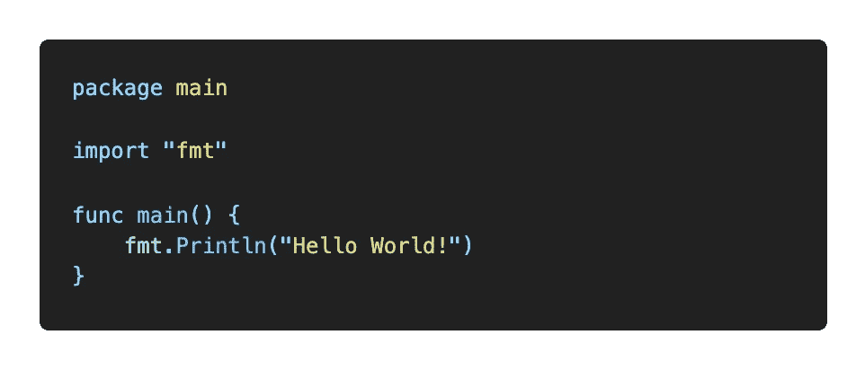

图片由作者提供。

`fmt` 代表格式化，是 Go 中输入输出的默认库。如你所见，我们在文件中有一个 main 函数，它是自动执行的，无需我们调用它。每个围棋项目都需要这样的功能。

这些是我们需要的基本说明。如果我们想编译我们的项目，并把它变成一个可执行文件，我们使用`go build main.go`。


图片由作者提供。

# 戈兰语的变量

围棋有些东西真的很特别。有一点是，没有`null`描述一个还没有赋值的变量的值。相反，根据变量的数据类型，每个变量类型都有一个默认值。

如果我们声明一个没有值的变量，我们必须指定一个数据类型，否则，变量类型是可选的。

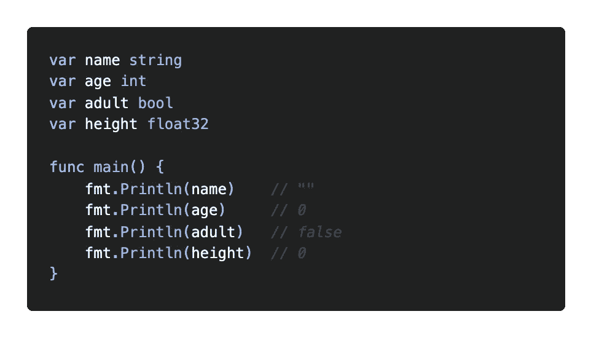

图片由作者提供。

有两种定义变量的方法:经典的方法，使用 variable-keyword，以及速记语法。上面我们使用了关键字，而不是简写。

如您所见，我们指定了数据类型。用速记语法，我们不能这样做，此外，我们可以用长语法创建一个空变量，用速记语法我们必须直接赋值。

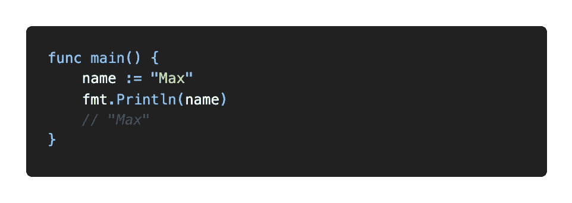

图片由作者提供。

声明变量的简写语法在函数之外不起作用。让我们再看看另一种可能性。

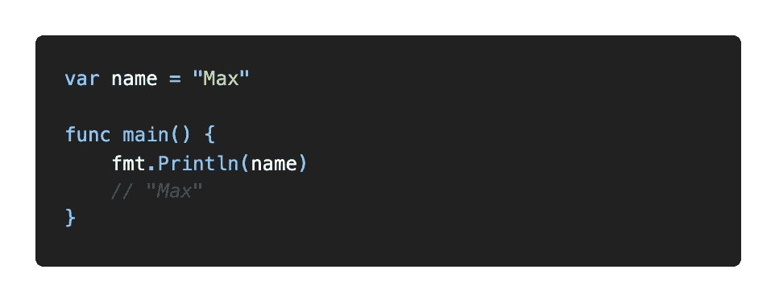

图片由作者提供。

每当我们不提供数据类型时，Go 使用类型推断来设置数据类型，这是基于我们保存在变量内部的值。如您所见，长语法指定数据类型是可选的。


图片由作者提供。

我们也可以很容易地一次定义几个变量。

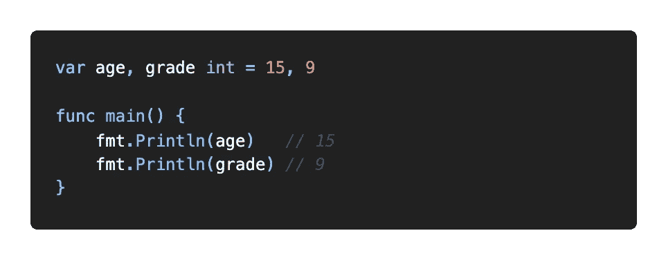

图片由作者提供。

如果我们已经给了一个变量一个值，我们可以覆盖它，这适用于用 var-keyword 和速记语法(`:=`)创建的变量。


图片由作者提供。

变量是个例外，它的变量类型是`const`。这代表常量，也就是说，我们不能覆盖变量的值，我们创建一个这样的常量:`const name = "Max"`。

# 获取用户输入

如果用户不能做任何输入，程序会是什么？在围棋中，我们可以用两种方法做到这一点。在使用 Scanln 函数执行代码期间，我们可以通过终端接受用户的输入。

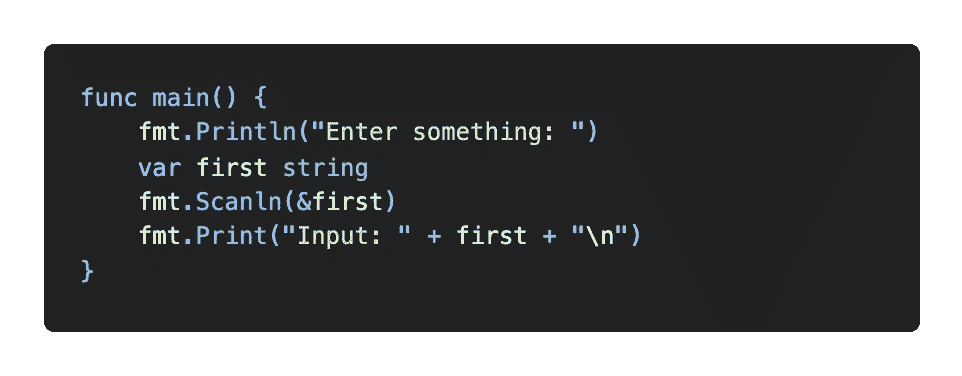

图片由作者提供。

我们先将输入存储在变量*中，然后直接输出。另一种可能是在执行程序时直接在控制台中传递参数。*

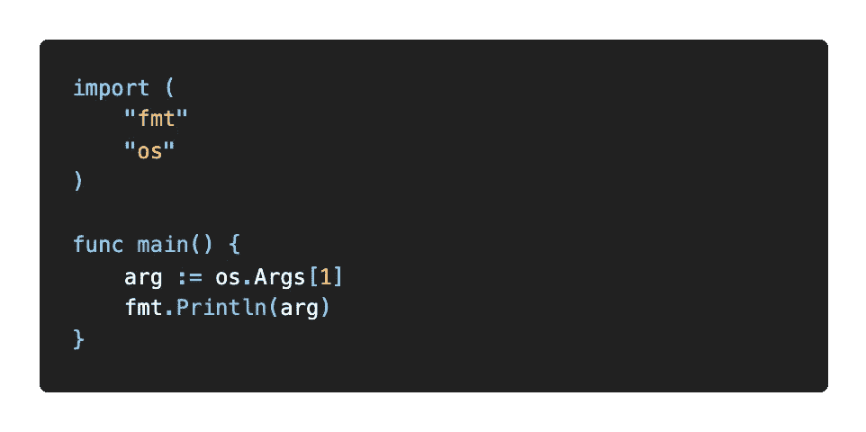

图片由作者提供。

我们需要导入`os`包，它提供对终端的访问，然后我们可以访问`*os.args*`，它包含我们运行 Go 程序时输入的所有内容。

我们通过`os.Args[1]`访问第二个元素，因为终端中的第一个元素是`go run main.go`命令，我们用它开始我们的程序。

现在我们可以启动程序并像这样传递命令行参数:`go run main.go name=max`。

我们的程序应该输出`name=max`。

# Golang 的数据类型

在 Go 中，有四种重要的数据类型你应该知道，整数、浮点、字符串和布尔。这里是一个简单的概述。

整数是整数，浮点数是逗号，字符串是“文本”，布尔是真值，因此是真还是假。

对于无符号变量，数值永远不能为负。有了有符号变量，就可以了。这里有一个例子。

下面一行代码会导致错误:`var age uint8 = -2`，编译器会说-2 不在无符号整数的范围内，就像说的，无符号意味着不能为负。

于是我们不得不重写代码，说它是一个有符号整数:`var age int8 = -2`，现在一切正常， *u* 代表无符号。如果我们没有指定一个" *u* "，变量是有符号的。但是 8 是什么意思呢？

8 表示内存中变量的大小，以位为单位，所以我们可能有一个 8 位的变量，它被赋予一个大于 8 位的值。这在逻辑上会产生错误，因为范围不够。

这会导致一个错误:`var age int8 = 235255`，值太大，无法用八位表示。

由于 int-expression 后面的数字，我们可以很容易地定义我们的变量在内存中应该有多大。我们可以对浮动做同样的事情。

# 功能

Go 是一种编译语言，通常用于编译语言，因为你可以在执行一个函数后声明它。是的，下面的代码绝对可以工作。

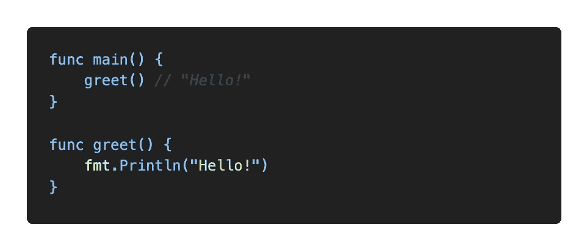

图片由作者提供。

## 从函数中返回一些东西

当定义变量时，指定数据类型是可选的，但是如果我们从函数返回一些东西，就有必要指定数据类型。在 greet 函数中，我们返回的是一个字符串。


图片由作者提供。

## 返回多个值

这是 Go 的另一个特别之处，我们可以在一个函数中返回几个东西。在大多数其他语言中，这是不可能的。在那里，你必须返回一个数组来获得类似的效果。


图片由作者提供。

因为我们也可以用简写语法一次定义几个变量，所以我们可以在 Golang 中干净地使用这种方法，这与 JavaScript 中的析构非常相似。

## 功能参数

当传递参数时，它与返回值一样，我们必须指定数据类型。特别的是，我们将数据类型写在参数名之后，而不是像大多数编程语言那样写在参数名之前。

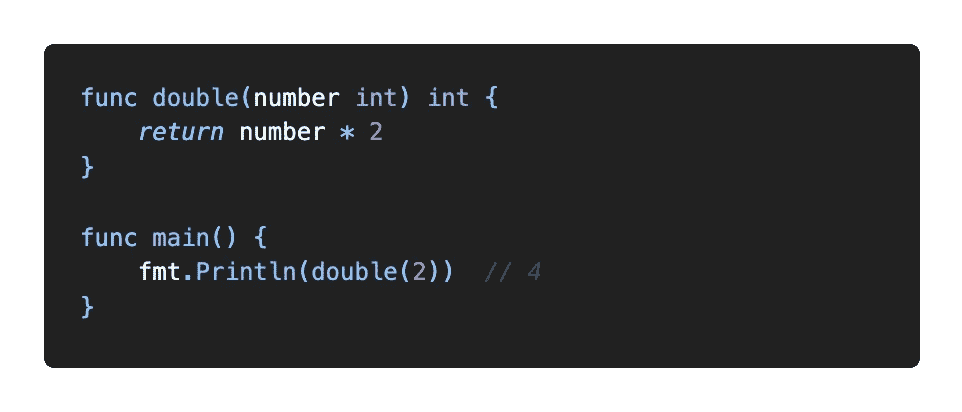

图片由作者提供。

就像我们可以简化变量的声明一样，我们也可以稍微简化参数的定义。使用下面的语法，我们为预期的两个参数设置相同的数据类型。

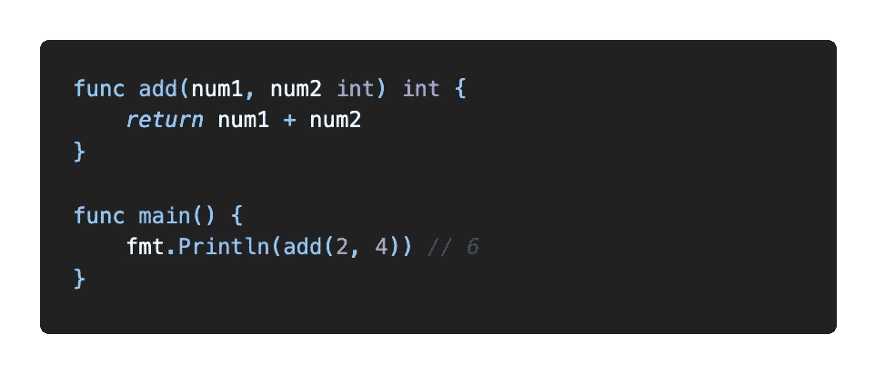

图片由作者提供。

# 条件式

If-Else 可能存在于每一种编程语言中。对于 Golang 来说也是如此，它的工作方式和其他地方一样。

在语法中，您只会注意到我们没有在条件本身周围使用括号。


图片由作者提供。

当然，还有通常的 else——如果在 Go 中可用的话。它的关键词是`else if`。

# Golang 中的循环

唯一真正存在于戈朗的环线是`for-loop`，更重要的是我们去看看它。但是语法和其他语言差不多。我们不用括号把条件括起来。


图片由作者提供。

现在，从零到九的所有数字都显示在终端中。

我们不允许使用`var-keyword`在`for-syntax`中定义变量。唯一的方法是直接声明计数器变量，使用如上所示的简写方式。 *i* 只在`for-loop`内有效；在花括号之外，我们不能访问它。

## 戈朗的另一种选择

我刚才说 Golang 里其实只有`For-Loop`，确实是这样，一个带*而*-关键字的`While-Loop`是不存在的。

但是您可以通过使用`for-loop`相对容易地构建这样一个 while 循环。我们可以简单地省去所有不必要的`for-loop`积木，剩下的就是一个技术`while-loop`。


图片由作者提供。

只要条件为真，就执行循环。

当然，病情没有任何变化；6 永远会大于 5，所以是一个无穷大的`while-loop`，不过我们可以写的更简单一些。


图片由作者提供。

代码现在将一直运行，它像`while true`一样工作。

# Golang 中的数组

让我们看看 Golang 中的数组。理解数组有一定的规则是很重要的:

*   它们只能包含一种类型的数据。
*   它们有固定的大小。
*   固定的大小意味着我们不能向数组中添加更多的值。

也许你从 JavaScript 等语言中知道数组，在这些语言中上限条件并不适用，但当我们在 Golang 中谈论数组时，我们指的是经典数组，这在许多其他低级语言中也是非常不动态的。

所以当我们使用数组时，我们必须考虑这一点，当我们创建一个数组时，我们必须指定有多少元素存储在其中。

这里是一个简单的数组，它应该有两个元素，我们在声明时直接存储它们。


图片由作者提供。

但是我们也可以先创建一个空数组，然后在执行过程中将值传递给它。


图片由作者提供。

这样，我们得到了与上面代码相同的结果，但是因为数组总是有固定的长度，所以我们不能添加比我们指定的大小更多的元素。

我们也可以用简写语法创建一个数组。在 Go 中，和许多其他语言一样，我们从 0 开始计数，所以第一个元素的索引为 0。

例如，与 Python 不同，索引不能为负，我们不能使用-1 来选择数组的最后一个元素。

如果我们想有一个数组，我们可以添加更多的值，我们可以省略方括号中的数字，但这样它就不再是一个数组，而是一个切片。

这里我们创建了一个切片，并在其中添加了另一个元素，但是 append 函数并没有覆盖实际的切片，而是返回了一个新的切片，所以我们用它覆盖了现有的切片。


图片由作者提供。

## 组合数组/切片和 for 循环

是时候把两个概念融合在一起了。，用`For-Loops`，我们可以循环数组和切片。


图片由作者提供。

**i** 是我们的索引变量，value 是对应位置的元素，一个常见的问题是这样的:如果我们不使用变量，Go 喜欢给出一个错误消息，所以简单地不访问变量**I**就会导致错误。**

**如果我们只写`for value`，那么*值*将是 *i* ，因为它在第一位，所以我们要跳过第一位，这样做如下:**

****

**图片由作者提供。**

**现在，只输出切片中的每个元素，而不是相应的索引。**

# **围棋中的指针**

**顾名思义，指针指向某个东西，在编程语言中，它通常指向一个存储地址或保存一个存储地址，它在一个值后面。**

****

**图片由作者提供。**

**如果您自己执行这段代码，您可能会得到一个不同的输出，但是根据程序的执行，程序用来存储变量的内存地址会发生变化。所谓内存，我们指的是 RAM，不是硬盘。**

**如果我们有了内存地址，我们就可以直接读取存储在那里的内容，从而读取变量的值。**

**用`&`我们得到内存地址，用`*` 后面的值。**

****

**图片由作者提供。**

# **使用多个文件**

**把所有东西都写在一个文件中并不是很有用，相反，我们想把我们的代码分开，为单独的函数或类创建单独的文件。在 Go 中，这非常非常方便，因为我们甚至不需要某种导入或导出语句。**

**在一个 Golang 项目中，我们一次应该只有一个`main.go`，但是我们所有的文件可以使用同一个包，即 package main。**

**我们先创建一个`main.go`，内容如下:**

**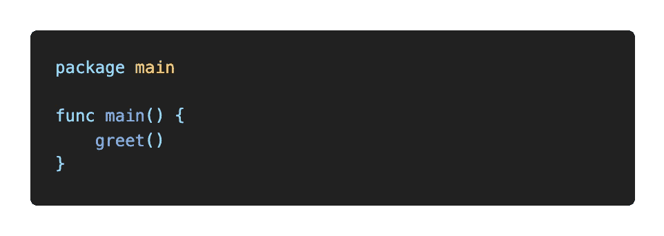**

**图片由作者提供。**

**在执行过程中，一个名为*的函数 greet* 被直接调用，为此，我们用下面的内容创建了`greet.go`。**

**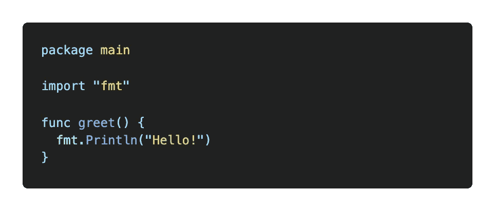**

**图片由作者提供。**

**你可以直接看到我们也导入了`fmt-package`，这是我们在`main.go`中没有做的，这是完全正确的，我们只需要在我们使用它的文件中导入一个类似`fmt`的外部包。现在我们可以运行它了。**

**也许你已经自己试过了，并注意到了一个错误，但这并不是因为我们不知何故忘记了从`greet.go`导入 greet 函数。**

**我们需要调整程序运行的方式。我们需要运行`go run main.go greet.go`，而不是`go run main.go`，我们告诉 Go 两个文件是相关的执行，突然，它工作了！**

# **自定义类型和接收器功能**

**让我们创建一个包含某门课程的学生姓名的新切片。**

****

**图片由作者提供。**

**那很容易。但是如果我们想为其他每门课程创建一个单独的切片，它也包含字符串，那么我们只能为此创建一个额外的类型。**

**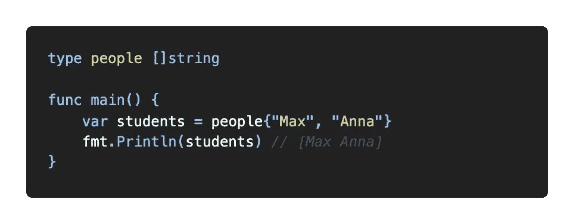**

**图片由作者提供。**

**该类型充当我们用`type-keyword`创建的模板。然后我们可以用这个名字访问它。**

**它变得有点抽象，因为我们可以创建一个所谓的`receiver`函数，所有类型为`people`的变量都可以访问它。**

**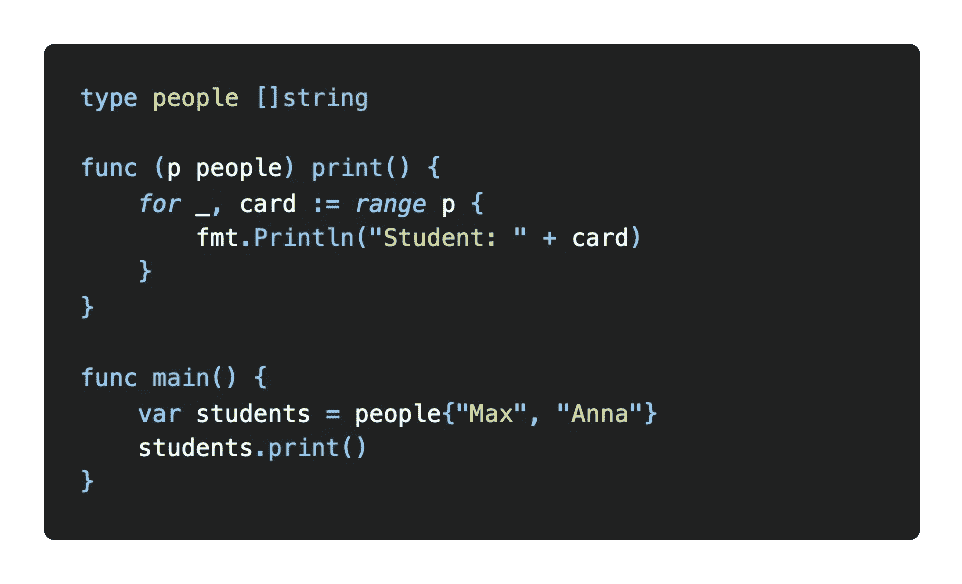**

**图片由作者提供。**

**是的，主函数上面的函数看起来有点奇怪，基本上，这个函数叫做`print`，但是我们已经把它标记为接收器了。在括号内，它得到它应该使用的类型， *p* 是我们学生切片的副本，`people`是函数应该可用的类型。**

**在主函数的底部，我们可以调用这个函数，当我们遍历切片时，它会产生下面的输出。**

```
**Student: Max
Student: Anna**
```

**所以 *p* 在`students`片的函数`print`里面。如果你来自面向对象语言，你可以把 *p* 想成*这个*，对了，如何命名*p* 并不重要，可以自由选择，但是第二个参数(类型)必须定义清楚。**

# **戈朗地图**

**在不同编程语言之间切换的一个问题是，相同的概念通常有不同的名称，地图也是如此。地图在 JavaScript 中是对象，在 Python 中是字典。他们给每个值分配一个键。**

**所有键和所有值必须具有相同的数据类型，但是键和值不必具有相同的数据类型。**

**这里有一个例子。**

```
**1: "Max"
2: "Anna"**
```

**因此，我们可能只是对学生进行编号，按照他们的表现进行排序，1 是最好的，2 是第二好的，等等，所以我们对键和值有不同的数据类型。我们还可以为年鉴制作一个映射，并为每个值(学生)分配一个不同的键。**

```
**Team Captain: Max
Prom Queen: Anna**
```

**我觉得原理很清楚，我们来看看实践中的地图。**

**为此，我们使用 map-关键字，首先在方括号中指定键的数据类型，然后指定值的数据类型。**

****

**图片由作者提供。**

**这里我们使用了简写语法来声明一个 map，但是我们也可以使用`var-keyword`，那么这个 map 可以默认为空。**

**如果我们像现在这样创建一个空地图，而不是在另一个地图上使用`var-keyword`,我们可以如下输入值。**

****

**图片由作者提供。**

**为了从映射中只输出一个值，我们访问变量并指定相应的键。**

**要删除一个条目，我们使用 delete-函数，其中我们指定了映射和键:`delete(students, "Team Capitain")`。**

**这些是你应该在几分钟内了解的关于 Golang 的最重要的基础知识。**